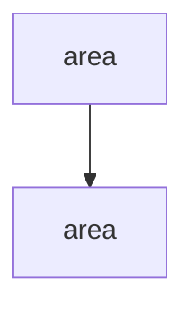

<!-- the-loop PR briefing (R10). This IS the PR description / top-comment. Produced
     before requesting human review — a required item of the ready-to-ship gate. Keep it
     condensed and prioritized; educating the reviewer is mandatory, not optional. -->

# <PR title> — reviewer briefing

## TL;DR

One or two sentences: what this PR does and why.

## Where to focus (in this order)

Prioritized so a reviewer of AI-authored work knows what to scrutinize first.

1. **<highest-priority area>** — `<path>` — why it matters / what to check.
2. **<next>** — `<path>` — …
3. **<lower-risk / skim>** — …

## What changed (map)

## Key decisions & why (education)

The low-level calls the harness made, so the reviewer learns the design, not just the diff.

- **<decision>** — why; trade-off; link to `docs/decisions/decision-<nnn>.md`.

## Evidence

Tests / checks / screenshots proving the acceptance criteria are met (e.g. CI green,
`pre-commit` output, live smoke test).

## Open questions for the reviewer

Anything the reviewer must decide or is explicitly being asked to confirm.
