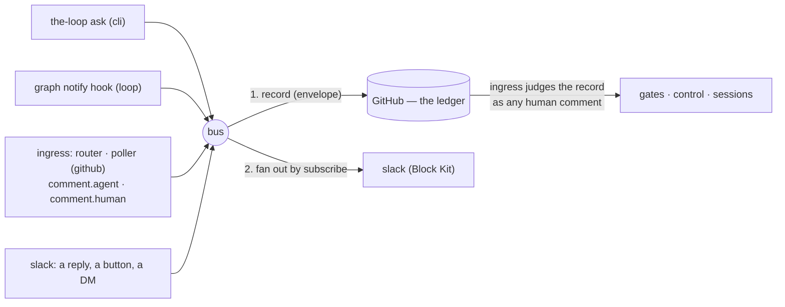

# Capability: channels

> Every channel — GitHub, the Slack bot, the CLI, the next one — is a peer on **one event
> bus**: it subscribes to the events it wants, may publish the ones it is granted, renders
> each natively; and one channel, the **ledger** (GitHub), records everything that started
> elsewhere before anything acts on it.

## What it is

The conversation layer, generalised (issue-309, decision-103). An **event** is one thing
that happened, with a type from one catalog: the ask, the graph's notifications, the
comments the ledger's ingress saw, the messages a channel read. The **bus** records an
event on the ledger (when the catalog says so and it did not start there) and then hands
it to every subscribed channel except its source. A **channel** is a named surface with a
`subscribe` list (what it receives), a `publish` list (what a message on it may become),
its own renderer, and — for channels that read — a pipeline that classifies each message
into exactly one event type and drops what its grants do not cover. Distinct from the
integrations layer ([issue-109](https://github.com/MadaraUchiha-314/the-loop/issues/109)):
an integration is a transport for one call; a channel is a conversation with state.

## Current behaviour

- **One catalog.** Every event type is a row of `channels/events.py` declaring whether a
  channel may subscribe to it, may publish it, and whether the ledger records it. The
  config parser warns against it, `the-loop channels status` prints it with ticks, and
  the [channels options](/config/cli/channels-options) page lists it — a test pins the
  three together. Subscribable: `session.awaiting_input`, the six graph notifications
  (`work-item-complete` now fires from the `complete` node), `comment.agent`,
  `comment.human`, `standing.started`. Publishable: `work-item.reply`, `gate.feedback`,
  `control.command`, `work-item.create`. Recorded: the ask and the four publishable ones.
- **The bus is the only caller of a channel.** WHEN any component publishes an event THEN
  the bus SHALL record it on the ledger first (if recorded and not from the ledger), then
  post it to every enabled channel whose `subscribe` names its type and that is not its
  source. Every step SHALL be best-effort per channel: a failure is a `PostResult` and a
  `bus.record_failed` / `channel.post_failed` event, never an exception to the publisher.
- **The ledger.** `channels.ledger` names the channel of record — `github`, the only value
  shipped; an unknown value is refused at load. A record is a comment carrying a
  machine-readable **envelope** (`<!-- the-loop:event {…} -->`: type, source, the actor's
  ids on every channel, timestamp). Four shapes: the ask's record is the question itself
  (marked); a `work-item.reply` record is the marked, quoted, scrubbed, keyword-defanged
  mirror; a `gate.feedback` / `control.command` record is **unmarked**, keywords intact,
  posted under the operator's credential with a visible attribution — so the ledger's
  own ingress classifies or executes it through the guards a typed comment goes through;
  a `work-item.create` record is the issue itself (unmarked, so it is armable; labelled
  from config only). WHEN the ledger's ingress sees an enveloped comment THEN it SHALL
  never re-publish it as a `comment.*` event (loop prevention across channels), and a
  marked one is dropped exactly as any marked comment is.
- **Identity in one place.** `routing.authorizedUsers` entries are people: a bare string
  is a GitHub login; a mapping names the person's id per channel (`github`, `slack`) plus
  an optional `name`. Every login consumer reads exactly the `github` ids; the Slack
  channel reads the `slack` ids; `channels.slack.authorizedUsers` is gone (config version
  `0.7.0`, migrated by `the-loop migrate-config`, which also renames `events` to
  `subscribe`). Empty stays fail-closed everywhere. WHEN a record names a person THEN the
  envelope SHALL carry every id the entry declares, resolved from config, never from the
  message.
- **Grants.** WHEN a message arrives on a channel THEN the pipeline SHALL run map →
  drop-own → authorize → classify → grant → record → (deliver): a message outside a bound
  thread is `unmapped` (unless it is a top-level kickoff candidate); a bot's is dropped;
  an unlisted member's is dropped, not recorded; classification is control keyword →
  open human gate → reply, and a type not in `publish` is dropped as
  `unpublishable-event`, never downgraded. The default grant is `[work-item.reply]`.
  `gate.feedback` and `control.command` stop at the record — the ledger's ingress does the
  rest, on its next delivery or poll — and the graph's `comments_from` attributes an
  enveloped record to the person it names **only** when the real poster is authorized and
  the named login is too.
- **The comment mirror.** WHEN the router or poller accepts a human comment (authorized or
  collaborator) THEN it SHALL publish `comment.human`; WHEN it drops a marker-stamped,
  envelope-less comment THEN it SHALL publish `comment.agent` — once per comment, first
  sight only on the poll path. A stranger's comment is published nowhere.
- **Content-rich notifications.** The `notify` hook publishes with the work item's URL
  and, when the node names an `artifact` (`requirements-approval` → `requirements.md`,
  `design-approval` → `design.md`), an excerpt of it; it no longer skips when
  `notifications.events` names no role — the roles ride along as detail.
- **Rendering is the channel's.** The Slack channel posts Block Kit: a header (event,
  person, work item), the text capped at `maxChars` with the remainder behind the link,
  a context line at `verbose`, a link button whenever the event has a URL, and
  Approve / Request changes buttons for an approval-shaped event **only** when
  `read.mode: socket` and the `gate.feedback` grant both hold. A press enters the
  pipeline as that member's reply carrying the button's text; an unrecognised value is
  plain text.
- **Kickoff.** WHEN the channel holds `work-item.create` AND `kickoff.repo` is set AND an
  authorized member posts a top-level message THEN the ledger SHALL create the issue with
  `kickoff.labels`, the thread SHALL be bound to the new ref and told the link. The first
  read baselines the channel; a failed creation is not retried.
- Reads, tokens, state: as before — `poll` or `socket` (`listen` now also handles
  `block_actions` and top-level messages), env-named tokens read at call time, bindings
  and cursors in `<state.root>/channels/slack.json` (plus a `channel:<id>` cursor).
- Every step is observable: `bus.published`, `bus.recorded`, `bus.record_failed`, the
  `channel.*` types, `channel.dropped` with `unpublishable-event` / `kickoff-disabled` /
  `create-failed`, and `channel.created`. Payloads carry ids and event types, never text.

## Design

- [`docs/specs/issue-309/design.md`](../specs/issue-309/design.md) — the catalog, the
  bus, the ledger's record shapes, identity, the classify-then-grant pipeline, the
  renderer, and the security design table (ten abuse cases, one negative test each).
- [`decision-103`](../decisions/decision-103.md) — through the ledger, never around it;
  grants are event types; identity entries keyed by channel; the person is recorded, the
  poster is the proof; buttons only where a press can arrive.
- [`docs/specs/issue-245/design.md`](../specs/issue-245/design.md) — the Slack provider,
  the two read transports and the original inbound ordering, which this work item keeps.
- [`skills/the-loop/reference/collaboration.md`](https://github.com/MadaraUchiha-314/the-loop/blob/main/skills/the-loop/reference/collaboration.md)
  § Where questions go — how channels compose with the interaction mode and the marker rule.

## History

| Work item | What changed | Links |
|-----------|--------------|-------|
| issue-309 | Made every channel a peer on one event bus with one ledger: a unified catalog with subscribe/publish/recorded flags; `bus.publish` as the only caller of a channel (the ask, the `notify` hook and both ingresses publish through it); the GitHub ledger with four record shapes and the envelope; identity declared once (`routing.authorizedUsers` person entries; `channels.slack.authorizedUsers` removed, `events` renamed `subscribe`, config version 0.7.0); per-channel `publish` grants — `gate.feedback` and `control.command` recorded unmarked for the ledger's ingress, `work-item.create` opening an issue from a top-level DM; Block Kit rendering with link and Approve buttons; `comment.agent` / `comment.human` mirrored into the bound thread; notifications carrying a link and an artifact excerpt; `work-item-complete` fired by the `complete` node. The five gaps @jc1993 named close as consequences | [spec](../specs/issue-309/), [decision-103](../decisions/decision-103.md), [issue](https://github.com/MadaraUchiha-314/the-loop/issues/309) |
| issue-304 | Retired every Slack- and collaborator-related config surface that no code read, leaving one Slack surface (`channels.slack`) and two identity allow-lists (`routing.authorizedUsers`, `channels.slack.authorizedUsers`). Removed: the CLI config's top-level `collaborators` and `notifications` blocks (behind a versioned migration to 0.6.0, so an un-migrated config is refused rather than half-loaded) and `collaborators.yaml`'s per-collaborator `notifications` sub-object (refused by the schema, with the replacement named in the message). `collaborators.yaml` now declares people and roles only; `harness-config.yaml`'s `notifications.events` is unchanged and still gates the `notify` hook. Per-person routing stays deferred — the config no longer claims otherwise | [spec](../specs/issue-304/), [issue](https://github.com/MadaraUchiha-314/the-loop/issues/304) |
| issue-277 | A Slack thread can now carry a [standing session](standing-sessions.md) instead of a work item: the binding key is `standing:<name>`, the mirror step is **skipped** (there is no ticket to mirror onto, recorded as `channel.mirror_skipped`) and the delivery goes to that session's pane. The bot drop, the authorized-member allow-list and the cursor advance are unchanged, and the bot still reads only threads it is bound to | [spec](../specs/issue-277/), [issue](https://github.com/MadaraUchiha-314/the-loop/issues/277) |
| issue-245 | Introduced the capability: the channel abstraction (events filter, verbosity, best-effort broadcast from `the-loop ask`), the Slack bot channel (slack-sdk, thread per work item, poll + Socket Mode reads), the authorize → mirror → deliver inbound pipeline with the work item as source of truth, the `channels` CLI verb, and the `channel.*` event types. In the same PR's review the owner converged Slack entirely onto this layer: the graph's `notify` hook broadcasts through channels and `integrations.slack` (the incoming webhook) was removed behind a versioned migration (0.5.0). | [spec](../specs/issue-245/), [decision-094](../decisions/decision-094.md), [PR #267](https://github.com/MadaraUchiha-314/the-loop/pull/267) |
