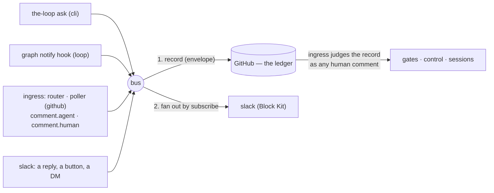

# Capability: channels

> Every channel — GitHub, the Slack bot, the CLI, the next one — is a peer on **one event
> bus**: it subscribes to the events it wants, may publish the ones it is granted, renders
> each natively; and one channel, the **ledger** (GitHub), records everything that started
> elsewhere before anything acts on it.

## What it is

The conversation layer, generalised (issue-309, decision-103). An **event** is one thing
that happened, with a type from one catalog: the ask, the graph's notifications, the
comments the ledger's ingress saw, the messages a channel read. The **bus** records an
event on the ledger (when the catalog says so and it did not start there) and then hands
it to every subscribed channel except its source. A **channel** is a named surface with a
`subscribe` list (what it receives), a `publish` list (what a message on it may become),
its own renderer, and — for channels that read — a pipeline that classifies each message
into exactly one event type and drops what its grants do not cover. Distinct from the
integrations layer ([issue-109](https://github.com/MadaraUchiha-314/the-loop/issues/109)):
an integration is a transport for one call; a channel is a conversation with state.

## Current behaviour

- **One catalog.** Every event type is a row of `channels/events.py` declaring whether a
  channel may subscribe to it, may publish it, and whether the ledger records it. The
  config parser warns against it, `the-loop channels status` prints it with ticks, and
  the [channels options](/config/cli/channels-options) page lists it — a test pins the
  three together. Subscribable: `session.awaiting_input`, the six graph notifications
  (`work-item-complete` now fires from the `complete` node), `comment.agent`,
  `comment.human`, `standing.started`. Publishable: `work-item.reply`, `gate.feedback`,
  `control.command`, `work-item.create`, and — since issue-334 — `instance.command`,
  `standing.command`. Recorded: the ask and the four ticket-bound publishable ones; the
  two command grants have no ticket and are not.
- **The bus is the only caller of a channel.** WHEN any component publishes an event THEN
  the bus SHALL record it on the ledger first (if recorded and not from the ledger), then
  post it to every enabled channel whose `subscribe` names its type and that is not its
  source. Every step SHALL be best-effort per channel: a failure is a `PostResult` and a
  `bus.record_failed` / `channel.post_failed` event, never an exception to the publisher.
- **The ledger.** `channels.ledger` names the channel of record — `github`, the only value
  shipped; an unknown value is refused at load. A record is a comment carrying a
  machine-readable **envelope** (`<!-- the-loop:event {…} -->`: type, source, the actor's
  ids on every channel, timestamp). Four shapes: the ask's record is the question itself
  (marked); a `work-item.reply` record is the marked, quoted, scrubbed, keyword-defanged
  mirror; a `gate.feedback` / `control.command` record is **unmarked**, keywords intact,
  posted under the operator's credential with a visible attribution — so the ledger's
  own ingress classifies or executes it through the guards a typed comment goes through;
  a `work-item.create` record is the issue itself (unmarked, so it is armable; labelled
  from config only). WHEN the ledger's ingress sees an enveloped comment THEN it SHALL
  never re-publish it as a `comment.*` event (loop prevention across channels), and a
  marked one is dropped exactly as any marked comment is.
- **Identity in one place.** `routing.authorizedUsers` entries are people: a bare string
  is a GitHub login; a mapping names the person's id per channel (`github`, `slack`) plus
  an optional `name`. Every login consumer reads exactly the `github` ids; the Slack
  channel reads the `slack` ids; `channels.slack.authorizedUsers` is gone (config version
  `0.7.0`, migrated by `the-loop migrate-config`, which also renames `events` to
  `subscribe`). Empty stays fail-closed everywhere. WHEN a record names a person THEN the
  envelope SHALL carry every id the entry declares, resolved from config, never from the
  message.
- **Grants.** WHEN a message arrives on a channel THEN the pipeline SHALL run map →
  drop-own → authorize → classify → grant → record → (deliver): a message outside a bound
  thread is `unmapped` (unless it is a top-level kickoff candidate); a bot's is dropped;
  an unlisted member's is dropped, not recorded; classification is control keyword →
  open human gate → reply, and a type not in `publish` is dropped as
  `unpublishable-event`, never downgraded. The default grant is `[work-item.reply]`.
  `gate.feedback` and `control.command` stop at the record — the ledger's ingress does the
  rest, on its next delivery or poll — and the graph's `comments_from` attributes an
  enveloped record to the person it names **only** when the real poster is authorized and
  the named login is too.
- **The gate is read through the dispatcher's own coupling, and "cannot tell" is left
  to the ledger** (issue-321, decision-109). The pipeline reads whether the work item is
  parked at a human gate through the same `RoutingConfig` the daemons build their
  dispatcher from — the same control policy, control store, allow-list and registry —
  so under the default control policy an armed item at a gate reads as *at a gate*. The
  read has three answers: WHEN it says *at a gate* THEN the reply SHALL be
  `gate.feedback`; WHEN it says *not at a gate*, or the coupling is off, THEN the reply
  SHALL be `work-item.reply`; WHEN the pipeline **cannot tell** — no session record, no
  checkout, no context, a fault — THEN, with the `gate.feedback` grant, the reply SHALL
  be recorded unmarked as `gate.feedback` (attributed as a *reply*, not as an answer to
  a gate the pipeline never saw) and delivered by nothing but the ledger's ingress, and
  without the grant it SHALL stay the marked mirror with direct delivery. A control
  keyword outranks every answer, as before. `channel.reply_received` carries
  `gate: open | none | unknown`. Before this the pipeline's reader had no control store,
  read no graph at all under the default policy, and turned every "cannot tell" into
  the marked record the gate never reads.
- **The comment mirror.** WHEN the router or poller accepts a human comment (authorized or
  collaborator) THEN it SHALL publish `comment.human`; WHEN it drops a marker-stamped,
  envelope-less comment THEN it SHALL publish `comment.agent` — once per comment, first
  sight only on the poll path. A stranger's comment is published nowhere.
- **Content-rich notifications.** The `notify` hook publishes with the work item's URL
  and, when the node names an `artifact` (`requirements-approval` → `requirements.md`,
  `design-approval` → `design.md`), an excerpt of it; it no longer skips when
  `notifications.events` names no role — the roles ride along as detail. The URL is
  derived from the work item's ref, which on GitHub Enterprise carries the host
  `integrations.github.host` resolves (issue-311) — so the link a Slack member clicks
  and the comment the ledger wrote are on the same GitHub.
- **One thread per work item, rooted on the work item** (issue-312, decision-105). WHEN
  the Slack channel receives an event for a work item that has no bound conversation THEN
  it SHALL open a root message naming the work item (its ref, and an *Open on GitHub*
  button when the ref has a link), bind it, and post the event as that thread's **first
  reply**; WHEN a conversation is bound THEN every event SHALL be a reply into it and the
  channel SHALL never post a second top-level message for the work item. Open-and-bind is
  exclusive per state file (`flock` on a sibling lock), so the agent's session, the two
  daemons and the poll watcher open one thread between them; a reply that fails is
  `channel.post_failed` and never a second root. A kickoff thread (a member's top-level
  message that became the work item) is that work item's conversation, no root opened; a
  standing session's thread follows the same rule. The conversation is a keyed record —
  work item → channel, thread, opened, origin (`event` | `kickoff` | `legacy`),
  permalink — in the local channel state, listed by `the-loop channels threads`
  (`--work-item`, `--json`), counted by `channels status`, and announced by
  `channel.thread_opened` (ids only). A ref spelled with the default host
  (`github:github.com/o/r#7`) and without it (`github:o/r#7`) are one conversation; a
  state file from before issue-312 is backfilled from its newest binding on load.
- **The thread opens when the work item starts** (issue-317, decision-107). WHEN a
  session is spawned for a work item — a `the-loop start` / `contribute` / `do` /
  `review` comment, `the-loop sessions start`, the control plane's start route, or the
  poller's presence spawn for an authorized author — THEN, before the workspace checkout
  and the harness boot, the dispatcher SHALL ask every enabled channel that has a
  conversation to open to open the work item's: the Slack channel posts the root alone
  (no reply) and binds it with origin `start`; the GitHub ledger opens nothing, because
  the issue is its conversation. A work item that already has a conversation SHALL keep
  it (a restart, a kickoff thread, a thread the first event already opened). A refused
  start — unarmed, unauthorized, spawn policy — SHALL open nothing, because the open sits
  on the spawn path behind every refusal. Best-effort by contract: a channel that raises
  or returns no `ts` is `channel.open_failed`, the session spawns regardless, nothing is
  bound, and the next event opens the thread lazily as before. The first subscribed event
  is then the thread's first reply. The opener is injected into the dispatcher
  (`channels.publishers.conversation_opener`, reading the CLI config per call — both
  daemons and the core facade wire it, the facade with the config it was handed); a
  dispatcher built without one behaves as at 13.1.1.
- **Rendering is the channel's.** The Slack channel posts Block Kit: a header (event,
  person, work item), the text drawn as mrkdwn and — above `maxChars` — digested or
  truncated per `longMessages` (the next bullet), a context line at `verbose`, a link
  button whenever the event has a URL,
  Approve / Request changes buttons for an approval-shaped event **only** when
  `read.mode: socket` and the `gate.feedback` grant both hold, and — since issue-337 —
  an **Execute** button on the phase-selection checklist mirror (a `comment.agent`
  carrying the hook's marker) and a **Start** button on the kickoff's "opened" reply,
  each **only** when `read.mode: socket` and the `control.command` grant both hold,
  each carrying the **configured keyword** as its value (a disabled keyword renders no
  button). A press enters the pipeline as that member's reply carrying the button's
  text; an unrecognised value is plain text.
- **Long text is digested, never cut mid-sentence** (issue-338, decision-118). WHEN a
  text section — an event's text, a notification's artifact excerpt — is longer than
  `channels.slack.maxChars` AND `channels.slack.longMessages` is `digest` (the default)
  THEN the channel SHALL post a **structural digest** within `maxChars`, computed with
  no model: the first question in the text (else the sentence that says *reply `…`*)
  first, in bold; every list as numbered lines with GitHub task boxes drawn ☑ / ☐;
  every code fence, table and stack trace replaced in place by a pointer with its
  size; absolute paths of three or more segments shortened to their last two; the rest
  in the author's order until the budget is spent; the cut on a sentence boundary (a
  clause, then a word, only when no sentence fits); and one closing line linking the
  full text (the event's URL, never one from the text) whenever anything was cut, left
  out or replaced. Every non-pointer line of a digest SHALL be text the author wrote.
  WHEN `longMessages` is `truncate` THEN the first `maxChars` characters and a note, as
  at 13.10.0. WHEN the text is at or under `maxChars` THEN it SHALL be posted whole, in
  order, with no pointer and no closing line. The plain-text fallback (the phone's
  notification) SHALL carry the same digest. Whatever the length, GitHub markdown is
  drawn as Slack mrkdwn (`**bold**` → `*bold*`, headings, `[text](url)`, task boxes,
  bullets), HTML comments — the-loop's markers and envelopes included — are removed,
  and a Slack broadcast sequence (`<!channel>`, `<!here>`) in a comment is neutralised.
  `the-loop channels status` prints the `longMessages` line beside `maxChars`.
- **A press's outcome is written onto the pressed message** (issue-337, decision-117).
  WHEN a button press is **processed** THEN the channel SHALL edit the pressed message:
  the pressed button set replaced by a context line naming the button (from its
  `action_id`, never the payload's text), the member, and what happened — recorded on
  the work item with the record's link, delivered to the session, or the error — with
  link buttons kept; WHEN the action landed THEN the non-link buttons SHALL be removed
  (a press acts once); WHEN it did not THEN they SHALL stay beside a ⚠️ line (the
  retry). A **dropped** press SHALL leave the message untouched. Best-effort: a refused
  edit is `channel.press_report_failed` and changes nothing else; the issue-325
  reactions are unchanged. `the-loop channels status` names both button sets and,
  while either cannot be received, prints only the steps that still apply — the
  app-level token is required because Slack delivers a press only to an acknowledging
  Socket Mode connection or a public Request URL, and the-loop exposes none.
- **Kickoff.** WHEN the channel holds `work-item.create` AND `kickoff.repo` is set AND an
  authorized member posts a top-level message THEN the ledger SHALL create the issue with
  `kickoff.labels`, the thread SHALL be bound to the new ref and told the link. The first
  read baselines the channel; a failed creation is not retried.
- **An accepted message is acknowledged on itself** (issue-325, decision-111). WHEN an
  inbound Slack message — a thread reply, a button press, a kickoff — passes
  authorization, classification and the `publish` grant THEN, before the ledger
  record, the channel SHALL add the configured `received` reaction
  (`channels.slack.reactions`, default 👀) to that message; WHEN the pipeline's action
  has landed — a `work-item.reply` recorded and delivered, a `gate.feedback` /
  `control.command` recorded on the ledger, a `work-item.create` with its issue opened
  and the thread bound — THEN it SHALL add `completed` (default ✅), and `error`
  (default ⚠️) when it has not. A dropped message SHALL get no reaction. For a button
  press the target is the message carrying the button. Best-effort: posted with the bot
  token (`reactions:write`), a refused reaction is `channel.reaction_failed` and never
  touches the record or the delivery, a missing token makes no call, and a name outside
  the emoji grammar is refused at load. On by default, mirroring `routing.reactions`'
  contract with Slack's open palette rather than GitHub's fixed one.
- **A slash command addresses what has no thread** (issue-334, decision-116). WHEN the
  Slack app delivers a `/the-loop` command over Socket Mode THEN the listener SHALL
  acknowledge it and hand it to `channels/commands.py`, which SHALL authorize the member
  (the `slack` ids of `routing.authorizedUsers`; an unlisted member is dropped and
  answered with nothing) **before** parsing, parse a fixed vocabulary as whole tokens
  (`help`; `<keyword> <work-item> [@login] [instance:<name>]` for every configured
  control keyword; `status` / `restart` / `upgrade`; `standing list|start|stop|restart
  <name>`), refuse anything beyond it whole, and check the verb family's grant —
  `control.command` (work-item verbs, reused), `instance.command` and
  `standing.command` (two new catalog rows: publishable, not subscribable, **not
  recorded**). WHEN a work-item verb is accepted THEN the handler SHALL publish
  `control.command` with a line **composed** from the configured keyword and the
  validated tokens and stop at the ledger record — the same unmarked, enveloped comment
  a keyword typed in the thread makes, executed by the ledger's ingress — and SHALL
  start, spawn or deliver nothing itself; the work item (`#N` against `kickoff.repo`,
  `owner/repo#N`, `github:…`, a URL on this instance's host) SHALL be in a repository
  this instance is configured for (`kickoff.repo`, `polling.sources`) or one it already
  manages or converses about, else refused (`unknown-target`). WHEN an instance or
  standing verb is accepted THEN the handler SHALL call the core facade the CLI and API
  route to (`core.lifecycle.status_all` / `schedule_restart`,
  `core.standing.list_standing` / `control_standing`) and render its result. The answer
  is ephemeral through the command's `response_url` (Slack's own host only); a trigger
  acts once; every refusal and failure is an outcome and an event, never an exception to
  the listener. Slash commands arrive over Socket Mode only, and `channels status` says
  which families this channel may run. The Slack **app manifest** — bot user, scopes
  (`chat:write`, `channels:history`, `groups:history`, `reactions:write`, `commands`),
  events, interactivity, Socket Mode, the command — ships in the package and is printed
  by `the-loop channels manifest`; the [Slack integration guide](../guide/slack.md) is
  the operator's map of every mode of interaction.
- **The service hosts the listener** (issue-334, the owner's review of PR #336). WHEN
  `the-loop start` runs with `channels.slack.enabled` and `read.mode: socket` under
  `service.hostIngresses` (the default) THEN the service's lifespan SHALL run
  `run_socket_listener` as a hosted thread beside the poller and the receiver, under its
  own pidfile lock (`<root>/slack-listener.pid`) held by the service's pid, reported by
  `start` as `hosted`, by `status` as `running (hosted in the service)`, and stopped with
  the service by `stop`; WHEN either token is absent from the service's environment THEN
  nothing SHALL be hosted and `start` SHALL report the row `failed` naming the variable;
  WHEN the hosted loop ends on its own THEN it SHALL release its lock. `the-loop channels
  listen` is the foreground form, takes the same lock, and refuses to run beside a hosted
  listener; with `hostIngresses: false` the `start` row is `manual` and names it. The
  listener has no standalone daemon form and is not in the daemons API's enumeration.
- **Downtime is reconciled from the shared cursors** (issue-334, the owner's review of
  PR #336). WHEN the Socket Mode listener connects THEN it SHALL run one read cycle
  (`poll_once`) over every bound thread and the kickoff cursor before it starts waiting
  on the socket, so a reply or kickoff posted while no listener was connected — beyond
  the few retries Slack makes — is processed once (`channel.caught_up`); WHEN Slack then
  redelivers a message whose `ts` is at or before the thread's cursor THEN the socket
  handler SHALL drop it as `duplicate`. `poll_once` SHALL run in `socket` mode as well
  as `poll` (only `off` refuses), so `the-loop channels poll` is a reconciliation an
  operator may schedule beside a listener. A slash command or button press issued while
  nothing was connected fails visibly to the member and is not recovered — an
  interactive gesture is re-issued, never replayed. A keyword or gate answer already on
  the ledger survives any downtime: the ledger's ingress executes it on its next cycle.
- Reads, tokens, state: as before — `poll` or `socket` (`listen` now also handles
  `block_actions`, top-level messages and `slash_commands`), env-named tokens read at
  call time, bindings and cursors in `<state.root>/channels/slack.json` (plus a
  `channel:<id>` cursor).
- Every step is observable: `bus.published`, `bus.recorded`, `bus.record_failed`, the
  `channel.*` types, `channel.dropped` with `unpublishable-event` / `kickoff-disabled` /
  `create-failed`, `channel.created`, `channel.thread_opened` (origin `event` |
  `kickoff` | `start`), `channel.open_failed`, `channel.reaction_added`,
  `channel.reaction_failed`, and the slash command's `channel.command_received`,
  `channel.command_completed`, `channel.command_answer_failed`, `channel.caught_up`,
  the drop reasons `unknown-command` / `unknown-target` / `duplicate`, and the press
  outcome's `channel.press_reported` / `channel.press_report_failed` (issue-337).
  Payloads carry ids and event types, never text.

## Design

- [`docs/specs/issue-338/design.md`](../specs/issue-338/design.md) — `channels/digest.py`
  (`to_mrkdwn`, `condense`, `fit`), the renderer's `long_messages`, the post's fallback
  text, the key in both schema copies, the status line.
- [`decision-118`](../decisions/decision-118.md) — a structural digest the channel
  computes rather than a model's summary; one enum key with `maxChars` as the
  threshold; mrkdwn drawing on every message, the digest only above the cap.
- [`docs/specs/issue-337/design.md`](../specs/issue-337/design.md) — the renderer's
  `commands`, `expected_commands` keyed on the checklist marker, the kickoff reply's
  Start button, `report_press` and the rebuilt blocks, the `channels status` steps.
- [`decision-117`](../decisions/decision-117.md) — a command button is a reply with
  the keyword as its value under `control.command`; the outcome by editing the
  message; Socket Mode and the app-level token stay required, `status` says how; which
  message gets which button is a fixed table keyed on the event.
- [`docs/specs/issue-334/design.md`](../specs/issue-334/design.md) — the two catalog
  rows, `channels/commands.py` (parse → target → handler per family), the
  `slash_commands` branch of the listener, the packaged manifest.
- [`decision-116`](../decisions/decision-116.md) — a slash command, not Workflow
  Builder; a work-item verb through the ledger, the other two families through the
  facade; three grants, not one; a bounded target; Socket Mode only.
- [`docs/specs/issue-325/design.md`](../specs/issue-325/design.md) — the
  `channels.slack.reactions` block, `SlackBotChannel.react`, the two calls on each
  accepted path of the pipeline, the socket handlers' channel.
- [`decision-111`](../decisions/decision-111.md) — the acknowledgment sits after the
  last refusal and before the record; its own block mirroring `routing.reactions`'
  contract; Slack's palette; *completed* means the pipeline's own action landed.
- [`docs/specs/issue-321/design.md`](../specs/issue-321/design.md) — the pipeline's
  graph reader as the dispatcher's own construction, the three-valued read, deferral to
  the ledger within the grant.
- [`decision-109`](../decisions/decision-109.md) — the reader is the dispatcher's
  coupling; "cannot tell" is a state; it defers to the ledger only within the grant; a
  reply's mirror keeps its marker.
- [`docs/specs/issue-317/design.md`](../specs/issue-317/design.md) — `open` on the
  channel, `open_conversation` on the bus, the injected opener on the dispatcher's spawn
  path and its wiring through both daemons and the facade.
- [`decision-107`](../decisions/decision-107.md) — the open is a channel operation on the
  spawn path, not a bus event; before the checkout, not beside the announcement;
  best-effort; the ledger opens nothing.
- [`docs/specs/issue-312/design.md`](../specs/issue-312/design.md) — the per-work-item
  conversation map and the sibling `flock`; the root-then-reply post; `channels threads`.
- [`decision-105`](../decisions/decision-105.md) — the root is the work item's; open-and-bind
  is exclusive; the conversation stays local; a failed reply never opens a second thread.
- [`docs/specs/issue-309/design.md`](../specs/issue-309/design.md) — the catalog, the
  bus, the ledger's record shapes, identity, the classify-then-grant pipeline, the
  renderer, and the security design table (ten abuse cases, one negative test each).
- [`decision-103`](../decisions/decision-103.md) — through the ledger, never around it;
  grants are event types; identity entries keyed by channel; the person is recorded, the
  poster is the proof; buttons only where a press can arrive.
- [`docs/specs/issue-245/design.md`](../specs/issue-245/design.md) — the Slack provider,
  the two read transports and the original inbound ordering, which this work item keeps.
- [`skills/the-loop/reference/collaboration.md`](https://github.com/MadaraUchiha-314/the-loop/blob/main/skills/the-loop/reference/collaboration.md)
  § Where questions go — how channels compose with the interaction mode and the marker rule.

## History

| Work item | What changed | Links |
|-----------|--------------|-------|
| issue-338 | Long text reaches Slack as a **structural digest** instead of a mid-sentence cut: above `maxChars` (unchanged meaning and default) the channel puts the first question — or the *reply `…`* instruction — first in bold, renders lists as numbered lines with ☑ / ☐, replaces code fences, tables and stack traces with a sized pointer, shortens absolute paths, keeps the rest in the author's order, cuts at a sentence and closes with a link to the full text; the phone's notification text carries the same digest; a text within the cap is posted whole. `longMessages: digest \| truncate` (default `digest`; `truncate` is 13.10.0's cut) is the one new key. On every message, whatever its length, GitHub markdown is now drawn as mrkdwn and HTML comments (the-loop's markers, seen literally before) are removed; `<!channel>`-style broadcasts in a comment are neutralised. No model, no new call, grant, scope or state | [spec](../specs/issue-338/), [decision-118](../decisions/decision-118.md), [issue](https://github.com/MadaraUchiha-314/the-loop/issues/338) |
| issue-337 | **Execute** and **Start** buttons on the two Slack messages that asked for a keyword typed back — the phase-selection checklist mirror and the kickoff's "opened" reply — rendered only with `read.mode: socket` and the `control.command` grant, each carrying the configured keyword as its value so a press is exactly a typed keyword through the unchanged pipeline (allow-list, classification, grant, unmarked ledger record, the ingress executes). A processed press is written back onto the pressed message (buttons replaced by the outcome line with the record's link; kept beside a ⚠️ line when it did not land; a dropped press edits nothing), for the Approve pair too. `channels status` names both button sets and prints only the steps a configuration still needs — the app-level token is required because Slack delivers a press only to an acknowledging Socket Mode connection or a public Request URL. No new grant, scope, key or state | [spec](../specs/issue-337/), [decision-117](../decisions/decision-117.md), [issue](https://github.com/MadaraUchiha-314/the-loop/issues/337) |
| issue-334 | The `/the-loop` slash command over Socket Mode — the channel's third inbound shape, for what has no thread: `<keyword> <work-item>` publishes `control.command` and stops at the same unmarked ledger record a thread keyword makes (the ingress executes it; the target bounded to `kickoff.repo`, the poll sources, the managed set and the bound threads); `status` / `restart` / `upgrade` and `standing list\|start\|stop\|restart` call the core facade under two new grants, `instance.command` and `standing.command` (catalog rows, not recorded); authorized first, a fixed vocabulary, ephemeral answers to Slack's host only, a trigger acts once. A packaged Slack **app manifest** (`the-loop channels manifest`) and the [Slack integration guide](../guide/slack.md). From the PR review: `the-loop start` hosts the listener in the service (`slack-listener` row, its own pidfile lock; `channels listen` is the foreground form), the listener runs a catch-up read over the shared cursors when it connects, `poll_once` runs in socket mode as a reconciliation, and a redelivered message at or before a thread's cursor is dropped as `duplicate`. Ask 1 of the ticket — a control keyword in the thread works as on the ticket — was already true by grant and is now pinned by tests and documented | [spec](../specs/issue-334/), [decision-116](../decisions/decision-116.md), [issue](https://github.com/MadaraUchiha-314/the-loop/issues/334) |
| issue-325 | The Slack channel acknowledges an accepted inbound message on the message itself: `received` (👀) after the last refusal and before the ledger record, then `completed` (✅) when the pipeline's action landed or `error` (⚠️) when it did not; a dropped message gets none; configured by `channels.slack.reactions` (on by default, Slack emoji names, `""` skips a state), posted best-effort with the bot token's `reactions:write`, observable as `channel.reaction_added` / `channel.reaction_failed`. Before this, `routing.reactions` acknowledged only on GitHub and a Slack reply's only feedback was a later posted message | [spec](../specs/issue-325/), [decision-111](../decisions/decision-111.md), [issue](https://github.com/MadaraUchiha-314/the-loop/issues/325) |
| issue-321 | An authorized gate answer from Slack now locks the gate under the daemon's default control policy: the pipeline's graph read is built from the same `RoutingConfig` the dispatcher's coupling is (control policy, control store, allow-list, registry), where before it had no control store and read no graph at all; the read is three-valued, and a gate the pipeline cannot read (no session record, no checkout, a fault) is recorded unmarked as `gate.feedback` for the ledger's ingress to judge when the channel holds that grant — attributed as a reply — and stays the marked mirror without it; `channel.reply_received` carries `gate: open \| none \| unknown` | [spec](../specs/issue-321/), [decision-109](../decisions/decision-109.md), [issue](https://github.com/MadaraUchiha-314/the-loop/issues/321) |
| issue-317 | The Slack thread opens when the work item **starts**, not when its first event arrives: the dispatcher's one spawn path — which every way of starting converges on — asks every configured channel to open the work item's conversation (`SlackBotChannel.open`, root only, origin `start`, through `bus.open_conversation`) before the checkout; a bound work item keeps its thread, a refused start opens nothing, a channel failure is `channel.open_failed` and never touches the spawn, and the first event replies into the thread that already exists. Wired as an injected opener on the dispatcher (`conversation_opener`, config per call) by both daemons and the core facade | [spec](../specs/issue-317/), [decision-107](../decisions/decision-107.md), [issue](https://github.com/MadaraUchiha-314/the-loop/issues/317) |
| issue-312 | The Slack thread is the work item's: the first event opens a root naming the work item (ref + link button) and every event, the first included, is a reply into it; open-and-bind runs under a `flock` on the channel state so the agent's session, the daemons and the poll watcher open one thread between them, and a failed reply never opens a second; the conversation is a keyed record (work item → channel, thread, opened, origin, permalink) backfilled from a pre-existing file, listed by `the-loop channels threads` and announced by `channel.thread_opened`; refs with and without the default host share one thread. Before this the root was whichever event arrived first, the binding a newest-wins scan, and four unlocked writers could open two threads or drop a binding | [spec](../specs/issue-312/), [decision-105](../decisions/decision-105.md), [issue](https://github.com/MadaraUchiha-314/the-loop/issues/312) |
| issue-311 | The link every notification and ask carries names the work item's own GitHub: a ref the graph mints from `ticketing.github` now carries the resolved host (`integrations.github.host`, `$GH_HOST`, the checkout's remote), the ledger's `gh api` writes pass `--hostname` for it, and a kickoff `repo` may be `[HOST/]OWNER/REPO` with the bound ref carrying the host | [spec](../specs/issue-311/), [decision-104](../decisions/decision-104.md), [issue](https://github.com/MadaraUchiha-314/the-loop/issues/311) |
| issue-309 | Made every channel a peer on one event bus with one ledger: a unified catalog with subscribe/publish/recorded flags; `bus.publish` as the only caller of a channel (the ask, the `notify` hook and both ingresses publish through it); the GitHub ledger with four record shapes and the envelope; identity declared once (`routing.authorizedUsers` person entries; `channels.slack.authorizedUsers` removed, `events` renamed `subscribe`, config version 0.7.0); per-channel `publish` grants — `gate.feedback` and `control.command` recorded unmarked for the ledger's ingress, `work-item.create` opening an issue from a top-level DM; Block Kit rendering with link and Approve buttons; `comment.agent` / `comment.human` mirrored into the bound thread; notifications carrying a link and an artifact excerpt; `work-item-complete` fired by the `complete` node. The five gaps @jc1993 named close as consequences | [spec](../specs/issue-309/), [decision-103](../decisions/decision-103.md), [issue](https://github.com/MadaraUchiha-314/the-loop/issues/309) |
| issue-304 | Retired every Slack- and collaborator-related config surface that no code read, leaving one Slack surface (`channels.slack`) and two identity allow-lists (`routing.authorizedUsers`, `channels.slack.authorizedUsers`). Removed: the CLI config's top-level `collaborators` and `notifications` blocks (behind a versioned migration to 0.6.0, so an un-migrated config is refused rather than half-loaded) and `collaborators.yaml`'s per-collaborator `notifications` sub-object (refused by the schema, with the replacement named in the message). `collaborators.yaml` now declares people and roles only; `harness-config.yaml`'s `notifications.events` is unchanged and still gates the `notify` hook. Per-person routing stays deferred — the config no longer claims otherwise | [spec](../specs/issue-304/), [issue](https://github.com/MadaraUchiha-314/the-loop/issues/304) |
| issue-277 | A Slack thread can now carry a [standing session](standing-sessions.md) instead of a work item: the binding key is `standing:<name>`, the mirror step is **skipped** (there is no ticket to mirror onto, recorded as `channel.mirror_skipped`) and the delivery goes to that session's pane. The bot drop, the authorized-member allow-list and the cursor advance are unchanged, and the bot still reads only threads it is bound to | [spec](../specs/issue-277/), [issue](https://github.com/MadaraUchiha-314/the-loop/issues/277) |
| issue-245 | Introduced the capability: the channel abstraction (events filter, verbosity, best-effort broadcast from `the-loop ask`), the Slack bot channel (slack-sdk, thread per work item, poll + Socket Mode reads), the authorize → mirror → deliver inbound pipeline with the work item as source of truth, the `channels` CLI verb, and the `channel.*` event types. In the same PR's review the owner converged Slack entirely onto this layer: the graph's `notify` hook broadcasts through channels and `integrations.slack` (the incoming webhook) was removed behind a versioned migration (0.5.0). | [spec](../specs/issue-245/), [decision-094](../decisions/decision-094.md), [PR #267](https://github.com/MadaraUchiha-314/the-loop/pull/267) |
