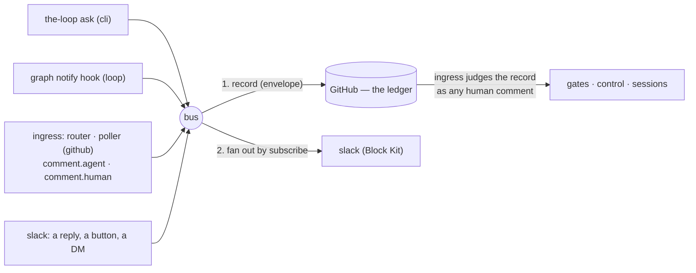

# Capability: channels

> Every channel — GitHub, the Slack bot, the CLI, the next one — is a peer on **one event
> bus**: it subscribes to the events it wants, may publish the ones it is granted, renders
> each natively; and one channel, the **ledger** (GitHub), records everything that started
> elsewhere before anything acts on it.

## What it is

The conversation layer, generalised (issue-309, decision-103). An **event** is one thing
that happened, with a type from one catalog: the ask, the graph's notifications, the
comments the ledger's ingress saw, the messages a channel read. The **bus** records an
event on the ledger (when the catalog says so and it did not start there) and then hands
it to every subscribed channel except its source. A **channel** is a named surface with a
`subscribe` list (what it receives), a `publish` list (what a message on it may become),
its own renderer, and — for channels that read — a pipeline that classifies each message
into exactly one event type and drops what its grants do not cover. Distinct from the
integrations layer ([issue-109](https://github.com/MadaraUchiha-314/the-loop/issues/109)):
an integration is a transport for one call; a channel is a conversation with state.

## Current behaviour

- **One catalog.** Every event type is a row of `channels/events.py` declaring whether a
  channel may subscribe to it, may publish it, and whether the ledger records it. The
  config parser warns against it, `the-loop channels status` prints it with ticks, and
  the [channels options](/config/cli/channels-options) page lists it — a test pins the
  three together. Subscribable: `session.awaiting_input`, the six graph notifications
  (`work-item-complete` now fires from the `complete` node), the three lifecycle events
  (`phase.started`, `phase.completed`, `work-item.closed` — issue-378), `comment.agent`,
  `comment.human`, `standing.started`. Publishable: `work-item.reply`, `gate.feedback`,
  `control.command`, `work-item.create`, — since issue-334 — `instance.command`,
  `standing.command`, and — since issue-389 — `context.added`, `decision.recorded`.
  Recorded: the ask and the six ticket-bound publishable ones; the two command grants
  have no ticket and are not. The two issue-389 rows are grants and **not**
  subscriptions: what a message may become and what a channel hears stay disjoint sets
  (decision-103), and `comment.agent` already carries every marked record.
- **The bus is the only caller of a channel.** WHEN any component publishes an event THEN
  the bus SHALL record it on the ledger first (if recorded and not from the ledger), then
  post it to every enabled channel whose `subscribe` names its type and that is not its
  source. Every step SHALL be best-effort per channel: a failure is a `PostResult` and a
  `bus.record_failed` / `channel.post_failed` event, never an exception to the publisher.
- **The ledger.** `channels.ledger` names the channel of record — `github`, the only value
  shipped; an unknown value is refused at load. A record is a comment carrying a
  machine-readable **envelope** (`<!-- the-loop:event {…} -->`: type, source, the actor's
  ids on every channel, timestamp). Four shapes: the ask's record is the question itself
  (marked); a `work-item.reply` record is the marked, quoted, scrubbed, keyword-defanged
  mirror; a `gate.feedback` / `control.command` record is **unmarked**, keywords intact,
  posted under the operator's credential with a visible attribution — so the ledger's
  own ingress classifies or executes it through the guards a typed comment goes through;
  a `work-item.create` record is the issue itself (unmarked, so it is armable; labelled
  from config only). WHEN the ledger's ingress sees an enveloped comment THEN it SHALL
  never re-publish it as a `comment.*` event (loop prevention across channels), and a
  marked one is dropped exactly as any marked comment is.
- **Identity in one place.** `routing.authorizedUsers` entries are people: a bare string
  is a GitHub login; a mapping names the person's id per channel (`github`, `slack`) plus
  an optional `name`. Every login consumer reads exactly the `github` ids; the Slack
  channel reads the `slack` ids; `channels.slack.authorizedUsers` is gone (config version
  `0.7.0`, migrated by `the-loop migrate-config`, which also renames `events` to
  `subscribe`). Empty stays fail-closed everywhere. WHEN a record names a person THEN the
  envelope SHALL carry every id the entry declares, resolved from config, never from the
  message.
- **Grants.** WHEN a message arrives on a channel THEN the pipeline SHALL run map →
  drop-own → authorize → classify → grant → record → (deliver): a message outside a bound
  thread is `unmapped` (unless it is a top-level kickoff candidate); a bot's is dropped;
  an unlisted member's is dropped, not recorded; classification is verb
  (`record-context`, `record-decision`, `help` — issue-389) → control keyword →
  open human gate → reply, and a type not in `publish` is dropped as
  `unpublishable-event`, never downgraded. The default grant is `[work-item.reply]`.
  `gate.feedback` and `control.command` stop at the record — the ledger's ingress does the
  rest, on its next delivery or poll — and the graph's `comments_from` attributes an
  enveloped record to the person it names **only** when the real poster is authorized and
  the named login is too.
- **The gate is read through the dispatcher's own coupling, and "cannot tell" is left
  to the ledger** (issue-321, decision-109). The pipeline reads whether the work item is
  parked at a human gate through the same `RoutingConfig` the daemons build their
  dispatcher from — the same control policy, control store, allow-list and registry —
  so under the default control policy an armed item at a gate reads as *at a gate*. The
  read has three answers: WHEN it says *at a gate* THEN the reply SHALL be
  `gate.feedback`; WHEN it says *not at a gate*, or the coupling is off, THEN the reply
  SHALL be `work-item.reply`; WHEN the pipeline **cannot tell** — no session record, no
  checkout, no context, a fault — THEN, with the `gate.feedback` grant, the reply SHALL
  be recorded unmarked as `gate.feedback` (attributed as a *reply*, not as an answer to
  a gate the pipeline never saw) and delivered by nothing but the ledger's ingress, and
  without the grant it SHALL stay the marked mirror with direct delivery. A control
  keyword outranks every answer, as before. `channel.reply_received` carries
  `gate: open | none | unknown`. Before this the pipeline's reader had no control store,
  read no graph at all under the default policy, and turned every "cannot tell" into
  the marked record the gate never reads.
- **The comment mirror.** WHEN the router or poller accepts a human comment (authorized or
  collaborator) THEN it SHALL publish `comment.human`; WHEN it drops a marker-stamped,
  envelope-less comment THEN it SHALL publish `comment.agent` — once per comment, first
  sight only on the poll path. A stranger's comment is published nowhere.
- **Content-rich notifications.** The `notify` hook publishes with the work item's URL
  and, when the node names an `artifact` (`requirements-approval` → `requirements.md`,
  `design-approval` → `design.md`), an excerpt of it; roles a node names in its `with:`
  ride along as detail (the harness config's `notifications.events` is gone, issue-352). The URL is
  derived from the work item's ref, which on GitHub Enterprise carries the host
  `integrations.github.host` resolves (issue-311) — so the link a Slack member clicks
  and the comment the ledger wrote are on the same GitHub.
- **A work item can be given a room of its own** (issue-375). `channels.slack.channel` is
  the deployment's default; a **collaboration channel** is one work item's, declared by an
  authorized user with `the-loop add-channel <type>@<target>` (or the CLI verb) and
  recorded in that work item's portable record. Two consequences, and only these two:
  WHEN a work item has a declared channel THEN its thread root SHALL be opened there
  instead of in the central channel — and when its conversation is already bound
  elsewhere, a root SHALL be opened in the declared room, the binding SHALL follow it
  (`origin: declared`) and the thread it left SHALL be told where it went, because a work
  item has one conversation and replies in the old one reach nobody. WHEN a message
  arrives in a declared channel and no **binding** already claims its thread THEN it SHALL
  be attributed to the declaring work item — a top-level message included, so a dedicated
  room never opens a new work item, the configured kickoff channel included. Authorization
  is untouched: the declaration moves a conversation and grants nobody anything. The
  grammar is `<type>@<target>` (`<type>://<target>` is the same thing, stored canonically),
  validated per type — Slack takes the channel's name or its conversation id — and a type
  with no adapter is refused rather than stored and ignored. One channel per type per work item (a second declaration moves the
  conversation) and **one work item per channel**: a held channel is refused, and a channel
  two records somehow claim attributes messages to neither. A declared room is **baselined
  on first sight**, so declaring one never delivers its backlog; since issue-389 a room
  hears only **mentions** unless declared `--listen all`, in which case `poll` mode reads
  its top-level messages and its bound threads' replies and `socket` mode every message
  in it, as before. Declarations are cleared when the work item ends, which is what frees
  the room for the next one. Since issue-397 (O1) a **new** declaration — from the
  ticket or the CLI — SHALL open the work item's conversation in the room at once,
  through the same idempotent open the spawn path makes, so the room hears "every
  update about … is posted in this channel" at the declaration rather than at the
  item's first update; a room that is already the conversation gets nothing, a
  conversation bound elsewhere moves then and there, and a confirmation that cannot
  be posted leaves the declaration standing.
- **A person names the room and the person; the-loop routes on ids** (issue-375, PR #376
  review). Everywhere the-loop asked for a Slack id it now accepts the name too:
  `channels.slack.channel` (`#the-loop`), `the-loop add-channel` (`slack@#tmp-issue-375`)
  and `routing.authorizedUsers[].slack` (`@dana`). WHEN a value is already an id THEN it
  SHALL be used directly — no API call, no scope, no cache, so every configuration that
  worked before is unchanged. WHEN it is a name THEN it SHALL be resolved through a
  `name → id` directory cached under `<state.root>/local/` and refreshed at most hourly,
  and **the id is what is stored and routed on**: a declaration keeps the id (with the
  name beside it for display), the central channel resolves once per process, and a
  record carrying a name rather than an id is ignored. WHEN a name cannot be resolved
  THEN the-loop SHALL fail closed — a declaration is refused, a post raises, and an
  allow-list entry authorizes **nobody** — and SHALL name the scope that is probably
  missing. Resolution needs `channels:read`, `groups:read` and `users:read`, which the
  shipped app manifest now declares: **an existing install must be re-installed** to pick
  them up. A **display name** resolves to nobody, because it is neither unique nor
  constrained; only the handle does. And a handle names *whoever holds it* — the-loop
  re-reads a stale directory and warns when the member behind one changes, but a member
  id is the only form that names one person for good, which is what the option's
  documentation says where an operator will read it.
- **One thread per work item, rooted on the work item** (issue-312, decision-105). WHEN
  the Slack channel receives an event for a work item that has no bound conversation THEN
  it SHALL open a root message naming the work item (its ref, and an *Open on GitHub*
  button when the ref has a link), bind it, and post the event as that thread's **first
  reply**; WHEN a conversation is bound THEN every event SHALL be a reply into it and the
  channel SHALL never post a second top-level message for the work item. Open-and-bind is
  exclusive per state file (`flock` on a sibling lock), so the agent's session, the two
  daemons and the poll watcher open one thread between them; a reply that fails is
  `channel.post_failed` and never a second root. A kickoff thread (a member's top-level
  message that became the work item) is that work item's conversation, no root opened; a
  standing session's thread follows the same rule. The conversation is a keyed record —
  work item → channel, thread, opened, origin (`event` | `kickoff` | `legacy` |
  `start` | `declared`),
  permalink — in the local channel state, listed by `the-loop channels threads`
  (`--work-item`, `--json`), counted by `channels status`, and announced by
  `channel.thread_opened` (ids only). A ref spelled with the default host
  (`github:github.com/o/r#7`) and without it (`github:o/r#7`) are one conversation; a
  state file from before issue-312 is backfilled from its newest binding on load.
- **The thread opens when the work item starts** (issue-317, decision-107). WHEN a
  session is spawned for a work item — a `the-loop start` / `contribute` / `do` /
  `review` comment, `the-loop sessions start`, the control plane's start route, or the
  poller's presence spawn for an authorized author — THEN, before the workspace checkout
  and the harness boot, the dispatcher SHALL ask every enabled channel that has a
  conversation to open to open the work item's: the Slack channel posts the root alone
  (no reply) and binds it with origin `start`; the GitHub ledger opens nothing, because
  the issue is its conversation. A work item that already has a conversation SHALL keep
  it (a restart, a kickoff thread, a thread the first event already opened). A refused
  start — unarmed, unauthorized, spawn policy — SHALL open nothing, because the open sits
  on the spawn path behind every refusal. Best-effort by contract: a channel that raises
  or returns no `ts` is `channel.open_failed`, the session spawns regardless, nothing is
  bound, and the next event opens the thread lazily as before. The first subscribed event
  is then the thread's first reply. The opener is injected into the dispatcher
  (`channels.publishers.conversation_opener`, reading the CLI config per call — both
  daemons and the core facade wire it, the facade with the config it was handed); a
  dispatcher built without one behaves as at 13.1.1.
- **Rendering is the channel's.** The Slack channel posts Block Kit: a header (event,
  person, work item), the text drawn as mrkdwn and — above `maxChars` — digested or
  truncated per `longMessages` (the next bullet), a context line at `verbose`, a link
  button whenever the event has a URL,
  Approve / Request changes buttons for an approval-shaped event **only** when
  `read.mode: socket` and the `gate.feedback` grant both hold, and — since issue-337 —
  an **Execute** button on the phase-selection checklist mirror (a `comment.agent`
  carrying the hook's marker) and a **Start** button on the kickoff's "opened" reply,
  each **only** when `read.mode: socket` and the `control.command` grant both hold,
  each carrying the **configured keyword** as its value (a disabled keyword renders no
  button). A press enters the pipeline as that member's reply carrying the button's
  text; an unrecognised value is plain text.
- **A work item's own room reads like a conversation** (issue-393,
  [decision-134](/decisions/decision-134)). WHEN `channels.slack.room.style` is
  `agentic` (the default) AND an event is bound to a work item's **room** (a channel the
  item was declared into) THEN the channel SHALL render it in the-loop's first-person
  voice — one state emoji, the event's own sentence, **no** event-type/ref header — and
  a RoomPolicy delivery decision SHALL apply: an event identical to the last one
  delivered for the node is dropped; a `phase.completed` immediately followed by its
  successor's `phase.started` is collapsed to the one transition; a node's
  `phase.started` line and its mirrored "ready for review" comment are suppressed once a
  `*-pending` approval message has been posted for it (the gate is announced **once**,
  with its buttons); a within-phase progress event edits that phase's one message in
  place (`chat.update`, falling back to a fresh post if the ts is stale); an
  acknowledgement of a consumed gate answer threads under the gate's message; and a
  runtime template for a moment the session already spoke for is dropped. Every drop or
  edit SHALL log the rule that decided it, so a "missing" message is diagnosable from
  the daemon log alone. The GitHub ledger is **unchanged** — collapse and suppression
  are a room-delivery policy, not a change to what happened, and the whole run remains
  reconstructable from the ticket. WHEN `room.style` is `classic` THEN rendering is the
  pre-issue-393 header form, byte-for-byte. A shared or central channel keeps the header
  rendering whichever style is set, identifying the item by a short `#<n> <title>` link
  rather than the full ref. The delivery memory backing these decisions is local and
  transient: a pre-issue-393 state file loads it empty and a lost record degrades that
  item's room to classic delivery, never to silence.
- **A gate message can lead with the agent's own summary** (issue-393). WHEN a session
  attaches a summary (`the-loop ask --summary`, or the approval-submission path) THEN
  the room's message for that gate SHALL lead with that 2–3 sentence summary — what the
  agent decided and what it is least sure of — in place of the document excerpt, drawn
  as text with mentions and broadcasts neutralised and a length cap so it can page no
  one; WHEN no summary is attached THEN the digest excerpt is the fallback, as before.
  WHEN the PR-review gate publishes THEN its message SHALL name the pull request and its
  link SHALL open the **pull request**, not the issue.
- **Phase selection is a real control on Slack** (issue-393, F1/R9). WHEN the
  phase-selection checklist mirror reaches an interactive room (`read.mode: socket` and
  the `control.command` grant) THEN the channel SHALL render the phases as Block Kit
  **checkboxes** — pre-ticked to match the checklist, the outer-loop question its own
  element — beside the Execute button; WHEN Execute is pressed THEN the-loop SHALL read
  the checkbox state from the payload and compose the signed execute as a reconstructed
  checklist body, so the gate's existing freeze parses it unchanged. Without the grant
  the message keeps its text and Execute button and says to edit the checklist on
  GitHub. A typed reply serves any connector: `execute without 1, 3`, `execute without
  <phase>`, `skip <phase>` — the numbers index the live checklist's phase rows, and an
  unknown or protected name refuses the whole reply with the offered list rather than
  freezing a different selection. An unauthorized submit is refused (silent to a
  stranger, explained to a collaborator) and freezes nothing. Slack Execute records
  phases and the outer-loop surface; sessions/model/effort fall to their defaults and the
  message says so.
- **The session's own voice is the room's content** (issue-393, R12). WHEN a spawned
  session publishes (its `the-loop ask` question, its summary) THEN — the session having
  inherited the daemon's config so its events reach the bus — that message SHALL reach
  the room in the-loop's voice; WHEN the ask states a default (`the-loop ask --default`)
  AND the channel is interactive THEN the message SHALL carry a **Defaults are fine**
  button whose press delivers that default as the member's reply; and WHEN the session
  has spoken for a node THEN a later runtime template for that same node SHALL be
  suppressed, so the agent's words win over the boilerplate.
- **Long text is digested, never cut mid-sentence** (issue-338, decision-118). WHEN a
  text section — an event's text, a notification's artifact excerpt — is longer than
  `channels.slack.maxChars` AND `channels.slack.longMessages` is `digest` (the default)
  THEN the channel SHALL post a **structural digest** within `maxChars`, computed with
  no model: the first question in the text (else the sentence that says *reply `…`*)
  first, in bold; every list as numbered lines with GitHub task boxes drawn ☑ / ☐;
  every code fence, table and stack trace replaced in place by a pointer with its
  size; absolute paths of three or more segments shortened to their last two; the rest
  in the author's order until the budget is spent; the cut on a sentence boundary (a
  clause, then a word, only when no sentence fits); and one closing line linking the
  full text (the event's URL, never one from the text) whenever anything was cut, left
  out or replaced. Every non-pointer line of a digest SHALL be text the author wrote.
  WHEN `longMessages` is `truncate` THEN the first `maxChars` characters and a note, as
  at 13.10.0. WHEN the text is at or under `maxChars` THEN it SHALL be posted whole, in
  order, with no pointer and no closing line. The plain-text fallback (the phone's
  notification) SHALL carry the same digest. Whatever the length, GitHub markdown is
  drawn as Slack mrkdwn (`**bold**` → `*bold*`, headings, `[text](url)`, task boxes,
  bullets), HTML comments — the-loop's markers and envelopes included — are removed,
  and a Slack broadcast sequence (`<!channel>`, `<!here>`) in a comment is neutralised.
  `the-loop channels status` prints the `longMessages` line beside `maxChars`.
- **A press's outcome is written onto the pressed message** (issue-337, decision-117).
  WHEN a button press is **processed** THEN the channel SHALL edit the pressed message:
  the pressed button set replaced by a context line naming the button (from its
  `action_id`, never the payload's text), the member, and what happened — recorded on
  the work item with the record's link, delivered to the session, or the error — with
  link buttons kept; WHEN the action landed THEN the non-link buttons SHALL be removed
  (a press acts once); WHEN it did not THEN they SHALL stay beside a ⚠️ line (the
  retry). A **dropped** press SHALL leave the message untouched. Best-effort: a refused
  edit is `channel.press_report_failed` and changes nothing else; the issue-325
  reactions are unchanged. `the-loop channels status` names both button sets and,
  while either cannot be received, prints only the steps that still apply — the
  app-level token is required because Slack delivers a press only to an acknowledging
  Socket Mode connection or a public Request URL, and the-loop exposes none.
- **Kickoff.** WHEN the channel holds `work-item.create` AND an authorized member posts a
  top-level message THEN the ledger SHALL create the issue with `kickoff.labels`, the
  thread SHALL be bound to the new ref and told the link. The first read baselines the
  channel; a failed creation is not retried.
- **The kickoff names its repository** (issue-341, [decision-120](../decisions/decision-120.md)).
  WHEN the message's first line begins `<prefix>:` AND the prefix resolves to exactly one
  repository of the **declared set** — the top-level `repositories` (issue-348), the one
  list every ingress reads and the same set a slash command's
  target is bounded to — THEN the issue SHALL be created there with the prefix stripped
  from the message. A bare name, an `owner/repo` and a `host/owner/repo` SHALL each be
  accepted, case-insensitively. WHEN a **qualified** prefix resolves to none, a **bare**
  one to several, or a prefix leaves no message after it, THEN the kickoff SHALL be
  refused — the `error` reaction on the member's own message and a reply in its thread
  naming the candidates — and nothing SHALL be created, recorded or bound. WHEN a bare
  prefix resolves to none THEN it SHALL NOT be treated as a prefix: the message goes to
  `kickoff.repo` with its text intact, so a first line such as `fix: …` behaves as it
  always has. WHEN no prefix is read AND `kickoff.repo` is empty THEN the message SHALL
  be refused with a reply asking for one, rather than dropped in silence — so
  `work-item.create` without `kickoff.repo` is a valid, prefix-only configuration.
  WHEN no prefix is read AND `kickoff.repo` is set AND the instance declares
  `repositories` that do not contain it THEN the fallback SHALL be refused as
  `unknown-repo` (issue-348): `kickoff.repo` points AT a declared repository, it does not
  declare one, and the kickoff is not the one path that may still write outside the list.
  Every refusal SHALL sit **below** the allow-list: an unlisted member is dropped in
  silence and never told which repositories exist. Nothing but a **declared** slug ever
  reaches the issue writer.
- **The kickoff asks which repository when the message names none it knows** (issue-349,
  [decision-122](../decisions/decision-122.md)). The rule is one sentence: *if a pick
  could answer it, ask; otherwise refuse.* WHEN a top-level message from an authorized
  member resolves to no target, to several, or to a repository that is not declared, AND
  `read.mode` is `socket`, AND the instance declares at least one repository, THEN the
  channel SHALL post a question in that message's thread offering the declared
  repositories as Block Kit options — buttons at five or fewer, a static select menu
  above that, capped at Slack's ceiling of 100 with the `<repo>:` prefix named for the
  rest — and SHALL create, record and bind nothing. An **ambiguous** prefix SHALL offer
  only the repositories it matched. Every option's label and value SHALL be the
  operator's **declared** slug; nothing of the member's message SHALL be rendered into
  the question. WHEN the message resolves to exactly one repository, by prefix or by the
  `kickoff.repo` fallback, THEN the work item SHALL be created immediately and no
  question SHALL be asked. WHEN a prefix leaves no message after it (`empty-message`)
  THEN the kickoff SHALL be refused as before, because no pick puts words in an empty
  message. WHEN `read.mode` is not `socket`, or nothing is declared, THEN the kickoff
  SHALL be refused with the text it has always used, and `channels status` SHALL name
  the reason. No new grant, scope or config key: the question requires the
  `work-item.create` grant the kickoff already requires.
- **A pending question is held, expires, and is answered once** (issue-349). WHEN a
  question is asked THEN the message SHALL be held in the channel state's `pending` map
  under its own `ts`, with the asking member, the text the issue will be composed from,
  the offered slugs and the time asked. It SHALL be invisible once older than
  `PENDING_TTL_SECONDS` (24 hours), the map SHALL hold at most `PENDING_CAP` (50) with
  the oldest dropped first, and a second read of the same message SHALL NOT ask twice.
  WHEN the picker is pressed THEN the press SHALL be judged by five gates in order — the
  channel's own permission **re-read at that moment** (a revoked `work-item.create`, or a
  channel no longer in Socket Mode, revokes the answer too), the same allow-list, the
  **message's own author** (an issue is opened as the person who wrote it), a live
  record, and a value that is both in that record's offered set and still declared — and
  the record SHALL be removed under the state lock **before** the issue is created, so
  two presses open one issue. IF the create fails THEN the record SHALL be restored and
  the picker left in place. WHEN a press gets past the **allow-list** THEN its outcome —
  opened, failed, or refused — SHALL be written onto the question message, in fixed words
  naming no repository, no other member and no config value, with the picker removed only
  once the work item is open. WHEN a press does **not** get past the allow-list THEN
  nothing SHALL be created, no record touched, no message edited, no reaction added and
  nothing posted.
- **An accepted message is acknowledged on itself** (issue-325, decision-111). WHEN an
  inbound Slack message — a thread reply, a button press, a kickoff — passes
  authorization, classification and the `publish` grant THEN, before the ledger
  record, the channel SHALL add the configured `received` reaction
  (`channels.slack.reactions`, default 👀) to that message; WHEN the pipeline's action
  has landed — a `work-item.reply` recorded and delivered, a `gate.feedback` /
  `control.command` recorded on the ledger, a `work-item.create` with its issue opened
  and the thread bound — THEN it SHALL add `completed` (default ✅), and `error`
  (default ⚠️) when it has not. A dropped message SHALL get no reaction. For a button
  press the target is the message carrying the button. Best-effort: posted with the bot
  token (`reactions:write`), a refused reaction is `channel.reaction_failed` and never
  touches the record or the delivery, a missing token makes no call, and a name outside
  the emoji grammar is refused at load. On by default, mirroring `routing.reactions`'
  contract with Slack's open palette rather than GitHub's fixed one.
- **A slash command addresses what has no thread** (issue-334, decision-116). WHEN the
  Slack app delivers a `/the-loop` command over Socket Mode THEN the listener SHALL
  acknowledge it and hand it to `channels/commands.py`, which SHALL authorize the member
  (the `slack` ids of `routing.authorizedUsers`; an unlisted member is dropped and
  answered with nothing) **before** parsing, parse a fixed vocabulary as whole tokens
  (`help`; `<keyword> <work-item> [@login] [instance:<name>]` for every configured
  control keyword; `status` / `restart` / `upgrade`; `standing list|start|stop|restart
  <name>`), refuse anything beyond it whole, and check the verb family's grant —
  `control.command` (work-item verbs, reused), `instance.command` and
  `standing.command` (two new catalog rows: publishable, not subscribable, **not
  recorded**). WHEN a work-item verb is accepted THEN the handler SHALL publish
  `control.command` with a line **composed** from the configured keyword and the
  validated tokens and stop at the ledger record — the same unmarked, enveloped comment
  a keyword typed in the thread makes, executed by the ledger's ingress — and SHALL
  start, spawn or deliver nothing itself; the work item (`#N` against `kickoff.repo`,
  `owner/repo#N`, `github:…`, a URL on this instance's host) SHALL be in a repository
  this instance is configured for (the top-level `repositories`) or one it already
  manages or converses about, else refused (`unknown-target`). WHEN an instance or
  standing verb is accepted THEN the handler SHALL call the core facade the CLI and API
  route to (`core.lifecycle.status_all` / `schedule_restart`,
  `core.standing.list_standing` / `control_standing`) and render its result. The answer
  is ephemeral through the command's `response_url` (Slack's own host only); a trigger
  acts once; every refusal and failure is an outcome and an event, never an exception to
  the listener. Slash commands arrive over Socket Mode only, and `channels status` says
  which families this channel may run. The Slack **app manifest** — bot user, scopes
  (`chat:write`, `channels:history`, `groups:history`, `im:history`, `mpim:history`,
  `reactions:write`, `commands`), events, interactivity, Socket Mode, the command — ships
  in the package and is printed by `the-loop channels manifest`; the
  [Slack integration guide](../guide/slack.md) is the operator's map of every mode of
  interaction.
- **The service hosts the listener** (issue-334, the owner's review of PR #336). WHEN
  `the-loop start` runs with `channels.slack.enabled` and `read.mode: socket` under
  `service.hostIngresses` (the default) THEN the service's lifespan SHALL run
  `run_socket_listener` as a hosted thread beside the poller and the receiver, under its
  own pidfile lock (`<root>/slack-listener.pid`) held by the service's pid, reported by
  `start` as `hosted`, by `status` as `running (hosted in the service)`, and stopped with
  the service by `stop`; WHEN either token is absent from the service's environment THEN
  nothing SHALL be hosted and `start` SHALL report the row `failed` naming the variable;
  WHEN the hosted loop ends on its own THEN it SHALL release its lock. `the-loop channels
  listen` is the foreground form, takes the same lock, and refuses to run beside a hosted
  listener; with `hostIngresses: false` the `start` row is `manual` and names it. The
  listener has no standalone daemon form and is not in the daemons API's enumeration.
  **The hosted listener follows the config** (issue-395, B5 of the e2e run): WHEN the
  config file is edited so that `read.mode` is no longer `socket` (or the channel is
  disabled) THEN the service SHALL stop the hosted listener within its five-second
  config check — connection closed, lock released, `ingress.hosted_stopped` with
  `reason: config` — with no restart; WHEN an edit brings `read.mode: socket` back THEN
  the service SHALL start a listener with the **edited** config, under the same lock and
  the same by-name token refusal as at boot. Before this, `read.mode: off` fired
  `config.reloaded` from the poller and left the listener consuming events until a
  restart — which, with two instances on one Slack app, meant the B3 workaround did
  nothing. `the-loop status` never prints `slack-listener running … [disabled]`: a
  running row the config disables says so and names what ends it. A running listener's
  *own* config (channel, grants, catch-up interval) is still frozen until it is stopped.
- **Every kind of conversation is a channel** (issue-362). Slack emits a different
  message event per conversation kind and delivers only what the app subscribed to, so
  the shipped manifest SHALL carry all four pairs — `channels:history`/`message.channels`
  (public), `groups:history`/`message.groups` (private), `im:history`/`message.im` (a
  direct message with the bot), `mpim:history`/`message.mpim` (a group DM). The
  listener's filter stays **kind-agnostic**: a DM message reaches the inbound pipeline
  through exactly the path a public-channel message takes, with no DM branch, and the
  allow-list authorizes its author as it always did. Reading a DM was never the missing
  half — the bot token's history scopes already allowed it, which is why the catch-up
  read recovered everything at restart; being *subscribed* to one was.
- **A channel whose events the app cannot receive is reported** (issue-362). WHEN
  `channels status` runs THEN it SHALL name the configured channel's conversation kind
  from the id's own prefix (`D…` an IM; `G…` a private channel or a group DM; `C…` public
  or private) with the bot scope and bot event that kind needs, making **no** API call —
  `status` keeps its contract of reading the state file and calling nothing; AND WHEN the
  prefix is `D…` THEN it SHALL print a `[!]` finding, because that is the one kind a
  pre-issue-362 app certainly cannot serve. WHEN `channels status --probe` runs, and once
  when the Socket Mode listener connects, THEN the system SHALL call `conversations.info`
  on the configured channel and read the bot's granted scopes from `auth.test`'s
  `x-oauth-scopes` response header, and SHALL report a finding naming the channel, its
  kind, the missing scope, the missing event and the consequence — at `warning` in the
  listener, as a `[!]` line in `status`. A finding needs **every** candidate kind's scope
  to be missing, and unreadable scopes yield **none**: a warning that fires on a working
  configuration is one people learn to route around. The probe is two fixed calls, prints
  token presence only, and never fails its caller — a probe that cannot run says why and
  `status` still exits 0.
- **The probe names the expected events, and says it cannot verify them** (issue-393
  R2.1). WHEN the subscription probe runs THEN it SHALL also print the bot event
  subscriptions the app **manifest** is expected to carry, next to the scope probe, with
  the fixed caveat that Slack exposes no API to verify event subscriptions and that the
  way to test them is to send the bot a mention. This is what would have caught the
  report's B3: a scope probe that said `app_mentions:read` was granted while the event
  itself never arrived.
- **A deployment-wide `the-loop doctor slack`** (issue-393, F2/R2.2–R2.3). WHEN the
  doctor runs THEN it SHALL (1) detect a **second live Socket Mode consumer** on the same
  app token — by posting a nonce heartbeat to the bot's own channel and reading it back
  through the listener's `channel.heartbeat` receipt within a window; a missing echo is
  reported as "another consumer may hold this app's connection; Slack splits events
  across connections, halving inbound for both" — as **evidence, not proof**, because
  Slack lists no connections; and (2) verify the daemon's own **declared channels**
  resolve in its directory, reporting each `absent` miss (the B1 failure class). Every
  check is fail-closed: an unverifiable result is `[?] unverifiable`, never `[ok]`, and
  only ids and channel names are printed, never tokens.
- **An ignored Socket Mode envelope is logged, and a refused keyword explains itself**
  (issue-393, R2.4/R2.5). WHEN the listener ignores an envelope — an unhandled
  `events_api` type, an unknown interactive kind, a non-message/non-mention event — THEN
  it SHALL log the type and channel at debug rather than dropping it silently (the one
  thread to pull when two listeners split one app's events). WHEN a control keyword or
  binding act is refused THEN besides the reaction the-loop SHALL post one marked reply
  naming the reason and the remedy where the act was attempted, so a person on the ticket
  or a phone is not left reading the daemon log.
- **Downtime is reconciled from the shared cursors** (issue-334, the owner's review of
  PR #336). WHEN the Socket Mode listener connects THEN it SHALL run one read cycle
  (`poll_once`) over every bound thread and the kickoff cursor before it starts waiting
  on the socket, so a reply or kickoff posted while no listener was connected — beyond
  the few retries Slack makes — is processed once (`channel.caught_up`); WHEN Slack then
  redelivers a message whose `ts` is at or before the thread's cursor THEN the socket
  handler SHALL drop it as `duplicate`. `poll_once` SHALL run in `socket` mode as well
  as `poll` (only `off` refuses), so `the-loop channels poll` is a reconciliation an
  operator may schedule beside a listener. Since issue-362 the listener SHALL ALSO run
  that cycle every `channels.slack.read.catchUpSeconds` (default 900; `0` = connect-only;
  a non-zero value below 60 raised to 60) for as long as it runs, so a missed envelope
  costs at most one interval instead of the process's lifetime — whatever missed it: an
  event the app is not subscribed to, a Socket Mode reconnect gap, an acknowledgement
  that raced a restart. The deadline is carried through the listener's existing
  one-second tick on a monotonic clock, so a stop is still honoured within a tick, and a
  cycle that raises is logged and the listener lives on. A slash command or button press issued while
  nothing was connected fails visibly to the member and is not recovered — an
  interactive gesture is re-issued, never replayed. A keyword or gate answer already on
  the ledger survives any downtime: the ledger's ingress executes it on its next cycle.
- **A work item's whole life is on the bus** (issue-378,
  [decision-130](../decisions/decision-130.md)). Three catalog rows any channel may
  subscribe to, published by the loop itself rather than by a hook a graph author has to
  remember: `phase.started`, `phase.completed` and `work-item.closed`. WHEN the runtime
  enters a node whose phase differs from the phase the walk was in — the graph's first
  node, an edge into a new phase, the `cleanup` node — THEN it SHALL publish
  `phase.started` (the ref, its URL, the node, the phase, the loop's name and the node's
  actor; a human node's text says it is *waiting on a person*); WHEN it leaves a phase on
  a satisfied outcome, or finishes at a terminal node, THEN it SHALL publish
  `phase.completed` with the outcome and the node entered next. The events follow the
  **label**: two consecutive nodes under one phase (an author node and its approval
  gate) publish nothing between them, a node without a phase inherits the phase before
  it, and a `force` — which runs no entry chain and sets no label — publishes nothing.
  WHEN the dispatcher records a closure — the issue closed, or the pull request that *is*
  the work item merged or closed — THEN it SHALL publish `work-item.closed` (state,
  reason, the closer GitHub named, the kind) **before** it clears the item's
  collaboration-channel declaration, so the announcement lands in the room the item was
  worked in; a delivering pull request's end publishes nothing. None of the three is
  recorded on the ledger: the `loop:<phase>` label and the closure are its record. A
  config with no `channels` section builds no event at all, and every publish is
  best-effort in the bus's sense — the transition, the pointer and the label are what
  they were. Every human gate of the outer loop is announced by construction: it carries
  a phase (so `phase.started` says `actor: human`) or runs `notify` on entry, and a test
  pins that against the shipped graph.
- **A declared room is the conversation; the central channel keeps its threads**
  (issue-378, decision-130). WHEN a work item has a declared collaboration channel
  (issue-375) and no conversation bound there THEN the Slack channel SHALL open the
  conversation as the **room itself** — one top-level message naming the work item, a
  record with no thread and `mode: channel` — and every event for it SHALL be a
  top-level message in that room, never a reply. A work item with no declaration is
  unchanged: a thread rooted on the work item in `channels.slack.channel`, every event a
  reply. A conversation declared into a room after it began as a thread moves as
  issue-375 says, and is opened as a room on arrival; a conversation already bound as a
  thread *inside* a room keeps that shape, because a restart never changes the shape of
  a conversation that exists (`remove-channel` then `add-channel` re-opens it as a
  room). `open` stays idempotent for a room, `the-loop channels threads` lists a room
  with `(channel)` in the thread column and `mode` in its JSON, and the inbound pipeline
  is untouched — a reply under any of the-loop's room messages is a message on the work
  item, as issue-375 already attributes it.
- **A work item can be opened from the slash command** (issue-378).
  `/the-loop new [<repo>:] <title>` (more lines are the body; `create` is an alias) is
  the kickoff with the text in the command: authorized first, judged under the same
  `work-item.create` grant, acting once per trigger, and resolved by the kickoff's own
  grammar — a first-line `<repo>:` prefix against the declared `repositories`, else
  `kickoff.repo` — so what reaches the ledger is a **declared** slug and never the
  member's text. WHEN the text resolves THEN the issue SHALL be created through the same
  `work-item.create` event with `kickoff.labels`, the work item's conversation SHALL be
  opened the way a start opens it (a thread in the home channel, origin `kickoff`), told
  the link with the **Start** button where a press can be received, and the member
  answered ephemerally with the link and where the conversation is. WHEN the text
  resolves to no repository, to several, to an undeclared one, or is nothing but a
  prefix THEN it SHALL be refused with the kickoff's own refusal text and nothing
  created — a slash command has no message to hold and no thread to ask in, so the
  prefix is the answer. A conversation that cannot be opened never fails the creation.
- **The next channel type is a row** (issue-378). `load_channels` walks
  `CHANNEL_PROVIDERS` (`name → loader`) instead of naming Slack; a loader answers an
  enabled channel or nothing, fail-closed as before, and one that raises hides no other.
  The lifecycle publishers speak `Event` and `bus.publish` only, and a test drives a
  provider the-loop does not ship through a runtime walk with no Slack configured.
- **A conversation reaches the-loop only when it is addressed** (issue-389,
  [decision-133](../decisions/decision-133.md)). The address is the `@the-loop` mention,
  delivered as Slack's `app_mention` event; message text is never matched for it. WHEN
  Slack delivers an `app_mention` in a conversation the-loop attributes to a work item —
  a bound thread, a declared room, the central channel — THEN the listener SHALL hand it
  to the inbound pipeline as that member's message on that work item, the `<@bot>` token
  removed wherever it sits, and SHALL process it once (a redelivery is `duplicate`
  through the shared cursor). The decision is made right after attribution and before
  the kickoff branch, authorization and any reaction, by one table:

  | Conversation | `message.*` event | `app_mention` event |
  |---|---|---|
  | a direct message with the bot (`D…`) | input, as before (Slack sends no `app_mention` there) | never delivered |
  | a room declared `listen: all` | input, as before | dropped `duplicate` — the message copy is the input |
  | everything else — a `mentions` room, the central channel, a bound thread | dropped `not-addressed`: no record, no reaction, no reply, **no cursor advance** | input |

  The rule reaches every shape: a reply under the-loop's own question without the
  mention is ignored; a typed gate answer or a control keyword with the mention
  classifies exactly as the same text typed in a thread did; a top-level `app_mention`
  in the central channel is the kickoff candidate, with the `<repo>:` grammar unchanged;
  a mention in a channel the-loop cannot attribute is `unmapped`. A button press and a
  slash command are unchanged, because neither is a message. WHEN `read.mode` is `poll`
  THEN the poll transport SHALL read no mention-gated conversation (a DM's and an `all`
  room's messages excepted) and SHALL move no cursor for one, so a mention the listener
  later processes is never behind a cursor the reconcile moved; `catch_up` inherits the
  rule. The consequence — a mention posted while no listener was connected is lost
  after Slack's own retries — is documented, not hidden.
- **A room's listen mode is an authorized user's switch** (issue-389). `the-loop
  add-channel <type>@<target> [--listen mentions|all]` — on the ticket, from the
  terminal, by mention — records the mode in the work item's collaboration-channel
  declaration with the declaration's own provenance; the default is `mentions`, a
  re-declaration replaces it, a value outside the two reads as `mentions`, and a
  declaration invalid under issue-375's rules is refused whole, mode included. WHEN the
  mode is `all` THEN the room's `message.*` events SHALL be input exactly as before this
  work item. Only `routing.authorizedUsers` may set it, as only they may declare; a
  collaborator's attempt is `control.rejected`. `channels threads` prints the mode and
  `channels status` counts the `all` rooms.
- **A fixed grammar after the mention, no model** (issue-389). The pipeline SHALL read
  the **first token** after the mention and classify the message as exactly one of:
  `record-context`, `record-decision`, `help`, the **last word** of a configured control
  keyword (`start`, `execute`, `add-collaborator`, `add-channel`, …) — composed into the
  configured keyword plus the validated remainder exactly as the slash command composes
  it, then recorded unmarked as `control.command` for the ledger's ingress to execute —
  or, for any other first token or none, a `work-item.reply` delivered as before. WHEN
  the token is `help` THEN the channel SHALL answer the member ephemerally
  (`chat.postEphemeral`) with the grammar and this channel's grants and record nothing;
  WHEN it is `help public` (issue-397 O4) THEN the same text SHALL be posted as an
  ordinary reply where the member asked — so an integration acting on a person's
  behalf, which never sees an ephemeral, can read it — and still record nothing (the
  slash command's `/the-loop help` stays ephemeral: its answer is Slack's per-invoker
  `response_url` receipt). The verb and its one modifier are read from the **first
  line only**, so a connector that signs every message on a second line ("*Sent
  using* @Claude", issue-397 O5) changes nothing — pinned by tests.
  Every message that opens a room conversation carries a one-line hint naming the
  mention and `help`. `add-collaborator` / `remove-collaborator` after the mention
  accept a Slack member mention, a GitHub `@login`, or both; the roster entry carries
  whichever ids were given, the Slack one written as `slack:U…` in the composed line.
- **`record-context`: a thread becomes an auditable record** (issue-389). WHEN an
  authorized user or a collaborator of the work item mentions `record-context` in a
  thread THEN the channel SHALL read the thread (`conversations.replies`, the root and
  every reply so far, ascending), render each message as `**@name** (HH:MM UTC, link):
  text` — the name from the directory's reverse lookup, an unknown id left as `U…`, the
  per-message permalink composed from the workspace URL with no per-message API call,
  the-loop's own and other bots' messages included — and cap the snapshot at the first
  **150 messages or 40,000 characters**, whichever comes first, with a closing line
  counting the rest. A top-level mention with no thread snapshots that message alone.
  The text SHALL pass `strip_comments` → `neutralise` → `scrub` → `defang`, in that
  order, so a snapshot can carry no HTML comment, no broadcast, no token and no marker,
  envelope or keyword; a snapshot still over GitHub's comment limit after scrubbing is
  refused (`snapshot-too-large`), never truncated silently; a model never summarises it.
  The record is a **marked**, quoted, enveloped `context.added` comment on the ticket
  whose visible line names the act and the person and which carries the thread's
  permalink and the count. Idempotent per thread: a `snapshots` map in the channel
  state, keyed `<channel>:<thread_ts>` and written under the state lock beside
  `pending`, remembers the last `ts` recorded, so a second `record-context` records only
  what is newer and an empty delta is an ephemeral *nothing new* with no record
  (`channel.snapshot_empty`). The record is then **delivered by the channel** — not the
  ingress, which drops marked comments — into the work item's session with a preset
  `context` frame naming the person, the count, the permalink, the record's URL and
  `docs/specs/<id>/context.md` as the file to append to, the snapshot inside it named
  untrusted data; the session appends one entry with that provenance from the bundled
  `context` template and commits it with the work item. A refused delivery is
  `channel.dropped` / `undeliverable` and ⚠️; the record stands.
- **`record-decision`: a human's decision is a decision record** (issue-389). WHEN an
  authorized user mentions `record-decision <text>` THEN the channel SHALL record a
  **marked**, quoted, scrubbed, enveloped `decision.recorded` comment carrying the text,
  the person, the time, the message's permalink and — when the modal gave them — a kind
  (`product` | `design` | `tech`) and a rationale; its visible line says *decision from
  `name`*, and the envelope, never the marker, is what attributes it. The marker is the
  guarantee behind the rule that a decision is **never a gate answer**: an unmarked
  comment under the operator's credential is an authorized human's comment to every
  gate, so a decision recorded at an open gate would have answered it. WHEN the text is
  empty THEN the mention SHALL be refused ephemerally with the grammar and nothing
  recorded (`empty-decision`). The record is delivered with the preset `decision` frame
  (person, kind, record URL, permalink); the session writes
  `docs/decisions/decision-<nnn>.md` from the decision template with the person as
  decider and the two links as provenance, plus its row in `docs/decisions/decisions.md`,
  committed with the work item.
- **A message shortcut is exactly the typed mention** (issue-389, decision-117's rule
  applied to the next interactive surface). The shipped manifest declares two message
  shortcuts with fixed callback ids — `the-loop:record-context` (*Add as the-loop
  context*) and `the-loop:record-decision` (*Record the-loop decision*) — and the
  listener routes the `message_action` and `view_submission` payloads over Socket Mode,
  acknowledging each before any work. WHEN the context shortcut is used on a message
  THEN it SHALL be processed as `record-context` typed by that member on that message,
  through the same pipeline, authorization and grant. WHEN the decision shortcut is used
  THEN the channel SHALL open a modal on the payload's `trigger_id` — the decision text
  pre-filled from the message, a kind select, an optional rationale, the message's
  `channel`, `ts` and `thread_ts` in `private_metadata` — and WHEN it is submitted THEN
  process it as `record-decision <kind>: <text> — why: <rationale>` typed by the
  submitting member. The payload's own `user.id` is what is authorized, never the
  callback's or the metadata's contents; the metadata is validated as a channel id and
  two timestamps (`bad-metadata` otherwise); a shortcut acts once per `trigger_id` /
  `view.id` through the one ring the slash command uses (`channels/once.py`). The member
  is answered ephemerally with the record's link or the refusal, and the thread gets the
  one-line reply every recording act gets. Shortcuts exist only with `read.mode: socket`,
  and `channels status` names them and the manifest step an installation still needs.
- **Two tiers of speaker, per act** (issue-389, refining decision-102). The pipeline
  asks one object two questions — `authorized` (`routing.authorizedUsers[].slack`) and
  `collaborator` (the roster of the work item the message was attributed to, and only
  that one) — and the act decides which counts: **input** (`work-item.reply`,
  `context.added`, `help`) needs either; **binding** (`decision.recorded`,
  `control.command`, `gate.feedback`, `work-item.create`, `--listen`) needs `authorized`.
  A member with neither is dropped `unauthorized-actor` in silence before any reaction,
  as a stranger always was; a collaborator attempting a binding act is dropped
  `unauthorized-act` with ⚠️ and an ephemeral line — the one refusal that speaks,
  because the person is on the roster and learns nothing new. A collaborator entry may
  carry a Slack member id beside, or instead of, the GitHub login (at least one of the
  two; an entry with neither, or a `slack` that is not a member id, authorizes nobody),
  added by `add-collaborator slack:U…` from the room or `--slack <id|@handle>` from the
  CLI, a handle resolved through the directory and refused when it resolves to none or
  to several. A collaborator's record names them by the ids the roster holds, never by
  the message.
- **Every recording act ends in the session, and a session can read what it missed**
  (issue-389). `context.added` and `decision.recorded` join `work-item.reply` in the set
  the channel delivers directly; a read-only `the-loop channels records <ref> [--type
  context.added|decision.recorded] [--format json|markdown]` lists a work item's
  enveloped records of those types with URL, actor, timestamp and quoted body, so a
  session spawned after a record was made — or one whose delivery was refused — folds
  it in without parsing envelopes by hand. Every accepted mention gets the issue-325
  reactions, and every act that writes a record is answered with one reply in the
  message's thread carrying the record's link.
- **The app manifest and the status lines** (issue-389). The shipped manifest carries
  the `app_mentions:read` bot scope, the `app_mention` bot event and the two shortcuts;
  `channels status --probe` and the listener's connect-time probe measure
  `app_mentions:read` beside the history scopes and report its absence as a `[!]` /
  `warning` finding naming the consequence — nothing typed in a channel or thread
  reaches the-loop. `channels status` prints `mentions:` (the scope, the event, Socket
  Mode required; under `poll`, *nothing addressed can arrive*), `shortcuts:` and the
  count of `all` rooms. No config version bump: two grant names join `publish`, nothing
  is renamed; a declaration without a listen mode is `mentions`, a roster entry without
  a Slack id is unchanged.
- Reads, tokens, state: as before — `poll` or `socket` (`listen` now also handles
  `block_actions`, top-level messages, `slash_commands`, `app_mention`,
  `message_action` and `view_submission`), env-named tokens read at call time, bindings
  and cursors in `<state.root>/channels/slack.json` (plus a `channel:<id>` cursor and,
  since issue-389, the `snapshots` map).
- Every step is observable: `bus.published`, `bus.recorded`, `bus.record_failed`, the
  `channel.*` types, `channel.dropped` with `unpublishable-event` /
  `kickoff-unknown-repo` / `kickoff-ambiguous-repo` / `kickoff-no-target` /
  `kickoff-empty-message` / `kickoff-already-asked` / `kickoff-ask-failed` /
  `not-your-kickoff` / `no-pending-kickoff` / `undeclared-repository` /
  `create-failed`, `channel.kickoff_asked`, `channel.created`, `channel.thread_opened` (origin `event` |
  `kickoff` | `start` | `declared`; `mode: channel` for a room, issue-378), `channel.open_failed`, `channel.reaction_added`,
  `channel.reaction_failed`, and the slash command's `channel.command_received`,
  `channel.command_completed`, `channel.command_answer_failed`, `channel.caught_up`,
  the drop reasons `unknown-command` / `unknown-target` / `duplicate`, the press
  outcome's `channel.press_reported` / `channel.press_report_failed` (issue-337), and —
  issue-389 — the drop reasons `not-addressed` / `unauthorized-act` / `snapshot-failed`
  / `snapshot-too-large` / `empty-decision` / `bad-metadata`, and
  `channel.context_recorded`, `channel.decision_recorded`, `channel.snapshot_empty`,
  `channel.shortcut_received`, `channel.shortcut_failed`, `channel.view_submitted`.
  Payloads carry ids, event types and counts, never text.

## Design

- [`docs/specs/issue-389/design.md`](../specs/issue-389/design.md) — the `app_mention`
  branch and §1's input table in `handle_socket_event`; the room's `listen` field;
  `channels/verbs.py` (`parse_verb`, `compose_keyword`, `help_text`); the two marked
  record shapes and the `context` / `decision` frames of `reply_session`; `speaker_for`
  and the act table; the shortcuts, the modal and the shared `once.py` ring; the
  `context` template, the manifest row and `channels records`; the status lines.
- [`decision-133`](../decisions/decision-133.md) — the mention is the address in every
  shape and text is never matched for it; a fixed grammar with the reply as fallthrough;
  both records marked and delivered by the channel; grants, not subscriptions; the
  session keeps `context.md` and the decision log; two tiers of speaker; a shortcut is
  the typed mention.
- [`docs/specs/issue-378/design.md`](../specs/issue-378/design.md) — the three lifecycle
  rows and `publish_lifecycle` / `lifecycle_publisher`; the runtime's `phase_of` and
  `_lifecycle` on `start` / `advance` / `cleanup` with the phase pointer in the state
  file; the dispatcher's `_announce_closed` above the clears; `_open_home` / `_open_room`
  and `conversation_for`; the `create` verb family; `CHANNEL_PROVIDERS`.
- [`decision-130`](../decisions/decision-130.md) — the lifecycle is the runtime's and
  follows the label, never recorded; a declared room is channel-based, the central
  channel threaded; the next channel type is a provider row.
- [`docs/specs/issue-338/design.md`](../specs/issue-338/design.md) — `channels/digest.py`
  (`to_mrkdwn`, `condense`, `fit`), the renderer's `long_messages`, the post's fallback
  text, the key in both schema copies, the status line.
- [`decision-118`](../decisions/decision-118.md) — a structural digest the channel
  computes rather than a model's summary; one enum key with `maxChars` as the
  threshold; mrkdwn drawing on every message, the digest only above the cap.
- [`docs/specs/issue-337/design.md`](../specs/issue-337/design.md) — the renderer's
  `commands`, `expected_commands` keyed on the checklist marker, the kickoff reply's
  Start button, `report_press` and the rebuilt blocks, the `channels status` steps.
- [`decision-117`](../decisions/decision-117.md) — a command button is a reply with
  the keyword as its value under `control.command`; the outcome by editing the
  message; Socket Mode and the app-level token stay required, `status` says how; which
  message gets which button is a fixed table keyed on the event.
- [`docs/specs/issue-334/design.md`](../specs/issue-334/design.md) — the two catalog
  rows, `channels/commands.py` (parse → target → handler per family), the
  `slash_commands` branch of the listener, the packaged manifest.
- [`decision-116`](../decisions/decision-116.md) — a slash command, not Workflow
  Builder; a work-item verb through the ledger, the other two families through the
  facade; three grants, not one; a bounded target; Socket Mode only.
- [`docs/specs/issue-325/design.md`](../specs/issue-325/design.md) — the
  `channels.slack.reactions` block, `SlackBotChannel.react`, the two calls on each
  accepted path of the pipeline, the socket handlers' channel.
- [`decision-111`](../decisions/decision-111.md) — the acknowledgment sits after the
  last refusal and before the record; its own block mirroring `routing.reactions`'
  contract; Slack's palette; *completed* means the pipeline's own action landed.
- [`docs/specs/issue-321/design.md`](../specs/issue-321/design.md) — the pipeline's
  graph reader as the dispatcher's own construction, the three-valued read, deferral to
  the ledger within the grant.
- [`decision-109`](../decisions/decision-109.md) — the reader is the dispatcher's
  coupling; "cannot tell" is a state; it defers to the ledger only within the grant; a
  reply's mirror keeps its marker.
- [`docs/specs/issue-317/design.md`](../specs/issue-317/design.md) — `open` on the
  channel, `open_conversation` on the bus, the injected opener on the dispatcher's spawn
  path and its wiring through both daemons and the facade.
- [`decision-107`](../decisions/decision-107.md) — the open is a channel operation on the
  spawn path, not a bus event; before the checkout, not beside the announcement;
  best-effort; the ledger opens nothing.
- [`docs/specs/issue-312/design.md`](../specs/issue-312/design.md) — the per-work-item
  conversation map and the sibling `flock`; the root-then-reply post; `channels threads`.
- [`decision-105`](../decisions/decision-105.md) — the root is the work item's; open-and-bind
  is exclusive; the conversation stays local; a failed reply never opens a second thread.
- [`docs/specs/issue-309/design.md`](../specs/issue-309/design.md) — the catalog, the
  bus, the ledger's record shapes, identity, the classify-then-grant pipeline, the
  renderer, and the security design table (ten abuse cases, one negative test each).
- [`decision-103`](../decisions/decision-103.md) — through the ledger, never around it;
  grants are event types; identity entries keyed by channel; the person is recorded, the
  poster is the proof; buttons only where a press can arrive.
- [`docs/specs/issue-245/design.md`](../specs/issue-245/design.md) — the Slack provider,
  the two read transports and the original inbound ordering, which this work item keeps.
- [`skills/the-loop/reference/collaboration.md`](https://github.com/MadaraUchiha-314/the-loop/blob/main/skills/the-loop/reference/collaboration.md)
  § Where questions go — how channels compose with the interaction mode and the marker rule.

## History

| Work item | What changed | Links |
|-----------|--------------|-------|
| issue-398 | The Slack app's icon is the-loop's mark: `docs/assets/the-loop-logo-1024.png`, uploaded by hand under *Basic Information → Display Information* (Slack's manifest format carries no icon) — the step is in the Slack guide | [spec](../specs/issue-398/), [issue](https://github.com/MadaraUchiha-314/the-loop/issues/398) |
| issue-395 | `read.mode` takes effect in the running service (2026-09-20, B5 of the 2026-09-19 e2e run): the service reconciles which ingresses it hosts to the config file every five seconds, so an edit that takes `read.mode` off `socket` stops the hosted Socket Mode listener — connection closed, lock released, `ingress.hosted_stopped reason=config` — with no restart, and an edit that brings it back starts one with the edited config through the boot-time starter and its refusals. `the-loop status` stops printing the contradictory `running … [disabled]`. Membership only: a running listener's own config stays frozen until it is stopped. See [control-plane](control-plane.md) for the mechanism | [spec](../specs/issue-395/), [issue](https://github.com/MadaraUchiha-314/the-loop/issues/395) |
| issue-397 | Three leftovers of the 2026-09-19 e2e run (2026-09-20): a **new room declaration confirms itself in the room** by opening the work item's conversation there at once (the idempotent spawn-path open, so declare/start in any order yields one message and a conversation bound elsewhere moves at the declaration); **`help public`** posts the grammar as a visible reply where the member asked, for integrations that never see an ephemeral (plain `help` and the slash command stay ephemeral); and the first-line-only rule that makes a connector's "*Sent using* @Claude" signature harmless is pinned by tests. No config, grant, scope, schema or state change | [spec](../specs/issue-397/), [issue](https://github.com/MadaraUchiha-314/the-loop/issues/397) |
| issue-389 | A Slack conversation reaches the-loop **only when it addresses it**, and can hand it context, decisions and collaborators (2026-09-19). Since issue-375 a declared room was a firehose: every authorized member's message a `work-item.reply`, the ticket filling with talk meant for other people and the agent interrupted by all of it, while the stakeholders the room existed for could not address the-loop at all. Now the `@the-loop` mention — Slack's `app_mention` event, never a text match — is the address in every shape (a room, a thread the-loop opened, its own question, a kickoff), and a `message.*` event is input only in a DM with the bot or a room an authorized user declared `--listen all`; everything else is `not-addressed`, with no record, no reaction and no cursor moved. After the mention a fixed grammar and no model: `record-context` snapshots the thread (capped at 150 messages / 40,000 characters, names resolved, scrubbed in a fixed order, idempotent per thread) onto the ticket as a **marked** `context.added` record and into `docs/specs/<id>/context.md`, a fifth, living artifact with provenance per entry; `record-decision <text>` is a marked `decision.recorded` record attributed by its envelope — marked because an unmarked comment is a gate answer on this ledger — that becomes `docs/decisions/decision-<nnn>.md`; `add-collaborator` takes a Slack member id, so a collaborator may exist with no GitHub login; any keyword's last word composes the configured keyword; `help` is ephemeral; anything else is a reply. Both records are delivered by the channel with a preset frame, and `the-loop channels records` lets a later session find what it has not folded. Two message shortcuts are exactly the typed mention, the decision one through a modal. Two tiers of speaker: input from authorized users and the work item's collaborators, binding acts from authorized users only. Costs taken knowingly: an existing app must be re-imported for `app_mentions:read`, `app_mention` and the shortcuts (the probes say so); poll mode hears no channel or thread message; a mention during listener downtime is lost; a typed gate answer and a kickoff need the mention too | [spec](../specs/issue-389/), [decision-133](../decisions/decision-133.md), [guide](../guide/slack.md#addressing-the-loop), [webhook-triggers](webhook-triggers.md), [issue](https://github.com/MadaraUchiha-314/the-loop/issues/389) |
| issue-378 | A work item's **whole life reaches every channel**, and Slack can begin one (2026-09-18). Three catalog rows — `phase.started`, `phase.completed`, `work-item.closed` — published by the runtime on every transition of every graph and by the dispatcher on a closure, following the `loop:<phase>` label (two nodes under one phase are silent, a phase-less gate inherits, a force publishes nothing) and never recorded; the closure is announced **before** the item's room is forgotten. Before this a channel heard from the loop only where a graph author had written a `notify` hook — four nodes of the outer loop — and a work item closed on GitHub reached no channel, which is the *hit or miss* the ticket names. A **declared room is now the conversation**: the-loop's updates there are top-level messages and the record carries `mode: channel` with no thread, while the central channel keeps one thread per work item; a thread already bound inside a room keeps its shape. `/the-loop new [<repo>:] <title>` opens a work item through the kickoff's own grammar and grant, then opens its thread and answers with the link. `load_channels` walks a **provider table**, so the next channel type is a row and a module. No config key, grant, scope or version change; one optional key on a conversation record and one `phase` pointer in the state file | [spec](../specs/issue-378/), [decision-130](../decisions/decision-130.md), [process-graph](process-graph.md), [issue](https://github.com/MadaraUchiha-314/the-loop/issues/378) |
| issue-375 | A work item can name the **room it is worked in** (2026-09-17). `the-loop add-channel slack@C…`, from an authorized user on the ticket or from the terminal, records a collaboration channel in that work item's portable record; its thread root is then opened there instead of in `channels.slack.channel`, and every message in that room that no binding already claims is a message on that work item — a top-level one included, so the room never opens a second issue. A declaration made after the conversation started **moves** it, leaving a pointer in the thread it left. The grammar is `<type>@<target>` (with `<type>://<target>` as an alias), which is the extension point: a future Jira or WhatsApp channel is a type row plus an adapter. From the author's review of PR #376, **a person names the room and the person rather than looking up ids**: `the-loop add-channel`, `channels.slack.channel` and `routing.authorizedUsers[].slack` each take a name or an id, resolved through a `name → id` directory cached on the machine and stored as an **id**, so no message ever costs a lookup and a rename changes nothing. An id short-circuits before any lookup, so a pre-existing configuration is untouched; every failure to resolve fails closed, naming the scope likely missing; a display name resolves to nobody; and a handle names whoever holds it, which the allow-list's documentation says plainly because only a member id names one person for good. Three read-only scopes (`channels:read`, `groups:read`, `users:read`) join the shipped manifest, so an existing install must be re-installed. One channel per type per work item and one work item per channel, enforced on write and again on read, because attributing a room's messages must never be a guess. The declaration moves a conversation and grants nobody anything: who may speak stays `channels.slack`'s allow-list and who may direct the loop stays `routing.authorizedUsers` | [spec](../specs/issue-375/), [issue](https://github.com/MadaraUchiha-314/the-loop/issues/375) |
| issue-368 | A work item's thread binding moved out of `channels/<channel>.json` and into that work item's **portable record** (2026-09-15): the thread is a remote entity the-loop created, so a second machine continues the conversation instead of opening a second root and dropping replies in the first as `unmapped`. It stays in the operator's record rather than the repository because a channel id, a thread ts and a workspace permalink are the operator's workspace's. The read cursor went the other way, into this machine's session record beside the handles, because it states what this deployment has already mirrored — with the channel file keeping the cursor for a work item that has no session record here, which would otherwise re-process every reply. What remains in the file belongs to no work item: the per-channel kickoff cursor, the pending questions, and a standing session's binding. A binding written before the change is honoured and moved on the next write | [spec](../specs/issue-368/), [decision-128](../decisions/decision-128.md), [cli](cli.md), [issue](https://github.com/MadaraUchiha-314/the-loop/issues/368) |
| issue-362 | A **direct message is a channel like any other**. The shipped app manifest now carries all four conversation kinds — `im:history`/`message.im` and `mpim:history`/`message.mpim` beside the public and private pairs — closing a failure in which a `D…` channel bound threads, posted, reacted and answered button presses normally while **nothing anyone typed was ever delivered**: Slack emits `message.im` in a DM, the app was subscribed only to `message.channels`/`message.groups`, and the bot token's own history scopes still let the connect-time catch-up read recover everything hours later, so nothing ever logged an error. Two things make the class of failure loud instead: `channels status` names the conversation kind from the id's prefix with no API call and flags a `D…`, and `--probe` (also run once when the listener connects, logging at `warning`) measures it against the installed app with `conversations.info` + `auth.test`'s `x-oauth-scopes` — a finding needs every candidate kind's scope missing, and unreadable scopes yield none. Third, socket mode now **reconciles periodically** rather than only at connect (`read.catchUpSeconds`, default 900, `0` = connect-only, a non-zero value under 60 raised to 60), bounding every cause of a missed envelope. The listener's filter stays kind-agnostic — no DM branch — and no grant, state or config version changes | [spec](../specs/issue-362/), [issue](https://github.com/MadaraUchiha-314/the-loop/issues/362) |
| issue-349 | An unresolved kickoff is **asked about** rather than refused: the declared repositories arrive as Block Kit options (buttons at five or fewer, a static select above), and the pick finishes opening the work item through exactly the path a resolved prefix takes — same `work-item.create` event, same ledger record, same binding, same Start button. The held message is a fourth map in the channel state (`pending`), keyed by the message `ts`, expiring after a day, capped at fifty, and claimed under the state lock before the create so a double press opens one issue; only the message's own author may answer, and an unauthorized presser is refused above the record read. `read.mode: socket` is required — in `poll` mode the typed prefix stays the only route and `channels status` says so — and `KickoffTarget.text` now means the same thing on every outcome, which makes a message that is nothing but an ambiguous or unknown prefix an `empty-message` refusal. No new grant, scope, config key or schema change | [spec](../specs/issue-349/), [decision-122](../decisions/decision-122.md), [issue](https://github.com/MadaraUchiha-314/the-loop/issues/349) |
| issue-348 | The kickoff resolves against the **top-level `repositories`** instead of `kickoff.repo` + `polling.sources[].repos`: one declaration, read by every ingress (issue-348). `kickoff.repo` keeps its job as the channel's default target but no longer declares a repository — a fallback outside the declared list is refused as `unknown-repo` — and the slash command's `may_target` reads the same list. The builder moved from `channels/repos.py` to `the_loop/repos.py`, since a receiver and a poller now read it too | [spec](../specs/issue-348/), [decision-121](../decisions/decision-121.md), [issue](https://github.com/MadaraUchiha-314/the-loop/issues/348) |
| issue-341 | A Slack kickoff **names its own repository**: a first-line `<repo>:` prefix — a bare name, an `owner/repo` or a `host/owner/repo` — resolved against the set the operator already declared (`kickoff.repo` + every `polling.sources[].repos` entry, now built once in `channels/repos.py` and shared with the slash command's `may_target`), stripped from the issue, with `kickoff.labels` unchanged. A qualified prefix matching none, a bare one matching several, or a prefix with no message after it is **refused in the thread with the candidates named**, never guessed; a bare word matching none is not a prefix, so `fix: …` still goes to `kickoff.repo`. `kickoff.repo` is demoted to the fallback and is no longer a precondition for reading top-level messages, making grant-without-target a valid prefix-only configuration instead of a dead one. Refusals sit below the allow-list, so the repository list never reaches an unlisted member. No schema key, grant, scope or state added | [spec](../specs/issue-341/), [decision-120](../decisions/decision-120.md), [issue](https://github.com/MadaraUchiha-314/the-loop/issues/341) |
| issue-338 | Long text reaches Slack as a **structural digest** instead of a mid-sentence cut: above `maxChars` (unchanged meaning and default) the channel puts the first question — or the *reply `…`* instruction — first in bold, renders lists as numbered lines with ☑ / ☐, replaces code fences, tables and stack traces with a sized pointer, shortens absolute paths, keeps the rest in the author's order, cuts at a sentence and closes with a link to the full text; the phone's notification text carries the same digest; a text within the cap is posted whole. `longMessages: digest \| truncate` (default `digest`; `truncate` is 13.10.0's cut) is the one new key. On every message, whatever its length, GitHub markdown is now drawn as mrkdwn and HTML comments (the-loop's markers, seen literally before) are removed; `<!channel>`-style broadcasts in a comment are neutralised. No model, no new call, grant, scope or state | [spec](../specs/issue-338/), [decision-118](../decisions/decision-118.md), [issue](https://github.com/MadaraUchiha-314/the-loop/issues/338) |
| issue-337 | **Execute** and **Start** buttons on the two Slack messages that asked for a keyword typed back — the phase-selection checklist mirror and the kickoff's "opened" reply — rendered only with `read.mode: socket` and the `control.command` grant, each carrying the configured keyword as its value so a press is exactly a typed keyword through the unchanged pipeline (allow-list, classification, grant, unmarked ledger record, the ingress executes). A processed press is written back onto the pressed message (buttons replaced by the outcome line with the record's link; kept beside a ⚠️ line when it did not land; a dropped press edits nothing), for the Approve pair too. `channels status` names both button sets and prints only the steps a configuration still needs — the app-level token is required because Slack delivers a press only to an acknowledging Socket Mode connection or a public Request URL. No new grant, scope, key or state | [spec](../specs/issue-337/), [decision-117](../decisions/decision-117.md), [issue](https://github.com/MadaraUchiha-314/the-loop/issues/337) |
| issue-334 | The `/the-loop` slash command over Socket Mode — the channel's third inbound shape, for what has no thread: `<keyword> <work-item>` publishes `control.command` and stops at the same unmarked ledger record a thread keyword makes (the ingress executes it; the target bounded to `kickoff.repo`, the poll sources, the managed set and the bound threads); `status` / `restart` / `upgrade` and `standing list\|start\|stop\|restart` call the core facade under two new grants, `instance.command` and `standing.command` (catalog rows, not recorded); authorized first, a fixed vocabulary, ephemeral answers to Slack's host only, a trigger acts once. A packaged Slack **app manifest** (`the-loop channels manifest`) and the [Slack integration guide](../guide/slack.md). From the PR review: `the-loop start` hosts the listener in the service (`slack-listener` row, its own pidfile lock; `channels listen` is the foreground form), the listener runs a catch-up read over the shared cursors when it connects, `poll_once` runs in socket mode as a reconciliation, and a redelivered message at or before a thread's cursor is dropped as `duplicate`. Ask 1 of the ticket — a control keyword in the thread works as on the ticket — was already true by grant and is now pinned by tests and documented | [spec](../specs/issue-334/), [decision-116](../decisions/decision-116.md), [issue](https://github.com/MadaraUchiha-314/the-loop/issues/334) |
| issue-325 | The Slack channel acknowledges an accepted inbound message on the message itself: `received` (👀) after the last refusal and before the ledger record, then `completed` (✅) when the pipeline's action landed or `error` (⚠️) when it did not; a dropped message gets none; configured by `channels.slack.reactions` (on by default, Slack emoji names, `""` skips a state), posted best-effort with the bot token's `reactions:write`, observable as `channel.reaction_added` / `channel.reaction_failed`. Before this, `routing.reactions` acknowledged only on GitHub and a Slack reply's only feedback was a later posted message | [spec](../specs/issue-325/), [decision-111](../decisions/decision-111.md), [issue](https://github.com/MadaraUchiha-314/the-loop/issues/325) |
| issue-321 | An authorized gate answer from Slack now locks the gate under the daemon's default control policy: the pipeline's graph read is built from the same `RoutingConfig` the dispatcher's coupling is (control policy, control store, allow-list, registry), where before it had no control store and read no graph at all; the read is three-valued, and a gate the pipeline cannot read (no session record, no checkout, a fault) is recorded unmarked as `gate.feedback` for the ledger's ingress to judge when the channel holds that grant — attributed as a reply — and stays the marked mirror without it; `channel.reply_received` carries `gate: open \| none \| unknown` | [spec](../specs/issue-321/), [decision-109](../decisions/decision-109.md), [issue](https://github.com/MadaraUchiha-314/the-loop/issues/321) |
| issue-317 | The Slack thread opens when the work item **starts**, not when its first event arrives: the dispatcher's one spawn path — which every way of starting converges on — asks every configured channel to open the work item's conversation (`SlackBotChannel.open`, root only, origin `start`, through `bus.open_conversation`) before the checkout; a bound work item keeps its thread, a refused start opens nothing, a channel failure is `channel.open_failed` and never touches the spawn, and the first event replies into the thread that already exists. Wired as an injected opener on the dispatcher (`conversation_opener`, config per call) by both daemons and the core facade | [spec](../specs/issue-317/), [decision-107](../decisions/decision-107.md), [issue](https://github.com/MadaraUchiha-314/the-loop/issues/317) |
| issue-312 | The Slack thread is the work item's: the first event opens a root naming the work item (ref + link button) and every event, the first included, is a reply into it; open-and-bind runs under a `flock` on the channel state so the agent's session, the daemons and the poll watcher open one thread between them, and a failed reply never opens a second; the conversation is a keyed record (work item → channel, thread, opened, origin, permalink) backfilled from a pre-existing file, listed by `the-loop channels threads` and announced by `channel.thread_opened`; refs with and without the default host share one thread. Before this the root was whichever event arrived first, the binding a newest-wins scan, and four unlocked writers could open two threads or drop a binding | [spec](../specs/issue-312/), [decision-105](../decisions/decision-105.md), [issue](https://github.com/MadaraUchiha-314/the-loop/issues/312) |
| issue-311 | The link every notification and ask carries names the work item's own GitHub: a ref the graph mints from `ticketing.github` now carries the resolved host (`integrations.github.host`, `$GH_HOST`, the checkout's remote), the ledger's `gh api` writes pass `--hostname` for it, and a kickoff `repo` may be `[HOST/]OWNER/REPO` with the bound ref carrying the host | [spec](../specs/issue-311/), [decision-104](../decisions/decision-104.md), [issue](https://github.com/MadaraUchiha-314/the-loop/issues/311) |
| issue-309 | Made every channel a peer on one event bus with one ledger: a unified catalog with subscribe/publish/recorded flags; `bus.publish` as the only caller of a channel (the ask, the `notify` hook and both ingresses publish through it); the GitHub ledger with four record shapes and the envelope; identity declared once (`routing.authorizedUsers` person entries; `channels.slack.authorizedUsers` removed, `events` renamed `subscribe`, config version 0.7.0); per-channel `publish` grants — `gate.feedback` and `control.command` recorded unmarked for the ledger's ingress, `work-item.create` opening an issue from a top-level DM; Block Kit rendering with link and Approve buttons; `comment.agent` / `comment.human` mirrored into the bound thread; notifications carrying a link and an artifact excerpt; `work-item-complete` fired by the `complete` node. The five gaps @jc1993 named close as consequences | [spec](../specs/issue-309/), [decision-103](../decisions/decision-103.md), [issue](https://github.com/MadaraUchiha-314/the-loop/issues/309) |
| issue-304 | Retired every Slack- and collaborator-related config surface that no code read, leaving one Slack surface (`channels.slack`) and two identity allow-lists (`routing.authorizedUsers`, `channels.slack.authorizedUsers`). Removed: the CLI config's top-level `collaborators` and `notifications` blocks (behind a versioned migration to 0.6.0, so an un-migrated config is refused rather than half-loaded) and `collaborators.yaml`'s per-collaborator `notifications` sub-object (refused by the schema, with the replacement named in the message). `collaborators.yaml` now declares people and roles only; `harness-config.yaml`'s `notifications.events` is unchanged and still gates the `notify` hook. Per-person routing stays deferred — the config no longer claims otherwise | [spec](../specs/issue-304/), [issue](https://github.com/MadaraUchiha-314/the-loop/issues/304) |
| issue-277 | A Slack thread can now carry a [standing session](standing-sessions.md) instead of a work item: the binding key is `standing:<name>`, the mirror step is **skipped** (there is no ticket to mirror onto, recorded as `channel.mirror_skipped`) and the delivery goes to that session's pane. The bot drop, the authorized-member allow-list and the cursor advance are unchanged, and the bot still reads only threads it is bound to | [spec](../specs/issue-277/), [issue](https://github.com/MadaraUchiha-314/the-loop/issues/277) |
| issue-245 | Introduced the capability: the channel abstraction (events filter, verbosity, best-effort broadcast from `the-loop ask`), the Slack bot channel (slack-sdk, thread per work item, poll + Socket Mode reads), the authorize → mirror → deliver inbound pipeline with the work item as source of truth, the `channels` CLI verb, and the `channel.*` event types. In the same PR's review the owner converged Slack entirely onto this layer: the graph's `notify` hook broadcasts through channels and `integrations.slack` (the incoming webhook) was removed behind a versioned migration (0.5.0). | [spec](../specs/issue-245/), [decision-094](../decisions/decision-094.md), [PR #267](https://github.com/MadaraUchiha-314/the-loop/pull/267) |
