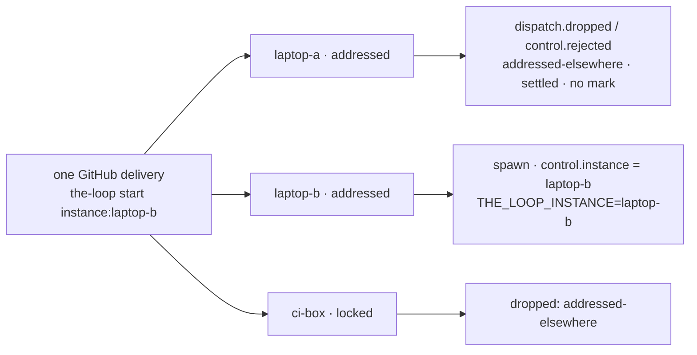

# Capability: instances

> Several instances of the-loop on one repository, each in an environment the operator
> provides, each scoped to its own work items: a named, scoped CLI config, an address
> token on the ticket, a locked instance, and the seams a manager of instances will use.

## What it is

One `cli-config.yaml` is one **instance** of the-loop: one set of daemons, one state root,
one registry of sessions. Before [issue-322](https://github.com/MadaraUchiha-314/the-loop/issues/322)
every instance was the same instance — each judged every labelled event identically
(labelled, authorized, started → spawn), so two instances watching one repository both
spawned a session for one `the-loop start`, in two checkouts, with two dev servers
fighting over one port.

An instance now has a **name**, a **scope mode** and a **declared list** of work items,
under the top-level `instance` block ([decision-110](../decisions/decision-110.md) D1: an
instance *is* a running CLI config, so the file that names its daemons names its scope).
What the-loop does **not** do is provide the environment: the machine, the container,
the checkout root and the port range are the operator's, and the-loop hands a spawned
session its instance's name and nothing else.

## Current behaviour

### The block

- The CLI config SHALL accept a top-level `instance` block: `name` (empty, or
  `^[a-z0-9][a-z0-9-]{0,39}$`), `scope.mode` (`open` | `addressed` | `locked`, default
  `open`) and `scope.workItems` (refs or GitHub issue / pull-request URLs, normalised to
  refs). Unset, the block SHALL resolve to an unnamed, open instance whose behaviour is
  that of 13.3.1; the block is additive — no config version bump, no migration.
- The block SHALL reach the dispatcher through the one `RoutingConfig` construction
  (fanned in under `routing._instance` by `cli_config.apply_instance`, the `_ghBinary`
  precedent) and SHALL be hot-reloaded with the rest of the config by both daemons and
  the service, so a scope edit is live on the next event.
- Every unresolvable value SHALL **narrow**: a name outside the grammar is unnamed; an
  unknown mode, and `addressed` on an unnamed instance, resolve to `locked` with a
  warning; a declaration that does not parse is warned about by index and skipped.

### The managed set, and the modes

- The **managed set** SHALL be derived, never kept (D2): the declared list ∪ the work
  items with a live session record in the instance's registry ∪ the work items with a
  control record in its portable state.
- WHEN an event names a work item in the managed set THEN the instance SHALL handle it
  exactly as at 13.3.1, in every mode.
- WHEN an event names no managed work item THEN `open` SHALL judge it as at 13.3.1;
  `addressed` SHALL take it only when the comment addresses this instance by name;
  `locked` SHALL refuse it whether or not it is addressed — the declared list is the only
  door, and an address never unlocks (abuse case 3).
- `the-loop sessions start <ref>` (and its API / MCP forms) run on an instance SHALL count
  as addressed to it: it claims on an `addressed` instance and is refused — exit code 1,
  effect `instance-locked`, nothing recorded, nothing posted — on a `locked` one whose
  managed set does not hold the work item.

### The address token

- A control comment MAY carry `instance:<name>` — a whole-word token, case-insensitive
  prefix, the name validated against the grammar — beside any keyword. A token outside
  the grammar SHALL NOT be an address, and nothing from the body other than a validated
  name SHALL reach a decision, a log line or a record.
- WHEN a comment addresses an instance whose name is not this instance's (an unnamed
  instance included) THEN this instance SHALL drop it, in every mode and whether or not
  it manages the work item: an explicit address is authoritative (D5).
- WHEN a comment names two or more different instances THEN every instance SHALL drop it
  as `ambiguous-address`, as a comment carrying two different keywords is refused.
- The token SHALL be recognised on both ingresses, on every event type a control keyword
  is read from.

### The refusal

- The scope decision SHALL run in `Dispatcher.handle` after linkage verification and the
  control parse, and before authorization, recording and matching; its only power SHALL
  be refusal — no mode and no token can make an instance spawn, record or post where
  13.3.1 would not.
- A refused event SHALL be recorded as `dispatch.dropped` (reason `unaddressed`,
  `instance-locked`, `addressed-elsewhere` or `ambiguous-address`, with the instance's
  name and mode) — or as `control.rejected` with the same reason when an authorized user
  typed a keyword — and SHALL be settled: not retried, not redelivered. It SHALL leave no
  reaction, comment, control record, collaborator grant or session record (D6).

### The record

- A control record SHALL carry `instance`: the recording instance's name, `""` for an
  unnamed instance and for every record written before the field existed.
- WHEN a named instance posts a keyword back to the ticket from the CLI THEN the comment
  SHALL carry `instance:<name>`; WHEN it announces a spawned session THEN the
  announcement's table SHALL name the instance.
- A session a **named** instance spawns SHALL find `THE_LOOP_INSTANCE=<name>` in its
  environment (`tmux new-session -e`, 3.2 or newer; an older tmux omits it with one
  warning, never a failed spawn). An unnamed instance SHALL spawn with the argv it used
  before.
- `GET /api/v1/instance` (the `get_instance` MCP tool, `loop.instance()` on the SDK) SHALL
  return the instance's name, scope and managed set with the source of each entry;
  `the-loop status` SHALL print one line naming the instance and its mode and carry the
  document in its JSON form.

### What it does not do

- Two `open` instances still take the same start; a work item declared on two instances
  is managed by both; a refused comment is not re-judged when the scope changes (claim it
  with `the-loop sessions start` on the instance). Instances share nothing and never talk
  to each other.
- A **manager** instance (the same API aggregated across instances) and an instance
  **managed from a ticket** are future work items; the seams left for them are the
  identical per-instance surface with `GET /api/v1/instance`, `control.instance` on every
  portable record, the address token as the vocabulary a ticket would speak, and
  `instance.ticket` as the reserved, not-yet-added place for the binding (D8, D9).

## Design

[`docs/specs/issue-322/design.md`](../specs/issue-322/design.md) ·
[decision-110](../decisions/decision-110.md) · [instance options](../config/cli/instance-options.md)
· [running several instances](../cli/instances.md) ·
[webhook-triggers](webhook-triggers.md) (the dispatch seam) · [control-plane](control-plane.md)
(the route) · [cli](cli.md) (`status`, `sessions start`)

## History

| Work item | What changed | Links |
|-----------|--------------|-------|
| issue-322 | The capability, whole (2026-09-08): the `instance` block, the derived managed set, the three modes, the address token, the dispatch-seam refusal that leaves no mark, `control.instance`, the token on posted keywords and the announcement, `THE_LOOP_INSTANCE` in a spawned session, `GET /api/v1/instance` and the `status` line | [spec](../specs/issue-322/), [decision-110](../decisions/decision-110.md), [issue](https://github.com/MadaraUchiha-314/the-loop/issues/322) |
