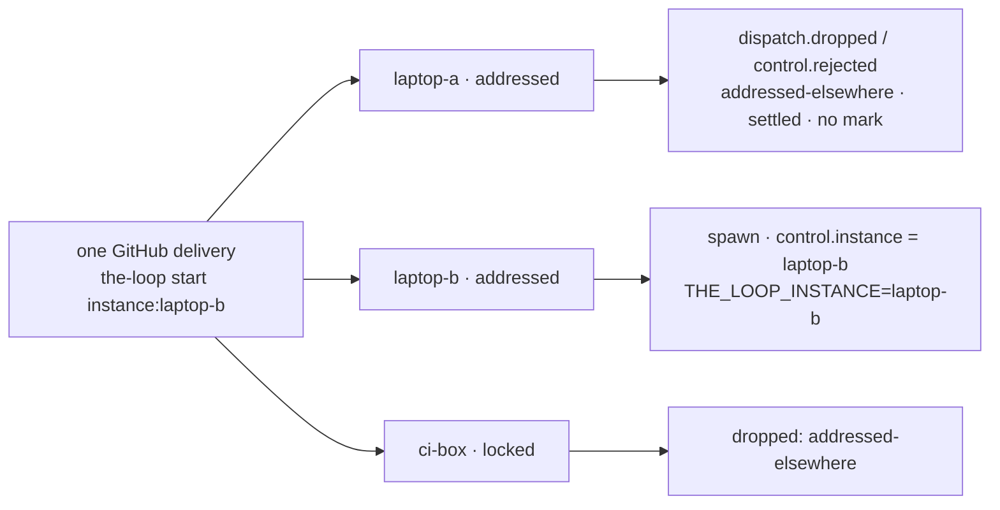

# Capability: instances

> Several instances of the-loop on one repository, each in an environment the operator
> provides, each scoped to its own work items: a named, scoped CLI config, an address
> token on the ticket, a locked instance — and a **manager** that serves the whole fleet
> through the same surface.

## What it is

One `cli-config.yaml` is one **instance** of the-loop: one set of daemons, one state root,
one registry of sessions. Before [issue-322](https://github.com/MadaraUchiha-314/the-loop/issues/322)
every instance was the same instance — each judged every labelled event identically
(labelled, authorized, started → spawn), so two instances watching one repository both
spawned a session for one `the-loop start`, in two checkouts, with two dev servers
fighting over one port.

An instance now has a **name**, a **scope mode** and a **declared list** of work items,
under the top-level `instance` block ([decision-110](../decisions/decision-110.md) D1: an
instance *is* a running CLI config, so the file that names its daemons names its scope).
What the-loop does **not** do is provide the environment: the machine, the container,
the checkout root and the port range are the operator's, and the-loop hands a spawned
session its instance's name and nothing else.

```mermaid
flowchart LR
  GH["one GitHub delivery<br/>the-loop start instance:laptop-b"] --> A["laptop-a · addressed"]
  GH --> B["laptop-b · addressed"]
  GH --> C["ci-box · locked"]
  A --> AD["dispatch.dropped / control.rejected<br/>addressed-elsewhere · settled · no mark"]
  B --> BS["spawn · control.instance = laptop-b<br/>THE_LOOP_INSTANCE=laptop-b"]
  C --> CD["dropped: addressed-elsewhere"]
```

## Current behaviour

### The block

- The CLI config SHALL accept a top-level `instance` block: `name` (empty, or
  `^[a-z0-9][a-z0-9-]{0,39}$`), `scope.mode` (`open` | `addressed` | `locked`, default
  `open`) and `scope.workItems` (refs or GitHub issue / pull-request URLs, normalised to
  refs). Unset, the block SHALL resolve to an unnamed, open instance whose behaviour is
  that of 13.3.1; the block is additive — no config version bump, no migration.
- The block SHALL reach the dispatcher through the one `RoutingConfig` construction
  (fanned in under `routing._instance` by `cli_config.apply_instance`, the `_ghBinary`
  precedent) and SHALL be hot-reloaded with the rest of the config by both daemons and
  the service, so a scope edit is live on the next event.
- Every unresolvable value SHALL **narrow**: a name outside the grammar is unnamed; an
  unknown mode, and `addressed` on an unnamed instance, resolve to `locked` with a
  warning; a declaration that does not parse is warned about by index and skipped.

### The managed set, and the modes

- The **managed set** SHALL be derived, never kept (D2): the declared list ∪ the work
  items with a live session record in the instance's registry ∪ the work items with a
  control record in its portable state.
- WHEN an event names a work item in the managed set THEN the instance SHALL handle it
  exactly as at 13.3.1, in every mode.
- WHEN an event names no managed work item THEN `open` SHALL judge it as at 13.3.1;
  `addressed` SHALL take it only when the comment addresses this instance by name;
  `locked` SHALL refuse it whether or not it is addressed — the declared list is the only
  door, and an address never unlocks (abuse case 3).
- `the-loop sessions start <ref>` (and its API / MCP forms) run on an instance SHALL count
  as addressed to it: it claims on an `addressed` instance and is refused — exit code 1,
  effect `instance-locked`, nothing recorded, nothing posted — on a `locked` one whose
  managed set does not hold the work item.

### The address token

- A control comment MAY carry `instance:<name>` — a whole-word token, case-insensitive
  prefix, the name validated against the grammar — beside any keyword. A token outside
  the grammar SHALL NOT be an address, and nothing from the body other than a validated
  name SHALL reach a decision, a log line or a record.
- WHEN a comment addresses an instance whose name is not this instance's (an unnamed
  instance included) THEN this instance SHALL drop it, in every mode and whether or not
  it manages the work item: an explicit address is authoritative (D5).
- WHEN a comment names two or more different instances THEN every instance SHALL drop it
  as `ambiguous-address`, as a comment carrying two different keywords is refused.
- The token SHALL be recognised on both ingresses, on every event type a control keyword
  is read from.

### The refusal

- The scope decision SHALL run in `Dispatcher.handle` after linkage verification and the
  control parse, and before authorization, recording and matching; its only power SHALL
  be refusal — no mode and no token can make an instance spawn, record or post where
  13.3.1 would not.
- A refused event SHALL be recorded as `dispatch.dropped` (reason `unaddressed`,
  `instance-locked`, `addressed-elsewhere` or `ambiguous-address`, with the instance's
  name and mode) — or as `control.rejected` with the same reason when an authorized user
  typed a keyword — and SHALL be settled: not retried, not redelivered. It SHALL leave no
  reaction, comment, control record, collaborator grant or session record (D6).

### The record

- A control record SHALL carry `instance`: the recording instance's name, `""` for an
  unnamed instance and for every record written before the field existed.
- WHEN a named instance posts a keyword back to the ticket from the CLI THEN the comment
  SHALL carry `instance:<name>`; WHEN it announces a spawned session THEN the
  announcement's table SHALL name the instance.
- A session a **named** instance spawns SHALL find `THE_LOOP_INSTANCE=<name>` in its
  environment (`tmux new-session -e`, 3.2 or newer; an older tmux omits it with one
  warning, never a failed spawn). An unnamed instance SHALL spawn with the argv it used
  before.
- `GET /api/v1/instance` (the `get_instance` MCP tool, `loop.instance()` on the SDK) SHALL
  return the instance's name, scope and managed set with the source of each entry;
  `the-loop status` SHALL print one line naming the instance and its mode and carry the
  document in its JSON form.

### The manager (issue-374)

- The CLI config SHALL accept `instance.role` (`worker` | `manager`, default `worker`)
  and, for a manager, `instance.manager.instances` (`{name, url}` entries validated by
  index: the name grammar, an `http(s)` URL without userinfo, uniqueness, not the
  manager's own address), `manager.timeoutSeconds` and `manager.probeIntervalSeconds`.
  `role` is boot-only (`restartRequired`); the registry is hot. `the-loop start` SHALL
  refuse a role outside the two values and a manager without a name; every other
  reader warns and reads `worker`.
- A manager SHALL remain a worker: its ingresses, scope, channels and sessions behave as
  on a worker, and its own state is the fleet's first member, served in-process under
  its own name, never through a registered URL ([decision-138](../decisions/decision-138.md) D2).
- A manager SHALL serve exactly the surface a worker serves — the same `APIRouter` over a
  second facade, the contract parity test run for both roles, one MCP tool list (D3).
  A list read is its own rows ∪ every live member's, each stamped `instance` with the
  registered name (a member's own claim overwritten, a differing one kept as `about` so
  an event about an instance still names its subject); an operation keyed by a work-item
  ref or a standing-session name routes to the one instance that manages it — none
  `404`, several `409` naming them, unless `instance` names one (D6); an operation keyed
  by a checkout path or a daemon, and `config`, `restart`, `health` and `instance`, are
  the manager's own without `instance` and proxied to a member with it. Every keyed
  operation carries the optional `instance` on every role; a worker accepts only its
  own name (D7).
- A member SHALL be trusted only once `GET /api/v1/instance` there answers with the
  registered name and `role: worker` (D5): otherwise it is `unreachable` or
  `mismatched`, nothing is served from it or sent to it, and its transitions are one
  event each (`instance.unreachable`, `instance.mismatched`, `instance.recovered`). A
  member's body is read within the timeout and a fixed bound and shape-checked; a
  failure is `instance.malformed` and that member left out. A list read that could not
  reach every member SHALL still answer `200`, naming them in
  `The-Loop-Instances-Unreachable` (`aggregate.partial`); a keyed operation to such a
  member is `502`.
- `GET /api/v1/instances` SHALL be served by every role (D9): `{role, name, instances}`,
  one row per instance — itself first, `live`; on a manager one more per registered
  member from a probe no older than `probeIntervalSeconds` — with `state`, `version`,
  `mode`, `managedCount`, `sessionCount`, `probedAt` and a `detail` when not live. The
  `list_instances` MCP tool, `loop.instances()` on the SDK and `the-loop instances list`
  read it; `the-loop status` prints it on a manager.
- `POST /api/v1/instances/register` / `unregister`, `the-loop instances register` /
  `unregister` and the dashboard's Instances tab SHALL all write
  `instance.manager.instances` through the config route's splice (D4): comments
  survive, the merged document is validated before anything is written, and the change
  is live on the next request. A worker answers `400` naming `instance.role`. Neither
  is an MCP tool.
- The manager's stream SHALL fan every live member's `log` and `transcript` frames into
  its own over one upstream connection per member however many subscribers it has, each
  `log` record stamped `instance` (a differing subject kept as `about`), the frame id one offset per instance
  (`name=offset,…`) resumed member by member, one `desync` when any part cannot be
  honoured (D8), bounded reconnection (`1…30 s`), `maxSubscribers` unchanged.
- The dashboard SHALL read a manager as one board: an instance chip on every row, a
  filter by instance, a work item on two instances as two rows (`#/item/<ref>@<instance>`),
  every keyed call carrying the row's instance, an Instances tab (`#/instances`) with a
  Register card and per-row Open / Manage / Unregister, and a per-instance pane
  (`#/instances/<name>`) with its identity, daemons, config editor and restart. A worker
  shows itself as one row.

### What it does not do

- Two `open` instances still take the same start; a work item declared on two instances
  is managed by both; a refused comment is not re-judged when the scope changes (claim it
  with `the-loop sessions start` on the instance). Instances share nothing and never talk
  to each other.
- An instance **managed from a ticket** is a future work item; `instance.ticket` stays
  the reserved, not-yet-added place for the binding (decision-110 D9). A manager
  registered with another manager is `mismatched` — the fleet is flat; nested managers
  are [issue #438](https://github.com/MadaraUchiha-314/the-loop/issues/438), and a
  fleet-wide Slack channel [issue #437](https://github.com/MadaraUchiha-314/the-loop/issues/437).
  Auth between a manager and its members is the deployment's (decision-059).

## Design

[`docs/specs/issue-374/design.md`](../specs/issue-374/design.md) (the manager) ·
[decision-138](../decisions/decision-138.md) ·
[`docs/specs/issue-322/design.md`](../specs/issue-322/design.md) ·
[decision-110](../decisions/decision-110.md) · [instance options](../config/cli/instance-options.md)
· [running several instances](../cli/instances.md) ·
[webhook-triggers](webhook-triggers.md) (the dispatch seam) · [control-plane](control-plane.md)
(the route) · [cli](cli.md) (`status`, `sessions start`)

## History

| Work item | What changed | Links |
|-----------|--------------|-------|
| issue-374 | The manager (2026-09-30): `instance.role: manager` and the registry `instance.manager.instances` in the CLI config; one router over two facades so a manager serves the identical `/api/v1` — its own rows plus every live member's on a list read, a keyed operation routed to the instance that manages it (`409` on ambiguity), an optional `instance` on every keyed operation that a worker accepts as its own name; members trusted by a name-checked probe; the `instances` family on every role with `register`/`unregister` writing the registry through the config splice; the stream fanned in with a per-member cursor; `the-loop instances`; the dashboard's Instances tab, instance pane, chip and filter | [spec](../specs/issue-374/), [decision-138](../decisions/decision-138.md), [issue](https://github.com/MadaraUchiha-314/the-loop/issues/374) |
| issue-322 | The capability, whole (2026-09-08): the `instance` block, the derived managed set, the three modes, the address token, the dispatch-seam refusal that leaves no mark, `control.instance`, the token on posted keywords and the announcement, `THE_LOOP_INSTANCE` in a spawned session, `GET /api/v1/instance` and the `status` line | [spec](../specs/issue-322/), [decision-110](../decisions/decision-110.md), [issue](https://github.com/MadaraUchiha-314/the-loop/issues/322) |
