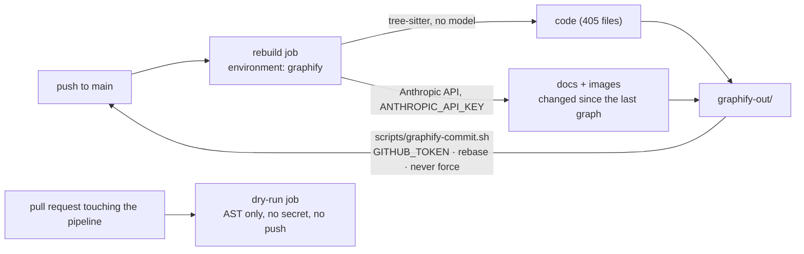

# Capability: knowledge-graph

> A graphify knowledge graph of this repository, rebuilt by CI on every merge to `main`
> and committed under `graphify-out/` — code by AST, documents and images by Claude.

<!-- Authored per the the-loop:writing skill. -->

## What it is

[graphify](https://github.com/Graphify-Labs/graphify) turns the tree into a graph of
entities and relationships: `graphify-out/graph.json` (the graph, for tooling and for
`graphify query`), `graphify-out/GRAPH_REPORT.md` (a plain-language report: hubs,
communities, surprising connections) and `graphify-out/graph.html` (an interactive view).
`.github/workflows/graphify.yml` rebuilds it on every push to `main` and commits the
result back, so the graph is never older than the code and nobody runs it by hand.

## Current behaviour

- WHEN a commit is pushed to `main` (by a person or a merge) THEN the `rebuild` job SHALL
  install the pinned `graphifyy` with the Anthropic SDK, run `graphify extract .
  --backend claude --model $GRAPHIFY_MODEL` and `graphify cluster-only` with the same
  backend, and commit `graphify-out/` back to `main` as one `chore(graphify):` commit
  under the `github-actions[bot]` identity, rebasing onto whatever landed meanwhile and
  never forcing. IF nothing changed THEN no commit is made.
- The rebuild SHALL be **incremental**: the committed `graph.json` and `manifest.json` are
  the baseline, so only documents changed since they were written go to the model. A
  `workflow_dispatch` with `force` rebuilds everything. The semantic cache under
  `graphify-out/cache/` is carried between runs by `actions/cache`, not by git.
- `ANTHROPIC_API_KEY` SHALL be read from a secret on the **`graphify` GitHub
  environment**, by the `rebuild` job only, which never runs for a `pull_request` event.
  Restrict the environment's deployment branches to `main`. IF the secret is empty THEN
  the job fails at once with a message naming it.
- WHEN a pull request changes `.github/workflows/graphify.yml` or
  `scripts/graphify-commit.sh` THEN the `dry-run` job SHALL run the no-model half
  (`--code-only`, `--no-label`) with no secret and no write access, and upload
  `GRAPH_REPORT.md` as a workflow artifact. Any other pull request runs nothing.
- A push made by the pipeline SHALL start no workflow (it uses `GITHUB_TOKEN`), so the
  graph commit triggers neither CI, the release, nor another rebuild. The token SHALL
  reach git in the commit step only — the checkout persists no credential, so graphify
  never runs with a token that could push. Runs are never cancelled; a newer `main`
  rebuild replaces a pending one, and pull-request rehearsals live in their own
  concurrency group.
- The tracked files SHALL be `graph.json`, `GRAPH_REPORT.md`, `graph.html`,
  `manifest.json`, `.graphify_labels.json` and its `.sig`; `graphify-out/cache/`, the
  other `.graphify_*` sidecars and dated backup directories are git-ignored; the
  generated report is excluded from markdownlint.
- Locally, `make graph` SHALL run the same no-model half from the repository root
  (`uv tool install --with anthropic graphifyy` first). A full local rebuild is
  `ANTHROPIC_API_KEY=… graphify extract . --backend claude --model claude-opus-5`
  followed by `graphify cluster-only . --backend claude --model claude-opus-5`.

## What it costs

| Item | Measured on this tree |
|---|---|
| AST extraction (no model) | ~40 s, 405 code files |
| Documents sent to the model on a full run | 1,273 docs + 77 images, 2.4 M words, 48 chunks |
| First full run (Opus 5) | roughly $20–30; a third on Sonnet 5 (`GRAPHIFY_MODEL`) |
| A merge that changed *n* documents | *n* documents, cents |
| `graph.json` | 19–32 MB on disk, ~1.9 MB in the pack; ~0.4 MB of pack per rebuild |

graphify prints its own token count and cost estimate at the end of each run; it is in
the job log.

## Design

[`docs/specs/issue-385/design.md`](../specs/issue-385/design.md) ·
[decision-133](../decisions/decision-133.md) (why headless in CI, why the asset lives on
`main`, and the Claude Code-in-CI recipe that was not chosen)

## History

| Work item | What changed | Links |
|-----------|--------------|-------|
| issue-385 | Introduced the graph: the rebuild-and-commit workflow, the pull-request rehearsal, the commit script with rebase-and-retry, the ignore rules, `make graph` | [spec](../specs/issue-385/), [decision-133](../decisions/decision-133.md) |
