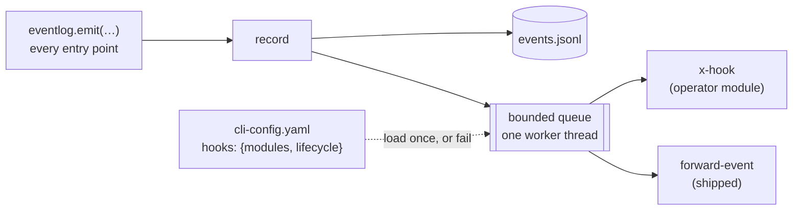

# Capability: lifecycle-hooks

> Every event the-loop records is a point an operator may attach code to: hooks on
> the whole lifecycle — work start, work finish and every dispatch between — declared in
> the operator's CLI config, run off one worker thread, never able to stop the-loop or
> move its graph.

## What it is

The runtime in `cli/the_loop/lifecycle_hooks.py`, the top-level `hooks` block of the
[CLI config](../config/cli/hooks-options.md), the `the-loop hooks` command, and the seam
in `cli/the_loop/eventlog.py` that hands every record to the runtime after writing it.

It exists because the-loop had one hook surface and it covered one place. The
[process-graph](process-graph.md) hooks (issue-248) append a **gate** to a node
boundary — the right tool for a licence-header check on `implementation`, the wrong one
for "send our telemetry when work starts and finishes", because neither work start (a
session spawning) nor work finish (a PR merging, the item ending) is a node boundary.
What *does* enumerate every one of those points is the
[event log](observability.md)'s catalog — ~150 typed events, already the enforced single
source of truth for "things that happen". This capability makes each of them an attach
point ([decision-124](../decisions/decision-124.md)).

## Current behaviour

### Attach points

- THE attach points SHALL be the event types of `EVENT_TYPES` minus the `hooks.*` domain;
  `the-loop events --types` lists them.
- WHEN an attachment's `on` names an exact type or an `fnmatch` pattern (a string or a
  list) THEN it SHALL be expanded against the catalog at load; a pattern matching nothing
  SHALL fail the load naming the pattern. A bare YAML `on:` key (which parses as `true`)
  SHALL be read as `on`.
- WHEN an event is emitted THEN every attached hook SHALL be invoked once, in declaration
  order, with the record's envelope and fields.
- `hooks.loaded`, `hooks.failed` and `hooks.dropped` SHALL never be attach points.

### Declaration

- THE declaration SHALL be the top-level `hooks` block of the operator's CLI config —
  `modules[]` (each exactly one of `path`/`module`) and `lifecycle[]` (each `hook`, `on`,
  optional `with`) — and nothing in any repository's file (decision-123). A checkout
  carrying a hook module nobody declared SHALL run nothing.
- A `modules[].path` SHALL resolve against the **CLI config file's directory** and stay
  inside it: absolute, `..` and symlink-out are refused. (A graph hook's `path` resolves
  against each checkout; the two roots are deliberate — one surface is the repository's,
  the other the instance's.)
- An absent block SHALL change nothing: no import, no thread, no sink.
- The block SHALL be described in the CLI-config schema, documented per leaf, and present
  as a commented example in the shipped template.

### Contract

- A lifecycle hook SHALL be registered with the same `@hook("x-<name>")` decorator a graph
  hook uses and SHALL have the signature `(LifecycleEvent) -> HookResult | None`, where
  `LifecycleEvent` carries `event`, `level`, `ts`, `source`, `pid`, `fields`, `params`
  (the attachment's `with`) and `instance`, plus `work_item` and `record()`.
- An operator module SHALL register only `x-` names; an attachment SHALL name an `x-` hook
  a declared module registered or a **shipped lifecycle hook**; anything else fails the
  load. Shipped lifecycle hooks live in their own table, not the graph registry, and are
  attachable by the operator (a shipped graph hook is not).
- A hook that raises, or returns a `block`, SHALL be one `hooks.failed` (warning; `hook`,
  `on`, `error`) and SHALL NOT stop the next hook, the next event, the dispatch, or the
  command that emitted. `None` and any non-blocking result are a success; `messages` are
  logged at debug, never recorded as events.
- A lifecycle hook SHALL have no effect on the process graph: no `HookContext`, no chain,
  no outcome read.

### Dispatch

- WHEN any entry point configures the event log from the CLI config THEN it SHALL install
  the `hooks` block from the same file in the same call — the receiver, the poller, the
  service, and every one-shot command that records events.
- Dispatch SHALL be independent of `eventLog.enabled`.
- Hooks SHALL run on one worker thread in emission order; `emit` SHALL return without
  waiting. The queue SHALL be bounded (1024); WHEN full, the record SHALL be dropped for
  hooks only and one `hooks.dropped` (`on`, `capacity`) recorded per overflow episode.
- A record emitted on the worker thread — by a hook, directly or through the-loop — SHALL
  be written and SHALL NOT be re-dispatched.
- A normal exit SHALL drain the queue for a bounded time (5 s).

### Shipped hooks

- `forward-event` SHALL POST the record as JSON to `with.url` (`http`/`https` only,
  checked at load) with `with.headers` verbatim, a bearer token read **at call time** from
  the environment variable `with.tokenEnv` names (unset → nothing sent, `hooks.failed`),
  and `with.timeoutSeconds` (default 5); any failure SHALL be one `hooks.failed` for that
  event with no retry.

### Inspection and failure

- `the-loop hooks [--format text|json]` SHALL report the shipped hooks, the declared
  modules and each attachment with the events its patterns match, importing nothing; a
  block it cannot parse SHALL exit 2 naming the entry.
- A declaration that cannot be honoured — malformed block, missing/raising/empty module,
  non-`x-` registration, duplicate name, unknown hook, empty expansion, bad shipped params
  — SHALL fail the entry point loading it. Nothing SHALL degrade to "no hooks".
- A successful load SHALL record one `hooks.loaded` (`modules`, `attachments`, `events`).

## Design

[`docs/specs/issue-344/design.md`](../specs/issue-344/design.md) ·
[decision-124](../decisions/decision-124.md) · [adding a hook](../cli/hooks.md) ·
[hook options](../config/cli/hooks-options.md) · the graph hooks this generalises:
[process-graph](process-graph.md) § A repository's own hooks, [decision-096](../decisions/decision-096.md).

**Not yet on this seam:** the-loop's own side effects that the dispatcher still hard-wires
— the session announcement (`session.spawned`), the dispatch reactions, comment mirroring.
Each is a follow-up that moves a test double into a config switch; the design lists what
each record must carry first.

## History

| Work item | What changed | Links |
|-----------|--------------|-------|
| issue-344 | The capability (2026-09-12): the top-level `hooks` block, the `LifecycleEvent` contract, the queued single-thread runtime with its two anti-recursion guards, the shipped `forward-event`, `the-loop hooks`, three `hooks.*` event types, and the event-log seam (`EventLog.build`/`write`, sinks) that every entry point's `configure_from_file` installs from | [spec](../specs/issue-344/), [decision-124](../decisions/decision-124.md), [issue](https://github.com/MadaraUchiha-314/the-loop/issues/344) |
