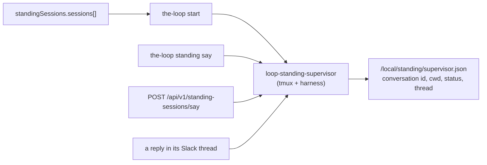

# Capability: standing-sessions

> Named, long-lived tmux + harness sessions that belong to **no work item** — the ones
> the-loop keeps for itself, declared in the CLI config, addressed by name, and talked to
> on the control plane or in a Slack thread.

## How you interact with one

Three ways, and no others are built ([decision-100](../decisions/decision-100.md)): type
directly into its **tmux session**, reply in its **Slack thread**, or reach it through the
**control plane** — the dashboard's **Standing** screen, `the-loop standing say`, `POST
/api/v1/standing-sessions/say`, or the `say_to_standing_session` MCP tool. The control
plane is deliberately *not* modelled as a `channel`, and the existing way to talk to a
tmux session is reused rather than reinvented.

The dashboard screen is where a session is created and deleted without touching a config
file: it lists both kinds, says which is which, and offers `delete` only for a **created**
one — the service refuses it for a declared session, and a button whose only outcome is
that refusal is worse than no button.

A standing session cannot yet *initiate* — it is read by looking at its pane, locally,
over SSH, or through the ttyd web terminal. That limitation is recorded in decision-100
rather than left to be rediscovered.

## What it is

Every other session the-loop spawns is a work item's: the tmux name is minted from a
`WorkItemRef`, events arrive from GitHub, and every question the agent asks goes back to
the ticket it came from. A **standing session** is the other kind. It owns no ticket, so
it has no phase to advance and no completion; it runs from `the-loop start` until an
operator stops it.

It exists for the work that sits *above* the work items —
[issue-277](https://github.com/MadaraUchiha-314/the-loop/issues/277) names watching the
items in flight and recovering one that is stuck — and because there is no ticket,
**GitHub is not its surface**: the control plane and Slack are.

| | work-item session | standing session |
|---|---|---|
| Identity | `github:OWNER/REPO#N` | a name (`^[a-z0-9][a-z0-9-]{0,39}$`) |
| Defined by | the ticket | a config entry, **or** `standing create` at runtime |
| tmux | `loop-<work-item-slug>` | `loop-standing-<name>` |
| Record | `<state.root>/local/<slug>.json` | `<state.root>/local/standing/<name>.json` |
| Started by | an authorized control keyword on the ticket | `the-loop start`, or `standing start` |
| Input | routed GitHub events, `sessions reply` | `standing say`, its Slack thread |
| Ends | when the work item is delivered | when an operator stops it |

## Current behaviour

### Definition — declared, or created

A session's definition comes from one of two sources, and the verbs cannot tell them
apart ([decision-100](../decisions/decision-100.md)):

- WHEN a name is **declared** in `standingSessions.sessions` THEN that entry is its
  definition.
- WHEN a name is not declared but **recorded** THEN its registry record is its definition:
  a session created through the API carries `harnessArgs`, `prompt`, `description` and
  `autoStart` in the record, because for it the record *is* the declaration.
- `start`, `stop`, `restart` and `say` SHALL resolve through that one seam, so the source
  of a definition never changes what a verb does.

### Created and deleted at runtime

- WHEN an authorized caller **creates** a session THEN its whole definition SHALL be
  written to the registry and the session started, unless the caller asks for the record
  alone.
- IF the name is already declared **or** already recorded THEN the create SHALL be refused.
  A name is one session; adopting an existing one would let a create take over a running
  agent.
- WHEN a create's start fails THEN the record it wrote SHALL be removed, so the name stays
  free for the retry and no half-session is left behind.
- WHEN an authorized caller **deletes** a session THEN it SHALL be stopped with the same
  graceful termination `stop` performs, and its record SHALL then be removed — the whole
  difference from `stop`, which keeps the record so the next start resumes.
- IF the named session is **declared** THEN delete SHALL be refused, naming the config key
  and `stop`. `the-loop start` would recreate the record on the next boot, so a delete
  that appeared to work would be lying.
- WHEN a **created** session's record says it auto-starts THEN `the-loop start` SHALL
  restore it. `stop` already takes down every *recorded* session, so without the symmetry
  `the-loop restart` would destroy exactly what the API created.

### Declaration

- WHEN the CLI config carries `standingSessions` THEN it SHALL be validated against
  `.the-loop/cli-config.schema.json`, and a block that cannot be parsed SHALL be **refused**
  by every verb — the reads included, because a listing that answered "none" for a config
  with a typo in it is a wrong answer that looks like a fact. `stop` alone parses
  tolerantly: it is the recovery verb, works off the registry, and must keep working when
  the declaration does not.
- A `name` SHALL match `^[a-z0-9][a-z0-9-]{0,39}$`, because it is interpolated into a
  tmux session name and a file name; a duplicate name SHALL refuse the whole block with
  both positions named, rather than resolve the collision.
- An entry that omits `harness`, `harnessArgs` or `cwd` SHALL inherit
  `routing.defaultHarness`, `routing.harnessArgs.<harness>` and `routing.spawnWorkdir`
  respectively. An explicit `harnessArgs: []` means *none* — the distinction between
  omitted and empty is load-bearing.
- An entry declaring **both** `prompt` and `promptFile` SHALL be refused: there is no
  precedence between them. A `promptFile` that cannot be read at start time SHALL fail
  **that** session and no other.
- The block is **off by default**. Enabling the daemons is not consent to spawn agent
  sessions nobody asked for.

### Lifecycle

- WHEN `the-loop start` runs AND the block is enabled THEN every `autoStart` entry SHALL
  be started **after** the control-plane service, and reported in its own section beside
  the service rows.
- WHEN a session is started AND its pane is alive THEN it SHALL be reported
  `already-running` and left untouched — a start SHALL never spawn over a live pane.
- WHEN a session is started AND a record carries a conversation id AND no live tmux
  session holds its name THEN the harness SHALL be spawned with its **resume** argv, and
  the resumed pane SHALL be probed (`routing.tmux.resumeProbeSeconds`) before it is
  trusted; a resume that does not survive falls back to a fresh conversation
  (`standing.resume_failed`, then `standing.started`).
- WHEN a start finds a **live** tmux session holding the name and **no record** THEN it
  SHALL refuse loudly, naming `tmux attach -r -t …` — the same refusal the work-item spawn
  path makes, for the same reason: the-loop must not kill an agent it cannot account for.
  `stop` SHALL NOT signal such a session either: the-loop releases what the-loop started.
  A **dead** retained pane is not that case — nothing is running in it, so a start clears
  it and spawns, record or no record.
- WHEN tmux does not **answer** whether the session exists THEN nothing SHALL be spawned:
  silence is not absence (the issue-146 rule), and reading it as absence is how a live
  session gets collided with.
- WHEN `the-loop stop` runs THEN every **recorded** session SHALL be stopped regardless of
  `enabled` and `autoStart`, and SHALL be stopped **first**, while the control plane it
  may be talking to is still up.
- WHEN a session is stopped THEN its harness SHALL be terminated gracefully first
  (SIGTERM, then SIGKILL after `routing.tmux.harnessKillGraceSeconds`) and only then its
  tmux session killed. The order is load-bearing: Claude Code flushes its conversation on
  exit, and a conversation that was not flushed cannot be resumed.
- WHEN a session is stopped THEN its record SHALL be **kept**, with `status: stopped` and
  its conversation id intact, so the next start resumes rather than forgets.
- WHEN `the-loop status` runs THEN each declared or recorded session SHALL be reported,
  and `ok` SHALL be false when a session `start` **would have started** (the block enabled
  and the entry's `autoStart` true) is not running. A session declared without
  `autoStart`, or one only in the registry because it was started by hand, SHALL be
  reported without deciding the health answer.

### Talking to one

- A standing session SHALL be addressed **by name**; a work-item ref SHALL NOT resolve to
  one, and `the-loop sessions list` SHALL NOT show one. The two registries are separate
  namespaces, which is what makes it structurally impossible to route a GitHub event into
  a standing session.
- WHEN a caller sends text to a **running** session THEN it SHALL be bracket-pasted into
  its TUI and submitted, `standing.said` SHALL be emitted, and the text SHALL be posted to
  no ticket anywhere — a standing session has none, so the event log is its paper trail.
- IF the addressed session is not running THEN the send SHALL be refused with an error
  naming `the-loop standing start <name>`. A message SHALL never spawn a session, the same
  fail-closed rule `sessions reply` follows.
- The CLI (`the-loop standing`), the REST API (`/api/v1/standing-sessions*`), the MCP
  endpoint and the SDK (`loop.standing`) SHALL all reach the same core functions.
  **Control, create and delete are not on MCP**: an agent that could stop or restart a
  standing session could stop the one supervising it, and bringing a harness process into —
  or out of — existence is an operator's act. Read and `say` are registered, because those
  are what an agent coordinating with a supervisor actually needs.

### Slack

- WHEN a session with `slack.enabled` starts AND `channels.slack` is enabled THEN the-loop
  SHALL post an announcement into that session's channel — its own `slack.channel`, or
  `channels.slack.channel` when it declares none — and SHALL bind the resulting thread to
  the session under `standing:<name>`.
- WHEN an authorized member replies in that thread THEN the reply SHALL be delivered into
  the session's pane. The existing fail-closed authorization applies **unchanged**: the
  standing branches sit after the bot drop and the allow-list check, and there is no
  second entry point into the pipeline.
- A standing session's reply SHALL NOT be mirrored onto any work item — it has none — and
  `channel.mirror_skipped` SHALL record why. This is the one place the paper trail moves
  from the ticket to the event log, and it is recorded rather than silent for exactly that
  reason.
- The bot SHALL still read **only threads it is bound to**. A standing session gets a
  thread of its own; it does not get permission to read the channel.
- A Slack failure SHALL never stop a session starting (`standing.announce_failed`).

### What the session is told

- WHEN a session is spawned THEN its boot prompt SHALL state its name, that it owns no
  work item, that it MUST NOT answer a phase-selection gate or post a control keyword on
  any ticket, and which surfaces its operator speaks to it on.
- An operator's `prompt`/`promptFile` SHALL be **appended to** that directive, never
  substituted for it. The directive is deliberately not configurable: a template key would
  exist only to let it be deleted — the same rule `$interaction_directive` follows for
  work-item prompts.

## Interfaces

| Surface | Operations |
|---|---|
| CLI | [`the-loop standing`](../cli/commands/standing.md) — `list`, `create`, `delete`, `start`, `stop`, `restart`, `say` |
| REST | `GET /api/v1/standing-sessions`, `GET …/one?name=`, `POST …/create`, `POST …/delete`, `POST …/control`, `POST …/say` |
| MCP | `list_standing_sessions`, `get_standing_session`, `say_to_standing_session` — **only** these three |
| SDK | `loop.standing.list() / get() / create() / delete() / control() / say()` |
| Dashboard | the **Standing** screen (`#/standing`) — list, create, delete, start/stop/restart, and a per-session message box |
| Lifecycle | [`start`](../cli/commands/start.md), [`stop`](../cli/commands/stop.md), [`status`](../cli/commands/status.md) carry a `standingSessions` section |
| Config | [`standingSessions`](../config/cli/standing-sessions-options.md) |
| Events | `standing.created`, `standing.create_failed`, `standing.deleted`, `standing.started`, `standing.resumed`, `standing.resume_failed`, `standing.spawn_failed`, `standing.stopped`, `standing.stop_failed`, `standing.said`, `standing.announced`, `standing.announce_failed`, `channel.mirror_skipped` |

## Security posture

- **The config is executable-adjacent.** An entry names harness arguments and a working
  directory, and the session runs with the operator's own credentials — the posture
  `routing.harnessArgs` and `reviews.critics` already carry. `/api/v1/config` is off the
  MCP surface, so an agent cannot write itself a new standing session.
- **No cross-namespace addressing.** `standing:<name>` has neither a `/` nor a `#`, so
  `WorkItemRef.parse` cannot accept it; `parse_standing_ref` is the only reader of the
  prefix and rejects anything else. Nothing in the router, the dispatcher or
  `SessionRegistry` knows it exists.
- **`say` is not a spawn.** Neither the API nor a Slack message can bring a harness
  process into existence; starting one stays an operator's act.
- **`cwd` must exist**, and is pre-trusted per `routing.harnessTrust` before the spawn, so
  an unattended session does not stall on a workspace-trust dialog.

## Related

[interactive-sessions](interactive-sessions.md) (how a session is hosted in tmux — the
runner these share) · [channels](channels.md) (the Slack bot and its pipeline) ·
[control-plane](control-plane.md) (the core → API → clients layering) ·
[cli](cli.md) · [decision-099](../decisions/decision-099.md)

## History

| Work item | What changed | Links |
|-----------|--------------|-------|
| issue-277 | Introduced standing sessions: the `standingSessions` config block, the `StandingRegistry` under `<state.root>/local/standing/`, `loop-standing-<name>` tmux sessions, the `the-loop standing` command and its REST/MCP/SDK surfaces, the `start`/`stop`/`status` integration with resume-across-restart, the non-configurable boot directive, and the Slack thread a session is announced in and answered on. On review the owner ruled the control plane is **not** a channel and asked for create/delete instead, so a session can be brought into existence and removed through the API rather than only by editing the config — the record then carries the whole definition. The dashboard gained a **Standing** screen when the owner asked whether create works from the control-plane UI — it did not, and neither did `say`, so the third surface the ruling named was unwired | [spec](../specs/issue-277/), [decision-099](../decisions/decision-099.md), [decision-100](../decisions/decision-100.md), [issue](https://github.com/MadaraUchiha-314/the-loop/issues/277) |
