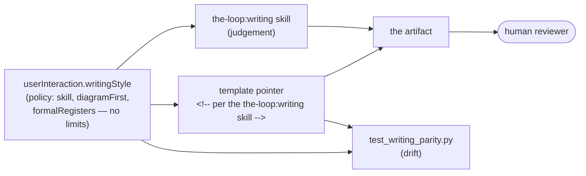

# Capability: writing-style

> How the-loop writes the artifacts a human has to read — the shape, the register and
> the diagram rule that keep them readable.

## What it is

A reviewer approving a work item reads `requirements.md`, `design.md`, `testing-plan.md`
and the PR briefing. Before issue-165 nothing set a shape, a length or a register for
them, and the harness's only verbosity lever (`tokenEconomy.outputVerbosity`) compresses
*chat narration* while explicitly **preserving** specs — aimed away from the documents the
reviewer actually opens.

This capability is the writing contract: a bundled **`the-loop:writing`** skill carrying
the judgement, `userInteraction.writingStyle` carrying the policy, a pointer to the skill
in each human-read template, and a parity test catching the drift prose cannot.

It carries **no length limits**, deliberately. A work item's scope is not known in
advance, so a number that fits a two-line bug fix is wrong for a new subsystem, and a cap
only pushes prose into an appendix ([decision-061](../decisions/decision-061.md)). The
test is density, not length — and density is a review judgement.

## Current behaviour

- the-loop SHALL bundle a second skill, `skills/writing/`, discoverable by the Agent
  Skills standard and resolving as **`the-loop:writing`**; its `reference/tells.md` holds
  the tells catalogue, loaded only for a revise pass so the skill body stays short.
- WHEN an artifact a human reads is authored or revised THEN it SHALL follow that skill:
  the four-part spine (what was broken → what we did → what it costs → what to check),
  conclusion-first sections, and the revise pass.
- Each template producing a human-read artifact SHALL name the governing skill in a
  pointer comment, so an author starting from the template is governed by the contract
  without having to know it exists.
- The configuration SHALL declare **no length limits**. WHEN an artifact is judged too
  long THEN the test SHALL be density — whether a sentence can be removed without losing
  information — assessed in review, never by a gate.
- IF shortening a document would delete a gated section THEN the section SHALL stay,
  recorded empty with its reason. Concision governs words, not coverage.
- WHERE prose would describe a structure, sequence or state change with three or more
  named parts THEN a mermaid diagram SHALL be authored instead
  (`writingStyle.diagramFirst`); `design.md` carries at least one.
- The registers in `writingStyle.formalRegisters` — EARS acceptance criteria, abuse cases,
  API contracts, JSON-Schema descriptions, RFC-2119 keywords — SHALL NOT be relaxed into
  informal prose. Explanation around them is ordinary prose.
- A revise pass SHALL NOT rewrite quoted material, code, committed evidence, third-party
  text, or historical specs under `docs/specs/`.
- `cli/tests/test_writing_parity.py` SHALL assert the mechanical half of the contract
  (the skill parses, every human-read template points at it, the pointer names the skill
  the schema declares, no length limits have crept back in, no P0 tell reaches shipped
  prose) and SHALL NOT assert whether a document is well written or how long it is —
  presence is mechanical, quality is a review item.
- Third-party writing skills SHALL be **registered** in `externalTools`, never vendored
  ([decision-062](../decisions/decision-062.md)).

## Design

[`docs/specs/issue-165/design.md`](../specs/issue-165/design.md) ·
[literature survey](../specs/issue-165/brainstorm.md) ·
[`skills/writing/SKILL.md`](../../skills/writing/SKILL.md) ·
[`reference/token-economy.md`](../../skills/the-loop/reference/token-economy.md) (the
neighbouring, output-side lever)

## History

| Work item | What changed | Links |
|-----------|--------------|-------|
| issue-165 | Introduced the capability: the `the-loop:writing` skill and its tells catalogue, `userInteraction.writingStyle` (diagram-first, formal carve-out), a skill pointer in eight templates, and `test_writing_parity.py`. Per-artifact word budgets were proposed and **rejected in review** — scope is not knowable in advance | [spec](../specs/issue-165/), [decision-061](../decisions/decision-061.md), [decision-062](../decisions/decision-062.md), PR #168 |
