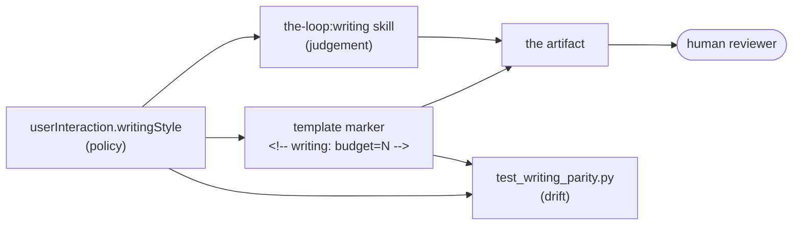

# Capability: writing-style

> How the-loop writes the artifacts a human has to read — and the budgets, register and
> diagram rule that keep them readable.

## What it is

A reviewer approving a work item reads `requirements.md`, `design.md`, `testing-plan.md`
and the PR briefing. Before issue-165 nothing set a shape, a length or a register for
them, and the harness's only verbosity lever (`tokenEconomy.outputVerbosity`) compresses
*chat narration* while explicitly **preserving** specs — aimed away from the documents the
reviewer actually opens.

This capability is the writing contract: a bundled **`the-loop:writing`** skill carrying
the judgement, `userInteraction.writingStyle` carrying the policy, a budget marker in each
template, and a parity test catching the drift prose cannot.

## Current behaviour

- the-loop SHALL bundle a second skill, `skills/writing/`, discoverable by the Agent
  Skills standard and resolving as **`the-loop:writing`**; its `reference/tells.md` holds
  the catalogue so the skill body stays inside its own budget.
- WHEN an artifact a human reads is authored or revised THEN it SHALL follow that skill:
  the four-part spine (what was broken → what we did → what it costs → what to check),
  conclusion-first sections, and the revise pass.
- Each budgeted template SHALL declare a **prose budget** in a
  `<!-- writing: budget=N skill=the-loop:writing -->` marker, mirroring the default in
  `userInteraction.writingStyle.budgets`.
- WHEN a budget is counted THEN front matter, headings, tables, fenced code, mermaid
  blocks, blockquote callouts and EARS criteria SHALL be excluded — a budget must never
  argue against a diagram or a contract.
- Budgets SHALL be **advisory**: an over-budget artifact is a review comment, never a
  blocked phase.
- IF meeting a budget would delete a gated section THEN the section SHALL stay, recorded
  empty with its reason. Brevity governs words, not coverage.
- WHERE prose would describe a structure, sequence or state change with three or more
  named parts THEN a mermaid diagram SHALL be authored instead
  (`writingStyle.diagramFirst`); `design.md` carries at least one.
- The registers in `writingStyle.formalRegisters` — EARS acceptance criteria, abuse cases,
  API contracts, JSON-Schema descriptions, RFC-2119 keywords — SHALL NOT be relaxed into
  informal prose. Explanation around them is ordinary prose.
- A revise pass SHALL NOT rewrite quoted material, code, committed evidence, third-party
  text, or historical specs under `docs/specs/`.
- `cli/tests/test_writing_parity.py` SHALL assert the mechanical half of the contract
  (skill present, markers well-formed, markers ↔ schema defaults in both directions, the
  skill and every template inside their own budgets, no P0 tell in shipped prose) and
  SHALL NOT assert whether a document is well written — presence is mechanical, quality is a review item.
- Third-party writing skills SHALL be **registered** in `externalTools`, never vendored
  ([decision-062](../decisions/decision-062.md)).

## Design

[`docs/specs/issue-165/design.md`](../specs/issue-165/design.md) ·
[literature survey](../specs/issue-165/brainstorm.md) ·
[`skills/writing/SKILL.md`](../../skills/writing/SKILL.md) ·
[`reference/token-economy.md`](../../skills/the-loop/reference/token-economy.md) (the
neighbouring, output-side lever)

## History

| Work item | What changed | Links |
|-----------|--------------|-------|
| issue-165 | Introduced the capability: the `the-loop:writing` skill and its tells catalogue, `userInteraction.writingStyle` (budgets, diagram-first, formal carve-out), budget markers in eight templates, and `test_writing_parity.py` | [spec](../specs/issue-165/), [decision-061](../decisions/decision-061.md), [decision-062](../decisions/decision-062.md), PR #168 |
