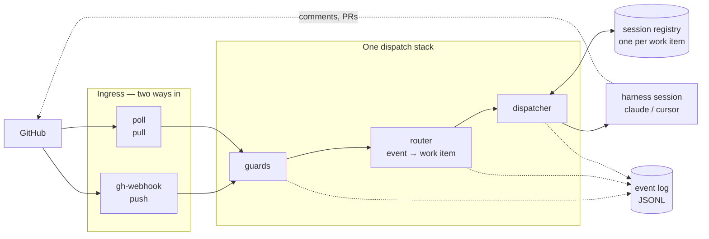

# Concepts

The model the command pages assume. Read once; the rest of the CLI reference makes more
sense afterwards.

## The shape of it

The important part is the funnel: **two ingresses, one dispatch stack**. Whatever you
configure under [routing](/config/cli/routing-options) applies identically whether events
arrive by webhook or by poll, so switching ingress later changes nothing else.

## Two configuration files

`cli-config.yaml` is the daemon's, and it describes *your machine*.
`.the-loop/harness-config.yaml` is a repository's, and it describes *how work is done
there*. They never share a key.

Which file governs what is a question of **direction**, not of which command is asking
([decision-044](/decisions/decision-044)): a repository's harness config configures work
done *on that repository* — including when the daemon is the one doing it, which is how
the graph coupling learns a repo's `phaseLabelPrefix` and `specDir`. It **never**
configures the daemon itself. The two settings people most expect to be inherited,
`authorizedUsers` and a poll source's `repos`, are CLI-config-only with no fallback, and
fail closed when unset. See [Configuring the-loop](/config/),
[decision-032](/decisions/decision-032) and
[decision-044](/decisions/decision-044).

## Work items and sessions

A **work item** is a ticket, referenced as `github:OWNER/REPO#N`. A **session** is a
running harness conversation — a Claude Code session id, or a Cursor chat id.

The invariant: **one work item, one active session.** The
[registry](/cli/commands/sessions) is the source of truth, one human-inspectable JSON file
per session under `<state.root>/sessions/`, written atomically so concurrent sessions on
one machine are safe.

Events are matched to a work item by the router — issue/PR number, the `issue-<n>` PR
head-branch convention, closing keywords, and the PRs behind `workflow_run` / `check_*`
events — and then delivered to that item's session. One event at a time per session, in
parallel across sessions.

### How a session ends

When the work item **itself** ends — the issue closed, or, when the PR *is* the work item,
that PR merged or closed — the session is auto-closed. No manual `sessions close`.

A PR merely *linked* to the work item closing leaves the session running: one item is often
delivered by several PRs, so only the item's own close ends it. Both ingresses do this —
the receiver on the `closed` event, the poller by noticing the item has left the open
listing and confirming upstream that it really ended.

## Arming, then starting

Three separate questions, answered by three separate settings:

| Question | Setting |
|---|---|
| **Who** may be an input? | [`authorizedUsers`](/config/cli/routing-options#authorizedusers) |
| **Which** items may run? | [`autoExecuteLabel`](/config/cli/routing-options#autoexecutelabel) + [`spawnOnUnmatched`](/config/cli/routing-options#spawnonunmatched) |
| **When** does one start? | [`control` keywords](/config/cli/routing-options#execution-control) |

Labelling an issue **arms** it. An authorized user's `the-loop:start-execution` comment
**starts** it. Before this split, labelling was itself the trigger — an irreversible act
you could perform by accident on a backlog.

An accepted start is durable: it survives a daemon restart, and a later `stop` or `pause`
disarms the item, so a stopped work item does not re-spawn on the next event.

## Guards

Two guards run before anything is dispatched, in this order. Both are load-bearing.

### 1. The self-comment marker

the-loop posts its replies under **your** credentials, so authorship alone cannot tell its
comments apart from yours. Every comment, review and reply it writes carries an embedded
marker; the ingress drops a marker-carrying event before dispatch, **regardless of actor**.

Without it, the-loop's own reply would resume the session that wrote it, forever. See
[decision-031](/decisions/decision-031).

### 2. The authorized-actor guard

::: danger Required, no fallback, fails closed
[`authorizedUsers`](/config/cli/routing-options#authorizedusers) lists the GitHub logins
the-loop may act on. Comments, reviews, labels and items from anyone else are dropped
before dispatch.

It is **required**. There is **no** fallback to any repository's harness config — a
repository is something other people can open pull requests against; your daemon's trust
list is not. An **empty** list fails closed: every human-authored event is ignored, with a
warning at startup.

This is the prompt-injection boundary ([decision-023](/decisions/decision-023)). A stranger
commenting on a public issue is untrusted input; without this guard their comment becomes
instructions to an agent running on your machine.
:::

CI and system events, which carry no human instructions, still pass — and a `closed` event
still auto-closes that item's own session whoever closed it.

Control-keyword parsing happens strictly **after** both guards, so it never becomes a
second, weaker way in.

## Where sessions run

By default a spawned session runs in `spawnWorkdir` — one static directory. Configure a
[workspace](/config/cli/routing-options#workspace-root) instead and each work item gets its
own checkout, so concurrent items never share a working tree:

- **`worktree`** — one shared clone per repo, one git worktree per work item. Concurrent
  items share objects; cheap.
- **`clone`** — one folder per work item with a full clone of every repo it touches.
  Self-contained, easier to reason about and clean up.

Auth is your own git credentials. The daemon holds no token.

::: tip Why the harness-trust setting exists
Every work item getting its own checkout means every spawn lands in a directory the harness
has never seen — so Claude Code shows its workspace-trust dialog, and an unattended daemon
has nobody to answer it. The daemon looked healthy while the TUI sat on a modal.
[`harnessTrust`](/config/cli/routing-options#harnesstrust-enabled) pre-seeds exactly the
keys the harness is about to ask about, and nothing else.
:::

## How sessions are hosted

- **`process`** — a headless one-shot subprocess. Fine for unattended work.
- **`tmux`** — the harness TUI in a named session, `loop-<slug>`, that you can attach to,
  watch, and type into.

`tmux` is what makes the loop *observable while it runs*. The defaults keep a finished
session readable and a crashed one's conversation alive: the pane survives the process
exiting, a dead session is respawned into the **same** conversation, and a closed work
item's session is retained as a record with its harness ended — so nothing can be typed
into finished work. See [interactive sessions](/capabilities/interactive-sessions).

## The process graph

the-loop's phases are an executable [graph](/capabilities/process-graph), not just labels.
Nodes have entry and exit hooks; the `loop:<phase>` label on a ticket is written by an
entry hook.

The ingress [drives it](/config/cli/routing-options#graph-enabled): a spawn enters the
start node, and a delivered event advances **at most one** node boundary, carrying the
event's comments to the human gate waiting for them. Best-effort — a graph failure is
logged and never costs the delivery.

Inspect and drive it by hand with [`graph`](/cli/commands/graph); ask what a work item is
missing with [`check`](/cli/commands/check).

## The event log

Every decision — accepted, rejected, routed, dropped, spawned, resumed, failed, closed —
is appended as one JSON object per line, by the receiver, the poller **and** the `sessions`
command.

This is how you answer "why did nothing happen?". Drops carry a machine-readable `reason`
(`unauthorized-actor`, `duplicate-delivery`, `self-comment`), and
[`events`](/cli/commands/events) is the query surface. The file is plain JSONL, so `jq`,
`grep` and `tail -f` work on it directly.

## Where the state goes

Everything above leaves a file: the registry, the control records, the poller's baselines,
the event log. All of it sits under one root, [`state.root`](/config/cli/#state-root), and
splits in two — **facts about the world** (what an authorized user armed, which comments
have been seen) travel to another machine; **handles to this machine** (a conversation id,
a `cwd`, a pid) must not. [State on disk](/cli/state) documents every file, what is in it,
and the `.gitignore` block that carries the portable half.

## Next

- **[State on disk](/cli/state)** — the files behind everything above.
- **[Commands](/cli/commands/)** — the full reference.
- **[Configuring the CLI](/config/cli/)** — every option, by area.
