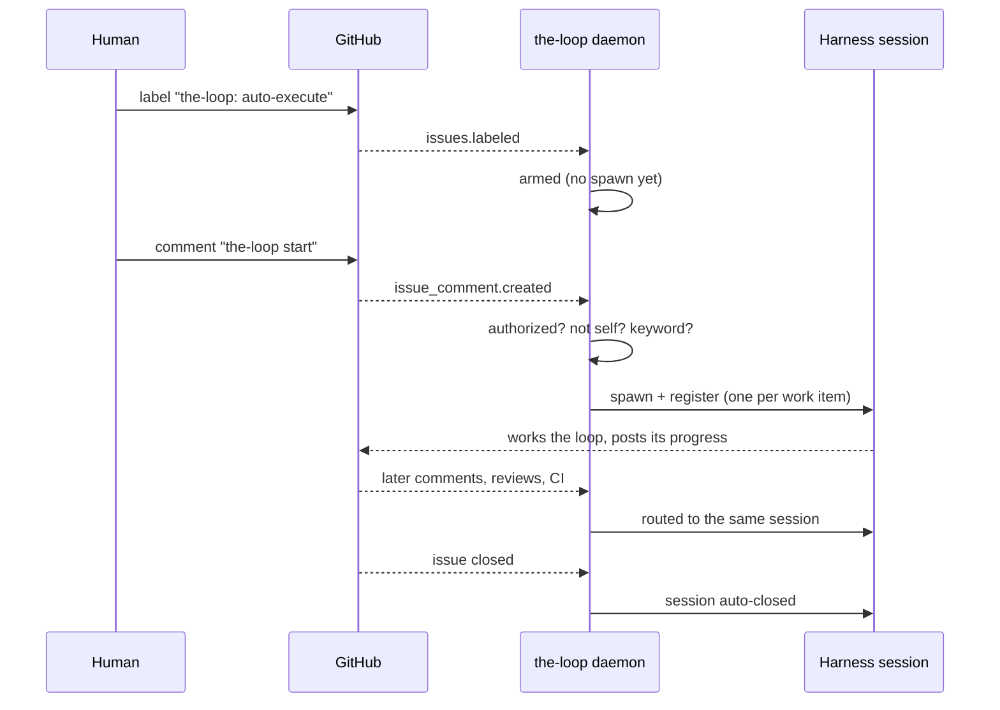

# Getting started

From an uninstalled CLI to a GitHub issue that an agent picks up on its own, in five steps.

By the end: you comment `the-loop start` on a labelled issue, a harness session
spawns for it, every later comment and CI result on that item is routed to the same
session, and the session closes itself when the item does.

::: tip Prerequisites
An authenticated `gh` (`gh auth login`), `tmux` (every spawned session is hosted in it),
and the harness you want to spawn — `claude` or `cursor-agent` — on your `PATH`.
:::

## 1. Install

```bash
pip install the-loopy-one
the-loop --version
```

Details and extras: [installation](/cli/installation).

## 2. Write the CLI config

The daemon's config is **not** tied to a repository — it watches several. Put it at
`~/.the-loop/cli-config.yaml` (the always-available fallback; three other locations are
listed under [configuring the CLI](/config/cli/#where-the-file-is-found)):

```bash
mkdir -p ~/.the-loop
$EDITOR ~/.the-loop/cli-config.yaml
```

This is a complete working file, not a fragment. Everything not named here takes its
default:

```yaml
version: "0.3.0"

state:
  root: .the-loop          # relative to where you run the daemon; `~` is NOT expanded

webhooks:
  ghWebhook:
    host: 127.0.0.1          # loopback — put a proxy or tunnel in front for anything wider
    port: 8787
    path: /gh-webhook
    secretEnv: THE_LOOP_GH_WEBHOOK_SECRET
    routing:
      enabled: true
      authorizedUsers: ["your-github-login"]     # REQUIRED — see below
      spawnOnUnmatched: labeled
      autoExecuteLabel: "the-loop: auto-execute"
      defaultHarness: claude
      control:
        enabled: true
        requireStartCommand: true                 # a label arms; a comment starts
      webTerminal:
        enabled: false                            # no browser terminal until you mean it

polling:
  enabled: true              # so `the-loop start` brings the poller up (issue-228)
  intervalSeconds: 60
  sources:
    - provider: github
      repos: ["your-org/your-repo"]               # REQUIRED — no fallback

eventLog:
  enabled: true
```

::: danger `authorizedUsers` is the security boundary
It lists the GitHub logins the-loop may act on. Anyone else's comments, reviews and labels
are dropped before dispatch. It is **required**, it does **not** fall back to any
repository's config, and **empty fails closed** — the daemon ignores every human-authored
event and tells you so at startup.

Put your own login here. This is the guard that stops a stranger's comment on a public
issue from becoming instructions to an agent on your machine.
:::

Any command loads this file, so running one is the quickest way to find out whether it
parses and whether its `version` is current:

```bash
the-loop events --limit 1
```

A config that predates a breaking change is **refused**, naming the key and the fix — see
[versioning and migration](/config/cli/#versioning-and-migration).

## 3. Pick an ingress

Two ways for GitHub activity to reach the daemon. They share the whole dispatch stack —
sessions, tmux hosting, guards, prompts — and differ only in how events arrive.

::: code-group

```bash [Webhook (push)]
# Needs an inbound route to your machine.
# Enable it in the CLI config (webhooks.ghWebhook.enabled: true), then:
export THE_LOOP_GH_WEBHOOK_SECRET='the same secret you gave GitHub'
#   — or put it in a .env file the config names (env.file) and skip the export
the-loop start

# GitHub → repo Settings → Webhooks → Add:
#   Payload URL:  https://<your-host>/gh-webhook
#   Content type: application/json
#   Secret:       the value above
#   Events:       issues, issue comments, pull requests, reviews, workflow runs
```

```bash [Poll (pull)]
# No inbound route needed — works behind NAT, a firewall, or on a laptop.
# Enable it in the CLI config (polling.enabled: true), then:
the-loop start              # detached; logs to .the-loop/logs/poller.out
the-loop status             # running? pid? last cycle? (exits 1 if it is not)

# In the foreground instead, for a systemd `Type=simple` unit:
python -m the_loop.daemon_entry poller

# One cycle and exit, for a cron job or a systemd timer:
python -m the_loop.daemon_entry poller --once
```

:::

Not sure? Start with **polling**. It needs no networking at all, and everything you configure
carries over if you later switch.

## 4. Arm a work item, then start it

Two separate acts, deliberately ([issue-106](https://github.com/MadaraUchiha-314/the-loop/issues/106)):

1. **Arm it** — add the `the-loop: auto-execute` label to a GitHub issue. Nothing runs yet.
2. **Start it** — comment the keyword:

   ```text
   the-loop start
   ```

Labelling used to be the trigger, which made it an irreversible act you could perform by
accident. Now the label says *which* items may run and the comment says *when* — so you can
label a backlog without launching it.

The same four commands work from the shell, and post the identical keyword back to the
ticket so the thread stays the record of who asked for what:

```bash
the-loop sessions start  --work-item github:your-org/your-repo#42
the-loop sessions pause  --work-item github:your-org/your-repo#42
the-loop sessions resume --work-item github:your-org/your-repo#42
the-loop sessions stop   --work-item github:your-org/your-repo#42
```

## 5. Watch it work

```bash
the-loop sessions list                                  # what is running
the-loop sessions attach --work-item github:your-org/your-repo#42   # the live TUI (tmux)
the-loop events --work-item github:your-org/your-repo#42            # the full decision trail
the-loop events --follow --level warning                # tail problems as they happen
```

When nothing appears to happen, the event log is the answer. Every drop is recorded with a
machine-readable reason:

```bash
the-loop events --type 'event.dropped' --limit 20
```

`unauthorized-actor` means the author is not in `authorizedUsers`; `duplicate-delivery`
means GitHub redelivered something already handled; `self-comment` means the-loop
recognised its own reply and refused to answer itself.

## What you just built



## Next

- **[Concepts](/cli/concepts)** — the model underneath: sessions, guards, workspaces, the
  process graph.
- **[Configuring the CLI](/config/cli/)** — every option, by area.
- **[Commands](/cli/commands/)** — the full reference.
