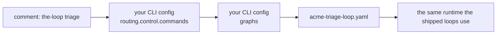

# Bringing your own graph

the-loop's process is a **graph** — nodes, hook chains and edges, declared as YAML and
executed by the CLI ([process-graph](/capabilities/process-graph)). Five loops ship with
it, and four arming commands choose between them: `the-loop start`, `contribute`, `do` and
`review`. Since [issue-343](https://github.com/MadaraUchiha-314/the-loop/issues/343) an
operator can add graphs of their own and decide which command walks each one: re-point a
shipped command (`the-loop do` walks your quick loop) or add a new one (`the-loop triage`
walks your triage loop).



## Write it

A graph is the same YAML the shipped loops are written in
(`cli/the_loop/graph/pdlc-*.yaml` are the reference):

```yaml
# ~/.the-loop/graphs/acme-triage-loop.yaml
version: 1
start: triage

nodes:
  - id: triage
    phase: implementation          # one of the-loop's phases (see below)
    actor: agent
    command: acme:triage           # another plugin's slash command → /acme:triage
    entry: [set-phase-label, deliver-assignment]
    exit: [x-triage-complete]      # a hook of your own (see "Adding a hook")

  - id: decide
    actor: human
    session: inherit
    entry:
      - request-review
      - {hook: notify, with: {event: decision-pending}}
    exit: [classify-adhoc-reply]

  - id: complete
    phase: complete
    actor: agent
    terminal: true
    entry: [set-phase-label]

  - id: cleanup                    # entered before the-loop releases local resources
    phase: cleanup
    actor: code
    terminal: true
    entry: [set-phase-label]

edges:
  - {from: triage, to: decide, on: pass}
  - {from: decide, to: triage, on: more-work}
  - {from: decide, to: complete, on: done}
```

It is compiled by **the same code** as the shipped loops, and held to the same rules:

| Rule | Why |
|---|---|
| Every hook is a shipped one or an `x-` hook a module in [`routing.graph.hooks.modules`](/cli/hooks) registers | A gate the graph names either runs or fails the load — never silently absent |
| Every `phase` is one of the-loop's: `phase-selection`, `brainstorming`, `requirements-definition`, `design`, `test-planning`, `tasks-breakdown`, `implementation`, `verification`, `needs-review`, `complete`, `cleanup` | The `loop:<phase>` labels are one vocabulary for every repository, so dashboards keep working |
| A node's `command:` is `do-task` (the-loop's own, `/the-loop:do-task`) or `plugin:command` (another plugin's, `/plugin:command`) | The session is told exactly one slash command, never free text |
| Edges, skippable nodes, skip sets, `produces` entries — every structural rule | A mistake fails at load, not three nodes into a work item |
| A top-level `name:`, if present, equals the name you declare | One name, recorded in `work-item-state.json` |

Include a `cleanup` node (phase `cleanup`, `actor: code`, no inbound edge) if you want the
teardown recorded as a transition, as every shipped work-item loop does.

## Declare it

Two declarations in your CLI config, kept apart: **which graphs exist**, in the top-level
[`graphs`](/config/cli/graphs-options) list, and **which command selects which graph**,
under [`routing.control.commands`](/config/cli/routing-options#control-commands).

```yaml
graphs:
  - name: acme-triage-loop             # not pdlc-*: reserved for the-loop's loops
    path: graphs/acme-triage-loop.yaml # absolute, ~/…, or relative to THIS file
  - name: acme-quick-loop
    path: ~/.the-loop/graphs/quick.yaml
  - name: acme-review
    path: /etc/the-loop/review.yaml
    guest: true                        # keep the guest posture review has
                                       # (spec tree out of git; plan on the thread)

routing:
  control:
    commands:
      triage: {graph: acme-triage-loop}        # a new word → `the-loop triage`
      do: {graph: acme-quick-loop}             # `the-loop do` now walks this graph
      review: {graph: acme-review}
```

A command you do not list keeps its shipped loop, so an operator who adds nothing here
sees no change. Declaring a graph selects nothing by itself: a command must name it.

| A command word may be | What happens |
|---|---|
| `start`, `contribute`, `do` or `review` | That command now selects the named graph, yours or another shipped loop. Everything else about it is unchanged: `review` still binds to the pull request it was typed on |
| A new word (`triage`) | `the-loop triage` becomes a keyword (or the `keyword:` you give it), matched like every other. It arms exactly as `start` does, with the same authorization and the same spawn policy |
| `stop`, `pause`, `resume`, `execute`, `cleanup`, the collaborator or channel commands | Refused: they do not select a loop |

A binding to a graph that is neither shipped nor declared fails the load. Two different
commands in one comment (`the-loop triage` and `the-loop stop`) are refused as ambiguous,
as they always were.

## Check it

```console
$ the-loop graph loops
pdlc-work-item-loop  (shipped)
  armed by: the-loop start
…
acme-triage-loop  (declared)
  armed by: the-loop triage
  file:     /home/me/.the-loop/graphs/acme-triage-loop.yaml
  compiles: ok — names x-triage-complete
```

[`the-loop graph loops`](/cli/commands/graph#loops) compiles every graph you declared,
checks the hook attachments that apply to it, and exits 1 when anything fails — without
importing any hook module.

## How a work item picks it

1. An authorized user types the command. The control record keeps the command **and** the
   loop it selected.
2. The first spawn enters that graph; `work-item-state.json` records its name.
3. From then on the recorded name is the fact — a later command cannot re-shape a walk in
   progress. The name selects your graph **only while your config declares it**: the state
   file is writable by the agent, so any name you did not declare is ignored.

An overridden `start` applies however the item is armed — a comment, `the-loop sessions
start`, or a spawn when no start is required — and `/the-loop triage #12` works from Slack.
A new word may not be one of the-loop's own verbs (`graph`, `check`, `sessions`, …), so a
comment quoting `the-loop graph complete …` never arms anything.

Remove or rename a graph only when no work item is walking it.

## Before you adopt one

A graph decides which gates a work item passes. Yours may leave out phase selection,
approvals or reviews — that is your choice for your machine, the way choosing critics and
hooks is. Review a graph like code. It lives in **your** config and **your** filesystem,
never in the repository a session works in: a graph in the checkout would be a graph the
session could edit. A `.the-loop/<name>.yaml` in a repository is ignored with a warning.

Graphs are compiled **once per process**: a daemon picks up an edited graph on its next
start.

## See also

- [Adding a hook](/cli/hooks) — hooks of your own, and scoping an attachment to some loops.
- [`the-loop graph loops`](/cli/commands/graph#loops) — every loop this machine can walk.
- [decision-136](https://github.com/MadaraUchiha-314/the-loop/blob/main/docs/decisions/decision-136.md)
  — why the declaration is the operator's and a new command is `start` with a loop.
