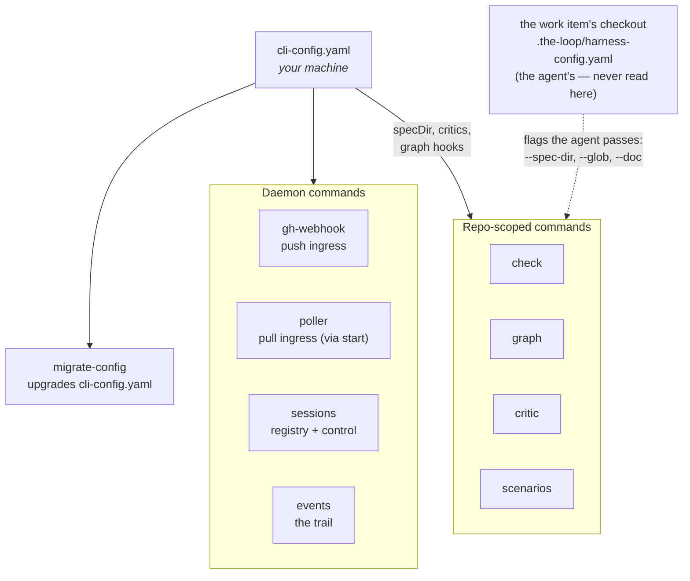

# the-loop CLI

`the-loop` is a lightweight, extensible command-line companion to the
[the-loop plugin](/guide/what-is-the-loop). The plugin is the operating model an agent
follows inside a session; the CLI is what **starts those sessions, keeps them attached to
work items, and tells you what happened**.

```bash
pip install the-loopy-one
the-loop --help
```

## You do not need it

Worth saying plainly, because "there is a CLI" reads like a prerequisite. It is not. Run
`/the-loop:work-on <ticket>` in Claude Code or Cursor and the whole loop works with no CLI
installed at all.

You want the CLI when you stop driving the loop by hand:

| You want to… | Use |
|---|---|
| Have a comment on a GitHub issue start an agent, unattended | [`start`](/cli/commands/start) with the [webhook receiver](/cli/receiver) or [polling](/config/cli/polling-options) enabled |
| Keep one session per work item and route later activity to it | [`sessions`](/cli/commands/sessions) |
| Watch an agent work, live, and type into it | [`sessions attach`](/cli/commands/sessions) |
| Answer "why did nothing happen?" | [`events`](/cli/commands/events) |
| Gate CI on a work item's own phase rules | [`check`](/cli/commands/check) |
| Hand a review round to a *different* model | [`critic`](/cli/commands/critic) |
| Run more than one the-loop against a repository, each with its own work items | the [`instance`](/config/cli/instance-options) block — see [running several instances](/cli/instances) |

## What it is

A Python package — import package `the_loop`, console script `the-loop`, published to PyPI
as [`the-loopy-one`](https://pypi.org/project/the-loopy-one/) — with an extensible command
registry.

- **One runtime dependency**, PyYAML. Its whole configuration is YAML, so reading it is
  not optional ([decision-038](/decisions/decision-038)); everything else is stdlib.
- **Python is deliberate.** It leaves room to add self-learning / ML capabilities later,
  which are mostly exposed as Python SDKs.
- **Extensible by design.** Commands are discovered from a registry — see
  [adding a command](/cli/extending).

## Two halves

Some commands are **daemons**: long-running, machine-scoped, watching several repositories
at once. Others are **repo-scoped**: they run once, inside a checkout. Worth knowing which
is which, because it decides what you have to configure to run them — a daemon needs a
`cli-config.yaml`, a repo-scoped command needs nothing but the checkout.



Note the arrow that is **not** there: nothing in the CLI reads a repository's harness
config. Since [issue #352](https://github.com/MadaraUchiha-314/the-loop/issues/352) that
file is the agent's alone; the spec directory, the critic roster and the graph hooks are
the CLI config's, and anything else the CLI needs from a repository the agent hands over
as a flag. The rule is [decision-123](/decisions/decision-123); the split into two files
is [decision-032](/decisions/decision-032), and both files are explained in
[Configuring the-loop](/config/).

## Next

- **[Installation](/cli/installation)** — get it on your machine.
- **[Getting started](/cli/getting-started)** — from nothing to a work item an agent picks
  up by itself.
- **[Concepts](/cli/concepts)** — the model the command pages assume.
- **[State on disk](/cli/state)** — what it writes, what is inside, and what you can carry
  to another machine.
- **[Commands](/cli/commands/)** — the full reference.
