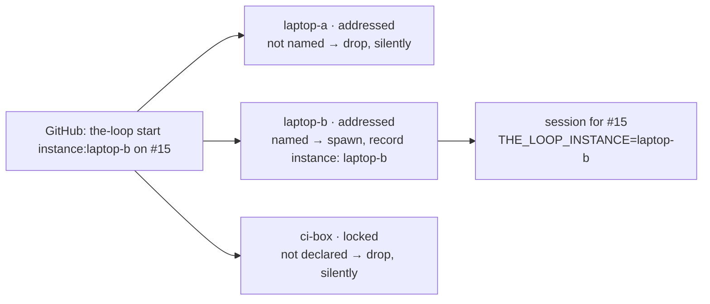

# Running several instances

One `cli-config.yaml` is one **instance** of the-loop: one set of daemons, one state root,
one set of sessions. Until [issue-322](https://github.com/MadaraUchiha-314/the-loop/issues/322)
every instance was the same instance — each judged every labelled event identically, so two
laptops watching one repository both spawned a session for one `the-loop start`, in two
checkouts, with two dev servers fighting over one port.

An instance now has a **name**, a **scope mode**, and a **declared list** of the work items
it manages, all under the [`instance`](/config/cli/instance-options) block. The environment
each instance runs in — the machine, the container, the checkout root, the port range —
stays yours to provide; the-loop hands the session its instance's name and nothing else.

## The shape of it



Every instance sees every delivery — a webhook fans out, a poller reads the same thread.
What changes is that each instance now answers *is this mine?* before it does anything,
and the answer is deterministic given the config and the comment.

## The three modes

| Mode | Takes a new work item when… |
|------|-----------------------------|
| `open` (default) | any armed, authorized start arrives — the behaviour before the block existed |
| `addressed` | the start names it: `the-loop start instance:<name>`, or `the-loop sessions start` runs on it |
| `locked` | never; `scope.workItems` is the only door |

A work item an instance **already manages** — declared in its config, or with a session
or control record on it — is handled in every mode exactly as before: comments are
delivered, `stop` stops it, a close closes it. The mode decides only what happens to a
work item the instance has never seen.

The steady state for several instances is **every instance `addressed`**: every start
then says which one runs it, and nothing is taken twice. `open` is for one instance;
`locked` is for an instance you want frozen to what it has.

## Addressing an instance

Add `instance:<name>` anywhere in a control comment:

```text
the-loop start instance:laptop-b
the-loop do instance:ci-box run the flaky suite ten times and report
the-loop stop instance:laptop-b
```

The token composes with every keyword. It is read as a whole word, the prefix is
case-insensitive, and the name must fit `^[a-z0-9][a-z0-9-]{0,39}$` or the token is not
an address at all — nothing else from the comment reaches a decision, a log line or a
record. An explicit address is **authoritative**: an instance not named drops the comment
even for a work item it manages, and a comment naming two different instances is dropped
by all of them.

Alternatively, run the command on the instance itself: `the-loop sessions start <ref>`
typed on `laptop-b` is by definition addressed to `laptop-b`. The keyword it posts back to
the ticket carries `instance:laptop-b`, so the thread says which instance acted.

## Pinning and locking

Declare a work item in the config to pin it to an instance:

```yaml
instance:
  name: ci-box
  scope:
    mode: locked
    workItems:
      - github:octo/repo#15
      - https://github.com/octo/repo/pull/16
```

A declared work item is taken without an address, in any mode. A `locked` instance takes
*only* what is declared — an address does not unlock it — so the edit is the paper trail.
The block is hot-reloaded: the next event sees the new scope.

## What the record says

- **The portable record** (`<state.root>/portable/<slug>.json`, `control.instance`) names
  the instance that recorded each control command. It travels with the work item.
- **The thread** carries the instance on every keyword the CLI posts and on the session
  announcement's table.
- **`the-loop status`** prints one line —
  `instance    laptop-b [addressed] — 2 declared, 5 managed` — and `GET /api/v1/instance`
  (also the `get_instance` MCP tool and `loop.instance()` on the SDK) returns the full
  document: name, scope, and the managed set with the source of each entry.
- **The event log** records every drop with its reason: `unaddressed`,
  `instance-locked`, `addressed-elsewhere`, `ambiguous-address`. An authorized keyword
  that was refused is a `control.rejected`; anything else is a `dispatch.dropped`. A
  refused instance leaves **nothing** on the thread — no reaction, no comment — because
  another instance may own the work item.

## What the design does not do

- **Two `open` instances still clash.** The mode makes the steady state reachable, not
  automatic. Name every instance and set them `addressed`.
- **A work item declared on two instances is managed by both.** That is your declaration.
- **A refused comment is not re-judged** when the scope changes; it was settled. Claim the
  work item with `the-loop sessions start` on the instance, which is the addressed form.
- **Instances share nothing** and never talk to each other. A manager that aggregates
  every instance's API is a client of N base URLs, which the dashboard already
  parameterises; the seam it will use is `GET /api/v1/instance` on each
  ([decision-110](/decisions/decision-110)).

## Next

- **[Instance options](/config/cli/instance-options)** — the three keys.
- **[State on disk](/cli/state)** — where `control.instance` lives.
- **[Concepts](/cli/concepts)** — arming, starting, and the guards this sits behind.
