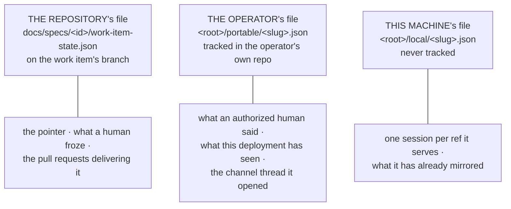

# State on disk

What the daemon writes, where it writes it, what is inside — and which of it means
anything on another machine.

Read this before you back up, wipe, or move a working setup between laptops.

::: tip Moving machines? The short answer
Track **one** directory in git: `<state.root>/portable/`. It holds one file per work item
— what an authorized user armed, and which comments have already been seen. The
[block below](#carrying-state-to-another-machine) is three lines.

Leave `local/`, `logs/` and the pidfile ignored. The session records in `local/` must
**not** travel: copying them is [worse than losing
them](#what-must-never-be-carried).
:::

## Where it lives

Everything the CLI **generates** sits under one configured root,
[`state.root`](/config/cli/#state-root) — `.the-loop` **beside your config file** unless
you say otherwise, never relative to whatever directory a command was run from
([decision-119](/decisions/decision-119)) — split by whether it travels:

```
.the-loop/
├── portable/
│   ├── index.json                 # what this directory holds, derived — tracked
│   └── github-octo-repo-15.json   # one per work item: control, poll, graph, collaborators — tracked
├── local/
│   ├── github-octo-repo-15.json   # that item's session handle(s) — never tracked
│   └── model-verdicts.json        # which models this box's harnesses accept — never tracked
├── logs/
│   ├── events.jsonl               # the decision trail
│   └── poller.out                 # a daemonized poller's stdout/stderr
├── channels/
│   ├── slack.json                 # channel conversations: thread bindings, per-work-item threads, read cursors, pending questions — never tracked
│   └── slack.json.lock            # the writers' flock — empty, never tracked
├── gh-webhook.pid                 # the running receiver
├── poll.pid                       # the running poller — and its lock
├── slack-listener.pid             # the running Slack listener (hosted or foreground) — and its lock
└── poll-status.json               # the poller's heartbeat, read by `the-loop status`
```

Everything here is JSON, JSONL or plain text, meant to be read with `jq`, `cat` and
`tail -f`. The record stores and the heartbeat are rewritten atomically (`tempfile` +
`os.replace`), so a crash never leaves half a file; the event log and the poller log are
appended to a line at a time, and a pidfile is written once at startup.

Two paths can be pointed elsewhere explicitly —
[`routing.registryDir`](/config/cli/routing-options#registrydir) for `local/`, and
[`eventLog.path`](/config/cli/observability-options#eventlog-path) /
[`pidfile`](/config/cli/webhook-options#pidfile) — but `portable/` follows `state.root`,
because "where does the half I track live?" should have exactly one answer.

## Three files, one per party — where an attribute goes

The layout above answers *does this file travel?* It never answered the question
underneath it: **where does one attribute go?** Nothing did, and attributes drifted
([issue-368](https://github.com/MadaraUchiha-314/the-loop/issues/368)) — a work item's
pull requests were recorded only in a file that never travels, the Slack thread only in
a machine-wide one, and a harness session id was checked into the repository.

The rule is the **party each fact belongs to**, because who may write a file decides
what may be in it. Three files hold something about one work item:



| Kind of attribute | Home | Why that file and no other |
|---|---|---|
| **pointer** | repository | must survive a machine change, a session change and a multi-day review, and be reviewable in a diff; re-derived from the artifacts, so a stale copy costs a recompute |
| **human decision** about the work item | repository | a declaration with provenance, honoured only within what the compiled graph and the operator's config allow |
| **repository entity** — a pull request, its inner loop | repository | a pull request is an object of the repository the branch lives in, and [`the-loop check`](/cli/commands/check) in CI must see it without a registry |
| **workspace entity** — a channel thread | operator | its identifiers are the operator's workspace's (channel id, member id, permalink) and must not enter a repository; it must also outlive the checkout, which `cleanup` removes |
| **operator ledger** — armed, the roster, seen comments, the closure | operator | proposable by nobody but an authorized human, and needed after the checkout is gone |
| **machine handle** — a conversation id, a tmux name, a path, a read cursor | machine | useless or harmful anywhere else |
| **derived** | wherever its reader is | rebuilt from its sources on every write and read to gate nothing, so a stale copy is cosmetic |

Every attribute is written **once**. Any other file that needs it carries an identity —
a ref, a thread ts — never a second copy of the record.

The table is declared in code, in
[`the_loop/state.py`](https://github.com/MadaraUchiha-314/the-loop/blob/main/cli/the_loop/state.py)
(`ATTRIBUTES`), and a test fails the build when one of the three files grows a key no
entry claims, when a kind sits in a file its rule forbids, or when this page and the
declaration disagree. A machine handle in a tracked file fails on its own assertion:
that is the one the table exists for.

## Work-item state — `docs/specs/<id>/work-item-state.json`

The one file of the three that lives in **your repository**, on the work item's branch,
and the only one a reviewer sees in a pull request. It is a cache, never an authority: a
stale copy degrades to a recompute, and `the-loop check --recompute` derives completion
from the artifacts alone.

| Attribute | Kind | Meaning |
|---|---|---|
| `version` | derived | the file's shape |
| `workItem` | pointer | which work item this is |
| `loop` | pointer | which shipped loop it walks |
| `currentNode` | pointer | where the pointer is |
| `nodes` | pointer | per node: `attempts`, `outcome`, `enteredAt`, `exitedAt`, `lastBlock`, `forced` |
| `completions` | pointer | the claims sessions have made |
| `parked` | pointer | the gate it is waiting at, and why |
| `forced` | human decision | every forced move, audited |
| `decisions` | human decision | each gate's outcome with its provenance |
| `skips` | human decision | declared skips, with who declared each and how |
| `optIns` | human decision | opt-in phases somebody asked for |
| `surface` | human decision | where the outer loop is iterated ([issue-183](https://github.com/MadaraUchiha-314/the-loop/issues/183)) |
| `sessionPerPr` | human decision | how many sessions its pull requests get ([issue-260](https://github.com/MadaraUchiha-314/the-loop/issues/260)) |
| `model` / `effort` | human decision | what it runs on, and at what effort ([issue-358](https://github.com/MadaraUchiha-314/the-loop/issues/358)) |
| `repos` | human decision | the repositories it contributes to |
| `pullRequests` | repository entity | each pull request delivering it |

```json
"pullRequests": [
  {
    "ref": "github:octo/lib#7",
    "repository": "octo/lib",
    "number": 7,
    "url": "https://github.com/octo/lib/pull/7",
    "stateDir": "pr-loops/octo__lib/pr-7",
    "state": "open",
    "linkedAt": "2026-09-15T08:03:40Z",
    "linkedBy": "session"
  }
]
```

`state` is the pull request's **upstream** state (`open`, `merged`, `closed`), written by
the daemon's one close path; the session endpoint's own `status` stays a handle's status,
which is why a tmux session retained after a merge is still attachable. `stateDir` is
where that pull request's inner loop keeps its own pointer, derived at write so a reader
needs no code to find it. `linkedBy` says who recorded it, and since
[issue-370](https://github.com/MadaraUchiha-314/the-loop/issues/370) there is one answer
that the-loop writes: `session` — the session that opened the pull request said so,
through `the-loop sessions link-pr`. The first event that routed for a pull request used
to write here too, as `event`; a row carrying that is read and kept exactly as it is,
because it is the record of what happened. Nothing mints a new one. **Which pull requests
deliver a work item is a fact the-loop recorded, never one it inferred from a branch name
or a closing keyword** — routing still reads those, but this list does not.

A row may also carry **`self: true`**. That says the pull request *is* this work item
rather than delivering it — `the-loop review` and `the-loop contribute` are armed on a
pull request, and the entity the-loop manages is a work item whatever represents it, so
both relations live in one list. A marked row has no `stateDir`: the work item's own
directory is the loop, so an inner-loop path would nest a copy of it inside itself, and
one written by hand is dropped rather than recomputed.

Every value is re-validated on read, because this file is agent-writable **and**
proposable by anyone who can open a pull request: a `repository` that is not a usable
repository path is refused, a `stateDir` that is not one this repository and number derive
is recomputed, and an entry that does not parse is skipped while the rest of the file is
honoured. A `model` resolves only to one the operator declared and this machine accepts;
a `sessionPerPr` outside `never | cross-repository | always` is the operator's default.

::: warning No session handle lives here
`work-item-state.json` carried a `session` block — a harness conversation id and its
runner — until issue-368. It was the wrong file for it twice over: a conversation id is a
handle to one machine, and this file is public and proposable. `session: inherit` resolves
the conversation through this machine's session registry now. A block left on disk by an
older release is ignored on read and gone on the next save; it is never resumed.
:::

## Two kinds of state

The layout is the answer to one question, so it is worth stating the question. Everything
the-loop writes is one of two things:

- **Facts about the world.** What GitHub already told us, and what an authorized human
  asked for. True no matter which machine is running. Slow to rebuild, and some of it
  cannot be rebuilt at all — nothing upstream records that a `stop` was honoured.
- **Handles to this machine.** A harness conversation id, a working directory, a pid, a
  local audit trail. These name things that exist only where they were created. Cheap to
  rebuild — the daemon rebuilds them by spawning — and actively harmful when moved.

Grouping the files by **which of those they are**, rather than by which component writes
them, is what makes the `.gitignore` recipe three lines instead of a puzzle
([decision-046](/decisions/decision-046)).

## The classification

| Path | Written by | Holds | Travels? |
|---|---|---|---|
| `<root>/portable/<slug>.json` | execution control + the poller | what was armed, who was invited onto the item, which comments are already seen (the work item's and each of its pull requests'), which channel thread carries its conversation, and whether — and how — the item ended | **portable** |
| `<root>/portable/index.json` | the same store, derived | one entry per record: ref, url, file, sections | **portable** |
| `<root>/local/<slug>.json` | the session registry | one entry per ref this machine holds a session for — the work item's own and one per pull request — each with its conversation id, `cwd`, tmux target and status; plus what this deployment has already mirrored of the item's channel threads | **local** |
| `<root>/local/model-verdicts.json` | `the-loop models check` (issue-358) | one verdict per harness × model-or-effort name: `ok`, `refused` or `unknown`, the argv it was taken against, and when — re-measured every 24h | **local** |
| `<root>/local/standing/<name>.json` | the standing-session registry (issue-277, opt-in) | per standing session: harness, conversation id, `cwd`, tmux target, status, the Slack channel/thread its chat runs in — and, for a session created through the API, its whole definition | **local** |
| `<root>/logs/events.jsonl` | every ingress, and `sessions` | one JSON object per decision | **local** |
| `<root>/logs/poller.out` | a daemonized poller | its stdout and stderr, appended | **local** |
| `<root>/gh-webhook.pid` | the receiver | the receiver's pid — and its single-instance lock (issue-228) | **local** |
| `<root>/poll.pid` | the poller | the poller's pid — and the lock proving it is the only one | **local** |
| `<root>/slack-listener.pid` | the Slack Socket Mode listener — hosted by the service or `the-loop channels listen` | its pid and the lock that keeps one listener per instance (issue-334) | **local** |
| `<root>/poll-status.json` | the poller, after every cycle | the heartbeat `the-loop status` reads: `startedAt`, `lastCycleAt`, last cycle's counters — and no pid, which is `poll.pid`'s to name | **local** |
| `<root>/self-diagnosis.json` | self-diagnosis (issue-242, opt-in) | which failure fingerprints this machine already reported (with the issue URL), abandoned or is retrying, and when it last posted | **local** |
| `<root>/channels/<channel>.json` | the channels reader/writer (issue-245, issue-312, opt-in) | per channel type, only what belongs to **no** work item: the per-channel kickoff cursor, the questions the-loop is waiting on, and a standing session's thread binding. A work item's own binding and read cursor moved to its records in issue-368 | **local** |

The same table is declared in code, in
[`the_loop/state.py`](https://github.com/MadaraUchiha-314/the-loop/blob/main/cli/the_loop/state.py)
(`GENERATED_PATHS`), and a test fails the build when a new generated path is added without
classifying it, or when this page and the declaration disagree.

The third per-work-item file, `docs/specs/<id>/work-item-state.json`, is
described above under **Work-item state**: checked in by design, in
**your** repository rather than under `state.root`, because the
[process graph](/capabilities/process-graph)'s record of where a work item stands must
survive a machine change, a session change and a multi-day human review. It is a cache,
never an authority, so a stale copy degrades to a recompute. The portable half above is
classified on exactly that reasoning.

## Work-item record — `<root>/portable/<slug>.json`

**One file per work item, whatever delivers it.** Named for its ref
(`github:octo/repo#15` → `github-octo-repo-15.json`), with independent sections —
`control`, `poll`, `pullRequests`, `collaborators`, `channels` and, once the item has
ended, `ended` — and, since
[issue-130](https://github.com/MadaraUchiha-314/the-loop/issues/130), a link to the work
item itself.

A pull request that delivers a tracked work item has **no record of its own**
([issue-368](https://github.com/MadaraUchiha-314/the-loop/issues/368)): the poller lists
a labelled pull request as an item in its own right, and each one used to be baselined
into its own file — three pull requests, four records and four index entries for one
work item. Its poll ledger is keyed under the owner's record now, and the pull request
itself is recorded once, in the repository's `work-item-state.json`. A pull request that
delivers nothing the-loop tracks — a review, or one that closes no issue — still gets its
own record, because it *is* the work item.

```json
{
  "ref": "github:octo/repo#15",
  "url": "https://github.com/octo/repo/issues/15",
  "control": {
    "command": "start",
    "source": "comment",
    "actor": "octocat",
    "requestedAt": "2026-07-31T09:11:58Z",
    "note": "",
    "instance": "laptop-b"
  },
  "poll": {
    "seenComments": ["2451…", "2452…"],
    "commentAttempts": {"2453…": 1},
    "spawn": {"attempts": 0, "gaveUp": false, "deliveryId": ""},
    "lastPolledAt": "2026-07-31T10:42:00Z",
    "title": "Rate-limit the poller's gh calls"
  },
  "pullRequests": {
    "github:octo/lib#7": {
      "seenComments": ["2460…"],
      "commentAttempts": {},
      "lastPolledAt": "2026-07-31T10:42:00Z"
    }
  },
  "channels": {
    "slack": {
      "channel": "C0AB…",
      "thread": "1726…001",
      "opened": "2026-07-31T09:12:00Z",
      "origin": "start",
      "permalink": "https://octo.slack.com/archives/C0AB…/p1726…001"
    }
  },
  "collaborators": {
    "users": [
      {
        "login": "dana",
        "addedBy": "octocat",
        "addedAt": "2026-08-31T16:20:11Z",
        "source": "comment",
        "note": "https://github.com/octo/repo/issues/15#issuecomment-1"
      }
    ]
  }
}
```

### `ref` and `url` — which work item this is about

`ref` is the identity: it is what the daemon parses, what the file name is derived from,
and what the pre-issue-128 shim keys on. `url` is the same fact in the form you can click,
added beside it rather than replacing it, because these files are tracked and therefore
read by people.

The URL is **derived, never guessed**: only `github` refs resolve, to the host the ref
names — `github.com` unless it says otherwise — and only when the host, owner and repo are
the shapes GitHub accepts. Anything else, such as a `jira:` ref, has no `url` field at
all, because a link somewhere other than the work item is worse than no link. When the
number belongs to a pull request, GitHub redirects `…/issues/<n>` to `…/pull/<n>`, so one
form serves both.

::: tip GitHub Enterprise
A work item that does not live on github.com carries its host in the ref
(`github:ghe.corp.example/octo/repo#15`), and therefore in its file name
(`github-ghe.corp.example-octo-repo-15.json`) and its URL. Nothing has to be configured:
the receiver reads the host from the repository's `html_url` and the poller from the
item's own. Two work items with the same owner/repo/number on different hosts are
different work items, and get different records.

If you were already running the-loop against a GitHub Enterprise host, its work items
are **re-identified** by this change — a new file name, so the poll ledger re-baselines
the thread once and any session for it should be re-registered
(`the-loop sessions register`). github.com work items are untouched.

A ref minted **in-session** — by `the-loop graph` from the repository's
`ticketing.github`, which names no host — carries the host
[`integrations.github.host`](/config/cli/integrations-options#github-host) resolves
(issue-311), so its `url` here and the link the `notify` hook posts agree with the
ingress's refs.
:::

### `control` — what an authorized user asked for

| Field | Meaning |
|---|---|
| `command` | the **last** command recorded: `start`, `stop`, `pause`, `resume` or `cleanup` |
| `source` | `comment` (a keyword on the ticket) or `cli` (`the-loop sessions …`) |
| `actor` | the GitHub login that asked |
| `requestedAt` | when |
| `instance` | which [instance](/cli/instances) of the-loop recorded it (issue-322) — `""` for an unnamed instance, and for every record written before the field existed |

Written when a control keyword is accepted (from either ingress) or a
`sessions start|stop|pause|resume|cleanup` runs; cleared when the work item ends. It answers one
question — *did an authorized user ask for this work item to be running?* — which is what
makes a start survive a daemon restart, and what lets a `stop` durably disarm a labelled
item so it does not quietly re-spawn on the next event.

**If you delete it:** an armed item is disarmed. A labelled work item stops being worked
with no error anywhere — the daemon is behaving exactly as configured, on a record that is
no longer there. This is the state you most want to carry, and the one nothing upstream
can rebuild.

### `pullRequests` — what the poller has seen on each pull request

One entry per pull request delivering this work item, keyed by its ref, holding exactly
what `poll` holds for the work item itself: `seenComments`, `commentAttempts` and
`lastPolledAt`. No `spawn` and no `title` — a pull request is never spawned as a work
item from here, and its title is the repository's.

Written by the poller, which resolves the owner **before** it writes anything: this
machine's session records first, then the pull-request ledgers already in `portable/`,
then the router's own linkage on the listed item (the closing references, the branch
convention, the closing keywords). Dropped when the pull request merges or closes — it
will not be listed again.

**If you delete it:** that pull request's thread is first-sight again, and the poller
re-baselines it. Nothing else.

### `channels` — the conversation the-loop opened for this work item

| Field | Meaning |
|---|---|
| `channel` | the channel id the thread is in |
| `thread` | the thread's `ts` — the conversation this work item's messages go to |
| `opened` | when the-loop opened it |
| `origin` | how: `start` (when the work item started), `event` (the first event delivered), `kickoff` (a member's message became the work item), `legacy` (a binding from before [issue-312](https://github.com/MadaraUchiha-314/the-loop/issues/312)) |
| `permalink` | the link Slack returned |

A thread is a **remote entity the-loop created**, so it travels with the work item
(issue-368): the machine that opened it is no longer the only one that knows, and a
second machine continues the conversation instead of opening a second root and dropping
replies in the first as `unmapped`. It is in the operator's record rather than the work
item's repository because a channel id, a thread ts and a workspace permalink are the
operator's workspace's, not the repository's — and because it must outlive the checkout,
which `cleanup` removes.

What this deployment has already *mirrored* of that thread is the other half, and stays
local: the read cursor is in the **session record** below.

**If you delete it:** the next message for that work item opens a fresh thread, and
replies in the old one are dropped as `unmapped`. Nothing is double-processed.

::: tip The retired `graph` section
Until issue-368 this record also carried `graph` — the frozen phase selection, plus
`sessionPerPr`, `model` and `effort`. Five of its eight keys were already in
`work-item-state.json`, which made it a second, partial copy of one human decision; the
three that were not are there now. Nothing writes the section any more. A record that
carries one is still **read**, so a work item frozen before the change keeps its routing
across the upgrade, and it is never rewritten. The rendered `nodes` view is derived by
[`the-loop check`](/cli/commands/check) from the compiled graph plus the declared skips
and opt-ins.
:::

### `collaborators` — who else may speak to this work item

| Field | Meaning |
|---|---|
| `login` | the GitHub login, canonicalised: no `@`, lower-cased (GitHub logins are case-insensitive) |
| `addedBy` | who granted it — the authorized user who typed the keyword, or the local user who ran the CLI |
| `addedAt` | when |
| `source` | `comment` or `cli` |
| `note` | the granting comment's URL, when there was one |

Written when an authorized user issues `the-loop add-collaborator @login`
([issue-307](https://github.com/MadaraUchiha-314/the-loop/issues/307)), from the ticket or
from the CLI. Each login on this list may be **input** on this work item — their comments
reach its session — and nothing else: no control command, no spawn, no arming, no human
gate. It is here rather than in the session record for the same reason `control` is: *an
authorized user invited Dana onto this item* is true on any machine.

Cleared when the work item closes, and by `the-loop sessions reset`. `the-loop cleanup`
keeps it, as it keeps `control`: cleanup releases *local resources*, and this is tracking.

**If you delete it:** everyone invited onto the item goes quiet. Their comments are
dropped at the ingress again — no error, exactly the behaviour of a work item nobody was
invited to — and an authorized user has to grant again.

### `ended` — the work item is over

```json
"ended": {
  "state": "merged",
  "kind": "pull-request",
  "reason": "pr-merged",
  "at": "2026-09-09T06:10:30Z",
  "source": "poll",
  "actor": "octocat"
}
```

| Field | Meaning |
|---|---|
| `state` | `closed` or `merged` |
| `kind` | `issue` or `pull-request` |
| `reason` | `issue-closed`, `pr-merged` or `pr-closed` — the same vocabulary `session.autoclosed` uses |
| `at` | when the daemon recorded it |
| `source` | which ingress saw the closure: `webhook` (a `closed` event) or `poll` (the item left the listing and GitHub confirmed it) |
| `actor` | who closed it — the webhook's `sender`, or GitHub's `closed_by` on a polled closure; `""` when neither names anyone |

Written by the daemon's one close path
([issue-329](https://github.com/MadaraUchiha-314/the-loop/issues/329),
[decision-113](../decisions/decision-113.md)) for every closing item the-loop **tracks** —
one with a session record of any status on this machine, or a portable record with any
other section — whether or not a session was live. A `closed` event for an issue the-loop
never tracked writes nothing. It is here rather than in the session record for the reason
the others are: *this item is over* is true on any machine, and it is what lets a control
plane anywhere demote the item to *Shipped* or *Idle* and stop showing its stale question
and gate as work for a human. A record carrying only this section is **kept**; the
other sections stay beside it.

Cleared when the item is **reopened** — a `reopened` event from an authorized user, or the
next poll cycle that lists the item again — and by `the-loop sessions reset`. `the-loop
cleanup` keeps it. It arms nothing and gates nothing: `the-loop cleanup` on a closed item
works exactly as before.

**If you delete it:** the item reads as open again on every machine, with whatever
question or gate it last had, until the next poll cycle re-detects the closure (one
provider call) and stamps it again.

### `poll` — what the poller has already seen

| Field | Meaning |
|---|---|
| `seenComments` | comment ids already baselined or delivered — capped, and pruned each cycle to what still exists upstream |
| `commentAttempts` | in-flight delivery attempts per comment, against [`maxRetries`](/config/cli/polling-options#maxretries) — **only deliveries that may still be retried** |
| `spawn` | the presence/spawn retry ledger: attempts, whether it gave up, the in-flight delivery id |
| `lastPolledAt` | the last cycle that saw the item |
| `closureCheckedAt` | the last cycle that asked GitHub whether this **unlisted** item had ended and was not told *closed* ([issue-332](https://github.com/MadaraUchiha-314/the-loop/issues/332)) — only ever on a record that carries nothing but `poll`; see below |
| `title` | the ticket's title, cached each cycle so the control plane can serve it (issue-283) — refreshed, so a renamed ticket converges |

An item is *baselined* on first sight — the whole existing thread is marked seen, because
the spawned session reads it itself — and the section is dropped when the item ends, so a
reopened item is first-sight again rather than skipped forever.

A comment the daemon **refused on purpose** is baselined too, not left pending: while a work
item is unstarted (`requireStartCommand`) or its session is paused, events are suppressed and
**never replayed**, so counting retries against them would be counting a delivery nobody is
attempting. Such a comment leaves `commentAttempts` empty and is recorded once as
`poll.comment_settled` (with the reason). The same holds for a comment that carried a control
keyword: it was executed, not delivered. Nothing is lost — a spawned session is told to read
the item's whole thread, which is where those comments still are.

A record that carries **only** this section — the ledger of a thread the poller once
listed, with no session, no arming, no frozen graph and no roster — is asked whether it
ended **lazily** ([issue-332](https://github.com/MadaraUchiha-314/the-loop/issues/332),
[decision-115](../decisions/decision-115.md)): once the later of `lastPolledAt` and
`closureCheckedAt` is sixty cycles' worth of
[`intervalSeconds`](/config/cli/polling-options#intervalseconds) old (one hour at the
default), the next complete listing asks GitHub once — at most twenty such records per
source per cycle, longest-absent first. Told *closed*, the item takes the same close path
as any other and the record ends up carrying only `ended`; told *still open*, or not
answered, only `closureCheckedAt` is written, so the question recurs once per window and
never once per cycle. A record with a session or any other section is asked every cycle
it is absent, as before — nothing waits on a ledger-only row, so it can wait.

**If you delete it:** every watched thread is first-sight again. Nothing breaks, but the
poller re-baselines them, and an item that had been given up on gets a fresh spawn budget.
Deleting only `closureCheckedAt` makes the record due again as soon as `lastPolledAt` is a
window old: one more question, then a fresh date.

::: tip Why one file, two writers
Control comes from a keyword a human typed; the poll section from what the poller saw. They
are written by different components, and grouping by *writer* is what used to spread this
across three stores. Writes are read-modify-write per section, so a poll cycle can never
clobber a control command recorded a moment earlier by the other ingress.
:::

## Work-item index — `<root>/portable/index.json`

One file listing the records beside it, so the directory answers *"what is the-loop
tracking?"* without opening every record ([issue-130](https://github.com/MadaraUchiha-314/the-loop/issues/130)).

```json
{
  "workItems": [
    {
      "ref": "github:octo/repo#15",
      "url": "https://github.com/octo/repo/issues/15",
      "file": "github-octo-repo-15.json",
      "sections": ["control", "poll"]
    }
  ]
}
```

| Field | Meaning |
|---|---|
| `ref` / `url` | the work item, and its page — same rule as the record above (`url` is absent when none can be derived) |
| `file` | the record's name inside `portable/` |
| `sections` | which of `control` / `poll` / `graph` / `collaborators` / `ended` that record actually holds |
| `sealed` | present only on an [upgrade tombstone](#upgrading-from-the-pre-issue-128-layout), which is why it has no sections |

**Lifecycle.** Rewritten after every record write and every removal, by scanning the
directory — never maintained incrementally. Entries are ordered by `ref`, so an unchanged
directory produces an identical file and a diff shows only what changed. When the last
record goes, the index goes with it.

**Nothing reads it.** Not the daemon, not any command. That is deliberate
([decision-047](/decisions/decision-047)): an index that gated behaviour would be a second
source of truth for what the directory already states, and a stale second source is worse
than none.

**If you delete it:** nothing happens, and the next record write puts it back. The same is
true if it is stale, hand-edited, or arrives from someone else's pull request.

::: tip Conflicts on it are safe
This is the one file both machines write even when they worked *different* work items —
the property [decision-046](/decisions/decision-046) otherwise gives you. Because it is
derived, resolving is not a judgement call: **take either side** (or delete the file), and
the next write rebuilds it from the directory.
:::

## Session record — `<root>/local/<slug>.json`

One file per work item that has a session, and **a map of every session this machine
holds for it**, keyed by the ref each one serves: the work item's own, and one per pull
request delivering it ([issue-172](https://github.com/MadaraUchiha-314/the-loop/issues/172),
reshaped by issue-368).

The ref is the key and the only thing this file knows about a pull request. Its
repository, number, URL and upstream state are the repository's facts and live once, in
`work-item-state.json`'s `pullRequests`, joined by that same ref — this file never
travels, so a second copy of a pull request here was a copy nobody else could read.

An entry is a durable **binding** — which pull requests deliver this work item —
and only sometimes a second conversation. Which of them get one is the work item's own
choice, frozen at `phase-selection` into `work-item-state.json`'s `sessionPerPr` and
falling back
to [`routing.tmux.sessionPerPr`](/config/cli/routing-options#tmux-sessionperpr)
([issue-260](https://github.com/MadaraUchiha-314/the-loop/issues/260)): under
`cross-repository`, a pull request in the work item's **own repository** has no
session of its own — it is the work item's delivery, on the work item's branch and in the
work item's checkout, so its `tmuxTarget` and `harnessSessionId` stay empty and its events
go to the record's session ([issue-253](https://github.com/MadaraUchiha-314/the-loop/issues/253)) —
while a pull request in **another** repository gets its own tmux session and harness
conversation, in a checkout of that repository. `always` makes the same-repository entry a
candidate too, and `never` makes none of them one
([issue-258](https://github.com/MadaraUchiha-314/the-loop/issues/258)). An entry whose
session was declined for want of a checkout of its own keeps the empty fields, exactly as a
collapsed one does — the record says what was *bound*, and the event log says what was
*spawned*.

```json
{
  "version": 2,
  "workItem": "github:octo/repo#15",
  "channels": {"slack": {"cursors": {"1726…001": "1726…340"}}},
  "sessions": {
    "github:octo/repo#15": {
      "harness": "claude",
      "harnessSessionId": "0f1c…",
      "cwd": "/Users/you/.the-loop/workspace/github.com/octo/repo/issue-15",
      "status": "active",
      "createdAt": "2026-07-31T09:12:04Z",
      "lastEventAt": "2026-07-31T10:41:55Z",
      "tmuxTarget": "loop-github-octo-repo-15",
      "recentDeliveries": ["8f2c…"]
    },
    "github:octo/repo#16": {
      "harness": "claude",
      "harnessSessionId": "77ab…",
      "cwd": "/Users/you/.the-loop/workspace/github.com/octo/repo/pr-16",
      "status": "active",
      "tmuxTarget": "loop-github-octo-repo-16",
      "recentDeliveries": ["91d0…"]
    }
  }
}
```

| Field | Meaning |
|---|---|
| `workItem` | whose sessions these are |
| `sessions` | one entry per ref this machine holds a session for — the work item's own, and one per pull request delivering it |
| `channels` | per channel type, what THIS deployment last mirrored in each of the work item's threads; absent when there is nothing |

Each entry under `sessions`:

| Field | Meaning |
|---|---|
| `harness` / `harnessSessionId` | which harness, and the conversation to resume |
| `cwd` | where a resume must run (that ref's checkout) |
| `status` | `active`, `paused` (suppressed, not gone) or `closed` |
| `tmuxTarget` | the tmux session to attach to; `""` until one is spawned (issue-156) |
| `recentDeliveries` | the last 50 delivery ids, so a restart does not re-deliver |
| `model` / `effort` / `harnessArgs` | what this session was actually launched as (issue-358) — absent when it was launched with nothing extra |

A record written before issue-368 — identity and handles at the top level, a
`pullRequests` list beside them — is read exactly as it was and rewritten as a map on its
next save. Nothing is migrated in bulk, and nothing is lost.

**Why the PRs are in here.** Which work item a PR delivers used to be recomputed from
`gh`'s `closingIssuesReferences` on every single event — so unlinking the PR in GitHub's
Development panel, editing out the closing keyword, or one transient GraphQL failure
silently re-pointed routing at the PR itself, past a session that was still running. The
record is now the answer: everything about a work item — every PR delivering it and every
conversation involved — is one file. An **endpoint** here is added the first time an event
routes for the PR: this is the machine's routing table, so it is built from the routing
decision. (The work item's own `work-item-state.json` is the opposite — since issue-370 a
row there is written only by [`sessions link-pr`](commands/sessions#link-pr), because that
file is checked in and a guess in it is permanent.) An endpoint gets its own tmux session
lazily from the first event that needs one, and is closed (that
entry alone) when the PR merges or closes; the work item's session runs on, because a
work item may be delivered by several PRs
([issue-101](https://github.com/MadaraUchiha-314/the-loop/issues/101)). An entry that has
been hand-edited into something unreadable degrades to "that PR is unrecorded" — it never
takes the work item's own session down.

**Lifecycle.** Written on spawn or `sessions register`; updated on every delivered event;
flipped to `closed` when the work item itself ends. Closed records are kept — that is what
makes a finished tmux session still attachable.

**If you delete it:** the daemon forgets the work item has a session and spawns a fresh
one on the next event — a new conversation with no memory of the old one, in the same
checkout. The PR list goes with it, and is re-recorded as PR events arrive. Recoverable,
at the cost of context.

**Never carry it to another machine.** See [what must never be
carried](#what-must-never-be-carried).

## Event log — `<root>/logs/events.jsonl`

Append-only JSONL: one object per decision, from both ingresses and the `sessions`
command. This is how you answer *"why did nothing happen?"* — drops carry a
machine-readable `reason`. Query it with [`the-loop events`](/cli/commands/events), or with
`jq`. See [observability](/config/cli/observability-options#eventlog-path).

**If you delete it:** you lose the audit trail, and nothing else. No behaviour reads it.

## Receiver pidfile — `<root>/gh-webhook.pid`

Written by the receiver (started by [`the-loop start`](/cli/commands/start) or
`python -m the_loop.daemon_entry gh-webhook`), removed when it exits. Since issue-228 it
is also the receiver's **single-instance lock**, exactly as `poll.pid` is the poller's
below. A stale file after a crash is harmless: it is unlocked, so the next start takes
it, and [`the-loop stop`](/cli/commands/stop) reports the process is gone.

## Poller pidfile — `<root>/poll.pid`

Written by the poller (started by [`the-loop start`](/cli/commands/start) or
`python -m the_loop.daemon_entry poller`), removed when it exits. It is also the
poller's **single-instance lock**: the poller holds an exclusive advisory lock on it for the
whole run, so a second poller against the same state root refuses rather than sharing the
ledger, and [`the-loop stop`](/cli/commands/stop) uses the same lock to tell a live poller from a pid left behind by a
crash. Being one file rather than two is the point — "who is running" and "how do I signal
them" cannot then disagree. It is the **only** place either question is answered: the
heartbeat below deliberately carries no pid, and
[why they stay separate files](#why-this-is-a-second-file-and-not-part-of-the-pidfile) is
written up there.

**If you delete it while a poller is running:** the running poller keeps its lock (the lock
lives on the open file, not the name), but a second start will no longer see it and can
start alongside. Don't. **A stale file after a crash is harmless:** it is unlocked, so the
next start reports it, removes it and takes a fresh one, and `the-loop stop` removes it.

## Poller heartbeat — `<root>/poll-status.json`

Rewritten by the poller after every cycle, and read by
[`the-loop status`](/cli/commands/status). It carries what a lock cannot: when this poller
started, when it last finished a cycle, and what that cycle did.

```json
{
  "startedAt": "2026-08-10T09:58:03Z",
  "lastCycleAt": "2026-08-10T10:42:00Z",
  "intervalSeconds": 60,
  "lastCycle": {
    "itemsSeen": 5, "spawns": 1, "commentsForwarded": 0,
    "closures": 0, "failures": 0, "errors": 1, "interrupted": false,
    "scopesPolled": 12,
    "scopesFailed": [
      {"scope": "octo/repo-m", "error": "gh issue list --repo exited 1: the 'octo/repo-m' repository has disabled issues", "permanent": true}
    ],
    "scopesSkipped": []
  }
}
```

The three `scopes*` keys (issue-315) say which repositories the cycle could not poll and
why — what `the-loop status` prints as `degraded:` lines. `scopesFailed` are this cycle's
listing failures (`permanent: true` for a condition no retry changes, such as Issues being
disabled), `scopesSkipped` the repositories deliberately not asked because of a standing
permanent condition, and `scopesPolled` how many answered. A heartbeat written before
these keys existed reads unchanged; they are simply absent.

::: warning It is never the answer to "is the poller running?"
That answer is the lock on `poll.pid`, and only the lock — the one formulation immune to
pid reuse, and the one nobody can forge by writing a file. A recent `lastCycleAt` beside a
lock nobody holds means the poller *stopped* after that cycle, and `the-loop status` says
exactly that.
:::

It is deliberately **not** removed when the poller exits, so `the-loop status` can still tell
you when the last cycle ran. **If you delete it:** `the-loop status` keeps reporting liveness
and pid and loses the progress lines, until the next cycle writes a new one.

The file carried a `pid` until [issue-205](https://github.com/MadaraUchiha-314/the-loop/issues/205);
nothing read it, and it is gone. A heartbeat written by an older poller still reads — the
leftover pid is dropped rather than reported.

### Why this is a second file, and not part of the pidfile

It is a fair question, and the answer is three things pulling in opposite directions
([decision-076](/decisions/decision-076)):

| | `poll.pid` | `poll-status.json` |
|---|---|---|
| Answers | is one running, and how do I signal it? | is it making progress? |
| Written | once, at startup, under the lock | after every cycle |
| How | in place, into the locked file | `tempfile` + `os.replace` — a **new inode** each time |
| On exit | removed | kept, on purpose |
| If the write fails | the start aborts — a daemon that cannot prove exclusivity must not run | warn once, carry on — observability must never break ingress |

The first row of *how* is the one that settles it. An advisory lock lives on the inode the
daemon opened, not on the name; replacing the file at that path leaves the poller holding a
lock on an orphan while the path goes free. Merged, the poller would unlock itself on its
own first cycle, and the next poller start would happily run a **second poller against the
same ledger** — the bug the lock exists to prevent. Writing the heartbeat in place instead
would trade that for a `the-loop status` that can read a half-written document, and would still
leave the last two rows contradictory.

## Poller log — `<root>/logs/poller.out`

Where a poller started detached — by [`the-loop start`](/cli/commands/start) or the control
plane — sends its stdout and stderr. Plain text, appended to, and **never rotated**: point
`logrotate` (or your platform's equivalent) at it on a long-lived host. the-loop does not
rotate it itself, because a daemon that truncates its own log while another process is
tailing it is a worse problem than a large file.

**If you delete it:** a running daemon keeps writing to the deleted inode until it is
restarted — the usual reason to have `logrotate` use `copytruncate` or to restart the
poller after rotating.

## Self-diagnosis ledger — `<root>/self-diagnosis.json`

What [self-diagnosis](/config/cli/self-diagnosis-options) — opt-in, off by default — has
already done with this machine's event log: each failure fingerprint it reported (with
the created issue's URL), abandoned after repeated agent failures, or is still retrying,
plus the timestamps behind the rolling daily cap. A sibling `self-diagnosis.json.lock`
holds the flock that keeps two processes from scanning at once; the `.gitignore` pattern
covers both (and the atomic writer's temporaries) with one `self-diagnosis.json*`.

**If you delete it:** every failure still in the event log becomes "new" again on the
next scan, so already-filed issues can be filed a second time. Delete it only together
with (or after) the event log it summarises.

## Availability verdicts — `<root>/local/model-verdicts.json`

What this machine's harnesses will actually accept (issue-358). It is what lets
[`models`](/config/cli/harnesses-options#models) be a plain list of provider-named models
with no harness attached: the model × harness relation is **measured**, not declared.

```json
{
  "verdicts": [
    {
      "harness": "claude",
      "kind": "model",
      "name": "fable-5.1",
      "argsDigest": "6f1c0a9b2d4e7a31",
      "verdict": "ok",
      "checkedAt": 1789000000.0
    }
  ]
}
```

`argsDigest` fingerprints the argv the verdict was taken against, so a changed flag or a
changed adapter mapping asks again rather than standing for something nobody tested. A
verdict older than 24 hours is re-measured. `unknown` — the harness could not be run at
all — is **offerable**: a machine with no binary installed must not silently lose a model
you declared.

**Local, and deliberately not agent-writable.** A verdict is a fact about this box's
harness installation and this account's model access, not about the work, so copying it
elsewhere would withhold a model another machine runs perfectly well. It is also
re-measurable in a second, so there is nothing to carry. It can only ever *withhold* a
declared choice — it can never introduce one, because resolution is always against what
the operator declared.

Delete it and the next `the-loop models check` rebuilds it.

## Standing-session record — `<root>/local/standing/<name>.json`

What the-loop remembers between processes about a [standing session](/capabilities/standing-sessions)
— one of the sessions it keeps for **itself**, which belongs to no work item
(issue-277, opt-in via [`standingSessions`](/config/cli/standing-sessions-options)).
One file per name: the harness and its conversation id, the `cwd` it runs in, its tmux
target, whether the-loop last started or stopped it, and the Slack channel and thread its
chat runs in.

For a session **created** through the API rather than declared in the config, the record
also carries the definition — `harnessArgs`, `prompt`, `description`, `autoStart` — because
for that session the record *is* the declaration. That is what lets `the-loop start`
rebuild it with nothing in `standingSessions.sessions` to read.

The conversation id is what the record exists for. `the-loop standing stop` keeps the
file so the next `start` resumes the same conversation instead of booting a blank one —
which is the difference between `the-loop restart` and amnesia for a supervisor session.

Its own directory rather than beside the work-item records, because the two namespaces
are separate by design: a standing session is addressed by name, never by a ref, and
nothing that resolves refs reads this directory.

**Local**, for the same reasons the session record is: a resumable conversation id, a
tmux session name and an absolute path all name things that exist on one machine. Carried
elsewhere, `standing start` would resume a conversation that is not there and bind replies
to a thread its bot never posted.

**If you delete it:** for a *declared* session the next `start` begins a **fresh**
conversation under the same name — it loses everything it knew — and its Slack thread
binding is gone, so it is announced into a new thread. For a *created* one the session
stops existing altogether, which is what [`standing
delete`](/cli/commands/standing) does deliberately (it stops the session first; deleting
the file by hand leaves the tmux session running).

## Channel conversation state — `<root>/channels/<channel>.json`

What the [channels](/config/cli/channels-options) surface — opt-in, off by default —
remembers that belongs to **no work item**, one file per channel type (today:
`slack.json`).

A work item's own two facts left this file in issue-368: which thread carries its
conversation is in its portable record's `channels` section,
because the thread is a remote entity the-loop created and every machine needs it; what
this deployment has already mirrored of that thread is in
its session record, because that is a statement
about this machine. A binding still in this file was written before the change: it is
honoured, and moved into the work item's record on the next write.

What is left is what no work item owns. `cursors` keeps one `channel:<id>` key per
channel read for kickoffs (the newest top-level message already considered; the first
read after the `work-item.create` grant is turned on baselines it, so nothing already in
the channel becomes an issue) — and a thread cursor for a work item with **no session
record on this machine**, which has nowhere else to keep one and must not re-process
every reply on the next cycle. A **standing session**'s binding and cursor also stay
here: a standing session belongs to no work item and has no record to be filed under.
`pending` (since
[issue-349](https://github.com/MadaraUchiha-314/the-loop/issues/349)) holds the questions
the-loop is still waiting on: a top-level message that named no repository it knows, kept
under its own `ts` with the asking member, the text the issue will be composed from, the
declared repositories it was offered and when it was asked — so that a pick can finish
opening it. It is the most transient of the four by construction: a record is invisible
once it is more than a day old (`PENDING_TTL_SECONDS`), the map holds at most fifty
(`PENDING_CAP`, the oldest dropped first), and an answered record is removed *before* the
issue is created, which is what makes a double press open one issue. A file written before
issue-349 simply has no `pending` key; it loads as an empty map and is written back with
one. Bounded (the oldest binding is
dropped past a cap, its conversation with it), rewritten atomically, and **local**: the
cursors are a ledger of what *this* machine processed, the pending questions are messages
nobody has filed yet, and the thread and member ids name conversations in the operator's
own workspace — none of it belongs in a repository.

Beside it sits `slack.json.lock`, an empty file the writers `flock` around every
read-modify-write — the agent's session, the two daemons and the poll watcher all write
this file, and the lock is what makes "one thread per work item" hold between them. It
carries nothing; deleting it is harmless.

**If you delete `slack.json`:** the bot forgets its open conversations. Replies in old
threads stop being read (an unbound thread is dropped as `unmapped`), and the next event
for a work item opens a fresh thread instead of continuing the old one. Nothing is
double-processed — the bindings are how replies are *found*, not how they are deduped
against the ticket.

## Wiping one work item — `sessions reset`

Backing state up is one question; getting rid of it is the other, and it has a command:
[`the-loop sessions reset`](/cli/commands/sessions#reset). It exists for the case where the
memory is the problem — you fixed a bug in the-loop's own CLI, released it, and the item in
flight is still holding a conversation the old code started.

| Path | What a reset does to it |
|---|---|
| `<root>/local/<slug>.json` | deleted (the session is closed through the normal close path first) |
| `<root>/portable/<slug>.json` | `control`, `poll`, `collaborators` and `ended` cleared — the file is removed, or left `sealed` while a pre-issue-128 tree still holds something for that item |
| `<root>/portable/index.json` | rewritten to match, on the same write |
| `<root>/logs/events.jsonl` | **appended to** — one `session.reset` line. Never rewritten: a command that could erase its own trail is not auditable |
| `<root>/gh-webhook.pid` | untouched. Reset does not stop the daemon — it warns when one is running, because a daemon holds poll state in memory and can write it back |
| the workspace checkout | removed unless [`workspace.keepCheckoutOnClose`](/config/cli/routing-options#workspace-keepcheckoutonclose) |

Nothing in your **repository** is touched: `docs/specs/<id>/work-item-state.json` is checked in
on the work item's branch and re-derived from the artifacts, so wiping local state never
rewrites the record of the work itself.

`--dry-run` prints the same list without doing any of it. Reaching for `rm` instead is the
one thing to avoid — deleting `portable/<slug>.json` by hand can *resurrect* a pre-issue-128
record through the legacy readers, which is exactly what the `sealed` marker below prevents.

## Releasing a finished work item — `sessions cleanup`

The other remover, and it answers a different question:
[`the-loop sessions cleanup`](/cli/commands/sessions#cleanup) — or the `the-loop cleanup`
keyword, or a closure by an authorized user — is for a work item that is **over**, not one
that needs to start again.

| Path | What a cleanup does to it |
|---|---|
| `<root>/local/<slug>.json` | deleted, and every endpoint's tmux session killed with it (harness ended first) |
| `<root>/portable/<slug>.json` | **untouched** — `control` (rewritten to `cleanup`, which disarms the item), `poll`, `graph` and `ended` all stay. This is the whole difference from a reset: persistence and tracking are what outlive the machine |
| `<root>/portable/index.json` | untouched |
| `<root>/logs/events.jsonl` | **appended to** — one `session.cleaned` line naming the actor, the source and the pieces |
| the workspace checkout | removed **regardless** of [`workspace.keepCheckoutOnClose`](/config/cli/routing-options#workspace-keepcheckoutonclose) — uncommitted work in it is gone |
| the shared per-repository clone | untouched: it serves every work item on that repo |
| anything remote | untouched: no branch, pull request, issue or label |

It runs with or without a live session and with or without a record — a checkout stranded
by a crash is located from the work-item ref alone — so it is also the way to reclaim
state an older version left behind.

## Carrying state to another machine

Track `portable/` in git. Paste this into the `.gitignore` of the repository your
`state.root` lives in — it is the block this repository uses for its own state:

```gitignore
# the-loop: generated state under state.root (default .the-loop) — see
# https://madarauchiha-314.github.io/the-loop/cli/state
# Local handles (session records, event log, pidfile) never leave the machine.
# .the-loop/portable/ is the half that travels with the work, so it is tracked.
.the-loop/local/
.the-loop/logs/
.the-loop/*.pid
.the-loop/poll-status.json
.the-loop/self-diagnosis.json*
.the-loop/channels/
.the-loop/portable/*.tmp
```

The one non-obvious line is the last: `portable/*.tmp` re-excludes the atomic writer's
temporaries — a crash between `mkstemp` and `os.replace` leaves one behind.

### The hand-off

The daemon never commits anything. Carrying state is a deliberate moment:

```bash
# on the machine you are stopping
the-loop stop
git add .the-loop/portable
git commit -m "chore: hand off the-loop state"
git push

# on the machine you are starting
git pull
the-loop sessions list              # empty — sessions are local, and that is correct
the-loop start
```

The new machine knows which items are armed and which comments it has already seen, and
spawns its own sessions as events arrive. `sessions list` being empty is the design
working, not state that failed to arrive.

### If `state.root` is outside a repository

The default sits beside your config file, so a config tracked in a checkout puts state in
that checkout. If yours resolves to `~/.the-loop` (or any absolute path), there is no
repository to track it in — two options:

- **Copy `portable/`.** With `rsync` or anything else. Nothing else is needed, and nothing
  else should come.
- **Point `state.root` at a tracked directory** — the same "dev box repo" pattern the
  [CLI config](/config/cli/#where-the-file-is-found) already supports. A relative path
  there is [resolved beside the config](/config/cli/#where-a-relative-root-lands), and
  `~` is expanded.

### The two costs

Worth knowing before you adopt it:

1. **A dirty working tree while the daemon runs.** Every accepted control keyword and
   every poll cycle writes a tracked file, so `git status` in that repository is rarely
   clean. Commit at hand-off, not continuously.
2. **Hand-resolved conflicts if two machines run at once.** Both would write the record of
   any work item they *both* touched. The intended shape is one active machine at a time —
   that is what a hand-off is. If you do collide, taking either side is safe: the worst
   case is a re-baselined thread.

### Upgrading from the pre-issue-128 layout

State used to live in `<root>/sessions/` (session records), `<root>/sessions/control/`
(control records) and one `<root>/sessions/poll-state.json`. Nothing is lost on upgrade:
when a work item's new record has no such section yet, the-loop reads the old location
once and writes it forward, so no watched thread is re-baselined and nothing armed is
forgotten. Writes only ever go to the new layout, so each work item converges the first
time it is touched. Delete `<root>/sessions/` once `the-loop sessions list` and
`the-loop events` look right.

An existing `portable/` directory gains its `index.json` (and each record its `url`) the
first time anything is written — a poll cycle, or an accepted control keyword. There is no
migration step, and nothing is lost by not having them yet.

While both trees exist you may see a record like `{"ref": …, "sealed": true}`, or a
section written as `null`. That is a work item whose state the-loop ended deliberately,
marked so the old tree cannot bring it back; the markers disappear with the old tree.

The `polling.stateFile` option is gone with it — the ledger is a directory now, not a
file. A config that still sets it is refused loudly rather than ignored; run
[`the-loop migrate-config`](/cli/commands/migrate-config) (or
`/the-loop:upgrade-the-loop`).

## What must never be carried

The **session registry** — `<root>/local/<slug>.json` — is the one file where copying is
worse than losing.

A session record is a handle to a conversation and a directory on the machine that made
it. On another machine the conversation id resumes nothing and the `cwd` may not exist.
But `find_by_work_item` still counts the record as **live**, so:

- the duplicate-session guard refuses to spawn the session the new machine actually needs
  (*"an active session already exists for github:octo/repo#15"*), and
- every event routed to that work item is delivered to a conversation that is not there.

The work item ends up armed, watched, and worked on by nobody.

There is a second reason, independent of that one: `cwd` is an absolute path from the
operator's filesystem — username and directory layout — and `harnessSessionId` is a
resume handle to a conversation. Neither belongs in a repository, whoever can read it.

The `pullRequests` entries inside it are local for the same reason twice over: each one
is a conversation id and tmux target of its own. They disclose nothing beyond what the
record already does, and the daemon re-records a PR from the first event that routes.

## Security

Tracking state in a repository is publishing it, and — if that repository accepts pull
requests — accepting proposals about it. Both are bounded, and worth stating plainly.

**What `portable/` discloses.** A work-item record holds a ref, a few fixed keywords
(the control commands; `closed` / `merged` and its reason on an ended item), GitHub
logins, timestamps and comment ids. All of it is already visible on the ticket it
describes. The file that would disclose something new — the session record, with
its absolute paths and resume handle — is on the local side of the line, for that reason
among others.

**A tracked control section is an input.** `start_requested` gates autonomous spawning, so
a forged `start` merged into a repository the daemon later pulls is an attempt to arm a
work item without commenting on it. Three things bound that:

1. **The record only arms.** The [auto-execute label](/config/cli/routing-options#autoexecutelabel)
   is still required and [`spawnOnUnmatched`](/config/cli/routing-options#spawnonunmatched)
   still governs — and applying a label needs write access to the repository.
2. **The diff is loud.** A pull request touching `.the-loop/portable/` is a configuration
   change; review it like one, the way the operator's `critics[]` is reviewed as executable
   config.
3. **Choose the repository accordingly.** Track state where only you can push. A
   repository that accepts third-party pull requests means arming records are proposable
   by strangers; the label gate is what keeps that insufficient rather than dangerous.

**Fail-closed behaviour is unchanged.** A missing or unreadable record reads as "nothing
recorded", and the daemon declines to spawn on its own.

## Next

- **[Concepts](/cli/concepts)** — work items, sessions, guards, the model this state serves.
- **[`sessions`](/cli/commands/sessions)** — inspecting and steering what the registry holds.
- **[`events`](/cli/commands/events)** — querying the log.
- **[`state.root`](/config/cli/#state-root)** — moving all of it somewhere else.
