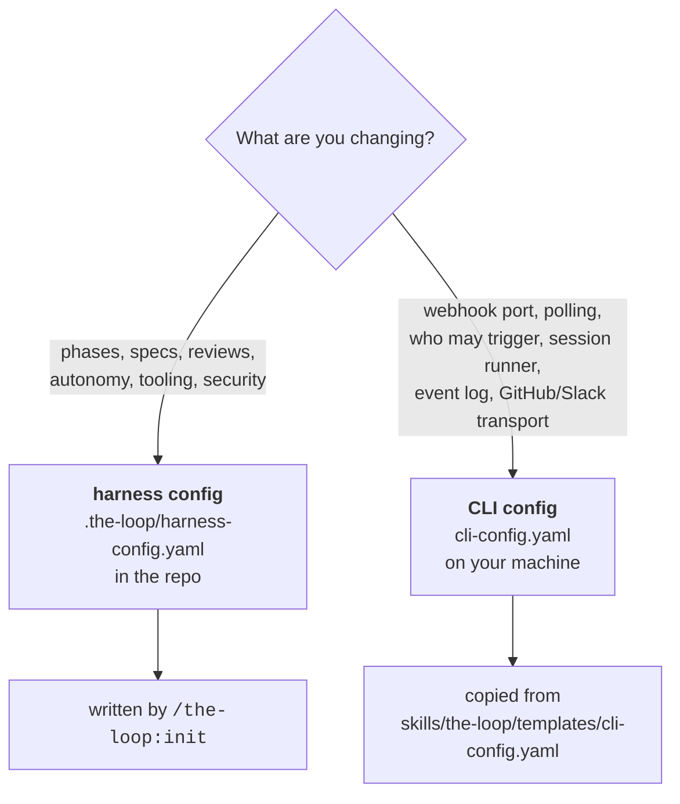

# Configuring the-loop

the-loop reads **two** configuration files. They never share a key, and knowing which one
you want is the whole trick:

| | [Harness config](/config/harness-config) | [CLI config](/config/cli/) |
|---|---|---|
| **File** | `.the-loop/harness-config.yaml` | `cli-config.yaml` |
| **Installed** | **per repository**, by `/the-loop:init` | **per operator**, wherever you keep it |
| **Read by** | the `/the-loop:*` commands and the operating skill — the agent doing the work | the CLI daemon: `gh-webhook`, `poll`, `sessions`, `events` |
| **Governs** | *how work is done here* — ticketing, phases, tooling, reviews, autonomy, security | *how work is triggered and hosted* — ingress, routing, sessions, integrations, logging |
| **Schema** | `.the-loop/harness-config.schema.json` | `.the-loop/cli-config.schema.json` |
| **Committed?** | yes — it is a statement about the project | usually not; it describes *your machine* |

The split is deliberate ([decision-032](/decisions/decision-032)). The daemon is expected
to watch **several** repositories at once, so tying its settings to any one checkout would
mean the same operator maintaining N copies of their own webhook port. Conversely, "this
project requires three critic rounds" is a property of the project, not of whoever happens
to be running the daemon today.

::: warning The daemon never reads a repository's harness config
Not for anything — including the two settings people most expect to be inherited:
`routing.authorizedUsers` (who may trigger it) and a poll source's `repos` (what it
watches). Both are **CLI-config-only**, with no fallback. Set them explicitly, or the
daemon fails closed and does nothing.
:::

## Which one am I editing?

There are three exceptions worth memorising, because they look like daemon settings but
are read from the **repository** the CLI is invoked in — they are repo-scoped commands,
not daemon commands:

- `the-loop check` and `the-loop graph` read the repo's `workflow` and process graph.
- `the-loop scenarios` reads the repo's `testing.integrationTestGlobs`.
- `the-loop critic` reads the repo's `reviews.critics[]`.

## Reference

- **[Harness config](/config/harness-config)** — every section of
  `.the-loop/harness-config.yaml`, plus the two files beside it
  (`collaborators.yaml`, `manifest.yaml`).
- **[CLI config](/config/cli/)** — how the file is found and versioned, then the options
  by area:
  [webhook](/config/cli/webhook-options) ·
  [routing](/config/cli/routing-options) ·
  [polling](/config/cli/polling-options) ·
  [integrations](/config/cli/integrations-options) ·
  [observability](/config/cli/observability-options).

Every CLI-config option on those pages is checked against
`.the-loop/cli-config.schema.json` by a test in the repository, in **both** directions: an
option documented here that the schema does not define fails the build, and so does a
schema key nobody documented.
