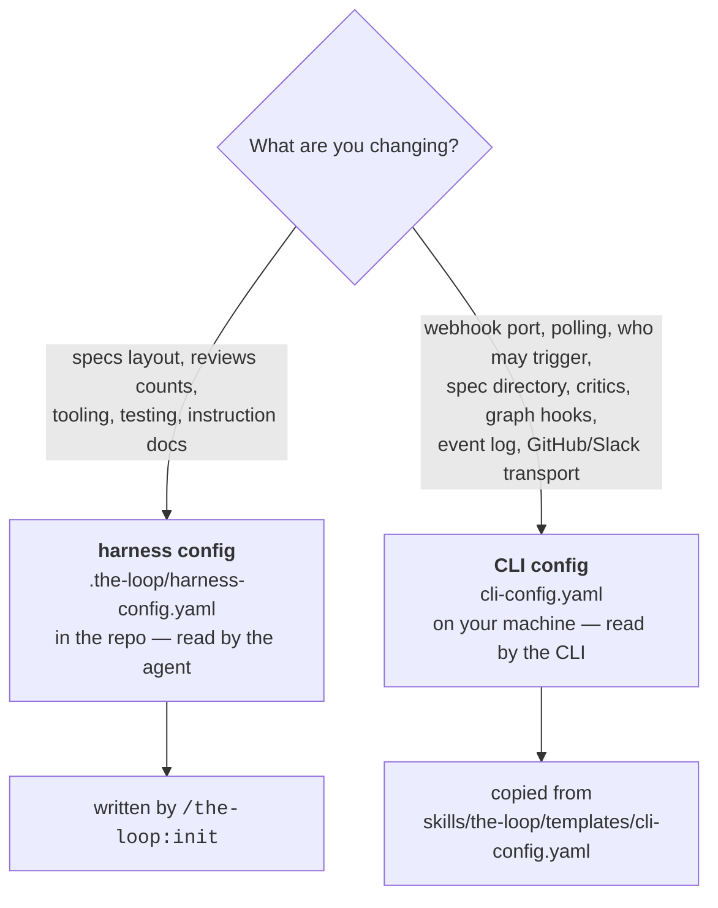

# Configuring the-loop

the-loop reads **two** configuration files. They never share a key, and knowing which one
you want is the whole trick:

| | [Harness config](/config/harness-config) | [CLI config](/config/cli/) |
|---|---|---|
| **File** | `.the-loop/harness-config.yaml` | `cli-config.yaml` |
| **Installed** | **per repository**, by `/the-loop:init` | **per operator**, wherever you keep it |
| **Read by** | the `/the-loop:*` commands and the operating skill — the agent doing the work. **Never the CLI** ([decision-123](/decisions/decision-123)) | every `the-loop` command and daemon |
| **Governs** | *how work is done here* — layout, tooling, reviews, testing, instruction docs | *how work is triggered, hosted and gated* — ingress, routing, sessions, the spec directory, critics, graph hooks, integrations, logging |
| **Schema** | `harness-config.schema.json` | `cli-config.schema.json` |
| **Where the schema lives** | [with the plugin](#where-the-schemas-live), never copied into your repo | [with the plugin](#where-the-schemas-live), never copied into your repo |
| **Committed?** | yes — it is a statement about the project | usually not; it describes *your machine* |

The split is deliberate ([decision-032](/decisions/decision-032)). The daemon is expected
to watch **several** repositories at once, so tying its settings to any one checkout would
mean the same operator maintaining N copies of their own webhook port. Conversely, "this
project requires three critic rounds" is a property of the project, not of whoever happens
to be running the daemon today.

::: warning A repository configures nothing the CLI does
Since [issue #352](https://github.com/MadaraUchiha-314/the-loop/issues/352)
([decision-123](/decisions/decision-123)) the CLI **never opens** a repository's harness
config. `routing.authorizedUsers` (who may trigger it) and `repositories` (what it works
with) were always CLI-config-only; now so are the spec directory
(`routing.graph.specDir`), the critic roster (`critics[]`) and the graph hooks
(`routing.graph.hooks`). Set them in your CLI config, or the daemon fails closed and does
nothing.
:::

## Which one am I editing?



The picture is simple since issue-352: **the agent reads one file, the CLI reads the
other.** Where the CLI needs something the repository knows, the agent hands it over as a
flag — `--spec-dir` on `check`/`graph`, `--glob` on `scenarios`, `--doc` and
`--on-missing` on `instructions` — and the skill says so. Two things stopped being
configuration at all: the ticket's repository (the work item's ref, or the checkout's
`origin` remote) and the phase label prefix (`loop:`). The table of what moved where is in
[the harness config reference](/config/harness-config#what-moved-out-of-it-in-issue-352).

## Where the schemas live

**With the plugin, not with your repository.** the-loop's three JSON schemas —
`harness-config.schema.json`, `collaborators.schema.json` and `cli-config.schema.json` —
ship inside the installed plugin at `${CLAUDE_PLUGIN_ROOT}/.the-loop/`, declared once as
`schemasDir` in `.the-loop/manifest.yaml`. `/the-loop:init` and
`/the-loop:upgrade-the-loop` read them from there to validate what they write, and
`/the-loop:upgrade-the-loop` **deletes** the copies older versions used to leave behind
(up to 118 KB of the-loop's internals per repository — [issue #220](https://github.com/MadaraUchiha-314/the-loop/issues/220)).

Your editor is not left out. Every config the-loop scaffolds opens with a modeline:

```yaml
# yaml-language-server: $schema=https://raw.githubusercontent.com/MadaraUchiha-314/the-loop/main/.the-loop/harness-config.schema.json
```

It is a comment, and only the *editor* ever reads it — the-loop always validates against
the installed plugin's schema on disk, so it works offline and cannot be redirected by
editing that line. It has to stay on the **first line** to work at all; delete it if you
prefer, and you lose completion while typing, nothing else.

## Reference

- **[Harness config](/config/harness-config)** — every section of
  `.the-loop/harness-config.yaml`, plus the two files beside it
  (`collaborators.yaml`, `manifest.yaml`).
- **[CLI config](/config/cli/)** — how the file is found and versioned, then the options
  by area:
  [webhook](/config/cli/webhook-options) ·
  [routing](/config/cli/routing-options) ·
  [critics](/config/cli/critics-options) ·
  [polling](/config/cli/polling-options) ·
  [integrations](/config/cli/integrations-options) ·
  [channels](/config/cli/channels-options) ·
  [observability](/config/cli/observability-options).

Every CLI-config option on those pages is checked against
`cli-config.schema.json` by a test in the repository, in **both** directions: an
option documented here that the schema does not define fails the build, and so does a
schema key nobody documented.
