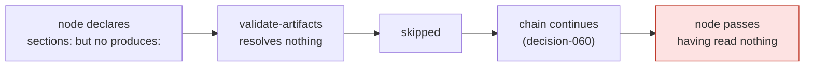

# Decision 063: A node may `validates:` an artifact it did not author — and a content gate with nothing to read fails closed

- **Status:** proposed
- **Date:** 2026-08-06
- **Deciders:** @MadaraUchiha-314 (issue #167)
- **Work item:** issue-167
- **Spec:** `docs/specs/issue-167/`
- **Refines:** [decision-041](decision-041.md) (the PDLC is an executable graph),
  [decision-045](decision-045.md) (one artifact, several accepted names — and the failure
  shape of a gate that reports success without running) and
  [decision-060](decision-060.md) (a skip is not a decision). Nothing in any of them is
  reversed; this adds the vocabulary for gating a *shared* artifact, and closes the hole
  that the combination of the three left open.

## Context

[Issue #167](https://github.com/MadaraUchiha-314/the-loop/issues/167). Six nodes of the
shipped graph declared `sections:` and no `produces:`. `validate-artifacts` resolves what
to read from `produces`, returns `HookResult.skipped` when a node declares none, and since
decision-060 a skip is not a decision — so the chain carried on and the node passed.



The six are `self-review`, `critic-review`, **`security-review`**, `evidence`,
`capability-docs` and `reviewer-briefing` — exactly the six that issue-109 split out of
the single `needs-review` label *because that is where the measured drift piled up* (23 of
26 execution logs stopped there). Splitting them gave each a name; none of them got a gate
that fires.

`security-review` is `required: true`, annotated in the graph as "never skippable, at any
risk tier". (That marker was traded in issue-179 — [decision-068](decision-068.md) — so an
authorized human may now *declare* the node away at `phase-selection`. What this decision
fixed still holds: the node can no longer skip **itself** by resolving no artifact.) It was
skippable, and it always skipped. The review itself still happened —
the skill, `reference/security.md` and `execute-tasks` all drive it — but the gate meant
to make it non-optional was inert, which is precisely the drift issue-109 exists to
prevent.

Riding along: `capability-docs` gated a `Capability docs` section that
`skills/the-loop/templates/execution-log.md` did not offer. Invisible while the node
skipped; a block for **every** work item the moment it stopped.

The reason this was not a one-line patch: these nodes' output is not a spec artifact, it
is *sections of the shared execution log*. `produces` means "this node authored it", and
`.the-loop/manifest.yaml` tracks `execution-log.md` with **no `phase`** — which is exactly
how `test_graph_parity.py`'s P1/P2 decide what is inside the node-artifact contract.

## Decision

**A new hook parameter, plus an inverted default.**

1. **`validates:`** — a `validate-artifacts` entry may name an artifact the node asserts
   against but did not author. It is resolved by the **same** `resolve_produces` as
   `produces`, so alternation (`a.md|b.md`), the absent-artifact block and the
   two-files-one-slot ambiguity block are identical for both, and cannot drift apart.
   Every declared check (`locked`, `frontMatter`, `sections`, `checkmarks`) applies to it.

   ```yaml
   - id: security-review
     required: true
     exit:
       - {hook: validate-artifacts, with: {validates: execution-log.md, sections: ["Security review (gate)"]}}
   ```

2. **A content gate with no resolvable target blocks, not skips.** When any of the four
   checks is declared and neither `produces` nor `validates` resolves anything, the hook
   returns `block` with `retriable=False` — a graph-authoring fault that re-running cannot
   repair, and that would otherwise burn `maxAttempts` before anyone was told.

3. **P5 in `cli/tests/test_graph_parity.py`**, asserted against the shipped graph: every
   content gate resolves a target (P5a), every validated name is manifest-tracked (P5b),
   and every section it demands exists in that artifact's bundled template (P5c). P5a
   fails naming all six nodes against the pre-fix graph; P5c fails naming
   `Capability docs` against the pre-fix template.

| Sub-decision | What was chosen | Why |
|---|---|---|
| **D1 — a parameter, not a `produces` entry** | `validates:` | `produces` means authorship. Six nodes claiming to author one shared file is false, and it would fail P2 (the manifest tracks the log with no phase) — repairable only by inventing a phase for a six-node artifact or by teaching the parity test a special case. It would also drag `lint-artifacts`, which reads `produces` too, onto the execution log. |
| **D2 — a hook parameter, not a node field** | lives in the chain entry's `with:` | Only one hook reads it, and it describes *this assertion*, not *this node's* ownership. A node field would touch `Node`, `as_mapping()`, the compile step and every serialized run state for nothing. |
| **D3 — one resolver for both** | `resolve_produces` | The two hooks that read `produces` each carried a byte-identical private copy until issue-124 — the same defect one level down. A second resolver for `validates` would rebuild it. |
| **D4 — fail closed as a backstop** | checks + no target → `block`, not retriable | Fixing six nodes fixes today. Failing closed is what stops the seventh node from shipping inert. Verified safe by a sweep: every `validate-artifacts` in the shipped graph declares `produces` or `validates`, so no node reaches the new branch. |
| **D5 — no `locked:` on the six** | the log is gated on sections only | The execution log is append-only and carries `status: in-progress \| complete`; it is never `approved`. |
| **D6 — the template gains `## Capability docs`** | shipped in the same change | Not optional follow-up: the moment `capability-docs` stops skipping, a template without the section blocks every work item authored from it. |

### What this gate does and does not prove

The section check is **structural**: a heading with placeholder text passes it. That is
pre-existing and deliberate — `Verification results` is authored up front holding "not yet
executed" (decision-060) — and it is written down here rather than left implied. **The
gate proves the record exists; the reviewer judges whether the review was any good.**
Making the gate judge content would mean an LLM call at every node boundary, which is
`classify-feedback`'s job at the human gates and not a shape to spread across the chain.

## Alternatives considered

- **Declare `execution-log.md` in `produces:`** (the ticket's option 1) — smallest diff,
  `validate-artifacts` unmodified. Rejected as D1: it makes `produces` mean two different
  things, breaks P2 against the manifest's deliberately phase-less entry, and pulls
  `lint-artifacts` onto a file it was never meant to lint.
- **`sections-in:` as the parameter name** (the ticket's own second suggestion) — rejected:
  it names one of four checks while governing all of them. `validates:` names the verb.
- **A dedicated `validate-log-sections` hook** — rejected by the minimalism ladder: it
  duplicates front-matter parsing, section resolution, aggregation and message vocabulary
  to gain nothing, and puts six nodes on a code path the other seven never exercise.
- **Fail closed *only*, with no new vocabulary** (the ticket's option 3 alone) — it would
  turn six silent passes into six permanent blocks with no way to satisfy them. Option 3
  is the backstop for option 2, not a substitute.
- **Fix only `security-review`**, the one that is `required: true` — rejected. The other
  five are the same defect, the fix is one line each, and five inert gates left behind
  would make P5a unlandable.
- **Give `execution-log.md` a phase in the manifest** so option 1 could pass P2 — rejected:
  six nodes across three phases author parts of it, so any phase chosen is wrong for five
  of them, and P1 would then demand that phase's node accept the name.
