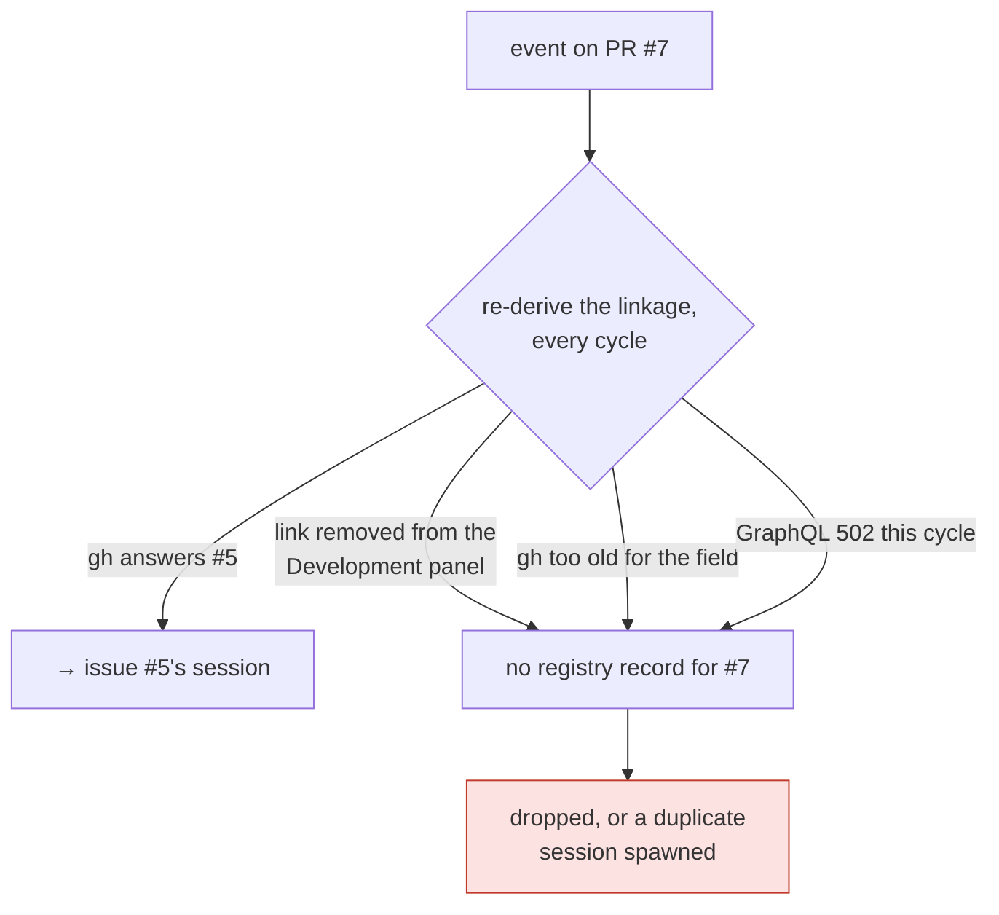

# Decision 064: The PR → session binding is persisted as its own record, not as a field on the session

- **Status:** proposed
- **Date:** 2026-08-07
- **Deciders:** @MadaraUchiha-314 (issue #172)
- **Work item:** issue-172
- **Spec:** `docs/specs/issue-172/`
- **Refines:** [decision-036](decision-036.md) (an event on a PR resolves the PR's linked
  issues first), [decision-039](decision-039.md) (a work item may be delivered by several
  PRs, so only the object that closed is ended) and [decision-046](decision-046.md)
  (generated state is grouped by whether it travels). Nothing in any of them is reversed:
  this persists decision-036's *outcome* instead of recomputing it, leaves decision-039's
  close rule untouched, and classifies the new file by decision-046's own test.

## Context

[Issue #172](https://github.com/MadaraUchiha-314/the-loop/issues/172). Since decision-036,
an event on a PR routes to the issue the PR is linked to. The decision is correct. What was
missing is that it was never written down — it existed only as the return value of
`linked_issue_numbers()`, recomputed from `gh`'s `closingIssuesReferences` on every single
event.



Three ways for the answer to change after the session was created, and no stored state to
contradict any of them. Worse, the whole session-recovery ladder — deliver into the live
tmux session, else respawn resuming the recorded conversation ([decision on
issue-89](../specs/issue-89/)), else start fresh — hangs off *finding a registry entry*. A
failed derivation does not degrade through the ladder; it skips it entirely.

The ticket named two acceptable shapes and left the choice open.

## Decision

**A link record: one file per bound ref, beside the session records, under a `.link.json`
suffix.**

```json
{
  "ref": "github:octo/repo#16",
  "url": "https://github.com/octo/repo/issues/16",
  "sessionRef": "github:octo/repo#15",
  "createdAt": "2026-08-07T16:40:11Z",
  "updatedAt": "2026-08-07T16:40:11Z"
}
```

| Sub-decision | What was chosen | Why |
|---|---|---|
| **D1 — a separate record, not a field** | `<slug>.link.json` beside `<slug>.json` | A `linkedRefs` array on the *issue's* session record makes "which session owns PR #16?" a reverse scan of every session file, on the one path that must be cheap. It also puts the binding inside a record two ingresses read-modify-write (`touch` fires on every delivered event), so a poll cycle and a webhook delivery racing on one work item could drop a binding that was just added. |
| **D2 — a distinct suffix, not the PR's own slug** | `.link.json`, not `<pr-slug>.json` | An alias file under the PR's own slug collides with the namespace a PR's **own** session needs — the supported non-GitHub-ticketing case, where a labelled PR is its own work item. `_REGISTRY_FILE_RE` wants a name ending `-<number>.json`; `.link.json` does not match it, so `list_sessions`, the unreadable-file warning and `reset --all` needed nothing taught about the new type. |
| **D3 — written where the decision is made** | on delivery into a matched session, and on spawn (after registration) | These are the two moments routing actually decides. Writing it at spawn only would miss a session registered by hand or by `work-on`; writing it on delivery only would miss the spawn the ticket calls "when the session spawned". Recording after registration, not before, keeps a binding from naming a session that failed to start. |
| **D4 — the binding adds a resolution, never removes one** | own record first, then the binding | Preferring the binding outright would make a deliberate re-link unactionable without a manual `sessions reset`. As chosen, a PR re-linked to a different live issue delivers to **both** — loud, and recoverable. The failure it replaces is silent. |
| **D5 — single hop** | `resolve_link` never follows its target's own binding | There is no legitimate chain to express. Refusing to traverse means no cycle can be constructed and no depth has to be bounded — a structural answer instead of a guard. |
| **D6 — `close` does not remove bindings; `reset` does, both directions** | see `docs/cli/state.md` | A closed session is reopenable and respawnable, and the binding is still true; removing it on close would lose it across exactly the close/reopen cycle it exists to survive. `sessions reset` is the verb that means "forget everything", and it gains a `link` piece. |
| **D7 — local, not portable** | `GENERATED_PATHS`, `portable=False` | It names a session record, and sessions are local (decision-046). Copied to another machine it points routing at a record that is not there — the session record's own failure, one indirection out. It also keeps these records outside the "a tracked record is an input" surface that portable state has. |

### What this does not change

Stated explicitly, because the ticket asks for it: **the routing decision itself.**
`linked_issue_numbers()` is untouched, `extract_work_items` still emits linked issues before
the PR's own number, and decision-039's rule that a `pull_request` close ends only that PR's
own session holds — a session matched *through a binding* is left open exactly as one matched
through the derived linkage is.

## Alternatives considered

- **`linkedRefs: []` on the issue's session record** (the ticket's second suggestion) —
  rejected as D1: reverse scan on the hot path, and a read-modify-write two ingresses race
  on.
- **An alias file under the PR's own slug** (the ticket's first suggestion) — rejected as
  D2: it collides with the session-record namespace.
- **Cache the derivation rather than the decision** — store `closingIssuesReferences` per PR
  and fall back to it when `gh` fails. Rejected: it caches the *input*, so it needs
  invalidation, and it answers nothing when the panel link is deliberately removed — the
  ticket's own reproduction. The decision is the stable fact; the input is not.
- **Have the poller pass its linkage through to the registry** — rejected: it fixes one
  ingress. The webhook path derives linkage from the PR body and head branch and fails the
  same way on a body edit. The binding belongs where both ingresses meet, which is dispatch.
- **Reap bindings when their target session closes** — rejected as D6.
- **Surface bindings in `sessions list` / the `/sessions` API** — rejected by the minimalism
  ladder: the records are human-readable JSON beside the session records, and
  `the-loop events --type session.linked` already answers "what is bound to what". A column
  would mean a new field in the OpenAPI contract for a fact the event log states.
