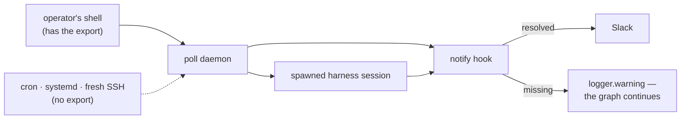

# Decision 075: A credential's secrecy is the operator's call — Slack's webhook URL may be configured inline

- **Status:** superseded (by 094: Slack converged on channels; the incoming-webhook integration this decision configured was removed)
- **Date:** 2026-08-10
- **Deciders:** @MadaraUchiha-314 (owner), the-loop (engineer)
- **Work item:** [issue-203](https://github.com/MadaraUchiha-314/the-loop/issues/203)

## Context

`integrations.slack` accepted only a *variable name* — `urlEnv`, whose schema description
read "Never the URL itself" — while `additionalProperties: false` refused everything else.
The value that actually turns notifications on therefore lived nowhere the-loop owns.

That is a policy about secrecy expressed as a limit on capability, and it bought less than
it cost:

Every arrow into `notify` is a process that needs the variable, and each starts from a
different place. Lose the export on any of them and delivery stops silently, because
`notify` is best-effort by contract: everything validates, `the-loop check` is green, and
nothing arrives. The ticket's author was running a `sitecustomize`-style patch of the
installed package to work around it — a fork of upstream behaviour re-applied after every
reinstall, which is the clearest possible signal that the policy was in the wrong place.

The counter-argument is real and was weighed: the issue-117 audit found that no key in any
the-loop config carries a secret *value* — every one is an env-var name — and that
property is worth keeping where it earns its keep.

## Decision

**Add an optional `integrations.slack.url`, taking precedence over `urlEnv`, and state the
trade-off in the schema and the docs instead of forbidding the choice.**

Three things bound it:

1. **Slack's incoming-webhook URL only.** A GitHub token (`github.api.tokenEnv`) and the
   webhook-signing secret (`webhooks.ghWebhook.secretEnv`) stay env-only. A webhook URL is
   post rights to one channel — no read access, no workspace scope, revoked by deleting
   the webhook. A repository token is not comparable, and this is not a general "values
   allowed everywhere" policy.
2. **Config wins over environment.** Precedence the other way round would make the
   effective configuration depend on ambient environment, so reading the file would no
   longer tell you where a notification goes. An empty `url:` counts as absent and falls
   back, so a blank key cannot disable a working env-based setup.
3. **The cost is stated where the choice is offered** — schema description, config
   template comment, and a `::: danger` block in the options page: setting it commits the
   credential, and git history keeps it after the line is deleted.

## Consequences

**Easier.** Notifications become configurable in the file the-loop already owns, for
operators who have priced the risk. The daemon, its spawned sessions and a fresh machine
all read the same declaration instead of three copies of one export. The ticket's
downstream patch can be deleted.

**Harder.** `integrations.slack` is now the one place in a the-loop config where a
credential may appear by value, so "no config file holds a secret" stops being a blanket
statement and becomes a per-key one — a reviewer of a shared or public config has one more
thing to look at. The mitigation is documentation, not mechanism: `urlEnv` remains the
default, and nothing writes `url` on the operator's behalf.

**Unchanged.** The env path, the schema `version` (an optional additive property needs no
migration), both transports, and `notify`'s best-effort contract.

## Alternatives considered

- **Keep env-only.** Rejected: the failure is silent and three processes deep, and the
  policy protects less than it costs for this particular credential. A user working around
  it by patching the installed package is a defect report about the policy.
- **`urlFile` — a path to a file holding the URL** (the ticket's option 2). Not taken: a
  third source for one value, matching a `LoadCredential`/docker-secrets deployment nobody
  has asked for yet. Additive later on the same resolution point if someone does.
- **Warn at `poll start` when the URL is unset** (the ticket's option 3, offered as the
  fallback if neither additive option was wanted). Not taken, and not merely as
  redundant: it cannot be made accurate. `slack` appears in every scaffolded CLI config,
  while `notifications.events` — which decides whether a notification is ever raised —
  lives in a *repository's* harness config that the repo-independent daemon does not read
  at `poll start`. The warning would fire for every operator who never uses Slack, and a
  diagnostic that cries wolf is one people learn to ignore. The diagnosability half of the
  ticket is answered where the information exists instead: the resolution error now names
  both remedies, matching the `auto`-transport contract that a failure "always names
  *every* remedy".
