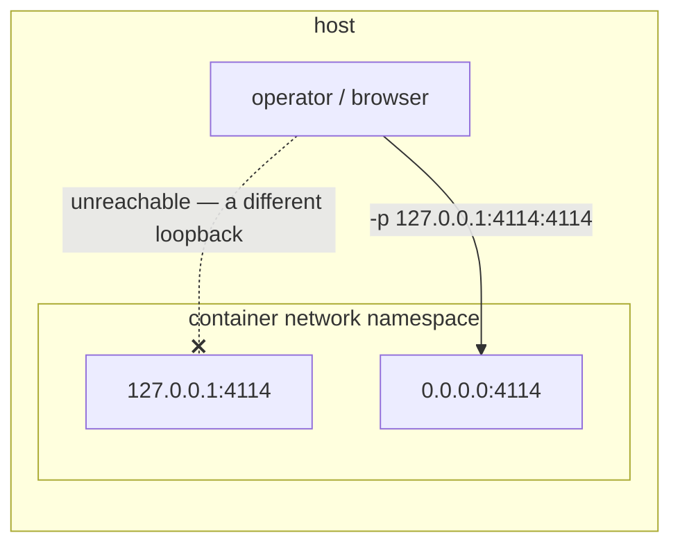

# Decision 102: In a container, the publish flag is the network boundary

- **Status:** proposed
- **Date:** 2026-08-27
- **Deciders:** MadaraUchiha-314 (owner/approver)
- **Work item:** [github:MadaraUchiha-314/the-loop#236](https://github.com/MadaraUchiha-314/the-loop/issues/236)

## Context

The control-plane service has one boundary of its own, and it is a bind address:
`service.host` defaults to `127.0.0.1`, and `api/serve.py` **refuses to boot** on anything
else unless `service.exposed: true` is set. That guard exists because the service carries
no in-app authentication ([decision-059](decision-059.md)) and its API can spawn harness
sessions with the operator's credentials — so a workstation must never put it on the
network by accident.

Issue #236 asks for a container image that an operator can pull and start. Inside a
container, that guard protects nothing anybody wanted:

A loopback bind inside a network namespace is reachable only from that namespace — not
even from the machine running the container. So `0.0.0.0` is not one option of two; it is
the only value that yields a service at all. The question is therefore not *whether* the
guard is cleared in the image, but **what replaces it** and **how visible that is**.

## Decision

The image ships a container-shaped default config that sets `service.host: 0.0.0.0` and
`service.exposed: true`, and the boundary moves to the **publish flag** the operator
passes — `-p 127.0.0.1:4114:4114` for their machine only, anything wider only behind an
auth-terminating gateway.

Three properties make that a decision rather than a hole:

1. **It is configuration, not code.** No env var, no branch in `serve.py`, no special case
   anywhere in `the_loop/`. The container copies a YAML file into its volume on first
   start; the operator can read it, the dashboard's Settings screen can change it, and the
   guard itself is untouched for every other way of running the service.
2. **Every start says so.** The entrypoint prints the boundary, naming the loopback
   publish form and the gateway — unconditionally, because from inside the container
   `-p 127.0.0.1:4114:4114` and `-p 4114:4114` are indistinguishable.
3. **Nothing else is widened.** CORS keeps the shipped allowlist
   ([decision-077](decision-077.md)), the ingresses stay off, the container is
   unprivileged, no credential is baked in, and the seed carries no key the container has
   no opinion about.

## Consequences

**Easier.** `docker run -p 127.0.0.1:4114:4114 …` is a working control plane in one line,
which is what the issue asked for. The image needs no privileged mode, no host networking,
and no first-run ritual. Because the exposure is expressed in the operator's own config
file, "how do I put this behind a gateway?" has the same answer inside and outside a
container.

**Harder.** A published port is easy to get wrong: `-p 4114:4114` on a cloud host is an
unauthenticated control plane on the internet, and the image cannot detect it, only warn.
The mitigation is documentation and the unconditional banner, which is weaker than a
refusal — deliberately, because a refusal here would refuse the one configuration that
works.

**Unchanged.** Anyone running the service from `pip install the-loopy-one` still gets the
loopback default and the guard exactly as before. This decision is scoped to the image.

## Alternatives considered

- **Require an explicit opt-in on first run** (`-e THE_LOOP_EXPOSED=1`, else refuse) —
  the first thing a new operator would meet is an error about a guard they have no context
  for, and the issue's premise ("download the container and start it") would be false. The
  warning carries the same information without failing the happy path.
- **Keep the loopback bind and document `--network host`** — Linux-only, and it hands the
  container the host's entire network stack: a strictly larger grant than one published
  port, to avoid a smaller one.
- **Ship in-app auth for the containerised service** — reverses PR #162's owner decision
  for one packaging format, and would mean two auth stories for one service.
- **Clear the guard in code when a container is detected** (`/.dockerenv`, cgroup
  sniffing) — invisible to the operator, unreadable in the config, untestable in the place
  it matters, and wrong the moment somebody runs the service in a container deliberately
  bound to loopback.
