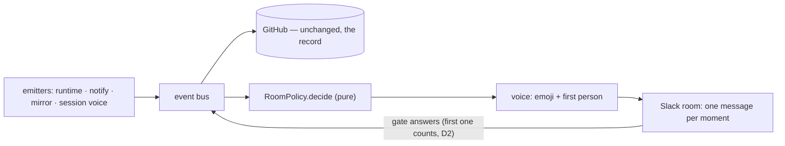

<!-- Written per the the-loop:writing skill. -->

# Decision 134: the Slack room is a delivery policy over an unchanged ledger; a human gate parks when it publishes its request

- **Status:** proposed
- **Date:** 2026-09-19
- **Work item:** [issue-393](https://github.com/MadaraUchiha-314/the-loop/issues/393)
- **Deciders:** MadaraUchiha-314 (owner, in-session); the-loop (design)
- **Refines:** [decision-133](decision-133.md) (a room addresses the-loop by mention),
  [decision-130](decision-130.md) (a declared room is the conversation),
  [decision-118](decision-118.md) (the digest reorders, never paraphrases),
  [decision-103](decision-103.md) (through the ledger, never around it)

## Context

An end-to-end run driven from Slack completed — brainstorm through merged PR — and the
operator's verdict was still *"horrible; too much text; too dry; it does not feel like an
agentic experience."* In two hours the bot posted 41 messages for one small work item:
22 of them `phase.started`/`phase.completed` pairs seconds apart, every gate announced
three times, a tmux cheat-sheet, a checklist of glyphs promising controls Slack could not
offer. Two plumbing bugs made it worse: a session's `ask` never reached the room, and the
first answer to every gate was misread as a reply. The question was how to make the room
read like a colleague without disturbing the record the whole system is built on.

## Decision

| # | What was chosen | Why |
|---|-----------------|-----|
| D1 | **The room rework is a delivery policy, not an event-bus change.** A new pure `RoomPolicy.decide(event, memory)` sits between the bus and the Slack renderer and returns post / drop / edit / thread; the GitHub ledger receives every event exactly as before. | The ledger is the record the dashboards, the poller and a hand-off all read; collapse and suppression are about what a *person in a room* should see, not about what happened. Keeping them a delivery decision means the whole run stays reconstructable from the ticket, and the rework cannot lose an event. |
| D2 | **A human gate parks at the moment it publishes its approval request**, deriving "at a human gate" from the node's own state written in that step — not from a `parked` flag a later evaluation sets (B8). | Entering a human node via the session's `graph complete` published the request but parked nothing, so the first ingress event — usually the answer — was classified a reply, and only a resend counted. Parking at publish makes the ✅ reaction tell the truth, and leaves issue-321's three-valued read contract untouched. |
| D3 | **The session's config path is inherited into spawned sessions** (`THE_LOOP_CLI_CONFIG`), so a session's own events reach the daemon's bus (B6). | A daemon run with `--config` spawned sessions that resolved the default config in the work-item checkout — a bus nobody subscribed to — so `ask` and every other session event vanished from the room. The single most valuable content of the run (the agent's questions) never arrived; routing the session to the same bus is what lets D1's voice carry it. |
| D4 | **A work item's own room reads in a first-person voice with one state emoji and no machine header**, behind `channels.slack.room.style: agentic` (default), with `classic` preserving the pre-393 rendering byte-for-byte. | `agentic` is the product; `classic` is the escape hatch and the compatibility baseline — one switch, not a knob per rule, and the existing outbound tests stay green under it. A shared/central channel keeps the header (it carries many items), identified by a short id+title link rather than the 50-character ref. |
| D5 | **The delivery memory is local and transient, and every collapse/suppress logs its rule.** A lost record degrades that item's room to classic delivery, never to silence. | The memory is a snapshot of what one deployment has shown one room — like the cursors, not portable — and a "missing" message must be diagnosable from the daemon log alone. Failing toward *more* messages is the safe direction. |

## Consequences

- **Easier:** following a work item in a room on a phone; approving from the room (the
  first answer counts, and the gate message can lead with the agent's own summary);
  diagnosing a missing room message (each drop logs its rule); reverting the whole look
  (`room.style: classic`).
- **Harder / accepted cost:** the delivery memory is one more per-item file to reason
  about; the four scattered emitters plus the memory mean a new event kind must be
  considered against the policy rules; a lost memory produces a duplicate message rather
  than a wrong one (the accepted direction).
- **Unchanged:** the GitHub ledger, the event vocabulary, authorization of who may answer
  a gate (D2 moves *when* the gate is readable, never *who*).

## Alternatives considered

- **Collapse at the emitters instead of a delivery policy** — rejected: four emitters that
  do not know about each other would each need suppression state, and the ledger would
  stop being event-complete by construction.
- **Widen `at_human_gate` to accept a not-yet-parked human node** (B8) — rejected: it
  would make the reader guess about state the writer had not committed; parking at publish
  fixes the race at its single writer.
- **A numeric message budget** (e.g. ≤ 12 per run) — rejected by the owner: the direction
  is one message per meaningful moment, measured as evidence, not gated on a count.
- **A modal for phase selection** — rejected by the owner in favour of in-message
  checkboxes.
