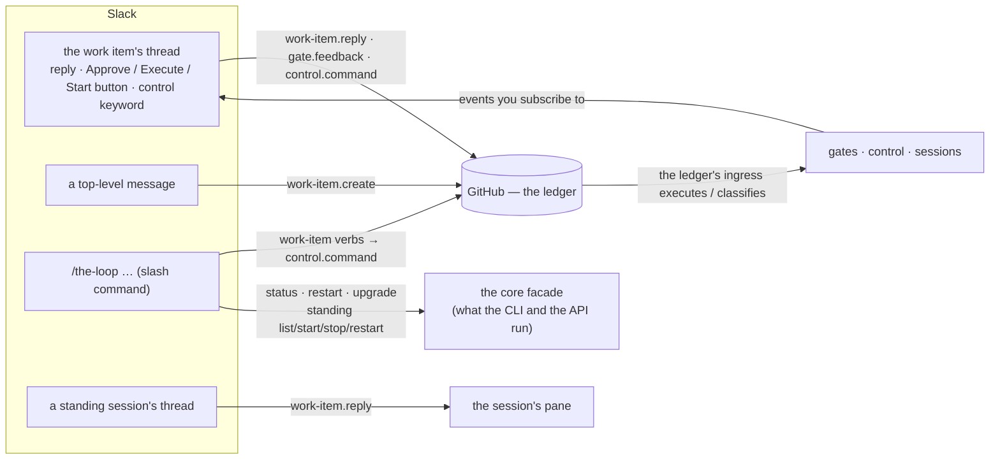

# Slack integration

Slack is a **channel** for the-loop: a peer on its event bus that receives the events you
subscribe it to, holds **one thread per work item**, and lets an authorized member drive
the loop back — as a reply, a button press (Approve, Request changes, and since
[issue-337](https://github.com/MadaraUchiha-314/the-loop/issues/337) **Execute** and
**Start**), a new work item, or, since
[issue-334](https://github.com/MadaraUchiha-314/the-loop/issues/334), a slash command.
GitHub stays the **ledger**: everything that starts in Slack is recorded on the work item
first, and the loop reads it from there ([decision-103](/decisions/decision-103)). This
page is the operator's map — every way to get work done from Slack, what each needs, and
where the limits are.



## Setting it up

### 1. Create the Slack app from the manifest

the-loop ships the app definition Slack imports — every scope, event subscription, the
Socket Mode switch and the `/the-loop` command. Print it with `the-loop channels manifest`,
or copy it from here; then at [api.slack.com/apps](https://api.slack.com/apps) choose
*Create New App → From a manifest*, pick the workspace, and paste it.

```yaml
# The Slack app the-loop's channel needs — Slack's own app-manifest format
# (https://api.slack.com/reference/manifests). Import it once: api.slack.com/apps
# → Create New App → From a manifest → paste this file. Print it with
# `the-loop channels manifest`. After the import, mint the app-level token
# (Basic Information → App-Level Tokens, scope connections:write) for Socket Mode
# and install the app to the workspace for the bot token; export both under the
# names channels.slack.botTokenEnv / appTokenEnv name. (issue-334)
display_information:
  name: the-loop
  description: Drive the-loop from Slack — one thread per work item, a slash command for the rest.
  background_color: "#1f2937"
features:
  bot_user:
    display_name: the-loop
    always_online: false
  slash_commands:
    - command: /the-loop
      description: "Drive the-loop: start a work item, check the instance, standing sessions"
      usage_hint: "help | start #123 | status | upgrade | standing start <name>"
      should_escape: false
oauth_config:
  scopes:
    bot:
      - chat:write          # post into the channel and its threads
      - channels:history    # read thread replies and kickoffs in a public channel
      - groups:history      # the same in a private channel
      - reactions:write     # acknowledge an accepted message on itself (issue-325)
      - commands            # the /the-loop slash command (issue-334)
settings:
  event_subscriptions:
    bot_events:
      - message.channels
      - message.groups
  interactivity:
    is_enabled: true        # Approve / Request changes, Execute / Start buttons (read.mode: socket)
  org_deploy_enabled: false
  socket_mode_enabled: true # `the-loop channels listen` — an outbound connection, nothing exposed
  token_rotation_enabled: false
```

The manifest is the "reusable, importable" definition the ticket asked about — Slack's
own format, checked into the-loop, the same for every workspace. (It is *not* a Workflow
Builder workflow; [why](#why-not-slack-workflow-builder).)

### Upgrading the app you already have (1b)

An app created for an earlier the-loop (issue-245 / issue-309 — thread replies and
buttons, no command) needs three things added: the `commands` scope and the `/the-loop`
command, the private-channel scope and event (`groups:history`, `message.groups`), and —
if it never used Socket Mode — Socket Mode itself. Two ways, pick one:

- **Replace the manifest** (recommended, one step). At
  [api.slack.com/apps](https://api.slack.com/apps) open the app → *App Manifest* → paste
  the manifest above over the existing one → *Save Changes*. Slack shows the diff and,
  because scopes changed, asks you to **reinstall** the app to the workspace — do it
  (*Install App → Reinstall*). The manifest's `display_information.name` and
  `bot_user.display_name` replace yours; edit those two lines first if you want to keep
  a different name.
- **By hand**, in the app's settings, then *Reinstall*:

  | Page | Add |
  |------|-----|
  | *OAuth & Permissions → Bot Token Scopes* | `commands`, `groups:history` (and `reactions:write` if the app predates issue-325) |
  | *Socket Mode* | *Enable Socket Mode* (if not already) |
  | *Slash Commands → Create New Command* | command `/the-loop`, any description and usage hint; **no Request URL** is needed in Socket Mode |
  | *Event Subscriptions → Subscribe to bot events* | `message.groups` (beside the existing `message.channels`) |
  | *Interactivity & Shortcuts* | on (it already is if the buttons worked) |

After either path: the **bot token** stays the one you have unless Slack issues a new one
on reinstall (it shows it on the install page — re-export if it changed); mint an
**app-level token** (`connections:write`) under *Basic Information → App-Level Tokens* if
the app has none; then set `read.mode: socket` and the grants you want in
`channels.slack.publish`, restart `the-loop channels listen`, and check
`the-loop channels status` — its `commands:` line should read *`/the-loop` over Socket
Mode* with the families you granted. `/the-loop help` in Slack is the end-to-end test.

### 2. Mint the two tokens

- **Install the app to the workspace** (*OAuth & Permissions → Install*). The **bot
  token** (`xoxb-…`) is what posts, reads and reacts. Export it under the name
  [`channels.slack.botTokenEnv`](/config/cli/channels-options#slack-bottokenenv) names
  (default `THE_LOOP_SLACK_BOT_TOKEN`).
- **Create an app-level token** (*Basic Information → App-Level Tokens*, scope
  `connections:write`). The **app token** (`xapp-…`) is what
  [`the-loop channels listen`](/cli/commands/channels) connects with over Socket Mode.
  Export it under [`channels.slack.appTokenEnv`](/config/cli/channels-options#slack-apptokenenv)
  (default `THE_LOOP_SLACK_APP_TOKEN`).

Both can live in the `.env` file the CLI config names
([`env.file`](/config/cli/#env-file)); neither ever appears in a config, a state file, the
event log or `channels status` output. Invite the bot to the channel it will post in, and
copy that channel's **id** (`C…`, from the channel's details pane).

### 3. Configure the channel

```yaml
routing:
  authorizedUsers:                    # identity, declared once per person
    - github: octocat
      slack: U0456GHIJKL                # the member id (U…), never a display name
      name: octocat
channels:
  ledger: github
  slack:
    enabled: true
    channel: C0123ABCDEF
    subscribe: [session.awaiting_input, phase-approval-pending, pr-review-pending,
                comment.agent, work-item-complete, standing.started]
    publish: [work-item.reply, gate.feedback, control.command,
              instance.command, standing.command]
    kickoff:
      repo: octocat/hello-world         # where a top-level message becomes an issue,
      labels: ["the-loop: auto-execute"]  # and what /the-loop start #N resolves against
    read:
      mode: socket                      # buttons and the slash command need this
```

`subscribe` is what the channel **hears**; `publish` is what a message on it **may
become** — the channel's authority, one grant per kind of act, all off except
`work-item.reply` until you write them down. Every option is in the
[channels options](/config/cli/channels-options).

### 4. Run it

```bash
the-loop start              # one process: the control-plane service, the ledger's ingresses,
                            # and — with read.mode: socket — the Slack listener, hosted
the-loop status             # …with a slack-listener row: running (hosted in the service, pid …)
the-loop channels status    # what is configured, which grants hold, whether buttons and
                            # commands can arrive — and, when they cannot, the exact steps
```

`the-loop start` reads the config and brings up everything it asks for, the long-lived
Slack connection included: with `channels.slack.enabled: true` and `read.mode: socket`
the service **hosts the listener** as a thread under its own lifespan
([`service.hostIngresses`](/config/cli/service-options#hostingresses), the default), exactly
as it hosts the poller and the webhook receiver. `the-loop stop` takes it down with the
service, `the-loop restart --with-upgrade` brings it back on the new version, and
`the-loop status` shows it as `slack-listener  running (hosted in the service, pid …)`. Both
tokens must be in the service's environment (the `.env` file the config names is loaded
at start); with one missing, `start` reports the row as `failed` and says which.
`the-loop channels listen` remains the **foreground** form — for `hostIngresses: false`,
or for watching the connection in a terminal — and takes the same single-instance lock,
so it refuses to run beside a hosted one.

**No webhook server, no Request URL.** Socket Mode is an *outbound* WebSocket the-loop
opens to Slack with the app-level token; Slack then pushes message events, button presses
and slash commands down that connection, the listener acknowledges each on the same
socket, and the ephemeral answer to a command is an outbound HTTPS POST to Slack's
`response_url`. Nothing listens for Slack, nothing is exposed, no port is opened — which
is why the manifest carries `socket_mode_enabled: true` and no `request_url`. (Slack's
classic HTTP delivery, which would need a public endpoint, is deliberately not offered.)

**One long-lived connection.** The listener (hosted or foreground) asks Slack for a one-time `wss://` URL
(`apps.connections.open`), connects, and keeps that socket open — a ping every few seconds
detects a dead one, and when Slack rotates the connection (it announces a `disconnect`
first) the SDK reconnects on its own. Every envelope — message events, button presses,
slash commands — arrives over that one socket and is acknowledged on it. Delivery happens
only while a listener is connected: with none running, a `/the-loop` command fails visibly
in Slack and message events are retried briefly, then dropped. Run **one** listener per
instance — Slack load-balances envelopes across an app's open connections, so two would
each see half of them.

With `read.mode: poll` the daemons read thread replies on a background thread instead and
`listen` is not needed — but no button press and no slash command can arrive that way,
because Slack delivers both only to a connection that acknowledges within seconds.
`channels status` says which you have.

## The modes of interaction

| You want to… | Do this in Slack | The grant it needs | What happens |
|--------------|------------------|--------------------|--------------|
| see what the loop needs from you | nothing — subscribe the events | — (`subscribe`) | one thread per work item, opened when it starts; every event a reply into it |
| answer the agent's question | reply in the work item's thread | `work-item.reply` (default) | mirrored onto the work item as the-loop's own marked comment, delivered into the waiting session |
| approve or reject a phase, a PR | reply `approved` / `changes requested`, or press the button | `gate.feedback` | recorded on the work item unmarked, as your answer; the gate reads it there |
| start, stop, pause, resume, execute, cleanup… a work item **that has a thread** | type the control keyword in its thread (`the-loop start`) | `control.command` | recorded on the work item unmarked, keyword intact; the ledger's ingress executes it — exactly as if you had typed it on the ticket |
| sign the phase-selection checklist | press **Execute** on the checklist message (or type `the-loop execute`) | `control.command` (+ `read.mode: socket`) | the same unmarked `the-loop execute` record; the message is edited to say so ([buttons](#the-buttons)) |
| start a work item you just filed from Slack | press **Start** on the-loop's "opened …" reply (or type `the-loop start`) | `control.command` (+ socket) | the same unmarked `the-loop start` record; the message is edited to say so |
| start a work item **that has no thread yet** | `/the-loop start #123` | `control.command` (+ `read.mode: socket`) | the same record on the ticket; the start opens the thread |
| file a new work item | post a top-level message in the channel | `work-item.create` + `kickoff.repo` | an issue is created (with `kickoff.labels`), the thread is bound to it and told the link |
| talk to a standing session | reply in its thread | `work-item.reply` | delivered into its pane (no ticket, so no mirror — the event log is the trail) |
| start, stop or restart a standing session | `/the-loop standing start <name>` | `standing.command` (+ socket) | the same verb `the-loop standing start` runs |
| ask the instance how it is, restart it, upgrade it | `/the-loop status` · `/the-loop restart` · `/the-loop upgrade` | `instance.command` (+ socket) | what `the-loop status` / `the-loop restart [--with-upgrade]` do |
| know which thread is whose | `the-loop channels threads` (from a shell) | — | the conversation map, ids only |

Every accepted message is **acknowledged on itself**: 👀 the moment it passes the
allow-list and the grant, ✅ when the action landed, ⚠️ when it did not
([`channels.slack.reactions`](/config/cli/channels-options#slack-reactions-enabled)). A
message that was dropped — a stranger's, a bot's, a kind the channel is not granted —
gets nothing: a refusal leaves no mark. A slash command has no message of yours to react
on; its receipt is the ephemeral answer only you see.

## Reading it on a phone

The GitHub comment is the record; the Slack message is the interface — and since
[issue-338](https://github.com/MadaraUchiha-314/the-loop/issues/338) they are no longer
the same text. A message whose text fits in
[`maxChars`](/config/cli/channels-options#slack-maxchars) (default 1500) arrives **as
written**. A longer one arrives as a **digest** the channel computes from the text's own
structure — no model reads it, so every sentence you see is the author's:

- **the ask first** — the first question in the text (or the sentence that says *reply
  `…`*), in bold, before any context;
- **a choice as a numbered list** — bullets, numbering and GitHub task boxes become
  `1.`, `2.`, … with ☑ / ☐ kept, so a reply can be one number;
- **pointers for what Slack cannot use** — a code fence, a table or a stack trace is
  replaced in place by *⟨code: 12 lines⟩* / *⟨table: 4 rows⟩* / *⟨stack trace: 9 lines⟩*,
  and an absolute path keeps its last two segments (`…/channels/slack.py`);
- **the rest in order, cut at a sentence** — never mid-sentence, then one closing line,
  *… full text: GitHub*, linking the comment or the work item.

The phase-selection checklist, with `maxChars: 700`:

```text
*🤖 _the-loop_ — which phases does this work item need?*

Before the loop starts, tell it what this item actually needs. *Untick anything this
work item does not need — right here on this comment — then reply `the-loop
execute`.* The tick state at that moment is frozen and becomes the graph this item
walks.

1. ☑ brainstorming
2. ☑ requirements-definition
3. ☑ design
4. ☑ test-planning
5. ☑ tasks-breakdown
6. ☑ implementation
7. ☑ verification

*Every phase of this loop is selectable — including the reviews, the security
review and the approval gate.*

_… full text: GitHub_
[Open on GitHub] [Execute]
```

The phone's notification preview (Slack's fallback text) leads with the same ask.
`maxChars` is the lever: turn it down and the digest fits the smaller screen; turn it
up to Slack's 3000 and most comments arrive whole. To have the old behaviour back — the
first `maxChars` characters and a note — set
[`longMessages: truncate`](/config/cli/channels-options#slack-longmessages). Whatever
the length, GitHub markdown is drawn as Slack mrkdwn (`**bold**`, headings, links, task
boxes) and the-loop's own `<!-- … -->` markers no longer show.

## Starting a work item from Slack

Two gestures, depending on whether the work item exists.

**It exists on GitHub and is labelled** (the auto-execute label,
[`routing.autoExecuteLabel`](/config/cli/routing-options#autoexecutelabel)) **but has
no thread yet.** Run `/the-loop start #123` — or `owner/repo#123`, `github:owner/repo#123`,
or paste the issue's URL. the-loop records `the-loop start` on the issue under your own
GitHub identity (the envelope names you) and the ledger's ingress executes it on its next
delivery or poll cycle, exactly as a typed comment; the accepted start then opens the
work item's thread here ([issue-317](https://github.com/MadaraUchiha-314/the-loop/issues/317)),
and everything after that is a reply into it. `#123` resolves against
[`kickoff.repo`](/config/cli/channels-options#slack-kickoff-repo); a work item may name
only a repository this instance is configured for (`kickoff.repo`, a poll source) or a
work item it already manages — anything else is refused, and nothing is written.

**It does not exist yet.** Post a **top-level message** in the channel — the first line is
the title, the rest the body. With the `work-item.create` grant and a `kickoff.repo`,
the-loop opens the issue (labelled from `kickoff.labels`, so add the auto-execute label
there to arm it), binds the message's thread to it and replies with the link. Then type
`the-loop start` **in that thread** (with `control.command`), or run
`/the-loop start #<n>` — either records the start on the new issue.

Once the loop runs, the thread carries its questions and approvals: answer the
phase-selection checklist by ticking it **on the ticket** and pressing **Execute** on the
checklist message — or typing `the-loop execute` in the thread — the execute is relayed
and signs whatever is ticked there (a checklist written inside the Slack message is
quoted in the record and not read; see [limits](#limits)).

## The buttons

Four buttons, on the messages that would otherwise ask you to type something back, each
rendered **only where a press can be received and acted on**
([issue-309](https://github.com/MadaraUchiha-314/the-loop/issues/309),
[issue-337](https://github.com/MadaraUchiha-314/the-loop/issues/337)):

| Button | On which message | It stands for | Rendered when |
|--------|------------------|---------------|---------------|
| **Approve** / **Request changes** | an approval request (`phase-approval-pending`, `pr-review-pending`, `security-sign-off-pending`) | the reply `approved` / `changes requested` | `read.mode: socket` + `gate.feedback` |
| **Execute** | the phase-selection checklist, mirrored from the ticket (`comment.agent`) | the keyword `the-loop execute` (your configured [`routing.control.keywords.execute`](/config/cli/routing-options#execution-control)) | `read.mode: socket` + `control.command` |
| **Start** | the-loop's "opened `#N` — this thread is now the conversation" reply to a kickoff | the keyword `the-loop start` | `read.mode: socket` + `control.command` |

A press is **exactly the typed reply**: the button's value enters the same pipeline a
message does — your member id against `routing.authorizedUsers`, the classification, the
grant, the unmarked record on the ticket — so a button adds no authority the grant did
not already give, and an unlisted member's press does nothing, silently. `Execute` and
`Start` are one tap where a phone keyboard used to be the slowest part of the loop.

**The outcome is written onto the message you pressed.** Once the press is processed the
message is edited: the pressed buttons are replaced by a line saying who pressed what and
what happened — *✅ Execute — pressed by @you · recorded on `o/r#337` (link) — the loop
runs it on its next ingress* — and the *Open on GitHub* button stays. A press that did
**not** land (the ledger refused the comment, no session could take the reply) keeps its
buttons beside a ⚠️ line carrying the error, so you can press again once it is fixed. The
👀 / ✅ / ⚠️ reactions stay too — they are the acknowledgment; the line is the outcome.

**The app-level token is required, and here is why.** Slack delivers a button press to
exactly two places: a public *Request URL* it can POST to, or a Socket Mode connection
that acknowledges the press within three seconds. the-loop exposes no endpoint
([decision-084](/decisions/decision-084)), so the only receiver is the Socket Mode
listener — which connects with an app-level token (`xapp-…`, scope `connections:write`,
minted under *Basic Information → App-Level Tokens*). A 60-second poller has nowhere to
receive the click, which is why no button is rendered in `poll` mode: a button nobody
can receive is worse than none. `the-loop channels status` prints, under its `buttons:`
line, only the steps your configuration still needs:

```text
  buttons:      Approve / Request changes: off · Execute / Start: off — a press reaches the-loop only over a Socket Mode listener connected with the app-level token. Still needed:
                  1. mint an app-level token: api.slack.com/apps → your app → Basic Information → App-Level Tokens → Generate (scope connections:write), and export it as THE_LOOP_SLACK_APP_TOKEN (now: unset)
                  2. set channels.slack.read.mode: socket (now: poll)
                  3. add to channels.slack.publish: gate.feedback (Approve / Request changes), control.command (Execute / Start)
                  4. the-loop restart — the service hosts the listener; `the-loop status` shows the slack-listener row, and this line reads on
```

## Standing sessions from Slack

A [standing session](/capabilities/standing-sessions) owns no work item, so Slack is one
of its two surfaces. When it starts it opens a thread (`standing.started`); a reply there
reaches its pane. To bring one up or take it down from Slack:

```text
/the-loop standing list
/the-loop standing start supervisor
/the-loop standing stop supervisor
/the-loop standing restart supervisor
```

These run `the-loop standing <verb>` on the host the listener runs on — the same core
verb the CLI, the dashboard and `POST /api/v1/standing-sessions/<verb>` call — and answer
with the same outcome rows. They need the `standing.command` grant. Creating and deleting
a standing session stay the dashboard's and the API's ([decision-100](/decisions/decision-100)).

## The control plane from Slack

What the [control plane](/capabilities/control-plane) offers from Slack, and what it does not:

| Operation | From Slack | Elsewhere |
|-----------|------------|-----------|
| liveness of the service, the daemons, the standing sessions; which instance this is | `/the-loop status` | `the-loop status`, `GET /api/v1/status`, the dashboard |
| restart every service | `/the-loop restart` | `the-loop restart`, `POST /api/v1/restart` |
| **upgrade the loop** — upgrade the CLI and restart | `/the-loop upgrade` | `the-loop restart --with-upgrade`, `POST /api/v1/restart {withUpgrade: true}` |
| a work item's session: start, pause, resume, stop, cleanup | `/the-loop <verb> <work-item>` (via the ledger) | `the-loop sessions <verb>`, the ticket, the API |
| standing sessions: list, start, stop, restart | `/the-loop standing …` | `the-loop standing …`, the API, the dashboard |
| create / delete a standing session, read a transcript, the event stream, config edits | — | the dashboard, the API, the MCP tools |

`restart` and `upgrade` schedule a detached `the-loop restart` — the answer names the
pid and the logfile — and `/the-loop status` tells you when it is back. The listener
itself (`channels listen`) is not one of the restarted services, so the command that
restarted the instance keeps answering. These need the `instance.command` grant, which
is separate from `control.command` on purpose: letting Slack start work items is not the
same decision as letting it restart the daemon ([decision-116](/decisions/decision-116)).

## The slash command, in full

```text
/the-loop help
/the-loop <keyword> <work-item> [@login] [instance:<name>]
/the-loop status | restart | upgrade
/the-loop standing list
/the-loop standing start|stop|restart <name>
```

- **`<keyword>`** is any configured control keyword's last word — `start`, `stop`,
  `pause`, `resume`, `execute`, `contribute`, `do`, `review`, `cleanup`,
  `add-collaborator @login`, `remove-collaborator @login` — or the command's own name
  when an operator renamed the keyword ([`routing.control.keywords`](/config/cli/routing-options#execution-control)).
  A disabled keyword (`""`) is refused.
- **`<work-item>`** is `github:[host/]owner/repo#N`, `[host/]owner/repo#N`, `#N` (or
  `N`) against `kickoff.repo`, or the issue's / pull request's URL on this instance's
  own GitHub host. A bare `owner/repo` is on the host the-loop resolves
  ([`integrations.github.host`](/config/cli/integrations-options)).
- **`instance:<name>`** addresses one [instance](/capabilities/instances) of several,
  as on the ticket; two addresses are refused.
- **The answer is ephemeral** — only you see it — and says what happened: *recorded on
  `<ref>`* with the comment's link (the loop acts on its next ingress), the status
  lines, the scheduled restart, the standing rows, or why it was refused. An unlisted
  member gets no answer at all.
- **Who may use it:** the `slack` ids of `routing.authorizedUsers` — the same people who
  may type a keyword on the ticket. Each verb family needs its grant in
  `channels.slack.publish`: `control.command`, `instance.command`, `standing.command`.
  `/the-loop help` lists which this channel holds.

## Through the ledger, never around it

A gate answer or a control keyword from Slack is never acted on by the Slack code. It is
written onto the work item as an **unmarked** comment under the operator's own credential,
with the keyword intact and an invisible envelope naming the Slack member and their GitHub
login — so the ledger's ingress (the webhook receiver or the poller) reads it as that
person's comment and runs every guard a typed comment meets: the self-authored marker
check, `routing.authorizedUsers`, the control seam's named-actor re-check, the instance's
scope. What GitHub shows is *"control command from `octocat` (`slack:U…`) on the
slack channel"* followed by the quoted keyword. The work item stays the single record;
an audit never needs Slack. This is also why a relayed keyword acts on the ledger's
**next ingress** — a webhook delivery, or one poll interval — rather than instantly.

## Limits

- **Socket Mode is required** for buttons and the slash command (`read.mode: socket`),
  and so is the app-level token it connects with — Slack delivers a press or a command
  only to an acknowledging connection or a public Request URL, and the-loop exposes none
  ([the buttons](#the-buttons)); in `poll` mode replies still work, on the daemons'
  interval, and no button is rendered. `the-loop channels status` lists the steps that
  remain.
- **The listener needs the service's environment to carry both tokens.** `the-loop start`
  hosts it only with `read.mode: socket` and both tokens set; `the-loop status` shows the
  row, and `start` reports `failed` naming the missing variable. With
  `service.hostIngresses: false` nothing hosts it — run `the-loop channels listen` in the
  foreground under your own supervisor.
- **A slash command cannot bind to the thread it was typed in** — Slack's payload carries
  no thread — so the work item is always an argument.
- **A checklist inside a Slack `the-loop execute` is not read.** The record quotes your
  message, and the phase-selection gate reads only unquoted checklist lines; tick the
  checklist on the ticket and type the keyword in the thread.
- **Private channels** need the `groups:history` scope and the `message.groups` event —
  both in the manifest above; an app created before issue-334 needs them added
  ([upgrading an existing app](#upgrading-the-app-you-already-have-1b)).
- **No completion receipt for a relayed keyword** beyond the ✅ on the record: the thread
  that opens when a start is accepted, and the events you subscribe to, are the feedback.
- **A command or a button press issued while no listener was connected is lost** — visibly,
  to the member, who issues it again. Replies and kickoffs are caught up; see
  [Downtime](#downtime).
- **The digest is structural, not a summary.** It leads with the *first* question the
  text asks, so a comment whose decision sits after a rhetorical question early on
  leads with the wrong one; the closing link is the remedy, and conclusion-first
  writing the prevention. A code block you wanted inline is a pointer —
  `longMessages: truncate`, or a larger `maxChars`, brings it back
  ([reading it on a phone](#reading-it-on-a-phone)).

## Downtime

What happens to what members did while the-loop was stopped, restarting or upgrading:

| What | While the-loop is down | When it is back |
|------|------------------------|-----------------|
| a keyword or gate answer **already recorded on the ledger** | it is a GitHub comment; nothing is lost | the ledger's ingress executes it on its next cycle — the GitHub side reconciles with its own cursors |
| a thread reply or kickoff message, `read.mode: poll` | stays on Slack | the next poll cycle reads every bound thread from its saved cursor and processes what accumulated, once |
| a thread reply or kickoff message, `read.mode: socket` | Slack retries the undelivered event a few times over a few minutes; beyond that it stays on Slack | the listener runs one **catch-up read** over every bound thread and the kickoff cursor the moment it connects (`channel.caught_up`), so what accumulated is processed once; a retry Slack then delivers of a message the catch-up already handled is dropped as `duplicate` |
| a `/the-loop` command or a button press | fails **visibly** to the member in Slack — no listener was connected to take it | the member issues it again; nothing was half-done |

**There is no dead-letter queue, on purpose.** A message the-loop *read but could not act
on* — the ledger refused the record, no session could take the delivery, the kickoff
issue could not be created — is recorded (`channel.dropped` with `reason: undeliverable`,
`channel.mirror_failed`, `bus.record_failed`, `create-failed`; ids and the error, never
text — `the-loop events --types 'channel.*' --types 'bus.*'` lists them), marked ⚠️ on
the member's own message, and **not retried**: a retried kickoff opens a second issue, a
retried gate answer answers twice, a retried keyword starts twice. The cursor advances,
and the person who typed it posts again — the safe retry for a message that is an
instruction. The two transports share the per-thread cursors in the channel state, so
the same message is never processed twice whichever path read it. In a socket deployment you may
also run `the-loop channels poll` from cron beside the listener as a reconciliation for a
long outage — it is the same read cycle. This is the standard shape for a robust Slack
integration, and the one the-loop already uses with GitHub: push for latency, a
cursor-based pull for completeness.

## Why not Slack Workflow Builder

The ticket asked whether Slack workflows can be defined in JSON/YAML and imported. For
Workflow Builder the answer is no in the way that matters, and it is not the-loop's
mechanism for three reasons ([decision-116](/decisions/decision-116)):

1. **It cannot reach the-loop.** A workflow's only outbound step is an HTTP webhook, and
   the control plane binds loopback and exposes nothing — Socket Mode exists so that
   nothing has to be exposed.
2. **Its messages are the workflow's, not yours.** A workflow that posts into the channel
   posts as a bot, which the pipeline drops as self-authored — correctly, since the person
   who filled the form is not recoverable from the message and authorization would have
   to be invented.
3. **There is nothing to check in.** Workflow Builder has no importable definition you can
   carry between workspaces; Slack's Deno "workflow apps" have one, but run on Slack's
   infrastructure and again need an endpoint to call.

A slash command is delivered into the connection the listener already holds, carries the
invoking member's id for the same allow-list to judge, is discoverable in Slack's own UI,
and is declared in the **app manifest** — the importable YAML that does exist.
