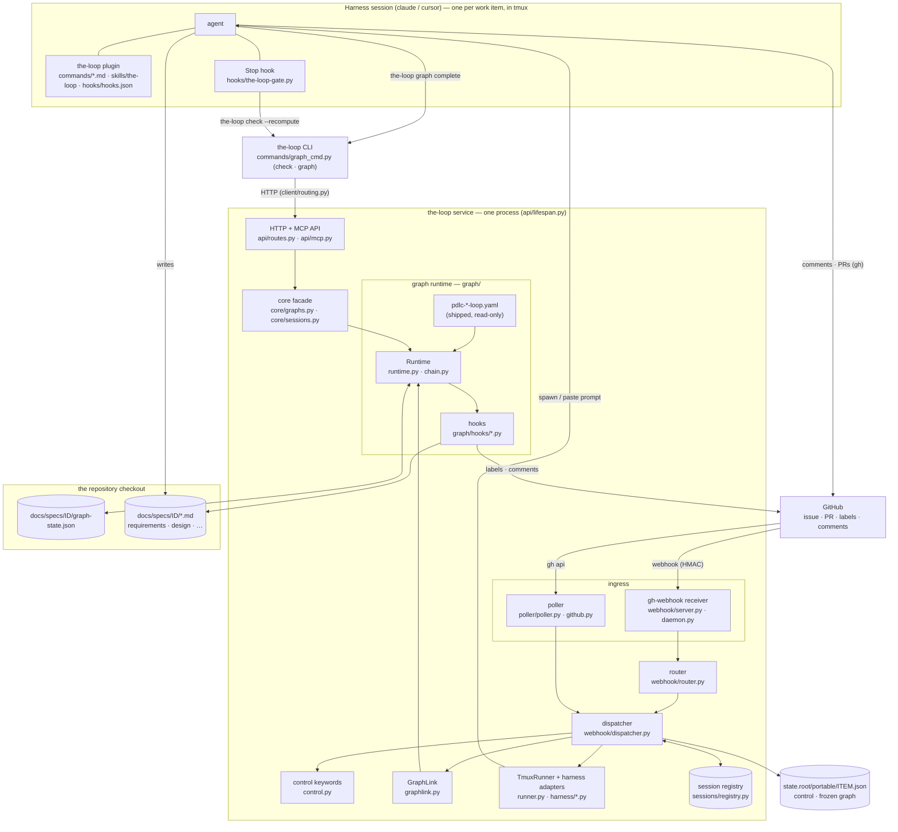
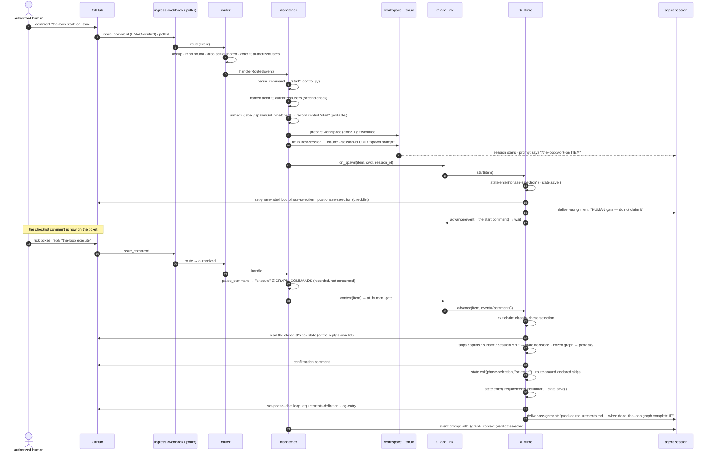
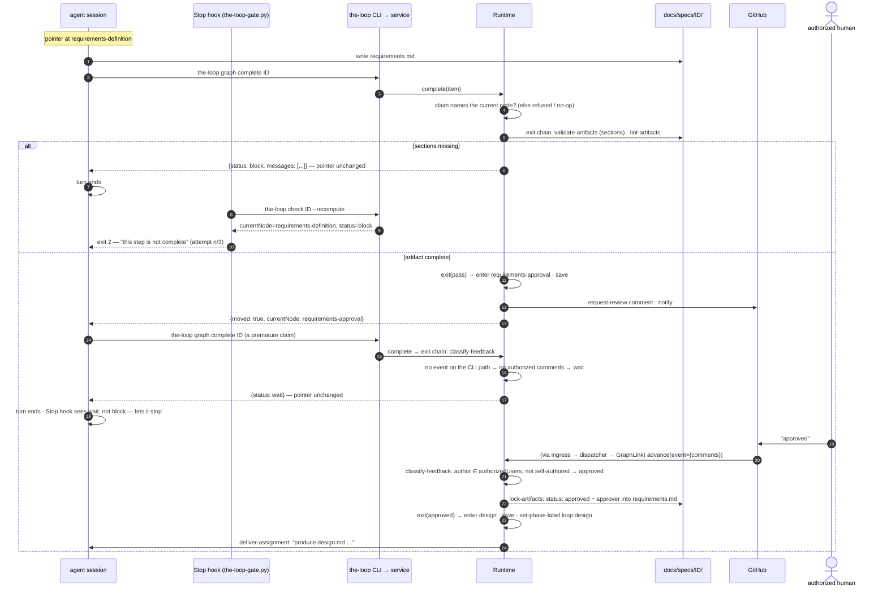
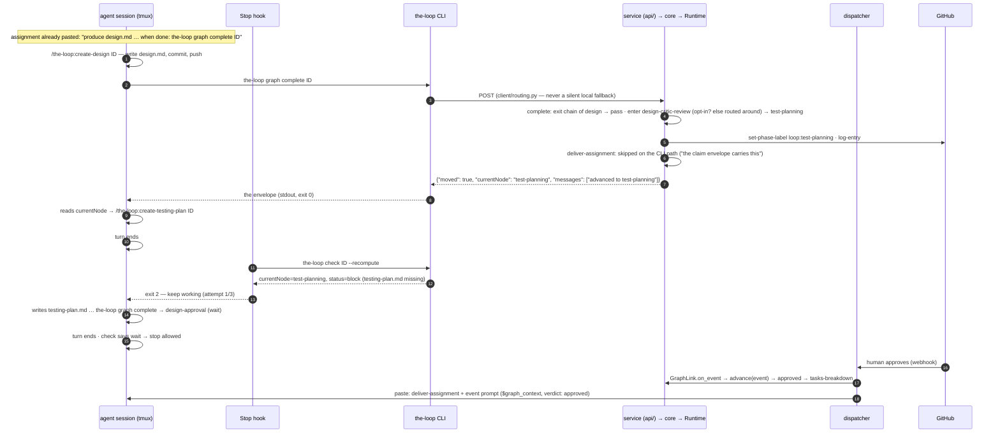

# Survey: the architecture of the-loop (CLI)

> Answers [issue #354](https://github.com/MadaraUchiha-314/the-loop/issues/354) — five
> questions about how the-loop is put together, traced through the code at v15.0.0.
> Reader: the owner, who knows the process and wants to see how the CLI enforces it.
> Every claim names the module it comes from so it can be checked against the tree.

**The short answers.**

1. the-loop is a **process graph** (`cli/the_loop/graph/`) executed by a **daemon**
   (`webhook/`, `poller/`, `dispatcher.py`) that spawns and steers **harness sessions**
   (Claude Code in tmux) and a **plugin** (`hooks/`, `commands/`, `skills/`) the session
   runs under. One process hosts all of it: the control-plane service (`api/`).
2. `the-loop start` is a **control command** consumed by the daemon: it records an
   authorized request, checks out a workspace, spawns a tmux session, enters the graph at
   `phase-selection`, and posts the phase checklist. `the-loop execute` is a **gate
   answer**: the daemon hands the comment to the `phase-selection` exit hook, which
   freezes the selection into graph state and moves the pointer to the first selected
   node.
3. A work item cannot reach `design` before `requirements-approval` because **the only
   edge into `design` leaves `requirements-approval`**, and that node's exit hook
   returns `wait` until an *authorized* human approves on the ticket. That is code:
   `Runtime.advance` takes no edge unless the exit chain passes, `the-loop check
   --recompute` re-derives the current node from the artifacts alone, the harness Stop
   hook blocks the session on a `block`, and CI runs the same check. What is *not*
   prevented: the session writing `design.md` early. It gets no pointer, no label and no
   gate for it.
4. **The daemon pushes; the agent reports.** The harness does not ask "what next": the
   daemon pastes the next assignment into the session when the pointer moves, and the
   agent reports completion with `the-loop graph complete <id>`, whose JSON reply names
   the node it now stands at. The Stop hook is the one *pull*: at every turn end it runs
   `the-loop check` and refuses to let the session stop on an unmet node.
5. Diagrams: one component diagram (§1) and three sequence diagrams (§2, §3, §4).

## 1. How the-loop is architected

**Three layers, one authority.** The plugin tells the agent *how* to work (prose). The
daemon decides *when* a session exists and what lands in it (code). The graph runtime
decides *where* a work item is and whether it may move (code). The graph is the
authority: the daemon and the CLI both call the same `Runtime`, and nothing else moves
the pointer.

| Component | Where | Responsibility |
|---|---|---|
| Process graphs | `graph/pdlc-work-item-loop.yaml` and four siblings | Nodes, `actor`, entry/exit hook chains, edges keyed on outcome. Shipped with the plugin; a repository cannot override them (`model.py:_warn_on_repo_graph`). |
| Graph runtime | `graph/runtime.py`, `graph/chain.py`, `graph/model.py` | `start`, `complete`, `advance`, `status`; compile-time validation of the graph; short-circuiting chain execution. No scheduler, no queue, no async. |
| Graph hooks | `graph/hooks/*.py` | The checks (`validate-artifacts`, `lint-artifacts`, `enforces-boundaries-from`, `classify-feedback`, `classify-phase-selection`) and the side effects (`set-phase-label`, `log-entry`, `post-phase-selection`, `request-review`, `lock-artifacts`, `deliver-assignment`, `notify`). |
| Graph state | `graph/state.py` → `docs/specs/<id>/graph-state.json` | Pointer, per-node attempts, decisions, declared skips, session binding. Checked in. **A cache, never an authority** (the module docstring). |
| Ingress | `webhook/server.py`, `webhook/daemon.py`, `poller/` | Two ways in, one event shape (`RoutedEvent`). |
| Router | `webhook/router.py` | Event-type filter, dedup, repository bound, work-item extraction, self-authored-comment drop, `authorizedUsers` check. |
| Dispatcher | `webhook/dispatcher.py` | Control keywords, arming, workspace, spawn/resume, per-work-item worker threads, prompt rendering, consult-the-gate-first delivery. |
| Control | `control.py`, `<state.root>/portable/` | Keyword table (`start`, `stop`, `pause`, `resume`, `execute`, `contribute`, `do`, `review`, …), the durable control record, the frozen graph. |
| GraphLink | `graphlink.py` | The daemon's adapter to the runtime: builds it in the session's checkout, injects the assignment sink, renders `$graph_context` into prompts, holds the state lock. |
| Sessions | `runner.py`, `harness/*.py`, `sessions/registry.py` | tmux spawn / paste / kill; harness argv (`claude --session-id …`, `--resume`); one registry record per work item. |
| CLI + service | `commands/graph_cmd.py`, `client/routing.py`, `api/`, `core/` | `the-loop check` and `the-loop graph …` are HTTP calls to the service, which auto-starts if permitted (`client.connect`). The same verbs are MCP tools. |
| Plugin | `hooks/hooks.json`, `hooks/the-loop-gate.py`, `commands/*.md`, `skills/the-loop/` | What the session runs under: the SessionStart reminder, the Stop gate, the slash commands, the operating model. |

The capability docs carry the current behaviour of each part:
[process-graph](../capabilities/process-graph.md), [cli](../capabilities/cli.md),
[webhook-triggers](../capabilities/webhook-triggers.md),
[interactive-sessions](../capabilities/interactive-sessions.md),
[control-plane](../capabilities/control-plane.md). This report links rather than repeats.

## 2. The exact flow: `the-loop start`, then `the-loop execute`

Both are comments on the ticket. The daemon reads them; the agent never sees `start`
and sees `execute` only after the gate has already classified it.

### `the-loop start`, step by step

1. **Ingress.** The webhook receiver verifies the HMAC (`webhook/server.py`), then
   `webhook/daemon.py` calls `Router.route` and `Dispatcher.handle`. The poller
   (`poller/github.py`) synthesizes the same `RoutedEvent` from `gh` listings, so the
   rest of the path is identical. Without a webhook the poll cycle is the trigger.
2. **Routing** (`webhook/router.py:Router.route`). In order: event-type filter,
   delivery-id dedup, repository bound (`repositories` in the CLI config), work-item
   extraction (issue number, `issue-<n>` branch convention, closing keywords), drop of
   any comment carrying the-loop's own `<!-- the-loop:agent-comment -->` marker, and
   the `authorizedUsers` check. An unauthorized actor is dropped here.
3. **Keyword parse** (`control.py:parse_command`). A whole-token, case-insensitive
   match over the *configured* keyword table, gated on `routing.control.enabled`. The
   result is one of a fixed set of constants, never body text; two keywords in one
   comment is `ambiguous` and nothing runs.
4. **Second authorization** (`dispatcher.py:Dispatcher.handle`). A control command
   needs a *named* actor in `authorizedUsers`, checked again, because this comment is
   about to command the daemon. `start` is then **consumed**: it is applied and never
   forwarded to a session.
5. **Arming** (`dispatcher.py:_apply_control`, `_spawn_refusal`). `start` spawns only
   if the item is armed — the auto-execute label, or `spawnOnUnmatched: always`. A
   refused `start` records nothing, on purpose: a stray comment on a backlog item must
   not leave a standing request. An accepted one writes the `control` section of
   `<state.root>/portable/<item>.json` (`control.py:ControlStore.record`), which is
   what survives a daemon restart.
6. **Spawn** (`dispatcher.py:_spawn_for`, on a per-work-item worker thread). Open any
   channel threads (Slack); prepare the workspace (`workspace.py`: clone under
   `routing.workspace.root`, one git worktree per work item); read the graph context;
   render the spawn prompt (`DEFAULT_SPAWN_TEMPLATE`, or the template file) with
   `$graph_context` and `$interaction_directive`; pre-trust the checkout and enable the
   plugin (`harness/claude_code.py:prepare_environment`); `tmux new-session -d -s
   loop-<slug> -- claude --session-id <uuid> … "<prompt>"` (`runner.py:TmuxRunner.spawn`);
   register the session (`sessions/registry.py`); announce it.
7. **Graph entry** (`graphlink.py:GraphLink.on_spawn` → `runtime.py:Runtime.start`).
   Guarded by: graph enabled, a spec id derivable from the ref, a start recorded, the
   checkout belonging to this repository, `docs/specs/<id>/` inside it. `start` is
   idempotent: a work item with a pointer returns `None`, so a redelivered spawn cannot
   rewind it. Otherwise it enters `phase-selection`, saves `graph-state.json` **before
   any side effect**, and runs the node's entry chain: `set-phase-label`
   (`loop:phase-selection`), `log-entry` (a checkpoint in `execution-log.md`),
   `post-phase-selection` (the checklist comment, idempotent via its own marker),
   `deliver-assignment` (pasted into tmux: "this node is a HUMAN gate — do not claim it").
8. **The start comment is offered to the gate once** (`on_spawn` calls `advance` with
   the comment attached), because the control path consumed it and no later event will
   carry it. For `start` the outcome is `wait`; for `contribute`, whose arming comment
   carries the goal, this is how the first gate is answered without a second command.

Slack and the CLI differ only at the front. `the-loop sessions start` applies locally
and posts the same keyword to the ticket with the self-authored marker so no ingress
re-executes it (`core/sessions.py:control_session`). A Slack `/the-loop start` relays
an *unmarked* comment to the ticket (`channels/github.py:relay_body`) and the GitHub
ingress above executes it — through the ledger, never around it.

### `the-loop execute`, step by step

1. **Same ingress, same routing, same parse.** `execute` is in `GRAPH_COMMANDS`, so
   the dispatcher only records it (`_record_graph_command`, event log) and **falls
   through**: the comment must reach the gate, not be consumed by the daemon.
2. **Consult the gate first** (`dispatcher.py:_dispatch_one`). The dispatcher reads
   the graph context; because the pointer is at a human node (`at_human_gate`), it calls
   `GraphLink.on_event` → `Runtime.advance(event={"comments": …})` *before* rendering a
   prompt, so approval and reaction cannot race.
3. **Classify** (`graph/hooks/selection.py:classify-phase-selection`). Skips if the
   decision is already recorded; otherwise finds authorized, non-self-authored comments
   containing the execute keyword (`routing.control.keywords.execute`, default
   `the-loop execute`); takes the latest; uses a checklist inside the reply if there is
   one, else re-reads the live tick state of the-loop's own checklist comment. Unticked
   skippable phases become skips; an unticked *protected* phase is refused out loud;
   an opt-in phase runs only if ticked. The same reply answers two non-phase rows: the
   outer-loop surface (work item or PR) and sessions-per-PR. No authorized comment
   means `wait`.
4. **Freeze** (`runtime.py:_record_selected_skips`). The skips, opt-ins, surface and
   PR-session mode go into `state.decisions` with provenance (who, via what, when), and
   the **frozen graph** — every node marked selected/skipped/opt-in — is written both
   into graph state and to the portable control record (`control.py:record_frozen_graph`).
   From here the selection is a recorded fact; editing the checklist comment changes
   nothing.
5. **Move** (`runtime.py:advance`). `state.exit(phase-selection, "selected")`, take the
   `on: selected` edge to `brainstorming`, then `_route_skips` walks *around* every
   declared-skipped successor (their hooks never run, their record says `skipped`)
   until it lands on the first selected node — `requirements-definition` for a typical
   item. `state.enter`, `state.save`, then that node's entry chain: label, log entry,
   and `deliver-assignment` — now an agent assignment: `produce: requirements.md`,
   `work it with: /the-loop:new-requirement <id>`, `when done: the-loop graph complete
   <id>`.
6. **Deliver.** The dispatcher renders the event prompt with the refreshed
   `$graph_context` and the gate's verdict, and pastes it into the tmux session
   (`runner.py:TmuxRunner.deliver`: tempfile → `load-buffer` → bracketed `paste-buffer`
   → submit). If the session died, it is resumed with `claude --resume <id>` or a fresh
   one is spawned.

## 3. The main question: what keeps `design` behind `requirements`

**The answer is the graph's topology plus a runtime that only follows edges.** The
edges into `design` are `requirements-approval → design` on `approved`,
`approved-with-comments` or `skipped`, and `design-approval → design` on
`changes-requested`. There is no edge from `requirements-definition` to `design`.
`Runtime.advance` computes the outcome of the *current* node's exit chain and takes the
edge declared for that outcome; on `wait` or `block` it returns without moving, and on an
outcome with no edge it parks and escalates rather than guessing.

### The guardrails, one by one

| # | Guardrail | Kind | Where |
|---|---|---|---|
| 1 | The only edges into `design` leave `requirements-approval` (or come back from `design-approval`). No `requirements-definition → design` edge exists. | programmatic | `graph/pdlc-work-item-loop.yaml` `edges:`; `model.py:Graph.next_node` |
| 2 | `advance` moves only on a passing exit chain; `wait` parks, `block` counts an attempt and escalates on repeat or at `max_attempts`; an outcome with no edge parks and escalates. | programmatic | `runtime.py:Runtime.advance` |
| 3 | A chain short-circuits at the first hook that is not `pass`/`skip`; a hook that raises or times out is a `block`, never a pass. | programmatic | `graph/chain.py:run_chain` |
| 4 | `requirements-definition` exits only when exactly one of `requirements.md`/`bugfix.md` exists (two present blocks) with non-empty `## Requirements` and `## Security considerations`; every unmet finding is reported in one result. A gate that resolves no artifact fails closed. | programmatic | `graph/hooks/artifacts.py:validate_artifacts` |
| 5 | `requirements-approval` exits only when `classify-feedback` sees a comment whose author is in `routing.authorizedUsers` and which does not carry the-loop's own marker; an empty allowlist denies everyone; indecisive text is `wait`, never a guessed approval. The verdict is confined to three outcomes. | programmatic | `graph/hooks/feedback.py:_authorized_comments`, `_classify`; `authz.py:is_authorized` |
| 6 | The comments a gate reads come only from the daemon's ingress (`HookContext.event`). `the-loop graph complete` and `graph advance` accept no `--event`, so a session claiming at a human gate gets `wait`. | programmatic | `graphlink.py:comments_from`; `commands/graph_cmd.py` |
| 7 | `status: approved` is written only by `lock-artifacts`, consuming `classify-feedback`'s verdict from the same chain run; it re-reads the file and blocks if the splice did not land. | programmatic | `graph/hooks/feedback.py:lock_artifacts` |
| 8 | A completion claim is a claim, not a verdict: it records who claimed and runs the real exit chain. A claim naming a node that is not current is refused; one behind the pointer is a no-op. Load→evaluate→save runs under `graph-state.lock`. | programmatic | `runtime.py:Runtime.complete`, `_complete_locked`; `graph/state.py:state_lock` |
| 9 | `the-loop check --recompute` ignores the stored pointer and reports the first node whose exit chain is unmet, from the artifacts alone. A hand-edited `graph-state.json` saying `design` reads back as `requirements-definition` or `requirements-approval`. | programmatic | `runtime.py:Runtime.status(recompute=True)`, `_first_unmet` |
| 10 | The harness **Stop hook** runs that recompute at every turn end and, on a `block` at the current node, refuses the stop (Claude Code: exit 2, stderr back to the model; Cursor: `followup_message`), up to three attempts. | programmatic | `hooks/hooks.json`, `hooks/the-loop-gate.py`, `.cursor/hooks.json` |
| 11 | **CI** runs `the-loop check <id> --recompute --fail-on block` for every `docs/specs/<id>/` a PR touches, and fails closed if it cannot compute the diff. | programmatic | `.github/workflows/the-loop-gate.yml` |
| 12 | Compile-time validation: `required` + `skippable` refused, a skippable node without an `on: skipped` edge refused, a skip set naming a non-skippable or opt-in node refused. `phase-selection` is `required: true`, so no declaration routes around choosing. | programmatic | `graph/model.py:compile_graph` |
| 13 | Declared skips are filtered through the compiled graph on every read, so a hand-written skip on a protected node is inert and `check` says so on that node; `graph skip` refuses a node already entered and requires `--reason`. | programmatic | `runtime.py:declared_skips`, `invalid_skips`, `declare_skips` |
| 14 | `graph force --to <node>` moves the pointer but never forges a verdict: `--reason` mandatory, warnings for an undeclared edge or a bypassed required node, `state.forced` recorded, a `graph.forced` event, and an audit comment on the ticket. `check --recompute` still reports the real result. | programmatic (audited hatch) | `runtime.py:force`, `_announce_force` |
| 15 | `design`'s own exit: `design.md` with `Architecture`, `Security design`, `Testing strategy`, and `enforces-boundaries-from` blocking when a `trust boundary`/`abuse case` marker in the requirements is unanswered. This links content, not approval. | programmatic | `graph/hooks/artifacts.py:enforces_boundaries_from` |
| 16 | "When a node's work is done, run `the-loop graph complete`"; "never set `status: approved` yourself"; "never write a downstream artifact against an unapproved upstream". | **prose** | `skills/the-loop/SKILL.md`, `reference/workflow.md`, `commands/work-on.md` |
| 17 | The SessionStart reminder ("follow the the-loop skill") and the `$graph_context` block in every prompt, which names the current node and the claim command. | **prose** | `hooks/hooks.json`; `graphlink.py:render_graph_context` |
| 18 | The deterministic keyword classifier in `_classify` is the floor; the harness may classify with a model. The *output* is confined to three outcomes (programmatic); the *judgement* on free text is heuristic. | mixed | `graph/hooks/feedback.py:_classify` |

### What is not prevented, honestly

- **Writing `design.md` early is not blocked.** Nothing stops the agent creating any
  file at any time. What it cannot get is the pointer, the `loop:design` label
  (`set-phase-label` runs only on node entry) or a passing `design` gate before
  `requirements-approval` has passed. The prose rule (row 16) is what asks it not to.
- **`graph-state.json` has no checksum or signature.** It is plain JSON with an atomic
  write. The design compensates rather than prevents: every skip/opt-in entry is
  re-filtered through the compiled graph on read; the frozen graph is also in the
  portable record outside the checkout; the file is checked in and shows in the PR
  diff; and both the Stop hook and CI use `--recompute`, which does not trust it.
- **The Stop hook ignores `wait`** (a human gate), by design, so a session may end its
  turn parked at `requirements-approval` without being spun against an absent human.
- **The Stop hook is a no-op** when `THE_LOOP_WORK_ITEM` is unset or `the-loop` is not
  on `PATH`, and it gives up after three attempts. An unrelated session is never
  blocked; a session outside the daemon's spawn has no gate unless the variable is set.
- **`graph force` is reachable from the agent's shell.** It is bounded by audit
  (reason, warnings, event, ticket comment), not by authorization.
- **The graph gate is not a pre-commit or pre-push hook.** `.pre-commit-config.yaml`
  wires ruff, pyright, pytest, markdownlint and config validation. Outside the session
  the enforcement point is the CI workflow.

## 4. Does the harness come back to ask what to do next?

**No. The daemon pushes assignments; the agent reports completions.** There is no
`graph next` or `graph context` CLI verb (the subcommands are `show`, `status`,
`advance`, `complete`, `force`, `skip`, `hooks`, `run`). The three touchpoints between
a session and the CLI are:

| Touchpoint | Direction | What crosses |
|---|---|---|
| **Assignment** | daemon → session | On every node entry, `deliver-assignment` renders the node in the graph's own vocabulary — node id, `produce:`, the `/the-loop:<command>` to use, the surface to iterate on, and the exact claim command — and the dispatcher pastes it into the bound tmux session. Every event prompt also carries `$graph_context`, re-rendered from state. |
| **Claim** | session → CLI → service → Runtime | `the-loop graph complete <id> [--pr N]` runs the current node's exit chain and, if it passes, takes the edge and runs the next node's entry chain. The JSON reply — `{node, status, outcome, moved, currentNode, messages}` — *is* the-loop's reply with the next step on this path. |
| **Gate at turn end** | Stop hook → CLI | `the-loop check <id> --format json --recompute`: a read-only report of every node's verdict and the current node. "Is what I stand on satisfied?", not "what is next?". |

**Why the assignment is not delivered twice.** `deliver-assignment` needs a delivery
sink (`assignmentDeliver`) that only the daemon's `GraphLink` injects. On the CLI path
(`core/graphs.py` builds the runtime without it) the hook returns `skipped` with the
reason "no delivery channel (CLI path — the claim envelope carries this)": a session that
claimed already holds the reply on stdout, and a paste on top would deliver every
assignment twice. When the *daemon* advances (a human gate resolving on an event), there
is no envelope, so the paste is the delivery. Either way the durable truth is
`graph-state.json`, re-rendered into every later prompt, so a lost paste costs a nudge,
never the process.

**Human gates.** On entering an `actor: human` node the entry chain posts
`request-review` on the ticket and emits a `notify` event to the channels; the exit
chain (`classify-feedback` / `classify-phase-selection`) returns `wait`, and the
assignment tells the session "do not claim it; do not start the work it gates". The
session does not poll: it stops, the Stop hook lets it (a `wait` is not a `block`), and
the human's comment resumes it through the ingress → dispatcher → consult-the-gate-first
path, which pastes the verdict and the next assignment into the same tmux session or
resumes/spawns one if it died (`session: inherit` on the gate, honoured by
`Runtime.resolve_session`; a dead session falls back to `fresh-with-artifacts`).

**Where the human is reached** is `routing.interaction.mode`: `work-item` (default) means
every question is a comment on the ticket or PR and the session waits for the reply as
an event; `cli` means a person is attached to the terminal. The directive is injected
into every prompt as `$interaction_directive`.

**Cursor.** The Cursor adapter implements only the one-shot argv
(`harness/cursor_agent.py`); `interactive_argv` raises `UnsupportedRunnerError`. A
daemon-hosted loop session is Claude Code in tmux; Cursor participates as a critic
(one-shot) and through the same Stop-hook gate (`.cursor/hooks.json`, `followup_message`).

## 5. Where to look first

- The graph: `cli/the_loop/graph/pdlc-work-item-loop.yaml` — read the `edges:` block
  bottom-up from `design`.
- The runtime: `cli/the_loop/graph/runtime.py` — `start`, `complete`, `advance`,
  `status(recompute=True)`; `graph/chain.py` for the short-circuit rule.
- The two gate hooks: `graph/hooks/feedback.py` (`classify-feedback`, `lock-artifacts`)
  and `graph/hooks/selection.py` (`classify-phase-selection`).
- The daemon seam: `graphlink.py` (`on_spawn`, `on_event`, `_guarded`) and
  `webhook/dispatcher.py` (`handle`, `_apply_control`, `_spawn_for`, `_dispatch_one`).
- The clock: `hooks/the-loop-gate.py` and `.github/workflows/the-loop-gate.yml`.

What would falsify §3: an edge in any shipped graph from a producing node straight to
the node after its approval gate, or a code path that hands `Runtime.advance` an `event`
built from anything other than the ingress. Neither exists at v15.0.0.
