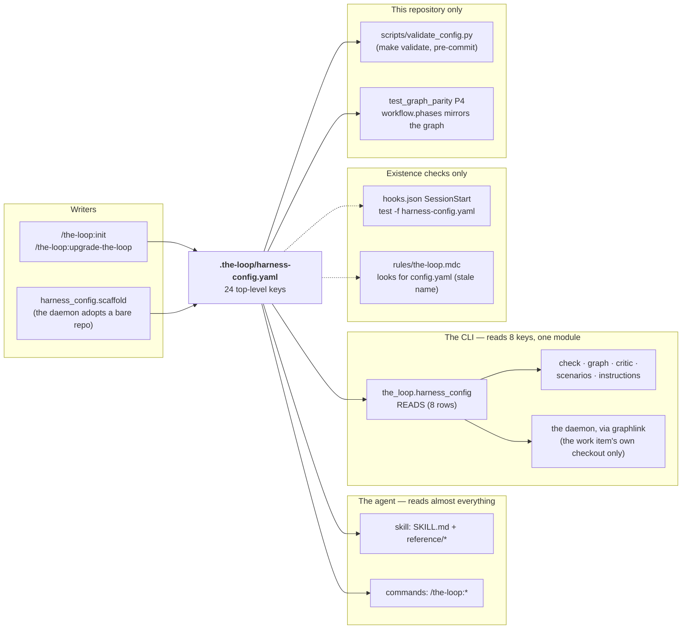

# Is `harness-config.yaml` required? An audit of who reads it

> Produced for [issue-352](https://github.com/MadaraUchiha-314/the-loop/issues/352), which
> asks: which system reads `.the-loop/harness-config.yaml`, how is it enforced, can it be
> removed outright, and if not, which of its keys belong in `cli-config.yaml` so the
> **operator** controls them rather than the repository owner?
>
> **Outcome (PR #353 review, 2026-09-12).** The owner took the audit further than it
> recommended: the CLI now reads **no** key of the harness config at all, and the file
> shrank to the agent's policy — see [decision-123](../decisions/decision-123.md) and
> [the config reference](../config/harness-config.md#what-moved-out-of-it-in-issue-352)
> for what moved where. A second review the same day went further still — *"remove all
> the bs"* — and the policy blocks this report marked **keep** (`autonomy`, `security`,
> `tdd`, `minimalism`, `tokenEconomy`, `selfImprovement`, `contextManagement`,
> `userInteraction`, `externalTools`) left the file too: the behaviour each configured is
> now the skill's fixed rule, and the harness discovers its own tools. The analysis below
> is the state **before** those changes, kept as the record the decisions were made on;
> its follow-ups are now the change itself.
>
> **Conclusion: the file cannot be removed, but it should shrink.** Two of its keys are
> the wrong file's (`reviews.critics[]` and the model ids under `tokenEconomy`), one is a
> mirror of the graph that a test forces to stay a mirror (`workflow.phases`), and a
> handful are read by nothing. The rest is the repository's own policy, read by the agent
> in every session and by the CLI on the repository's behalf — and a consuming
> repository, a cloud session and a bare CI checkout have **no other file** to read it
> from. Each recommended change is listed at the end as its own ticket; this report
> changes nothing.

## The four questions, answered in one table

| Question | Answer |
|---|---|
| Which system reads it? | Four, with very different weight: the **agent** (the skill and every `/the-loop:*` command — the primary reader, for almost every key); the **CLI** (`the_loop.harness_config`, exactly eight keys, declared in `READS`); two **hooks** that only check the file *exists* (Claude's SessionStart hook and Cursor's always-on rule); and this repository's **own tests and CI** (`scripts/validate_config.py`, `test_graph_parity.py`), which no consuming repository runs. |
| How is it enforced? | Three tiers, and only the first is a gate. **Tier 1, code-enforced:** the eight CLI-read keys feed `the-loop check`, the graph's hooks and the Stop hook, so a session cannot advance past what they gate. **Tier 2, prompt-enforced:** every other key is read by the agent following the skill — a rule the model honours, not one the harness checks. **Tier 3, unenforced:** a few keys no code and no prose reads. At read time the CLI validates **nothing** against the schema: `load` parses YAML and degrades any failure to `{}`, and the harness-config schema is not even shipped in the wheel. |
| Can it be removed? | **No.** Seven of the eight CLI-read keys are facts about the repository (where its specs are, its label prefix, its origin repository, the hooks and instruction docs *in its tree*, where its integration tests live, which roles its events concern) that a daemon watching N repositories cannot know without asking each one, and that `the-loop check` needs in a CI checkout with no operator config anywhere. The policy keys are what `/the-loop:init` onboards and what a work item's `overrides:` front matter overrides. Removing the file means moving all of that to prose, and prose has no schema, no onboarding and no per-item override. |
| What moves to `cli-config.yaml`? | `reviews.critics[]` (the executable roster — the operator's harnesses, models and binaries; the *count* stays), the model ids and thinking-effort levels under `tokenEconomy` (the operator's models), `observability.browserLogging` and `localOrchestration.containerRuntime` (tools on the operator's machine). Five keys should simply be deleted, and `workflow.phases` should be derived from the graph rather than declared. Details and the reasoning per key follow. |

## Who reads it



Three facts about that picture matter more than the rest:

1. **The agent is the primary reader, and it reads by prose.** Of the 24 top-level keys,
   the skill and commands name nearly every one; the CLI names 8 (plus `workflow.phases`
   in a test).
   A key the agent reads is enforced exactly as well as the model follows the skill —
   which is the design (the skill *is* the operating model), but it is not a gate, and
   the question "how is it enforced?" deserves that honesty.
2. **The CLI's read surface is small, declared and pinned.**
   [decision-044](../decisions/decision-044.md) answered the *narrow* form of this
   question (issue-121) two months ago: one reader module, a `READS` table naming each key
   and *why it is the repository's to declare*, and `cli/tests/test_harness_config.py`
   holding the code, the schema and the docs to that table in both directions. The
   surface has grown from five keys to eight since (`ticketing.github`, `graph.hooks`,
   `customInstructions`), each with a stated reason.
3. **Nothing validates a consuming repository's file at run time.** `validate_config.py`
   runs in *this* repository's CI against *this* repository's files. In a consuming
   repository the only validation is the editor's `yaml-language-server` modeline and
   whatever `/the-loop:init` did at write time. The CLI's `load` degrades an unparseable
   file to `{}` by design (so `the-loop check` still reports in a half-edited repo), and
   only `the-loop critic` refuses to run on one. A misspelled `workflow.specDir` is
   therefore silently `docs/specs`.

## Every key, its readers, and a verdict

**Legend.** *Enforced:* **gate** = read by the CLI and used by a check/hook that blocks;
**prompt** = read by the agent following the skill; **none** = no reader found.
*Whose:* **repo** = a fact about, or a policy of, the repository; **operator** = a fact
about the machine, harness or model the-loop runs on; **neither** = read by nothing.

| Key | Read by | Enforced | Whose | Verdict |
|---|---|---|---|---|
| `version` | `/upgrade-the-loop` (bookkeeping) | none | repo | keep |
| `ticketing.system` | skill, `/init` | prompt | repo | keep |
| `ticketing.github.owner`/`repo` | CLI (`READS`), skill | gate | repo | keep |
| `ticketing.github.useProjects` | nothing | none | neither | **delete** |
| `repository.*` | skill (`reference/tooling.md`) | prompt | repo | keep |
| `workflow.specDir`, `workflow.phaseLabelPrefix` | CLI (`READS`), skill, every command | gate | repo | keep |
| `workflow.capabilitiesDir`, `workflow.learningsDir` | skill, `/init` | prompt | repo | keep |
| `workflow.phases` | `/init` step 4 (label creation); `test_graph_parity` P4 | pinned to the graph | neither — the graph owns it | **derive, then delete** (see below) |
| `workflow.specApproach` | nothing branches on it; the enum has one value | none | neither | **delete** |
| `workflow.requireHumanReviewPerPhase` | skill (2 mentions) | prompt | repo | review — the graph's approval nodes and `autonomy.tiers` already decide this |
| `tooling.*` | skill (`reference/tooling.md`), `/init` detection | prompt | repo | keep |
| `customInstructions` | CLI (`READS`), skill | gate | repo | keep |
| `testing.integrationTestGlobs` | CLI (`READS`, `scenarios`) | gate | repo | keep |
| `testing.gherkinDocstrings`, `testing.linkRequirements` | skill | prompt | repo | keep |
| `apiSpecs` | skill (1 mention) | prompt | repo | keep |
| `design.uiArtifacts` | skill (`reference/design-artifacts.md`) | prompt | repo | keep |
| `localOrchestration.containerRuntime` | skill (`reference/tooling.md`) | prompt | **operator** | **move** |
| `localOrchestration.remoteServices`, `linkPackagesLocally` | skill | prompt | repo | keep |
| `hooks.*` | skill, `/init` (git-hook wiring) | prompt | repo | keep |
| `graph.hooks` | CLI (`READS`) | gate | repo | keep |
| `observability.devLevel`, `runtimeLevel` | skill | prompt | repo | keep |
| `observability.browserLogging` | skill | prompt | **operator** | **move** |
| `reviews.selfReviewCount`, `criticReviewCount`, `stopOnNoNewFindings`, `escalateOnRepeatFinding` | skill (`reference/reviewing.md`) | prompt | repo | keep |
| `reviews.critics[]` | CLI (`READS`, `critic`), skill | gate | **operator** | **move** (see below) |
| `autonomy.*` | skill | prompt | repo | keep |
| `security.*` | skill (`reference/security.md`) | prompt | repo | keep |
| `tdd.mode` | skill | prompt | repo | keep |
| `minimalism.*` | skill (`reference/minimalism.md`) | prompt | repo | keep |
| `tokenEconomy.modelRouting.tiers.*` (model ids), `tokenEconomy.thinkingEffort.*` | skill (`reference/token-economy.md`) | prompt | **operator** | **move** |
| `tokenEconomy.*` (everything else) | skill | prompt | repo | keep |
| `selfImprovement.*` | skill (`reference/automation.md`) | prompt | repo | keep |
| `contextManagement.*` | skill (`reference/context.md`) | prompt | repo | keep |
| `userInteraction.*` | skill, commands | prompt | repo | keep |
| `notifications` | CLI (`READS`, the graph's `notify` hook) | gate | repo | keep |
| `externalTools` | skill (registry, `/init`) | prompt | repo | keep |

Read down the *Whose* column and the shape of the answer is visible: the file is
overwhelmingly the repository's, with four operator-owned keys embedded in it. The
ticket's instinct about `reviews.critics` is right; its instinct about the file as a
whole is not.

## `workflow.phases` is redundant — and a test makes sure it stays redundant

The ticket says `workflow.phases` is redundant because the graph controls the workflow.
That is exactly correct, and the repository already knows it:

- The CLI never reads `workflow.phases`. It is not in `READS`. `the-loop check`, the
  graph runtime and the label-writing hook all take the phase from the graph node's
  `phase:` field and only the *prefix* from the config.
- `test_graph_parity.py` P4 (issue-148) asserts, for this repository's config, the
  template and the packaged default, that `workflow.phases` lists the graph's phases in
  the graph's order and adds nothing but `not-started`. The graph is the source of truth;
  the config is a **mirror that a test keeps in sync**.
- The only remaining reader is `/the-loop:init` step 4, which creates one label per
  entry. That is a real job, and it is why the key survived issue-148.

The fix is to give `/init` a better source than a hand-maintained list: the CLI already
loads the graph, so `the-loop graph phases` (or an option on `graph show`) printing the
ordered phases lets `/init` create the labels from the graph, `workflow.phases` goes, P4
goes with it, and the three copies of the list (own config, template, packaged default)
stop needing to agree. Note that this is a schema change consuming repositories carry
(`/upgrade-the-loop` should strip the key), and that `workflow.phaseLabelPrefix` stays —
the prefix genuinely is the repository's.

## `reviews.critics[]` is the one CLI-read key that belongs to the operator

Decision-044 kept `reviews.critics[]` in the harness config on the argument that "the
review bar is a property of the project, and the skill reads the same entries". Half of
that argument holds. The other half does not survive a closer look at what an entry
actually *is*:

```yaml
reviews:
  criticReviewCount: 3          # HOW MANY critic rounds — the project's bar
  critics:                      # WHO runs them — an executable on some machine
    - name: aider-review
      harness: aider
      model: gpt-5.5
      command: aider
      args: ["--message-file", "{promptFile}", "--model", "{model}"]
      env: {}
      timeoutSeconds: 900
```

| Consideration | Favours | Why |
|---|---|---|
| **What the entry describes** | operator | A harness that must be installed, a model the operator has access to, a binary on `$PATH`, a timeout for that machine. A repository declaring `harness: cursor` for an operator who has only `claude` produces a round recorded `unavailable` — the file says nothing true about the repository. |
| **Security** | operator | An entry becomes an argv the-loop spawns. In the harness config it is **executable configuration committed to an untrusted checkout** — the reason `.the-loop/harness-config.yaml` is in this repository's own `autonomy.sensitivePaths`, the reason the docs say "review a critic entry like code", and the reason `scaffold` refuses to touch an existing config. In `cli-config.yaml` the same entry is on the operator's machine, in a file the operator wrote, and that whole class of concern goes away — a PR can no longer add a critic. |
| **The CI-checkout argument** (decision-044, point 3) | does not apply | `the-loop check` and `scenarios` must work in a bare checkout; `the-loop critic run` cannot — it needs a harness binary, so it only ever runs where a `cli-config.yaml` can be. |
| **"The skill reads the same entries"** (decision-044, point 2) | neutral | The skill's actual procedure is `the-loop critic list` then `the-loop critic run <name>` — it consumes the *names*, through the CLI. Point the CLI at the CLI config and the skill's text changes by one sentence. |
| **The review bar is the project's** (decision-044, point 1) | repo | True — and it is `criticReviewCount`, `selfReviewCount` and the "a different harness than the one under review" rule. Those stay. |

So the recommendation is a **split, not a wholesale move**: the counts and the rule stay
in `reviews`; the roster moves to a new `critics:` block in `cli-config.yaml`, read by
`the-loop critic` alone. The cost is one real behaviour change to name honestly: a
project can no longer *require* a specific critic. A project that wants that can say so
in prose (`customInstructions`), or a later change can let `reviews` name the *kind* of
critic it needs (`requireDifferentHarness: true`) while the operator supplies the
instance. This refines decision-044 and needs a decision record of its own.

## Why the file cannot go

Take the strongest form of the ticket's question — delete the file, move what the CLI
needs to `cli-config.yaml`, and let the skill carry the policy as prose — and walk the
consequences:

1. **Seven CLI-read keys have nowhere else to live.** `workflow.specDir`,
   `workflow.phaseLabelPrefix`, `ticketing.github`, `graph.hooks`, `customInstructions`,
   `testing.integrationTestGlobs` and `notifications` are per-repository. A daemon
   watching N repositories would need a hand-maintained `OWNER/REPO →` map in one
   machine-scoped file, drifting from each repository the moment one side is edited
   without the other. Decision-044's cardinality argument is intact for these seven.
2. **Two of the CLI's commands run where no `cli-config.yaml` exists.** `the-loop check`
   is the Stop-hook gate and, by design, a CI job (decision-044); `scenarios` is the same. In a bare checkout there
   is no home directory config and no `--config`; the repository's file is the only one
   present.
3. **A cloud session has only the checkout.** This very session is one: no daemon, no
   operator config, a fresh clone. What it knows about how work is done here, it knows
   from `CLAUDE.md` pointing at `harness-config.yaml` and the skill. Remove the file and
   the process in a cloud session is whatever the model remembers.
4. **The onboarding is the schema.** `/the-loop:init` is driven by
   `x-onboarding.groups` in the schema — ten groups, three ask levels, per-key
   descriptions, enums and examples (`reference/onboarding.md`). A policy held as prose
   cannot be onboarded, defaulted, detected or validated.
5. **Per-work-item `overrides:` hang off it.** A work item's front matter overrides a
   subset of these keys for that item alone. The mechanism needs a structured baseline
   to override.
6. **Committing it is the point.** "This project requires three critic rounds and a
   security review" is a statement about the project, reviewed in a PR like any other
   change to how the project is run. An operator's file is not reviewed by the
   repository's owners.

What *is* true is that the file is bigger than its enforced core, and the honest shape of
it after the changes below is: eight CLI-read keys (seven after critics move), a policy
block the agent reads, and nothing about the machine the-loop runs on.

## Candidates to move to `cli-config.yaml`

| Key today | Proposed home | Why it is the operator's |
|---|---|---|
| `reviews.critics[]` | `critics:` (new top-level block) | Executable roster: the operator's harnesses, models, binaries, timeouts. See above. |
| `tokenEconomy.modelRouting.tiers.{economy,standard,frontier}` | `models.tiers` (new), or alongside `critics` | The map from tier to **model id** is which models this operator can run. This repository's own config leaves all three empty with the comment "the-loop dogfoods on whatever model the operator runs" — the value has already declared whose it is. The *stage → tier* map and `riskTierFloor` stay: they are policy. |
| `tokenEconomy.thinkingEffort` | same block | Effort levels are a property of the model the operator runs, not of the project. |
| `observability.browserLogging` | `integrations` or `routing.harnessArgs` | Names an MCP server (`chrome-devtools-mcp`) that is installed on the machine, not in the repository. |
| `localOrchestration.containerRuntime` | `routing` (beside `workspace.gitBinary`) | `podman` vs `docker` is what is installed on the operator's machine; `remoteServices` and `linkPackagesLocally` stay, they describe the project's topology. |

Not candidates, despite looking like machine facts: `tooling.*` (which package manager,
test runner and linter the **project** uses is the project's; it is what `/init` detects
from lock files and CI), `hooks.*` (the project's git hooks), `externalTools` (which
MCPs and skills the project *permits* is policy — whether they are installed is a
runtime check the agent already makes).

## Candidates to delete

| Key | Evidence |
|---|---|
| `workflow.phases` | Read only by `/init` for labels; the graph is the source; P4 pins the mirror. Derive the labels from the graph first (above). |
| `workflow.specApproach` | An enum of one value (`kiro-3-phase`); nothing branches on it. |
| `ticketing.github.useProjects` | No reader in the skill, the commands or the CLI. The Projects integration it anticipated is described in `docs/reports/labels-and-dashboards.md` as a manual setup. |
| `workflow.requireHumanReviewPerPhase` | Two prose mentions. The graph's `*-approval` nodes and `autonomy.tiers` are what actually decide whether a human reviews a phase; a boolean beside them can only disagree with them. Lower confidence than the three above — confirm against the skill's text before removing. |
| `version` | Keep for now: `/upgrade-the-loop` reconciles by `manifest.theLoopVersion`, not this, but the schema names it and migrations may want it. Listed here so the next audit does not re-derive that. |

## Defects found on the way

None of these is the ticket's question, and none is fixed here; each is a one-line
ticket.

1. **The Cursor rule looks for the wrong file.** `rules/the-loop.mdc` checks for
   `.the-loop/config.yaml`, the name retired in issue-82. A Cursor session in a repository
   that ran `/upgrade-the-loop` gets no reminder; one that did not still does. The Claude
   hook has the mirror-image gap: `hooks/hooks.json` tests for `harness-config.yaml`
   only, so a pre-rename repository gets nothing there.
2. **No runtime validation of a consuming repository's harness config.** The CLI ships
   `cli-config.schema.json` and `collaborators.schema.json` as package data
   (`the_loop/schemas/`) and validates the CLI config before writing it (issue-222); the
   harness-config schema is not shipped and `load` never validates. The consequence is
   the silent-default behaviour described above. Whether to ship the third schema and
   warn (not fail) on a schema violation in `the-loop check` is a small, contained
   change.
3. **The template and the packaged default carry no `graph` block.** It is the one
   schema key absent from both; a repository that wants to declare hooks has no
   commented example to uncomment.

## Recommended follow-ups, each its own ticket

| # | Change | Tier | Refines |
|---|---|---|---|
| 1 | Move `reviews.critics[]` to `cli-config.yaml` (`critics:`); `the-loop critic` reads the CLI config; `reviews` keeps the counts; `/upgrade-the-loop` and `migrate-config` extract an existing block for the operator. Decision record refining decision-044. | 4 (schema + executable config) | decision-043, decision-044 |
| 2 | `the-loop graph phases` (or `graph show --phases`); `/init` creates labels from it; drop `workflow.phases` from schema, template, default and this repository's config; retire P4. | 3 | issue-148 |
| 3 | Move the model ids and thinking-effort levels out of `tokenEconomy` into the CLI config; keep the stage → tier policy. | 3 | issue-37 |
| 4 | Delete `workflow.specApproach` and `ticketing.github.useProjects`; decide `requireHumanReviewPerPhase`. `/upgrade-the-loop` strips them. | 2 | — |
| 5 | Move `observability.browserLogging` and `localOrchestration.containerRuntime` to the CLI config. | 2 | — |
| 6 | Fix the two existence checks (Cursor rule name, Claude hook's pre-rename fallback). | 1 | issue-82 |
| 7 | Ship the harness-config schema as package data and have `the-loop check` warn on a violation. | 3 | issue-222 |

Items 1 and 2 answer the ticket's two named examples; 3 to 5 are what the same test
finds when applied to the rest of the file; 6 and 7 are the defects. After all seven, the
file that remains is the one the ticket was really asking for: the repository's policy
and layout, nothing about the operator's machine, with every CLI-read key still declared
in `READS` and still pinned by `test_harness_config.py`.
