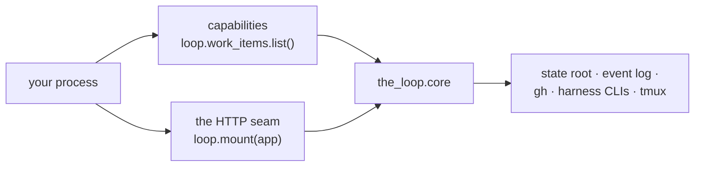

# The Python SDK

`the-loopy-one` ships three ways to run the same code. The CLI is one, the standalone
control-plane service is another, and the **SDK** is the third: the-loop as a component of
a Python process you already have.

```python
from fastapi import Depends, FastAPI
from the_loop.sdk import TheLoop

loop = TheLoop(config_path="/etc/the-loop/cli-config.yaml")

app = FastAPI()
loop.mount(app, prefix="/the-loop", dependencies=[Depends(verify_caller)])
```

That is the whole integration. Your service now serves every `/api/v1` operation
[`the-loop start`](/cli/service) serves — the same router, so the two cannot drift — plus
the MCP endpoint, under your prefix, behind your middleware, inside your process.

## When to use it

| You want | Use |
|----------|-----|
| the-loop on a laptop or a box of its own | [`the-loop start`](/cli/commands/start) — one command, no code |
| the control plane inside a service you already deploy (auth, tracing, one image, one port) | the SDK |
| to drive the-loop from a script, worker or job with no HTTP at all | the SDK's capability namespaces |

The SDK is not a client library: it does not talk to a running service, it **is** the
service's implementation, imported. Nothing is spawned, no port is bound, no HTTP happens
between your code and the-loop.

## Install

```sh
pip install the-loopy-one     # or: uv add the-loopy-one
```

There are no extras to remember — the SDK, the CLI, the service and the MCP layer all
resolve on that one install.

## The two surfaces



### Capabilities — plain method calls

Eight namespaces, each a thin binding over the-loop's core. No HTTP, no subprocess, no
running service:

```python
loop.work_items.list()
loop.graph.check("/srv/checkouts/app", "issue-42")
loop.events.query(types=["session.spawned"], limit=20)
loop.attention.list()
```

Failures are Python exceptions, not status codes: `ValueError` for a caller mistake,
`LookupError` for a resource that is not there. Full list in the
[reference](/sdk/reference).

### The HTTP seam — a router, not a second app

`loop.router()` returns a `fastapi.APIRouter`. Include it wherever you like; it is subject
to your middleware, your dependencies and your OpenAPI document.
[Embedding](/sdk/embedding) is the page for that — read it before mounting on anything
publicly reachable.

## Configuration

Initialising the SDK is naming a [CLI config](/config/cli/):

```python
TheLoop(config_path="/etc/the-loop/cli-config.yaml")   # explicit
TheLoop()                                              # standard resolution order
TheLoop(config={"routing": {...}})                     # a document you assembled
```

That file is the single source for everything the-loop does — who may command the loop,
where sessions are checked out, which binaries are run — exactly as it is for the CLI and
the daemons. Embedding changes nothing about it.

Unlike the CLI, the SDK reads it **strictly**: a missing or unparseable file raises at
construction. A short-lived command that falls back to defaults is being helpful; a
long-lived service that does the same starts with an empty `routing.authorizedUsers`,
which fails closed *invisibly* and looks exactly like a healthy start.

Edits to the file are picked up without a restart — once per request for the HTTP seam,
and on `loop.reload()` for everything else.

## What it expects from the host

the-loop drives other programs: `gh`, a harness CLI, `tmux`, `git`. Which of them your
configuration actually needs is answerable at startup:

```python
report = loop.check_environment()
if not report["ok"]:
    raise SystemExit(report)
```

The full contract — per binary, what it serves, and when it is required — is on
[Environment expectations](/sdk/environment).

## What the SDK does not do

- **Authentication.** The deployment owns auth
  ([decision-059](/decisions/decisions)); the SDK makes attaching yours a parameter.
- **CORS on your app.** Your app's cross-origin policy is yours, and its scope is the
  whole application rather than one router.
- **Process lifecycle.** `loop.status()` reads; `start`/`stop`/`restart` are not on the
  SDK, because inside your service they would be managing the-loop's own processes rather
  than yours.
- **Replacing the binaries with vendor SDKs.** Analysed in
  [the vendor-SDK report](/reports/vendor-sdk-analysis); the binary adapters are what
  ships today.

## Next

- [Embedding in an existing FastAPI app](/sdk/embedding) — prefixes, auth, middleware,
  lifespan, MCP.
- [Environment expectations](/sdk/environment) — what must be on `PATH`, and when.
- [API reference](/sdk/reference) — every public symbol.
