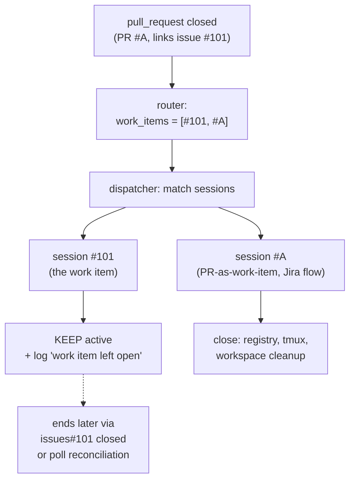

# Design: one work item may be delivered by several PRs

> Phase 2 of 3 (requirements → design → tasks). Derives from the approved
> `requirements.md`.

## Overview

The event → work-item direction is already list-shaped (issue-93): a PR resolves
to **every** issue it links, and those refs travel together in
`RoutedEvent.work_items`. What is not list-shaped is the *close* decision on the
webhook path: `Dispatcher.handle` treats "a PR of this work item closed" as "the
work item ended" and closes every session it matched.

The fix is one predicate, decided from data the dispatcher already holds:

> **A `pull_request` `closed` event ends only the session whose registered ref is
> that PR.** A session registered against an issue the PR is *linked* to is left
> active — the issue's own `closed` event (webhook) or closure reconciliation
> (poll) ends it, both of which already exist and are already per-ref.

`RoutedEvent.work_items` for a PR event is ordered *linked issues first, PR
last* (issue-93), so "is this session the PR itself?" is answered by comparing
the session's ref to the number carried by the event's own PR entity — no API
call, no new field, no config.



## Architecture

Only `cli/the_loop/webhook/dispatcher.py` changes. Everything else in the close
chain is reused unchanged, which is what keeps webhook and poll identical:

| Component | Change |
|-----------|--------|
| `webhook/router.py` | none — already emits the full linked list |
| `sessions/registry.py` | none — per-ref, close is already explicit |
| `webhook/dispatcher.py` | **the close predicate** (below) |
| `webhook/dispatcher.py::_cleanup_workspace` | none — it runs per closed session, so AC6/AC7 fall out of the predicate |
| `poller/poller.py`, `poller/github.py` | none — already per-ref (`closure()` asks about the session's *own* ref, `closure_event` carries `work_items=[ref]`); covered by a regression test |
| guidance + templates | multi-PR wording, execution-log `Pull requests` list |

## Components & interfaces

### `_closing_refs(routed) -> Optional[set[str]]` (new, module-level, pure)

The refs an event is allowed to end, or `None` when the event is not a close.

```python
def _closing_refs(routed: RoutedEvent) -> Optional[Set[str]]:
    """Refs this close event may end — the object that actually closed.

    An ``issues`` close ends that issue. A ``pull_request`` close ends only the
    PR itself: a work item may be delivered by several PRs (issue-101), so one
    of them closing says nothing about the item, whose own close event ends it.
    """
```

- `issues`/`closed` → `{the issue's ref}` (identical to today: the event's only
  work item **is** the issue).
- `pull_request`/`closed` → `{the PR's own ref}`, built from
  `payload["repository"]["full_name"]` + `payload["pull_request"]["number"]` —
  the same two fields `extract_work_items` reads, so a malformed payload yields
  an empty set and closes nothing (fail-safe: keep state).
- anything else → `None`.

Implemented next to `_is_close_event` / `_close_reason`, which it replaces at the
call site while they stay for the reason string and the "never spawn / never
prompt" guard.

### `Dispatcher.handle` — the close branch

```python
if _is_close_event(routed):
    reason = _close_reason(routed)
    closing = _closing_refs(routed)
    for session in matched:
        if session.work_item.ref not in closing:
            logger.info(
                "%s %s but %s is still open; leaving its session active "
                "(a work item may have several PRs)", ...)
            eventlog.emit("session.kept_open", ...)
            continue
        ...close exactly as today...
    return
```

Unchanged in that branch: a close never spawns, never enqueues, never renders a
prompt; per-session tmux/workspace handling; `session.autoclosed`.

### Guidance & templates

- `skills/the-loop/templates/execution-log.md` — a **Pull requests** table
  (`PR | Scope / tasks | Status`) next to the phase-transition table, so the
  per-work-item record lists *all* delivery vehicles (AC9).
- `commands/work-on.md`, `commands/execute-tasks.md` — label **every** PR of the
  item and record it in the log; `commands/finish-tasks.md` — verify every listed
  PR is merged/closed before completing.
- `skills/the-loop/reference/automation.md`, `docs/capabilities/webhook-triggers.md`,
  `cli/README.md` — the corrected end condition and its consequence.

## UI/UX design

N/A — CLI daemon behaviour, docs and templates. No user-facing surface.

## Data models

None added. No registry field, no config key, no schema change: the "list of PRs
for a work item" is *derived* (each PR links back to the issue) rather than
stored, which is why nothing has to be migrated or kept in sync.

## Error handling

| Failure | Behaviour |
|---------|-----------|
| PR-close payload missing `repository`/`pull_request.number` | `_closing_refs` returns an empty set → nothing is closed, warning-free info log; the item ends later via its own close/reconciliation |
| A close matches only linked-issue sessions | `session.kept_open` in the event log + an INFO line naming the PR and the work item — never silence |
| `issues` event type not enabled in `webhooks.ghWebhook.events` | the existing **startup/hot-reload warning** already covers it (a work item that ends would never be seen); now it is also the only webhook path that ends a multi-PR item, so the warning text is reused as-is |
| A PR merges without closing its ticket | session stays active by design (AC1); recoverable with `the-loop sessions close`, and the poller ends it as soon as the ticket closes |

## Security design

- **AuthN/AuthZ:** unchanged. HMAC verification (webhook) and the
  authorized-actor guard run before dispatch; the lifecycle-close bypass
  (issue-94) is unchanged in *scope* and **narrowed in effect** — a close can now
  only ever end the session for the object that closed, so a hostile
  `Closes #N` in a PR body can no longer end `#N`'s session (abuse case 1).
- **Input validation & injection surfaces:** `_closing_refs` reads two fields
  already parsed by the router and coerces the number with `int()`; a
  non-integer/missing value yields no ref. Close events are still never rendered
  into a harness prompt, so no prompt-injection surface is added.
- **Secrets handling:** none touched; no new network call, so no credential is
  needed for the decision.
- **Least privilege:** strictly fewer side effects than today (fewer closes,
  fewer workspace deletions).
- **Fail-closed behaviour:** here "closed" means *preserving state* — under any
  ambiguity the session and its checkout are kept, and the recoverable manual
  action (`sessions close`) replaces an unrecoverable deletion.
- **Abuse-case coverage:** abuse case 1 → the ref-equality predicate → test
  `test_pr_close_does_not_close_the_linked_issues_session`; abuse case 2 →
  unchanged never-spawn guard → existing `test_dispatcher_pr_close_never_spawns`.

## Testing strategy

Unit (`cli/tests/test_routing.py`), against AC1–AC7:

| Test | AC |
|------|----|
| `test_pr_close_leaves_the_linked_issues_session_active` (replaces the old `test_dispatcher_auto_closes_session_on_pr_close`) | AC1, AC3 |
| `test_pr_close_closes_a_session_registered_against_the_pr_itself` | AC4 |
| `test_second_pr_close_ends_nothing_while_the_issue_is_open` (two PRs on one item) | AC1 |
| `test_issue_close_still_closes_the_work_items_session` (existing) | AC2 |
| `test_pr_close_does_not_clean_the_work_items_workspace` | AC6 |
| `test_pr_close_cleans_its_own_sessions_workspace` | AC7 |
| `test_close_reason_names_why_the_work_item_ended` (existing) | AC5 |

Integration (Gherkin docstrings, `Requirement:` back-links):

- `cli/tests/test_webhook_routing_integration.py` — *Scenario: the work item's
  session survives its first PR merging*: signed `pull_request` `closed` webhook
  for a PR linked to the issue → the issue's session is still `active`; a
  subsequent signed `issues` `closed` webhook ends it.
- `cli/tests/test_poller_integration.py` — *Scenario: a merged PR does not end
  its still-open work item on the poll path*: the PR disappears from the listing
  while the issue is still listed → reconciliation closes nothing (regression
  guard for findings C–E).

Evidence: `make check` (ruff, ruff format, pyright, config validation, pytest)
before and after, recorded in the execution log.

## Trade-offs & decisions

1. **Ref-equality over an API lookup.** Asking GitHub "is the linked issue still
   open?" would let a PR merge close a genuinely finished item immediately, but it
   costs a credentialed API call per close on a path that is deliberately
   payload-only. The ticket's own close event arrives moments later anyway (GitHub
   fires it when `Closes #N` merges), so the lookup buys latency, not correctness.
2. **No compatibility flag.** For a single-PR item that closes its issue the
   observable difference is the ordering of two webhooks; for one that does not,
   today's behaviour is simply wrong. A knob would preserve a data-losing default
   (minimalism ladder → don't add the option).
3. **Derive the PR list, don't store it.** A `linkedPRs` array in the session
   registry would need writes on every PR open/close and would drift; the linkage
   already lives on the PR side and is read on every event.
4. **Keep `_is_close_event`/`_close_reason`.** They still express "never spawn,
   never prompt" and the reason string; the new predicate answers a different
   question (*which* session ends).

Durable decision recorded as
[decision-039](../../decisions/decision-039.md).

## Open questions

None.
