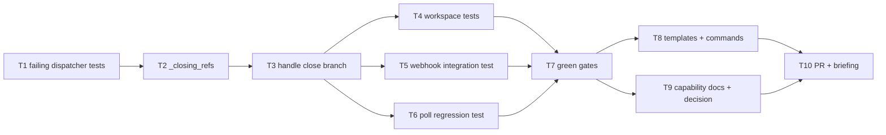

# Tasks: one work item may be delivered by several PRs (issue-101)

> Phase 3 of 3. Derived from the locked `design.md`. TDD (`tdd.mode: standard`):
> the failing test comes first for every behavioural task.

## DAG

## Tasks

- [x] **T1 — Failing dispatcher unit tests** (`cli/tests/test_routing.py`): a PR
  close leaves the linked issue's session active and delivers nothing; a PR close
  closes a session registered against the PR's **own** ref; a second PR closing
  ends nothing while the issue is open; the issue's own close still ends it.
  *(AC1–AC5)*
- [x] **T2 — `_closing_refs(routed)`** in `cli/the_loop/webhook/dispatcher.py`:
  pure, payload-only, `issues` → the issue's ref, `pull_request` → the PR's own
  ref, malformed payload → empty set. *(AC1, AC4)*
- [x] **T3 — Close branch of `Dispatcher.handle`**: skip a matched session whose
  ref is not in `_closing_refs`, logging it and emitting `session.kept_open`;
  everything else in the branch unchanged (never spawn, never prompt). *(AC1,
  AC3, AC5)*
- [x] **T4 — Workspace tests**: a PR close does not clean the work item's
  checkout; the closing PR's own session still does. *(AC6, AC7)*
- [x] **T5 — Webhook integration test** (`test_webhook_routing_integration.py`,
  Gherkin + `Requirement:` link): *the work item's session survives its first PR
  merging*, and the later `issues` `closed` webhook ends it. *(AC1, AC2)*
- [x] **T6 — Poll-path regression test** (`test_poller_integration.py`, Gherkin +
  `Requirement:` link): a merged PR vanishing from the listing while the issue is
  still listed closes nothing — guards findings C–E against regression. *(AC1,
  AC2)*
- [x] **T7 — Green gates**: `make check` from the repo root (ruff, ruff format,
  pyright, config validation, pytest) + `markdownlint` (`hooks.prePush` parity).
- [x] **T8 — Templates & commands**: `execution-log.md` template gains the
  **Pull requests** list; `work-on.md` / `execute-tasks.md` label and record
  **every** PR; `finish-tasks.md` verifies all of them before completing. *(AC8,
  AC9)*
- [x] **T9 — Docs & decision**: `docs/capabilities/webhook-triggers.md` (current
  behaviour + history row), `docs/capabilities/spec-workflow.md` (the PR list in
  the execution log), `skills/the-loop/reference/automation.md`, `cli/README.md`,
  and `docs/decisions/decision-039.md` + index. *(AC10)*
- [x] **T10 — PR + reviewer briefing** from
  `skills/the-loop/templates/pr-briefing.md`; phase label → `loop:needs-review`.
