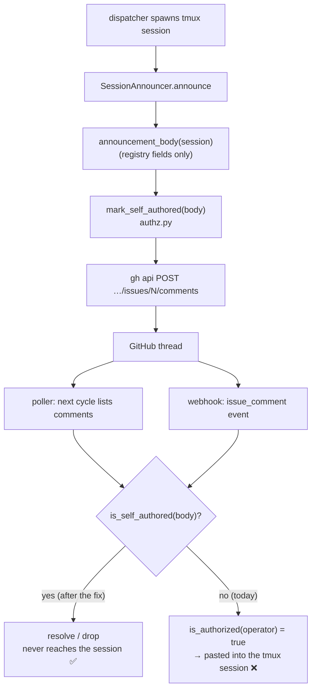

# Design: one helper marks every body the-loop posts

> Phase 2 of 3 (bugfix → design → tasks). Derives from the approved bugfix spec.

## Overview

The marker already exists (`the_loop.authz.SELF_COMMENT_MARKER`) and both
trigger paths already check it (`is_self_authored`). What is missing is a
**producer-side counterpart** to that consumer-side check, living next to it:

1. **`authz.py`** gains `SELF_COMMENT_ATTRIBUTION` (the visible line) and
   `mark_self_authored(body)` — the single, idempotent way to stamp a body
   the-loop wrote. It sits beside `is_self_authored`, so the writer and the
   reader of the marker are the same 30 lines of code and can never drift.
2. **`announce.py`** returns `mark_self_authored(...)` from `announcement_body`,
   which is the only comment body the CLI posts today.

Nothing else changes. The poller and the router already drop marker-carrying
comments (`poller.py:469`, `router.py:309`), so AC5/AC6 are satisfied by the
body changing — not by new routing logic.



## 1. `authz.py` — the producer half of the marker contract

```python
SELF_COMMENT_ATTRIBUTION = "🤖 _the-loop, autonomous comment_"


def mark_self_authored(body: str) -> str:
    """``body`` stamped as the-loop's own: visible attribution + the marker.

    Idempotent — a body that already carries the marker is returned unchanged.
    Apply ONLY to text the-loop itself composed (never to payload-derived or
    another author's text): the marker asserts authorship, and the trigger paths
    silently drop whatever carries it.
    """
    if is_self_authored(body):
        return body
    return f"{body.rstrip()}\n\n{SELF_COMMENT_ATTRIBUTION}\n{SELF_COMMENT_MARKER}\n"
```

Design points:

- **Placement.** In `authz.py`, immediately after `is_self_authored`. The
  invariant "what we write is what we recognise" is then local and obvious; a
  helper in `announce.py` would make the next posting site re-derive it (the
  structural root cause the bugfix spec names). This is the minimalism ladder's
  *reuse-what-exists* rung: no new module, no new dependency, one function.
- **Idempotence (AC3).** Guarded by the same `is_self_authored` predicate the
  consumers use, so "already marked" means exactly what the router means by it.
- **Ordering inside the body.** Visible attribution first, invisible marker
  last, matching `reference/collaboration.md` ("appended after a blank line") and
  what the harness already emits. `rstrip()` normalises bodies that do or don't
  end in a newline, so there is exactly one blank line before the attribution.
- **Signature.** `str -> str`, pure, no I/O — trivially testable and impossible
  to fail in a way that could affect a dispatch.
- **What it is not (AC4).** It is not applied anywhere near payload data. The
  only call site is a body built from registry fields; the docstring states the
  rule so a future caller does not launder foreign text through it.

## 2. `announce.py` — mark the one body the CLI posts

`announcement_body` gains a single wrapping call:

```python
    return mark_self_authored(
        f"🖥️ **the-loop** started an interactive session for `{ref}`.\n"
        ...
        f"{note}\n"
    )
```

The rendered comment is unchanged except for the two trailing lines (AC2).
`SessionAnnouncer._argv` already posts whatever `announcement_body` returns, so
no other change is needed; the module docstring gains a sentence recording that
the body is self-marked and why.

## 3. Components and interfaces

| Component | Change |
|-----------|--------|
| `the_loop.authz` | **new** `SELF_COMMENT_ATTRIBUTION`, `mark_self_authored`; exported alongside the existing marker/predicate |
| `the_loop.announce.announcement_body` | wraps its return value in `mark_self_authored` |
| `the_loop.poller.poller` | none — already drops self-marked comments |
| `the_loop.webhook.router` | none — already drops self-marked events |

## 4. Data model

None. The marker is a fixed literal already shipped
(`<!-- the-loop:agent-comment -->`); `SELF_COMMENT_MARKER` must never change so
older comments stay recognisable, and this change does not touch it. No config
key, no registry field, no schema change.

## 5. Error handling

`mark_self_authored` is pure string work over a self-composed body: no failure
mode beyond a `TypeError` on a non-`str`, which is a programming error, not a
runtime condition. The announcement path keeps its best-effort posture
unchanged — every `gh` failure remains a logged no-op that never affects the
dispatch.

## 6. Testing strategy

| Test | Covers |
|------|--------|
| `mark_self_authored` appends attribution + marker; `is_self_authored` then true | AC1 |
| applying it twice yields exactly one marker (byte-equal to one application) | AC3 |
| `announcement_body(session)` is `is_self_authored`, and still contains the tmux target, harness, both attach commands and the retention note | AC2 |
| poller integration: a work item whose thread contains the announcement forwards nothing to the session (Gherkin docstring + `Requirement:` link) | AC5, AC7 |
| router: an `issue_comment` event carrying the announcement body is dropped before dispatch | AC6 |

The two path-level tests are the regressions that fail before the change: with
an unmarked announcement the poller forwards it and the router dispatches it.

Existing coverage stays green: `cli/tests/test_announce.py` asserts on the body's
content, and the appended lines do not disturb those assertions (they are
`in`-checks, not equality).

## 7. Security design

The bugfix spec's boundary is *self-reply ingestion*; this design enforces it at
the **producer** rather than adding a new consumer-side heuristic:

- **The check and the stamp are one unit.** `is_self_authored` (consumer) and
  `mark_self_authored` (producer) share a module and a constant, so a future edit
  cannot mark bodies in a form the trigger paths no longer recognise.
- **Least authority for the helper.** Pure, `str -> str`, no config, no I/O, no
  subprocess. It cannot widen routing, cannot fail open, and cannot be reached by
  untrusted input on any current path.
- **No laundering (AC4).** Documented and enforced by call-site discipline: the
  sole caller composes its body from registry fields already validated
  (`_NAME_RE` on owner/repo, the regex-sanitised `loop-<slug>` tmux target).
  Marking is deliberately *not* applied in `_argv` or in a generic posting
  wrapper that could one day be handed payload text.
- **The marker remains non-authorizing.** Anyone may type it; the only effect is
  that the-loop ignores that comment. `routing.authorizedUsers` is untouched and
  still runs, in the same order, on both paths.
- **Fail-closed direction.** The change strictly *reduces* what re-enters a
  session. Its worst-case failure — the marker not being appended — is exactly
  today's behaviour, not a new exposure.
- **Abuse case as a test.** The poller regression (AC5) is the negative test
  proving the boundary: the-loop's own announcement fed back through the ingress
  must be resolved, never delivered.

## 8. Minimalism

One function (six lines) and one constant, reusing the module, the marker and
the predicate that already exist; the alternative — a posting wrapper class or a
per-call-site literal — either adds an abstraction with one implementation or
re-creates the very drift this bug is. No new dependency, no config surface.

## 9. UI/UX artifacts

None — CLI/daemon change with no user-facing surface (`design.uiArtifacts`
applies to user-facing work items only). The one visible effect is the
attribution line at the foot of the announcement comment, shown verbatim above.
