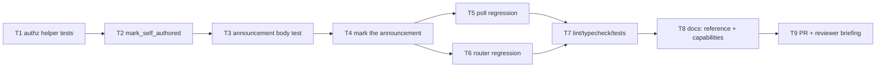

# Tasks: mark every body the-loop posts (issue-104)

> Phase 3 of 3. Derived from the locked `design.md`. TDD (`tdd.mode: standard`):
> the failing test comes first for every behavioural task.

## DAG

## Tasks

- [x] **T1 — Failing `authz` unit tests** (`cli/tests/test_poller.py`, beside the
  existing `is_self_authored` cases): a marked body carries the visible
  attribution *and* the marker and satisfies `is_self_authored`; marking twice is
  byte-identical to marking once; the original text survives verbatim. *(AC1, AC3)*
- [x] **T2 — `SELF_COMMENT_ATTRIBUTION` + `mark_self_authored`** in
  `cli/the_loop/authz.py`, immediately after `is_self_authored`, with the
  "only ever on text the-loop composed" rule in the docstring. *(AC1, AC3, AC4)*
- [x] **T3 — Failing announcement test** (`cli/tests/test_announce.py`):
  `announcement_body(session)` is `is_self_authored`, and still contains the tmux
  target, harness name, both attach commands and the retention note. *(AC2, AC7)*
- [x] **T4 — Mark the announcement**: `announcement_body` returns
  `mark_self_authored(...)`; module docstring records why. *(AC1, AC2)*
- [x] **T5 — Poll-path regression** (`cli/tests/test_poller_integration.py`,
  Gherkin docstring + `Requirement:` link): a known work item whose thread gained
  the-loop's own announcement forwards **nothing** into the session and resolves
  the comment. Fails before T4. *(AC5, AC7)*
- [x] **T6 — Webhook-path regression** (`cli/tests/test_routing.py`): an
  `issue_comment` event whose body is the announcement is dropped before
  dispatch. Fails before T4. *(AC6, AC7)*
- [x] **T7 — Full gate from the repo root**: `ruff check`, `ruff format --check`,
  `markdownlint`, `pyright`, `pytest`. Record the red→green evidence in the
  execution log. *(AC7)*
- [x] **T8 — Documentation**: `skills/the-loop/reference/collaboration.md`
  (the rule covers the CLI daemon's own comments, not only harness replies),
  `docs/capabilities/webhook-triggers.md` and
  `docs/capabilities/interactive-sessions.md` (current behaviour + history rows).
  *(AC8)*
- [x] **T9 — PR + reviewer briefing** from
  `skills/the-loop/templates/pr-briefing.md`; execution log finalised; label →
  `loop:needs-review`. *(ready-to-ship gate)*

## Verification

Every task's evidence is its test command's red→green transition, recorded in
`execution-log.md`. The work item is ready to ship when the full gate above is
green, the capability docs are updated in this same PR, the security review is
recorded, and the briefing is posted.
