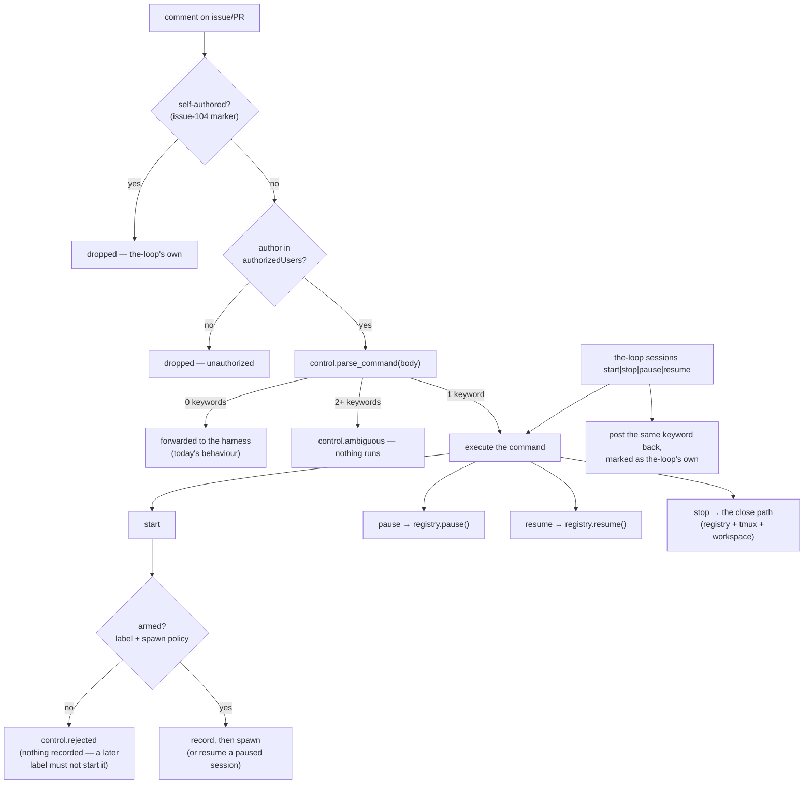

# Design: authorized execution control (start/stop/pause/resume) + one state root

> Phase 2 of 3 (requirements → design → tasks). Derives from `requirements.md`.

## Overview

Five seams, one new module each side of the boundary and no new dependency:

1. **`the_loop/control.py`** (new) — the vocabulary and its durable record:
   `ControlConfig` (the config mirror), `parse_command()` (body → one of four
   enum values, or nothing), `command_comment()` (the body the CLI posts) and
   `ControlStore` (per-work-item JSON under `<sessions>/control/`). Pure and
   stdlib-only, so both ingress paths and the CLI share exactly one
   implementation (R1.5).
2. **`the_loop/sessions/registry.py`** — `paused` becomes a first-class status:
   `pause()`/`resume()`, "live" = `active | paused` for lookups (R3.1, R3.7).
3. **`the_loop/webhook/dispatcher.py`** — one interception point at the top of
   `handle()`: a recognised command is *executed*, never forwarded; the spawn
   gate additionally requires a start request; a paused session drops deliveries.
4. **`the_loop/poller/poller.py`** — the poll path stops arming presence spawns
   for items nobody started, so `requireStartCommand` does not burn the issue-80
   retry budget on refused spawns.
5. **`the_loop/state.py`** (new) + `commands/sessions_cmd.py` — one configured
   root supplies every generated-path default (R5), and the CLI grows
   `start|stop|pause|resume` that apply the same command and post the same
   keyword back to the ticket (R4).



## 1. The control vocabulary (`the_loop/control.py`)

### Config mirror

```python
@dataclass(frozen=True)
class ControlConfig:
    enabled: bool = True
    require_start_command: bool = True     # the label is necessary, not sufficient
    keywords: Dict[str, str] = ...         # command -> keyword
    gh_binary: str = "gh"                  # for the CLI's paper-trail comment
```

Defaults (R1.1): `start` → `the-loop:start-execution`, `stop` →
`the-loop:stop-execution`, `pause` → `the-loop:pause-execution`, `resume` →
`the-loop:resume-execution`. Built by `from_mapping` like every other config
mirror, so it hot-reloads with `RoutingConfig` (R6.1). A keyword configured
empty disables *that* command only.

### Parsing

```python
COMMANDS = ("start", "stop", "pause", "resume")

def parse_command(body: Optional[str], config: ControlConfig) -> ControlResult:
    """One of four commands, `ambiguous`, or nothing."""
```

- **Whole-token match** (R1.3): each keyword is matched by a regex built from
  `re.escape(keyword)` with a `(?<![\w:-])` / `(?![\w:-])` boundary pair, so a
  trailing `.`/`,`/`)`/newline still matches while `xthe-loop:start-executionx`
  or `the-loop:start-execution-later` does not. Case-insensitive.
- **Ambiguity is refusal, not precedence** (R1.4): the parser collects the set
  of *distinct* commands present; two or more yields
  `ControlResult(ambiguous=True)` and the caller executes nothing **and forwards
  nothing** — a comment that half-says "stop" must not reach the agent as
  instructions either. The same keyword repeated is not ambiguous.
- Pure and side-effect free: it never sees a work item, a path or a harness, and
  it returns an **enum-shaped string**, never text lifted from the body. This is
  what keeps the new "comment text → daemon action" boundary narrow (see the
  requirements' threat model).

The one deliberate asymmetry: fenced code blocks are *not* stripped. Matching is
literal and documented, so a keyword quoted in a code block still counts —
consistent with GitHub's own closing-keyword behaviour, and far easier to reason
about than a half-markdown parser. It is only reachable by an authorized user.

### Durable control record

```python
@dataclass
class ControlRecord:
    ref: str
    command: str          # start | stop | pause | resume
    source: str           # comment | cli
    actor: str = ""       # GitHub login, or the OS user for a CLI action
    requested_at: str = ""
    note: str = ""        # e.g. the comment url

class ControlStore:               # <sessions dir>/control/<slug>.json
    def record(self, ref, command, source, actor="", note="") -> ControlRecord
    def get(self, ref) -> Optional[ControlRecord]
    def start_requested(self, ref) -> bool     # last command was start/resume
    def clear(self, ref) -> None               # on close
```

Same storage shape as the session registry (file per work item, tempfile +
`os.replace`, stdlib JSON), for the same reasons: human-inspectable, no
contention between concurrent sessions. It answers exactly one question for the
dispatcher — *did an authorized user ask for this work item to be running?* —
and it is what makes a start request survive a restart (R2.5) and a control
command land on a work item that has no session yet (R3.6).

`start_requested` is true when the **last recorded** command is `start` or
`resume`; `stop`/`pause` clear the arming. So a stop is durable too: a labelled
item that was stopped does not re-spawn on the next event.

**Arming commands are recorded only when they act** (owner decision on PR #107).
A `start` on a work item that is not armed is refused *before* anything is
written, so labelling it afterwards does not start it — otherwise the label
would still be the trigger, one event later. The same holds for a `resume` with
nothing to resume, and for a CLI `start` whose spawn fails (the record is
cleared again). Disarming commands are the mirror image: `pause`/`stop` are
recorded whether or not there was anything to act on, because forgetting them is
the unsafe direction.

## 2. Registry: `paused` is a live status

```python
LIVE_STATUSES = ("active", "paused")

class SessionRegistry:
    def find_by_work_item(self, ref, include_closed=False) -> Optional[Session]:
        # returns active AND paused sessions (live); closed only on request
    def pause(self, ref) -> Optional[Session]
    def resume(self, ref) -> Optional[Session]
```

Widening `find_by_work_item` to "live" rather than adding a parallel lookup is
what makes R3.7 free: every existing caller that asks "is there a session for
this item?" — the duplicate-registration guard, the dispatcher's matching, the
poller's `has_session`, closure reconciliation — now correctly counts a paused
session as one. The places that must distinguish are few and explicit:

| Caller | Behaviour with `paused` |
|---|---|
| `Dispatcher.handle` (delivery) | drop with `dispatch.dropped` / `session-paused` (R3.2) |
| `Dispatcher.handle` (close event) | close it exactly like an active one (R3.8) |
| `Dispatcher._on_unmatched` | never reached — a paused session *is* a match |
| `registry.register` | still a duplicate → `force` required (R3.7) |
| `sessions list --status` | gains `paused` as a filter value |

`close()` closes a live session of either status. `pause()`/`resume()` are
no-ops returning `None` when there is nothing live to act on, and emit
`session.paused` / `session.resumed` (R6.2).

## 3. Dispatcher: interpret, then gate

### Interception (R1.2)

At the top of `handle()`, after dedup and before matching:

```python
command = self._control_command(routed)      # None when disabled/absent
if command is ambiguous: emit control.ambiguous; return
if command: self._apply_control(command, routed); return
```

`_control_command` reads the body via the router's existing
`event_body(event, payload)` helper — the same function the self-marker check
uses — so both ingress paths are covered by construction (the poller's
`comment_event` synthesises exactly that payload shape). The actor comes from
`event_actor`, already verified by the guard upstream; the work item comes from
`routed.work_items`, never from the body.

`_apply_control` is a small table:

- **start** → if a live session exists, `resume` it (R3.5) or no-op when already
  active; else check the spawn policy and label gate **first** and refuse with
  `control.rejected` when the item is not armed (R2.4) — recording nothing — and
  only then record the request and run the normal unmatched path
  (`_on_unmatched`).
- **pause** → `registry.pause()`; nothing to pause is a recorded no-op (R3.6).
- **resume** → `registry.resume()`.
- **stop** → the existing close path, factored out of the close-event branch
  into `_close_session(session, reason="stopped")`: `registry.close()`,
  `_close_tmux()` (which terminates the harness per issue-94) and
  `_cleanup_workspace()` (R3.4).

Every branch emits `control.command` with `command`, `source`, `actor` and the
`effect` it had (`spawned`/`resumed`/`paused`/`stopped`/`noop`), or
`control.rejected` with a reason.

### The spawn gate (R2.1–R2.4)

```python
def _should_spawn(self, routed) -> bool:
    if not self._policy_allows(routed):        # never | always | labeled+label
        return False
    if not self.config.control.require_start_command:
        return True                            # pre-#106 behaviour (R2.6)
    # a start carried by THIS event satisfies the requirement directly; the
    # durable record is only consulted for later events (poll retry, redelivery)
    return control_command == START or self.store.start_requested(ref)
```

Two refinements fall out of it:

- The label check becomes `routed.labeled or event_carries_label(payload,
  auto_execute_label)`. The router sets `labeled` from the payload for webhook
  events, but the poller hard-codes `labeled=False` on **comment** events — and
  a start comment is exactly the event that must now spawn. Recomputing from the
  payload (which carries the item's labels on both paths) makes the gate ingress-
  agnostic instead of ingress-dependent.
- `spawnOnUnmatched: always` still consults the start requirement (R2.2):
  "always" is about *which items*, the start command is about *who asked*.

### Delivery gate (R3.2)

A matched session whose status is `paused` is dropped before enqueue with
`dispatch.dropped` / `session-paused`. Its delivery id stays marked in the
deduper (it is *not* released for retry): a pause is a deliberate suppression,
not a transient failure, so redelivering the event later — or every poll cycle
until the retry budget is spent — would be noise. Nothing is replayed on resume
either (R3.3): the harness reads the thread itself, which is the same contract
the receiver already has for events that predate a session.

## 4. Poller: don't arm what nobody started

`Poller._try_spawn` is the poll path's spawn trigger, and issue-80 gives it a
retry budget: three refused presence dispatches per item, then a terminal
`poll.spawn_failed`. With `requireStartCommand` on, **every** labelled item
nobody has started would burn that budget and log an error every cycle.

So the poller gets the same `ControlConfig` + `ControlStore` the dispatcher has
and skips arming presence entirely while a start has not been requested:

```python
if self.control.require_start_command and not self.store.start_requested(ref):
    # a start comment arrives as a normal comment event and spawns through
    # the dispatcher's unmatched path — presence must not try meanwhile
    return
```

Comments continue to be forwarded exactly as today, which is what carries the
start command to the dispatcher (`comment_event` → `_on_unmatched` → spawn).

## 5. One state root (`the_loop/state.py`)

```python
@dataclass(frozen=True)
class StateLayout:
    root: str = ".the-loop"

    @property sessions_dir  -> "<root>/sessions"
    @property control_dir   -> "<root>/sessions/control"
    @property poll_state    -> "<root>/sessions/poll-state.json"
    @property event_log     -> "<root>/logs/events.jsonl"
    @property pidfile       -> "<root>/gh-webhook.pid"

def layout_from_config(cli_config: dict) -> StateLayout   # reads `state.root`
```

**The root supplies defaults only** (R5.3). Every consumer keeps reading its own
configured key first and falls back to the layout when it is unset — so an
existing `cli-config.yaml` with explicit paths behaves byte-identically, and a
config with none of them relocates everything by setting one value. That is also
why nothing is migrated on disk: with the default root, three of the four
defaults resolve to the pre-#106 paths.

The fourth is the poll state, which moves from `.the-loop/poll-state.json` to
`<root>/sessions/poll-state.json` (R5.5, the "consolidate session tracking under
`sessions/`" ask). Losing it silently would re-baseline every watched thread and
re-forward its whole comment history, so `resolve_poll_state_path()` keeps the
legacy file when it exists and the new one does not, warning once with the new
location (R5.4). Explicit config still wins over both.

## 6. CLI: `the-loop sessions start|stop|pause|resume`

One shared implementation (`_control_action`) behind four thin sub-parsers:

1. parse the ref, load the routing + control config;
2. apply the command locally — the *same* code the dispatcher runs, reached by
   building a dispatcher from the config and handing it a synthesised
   `RoutedEvent` for `start` (so the spawn goes through workspace checkout,
   harness trust, the configured runner and the announcement — R4.5), and by
   calling the registry directly for pause/resume/stop;
3. record it in the `ControlStore` with `source="cli"`;
4. post the paper-trail comment (R4.2–R4.4): the *same keyword* plus a line
   saying it came from the CLI, marked with `authz.mark_self_authored` so no
   ingress path reads it back. `--no-comment` skips it; a `gh` failure warns.

The comment is posted through a new `the_loop/comments.py` helper
(`post_issue_comment`) — the third `gh`-shelling site after `reactions.py` and
`announce.py`, and the point at which the shared piece is worth extracting.
`SessionAnnouncer` is refactored onto it, keeping its injectable `runner`.

`sessions list` gains a `Control` column (last command + source) and accepts
`--status paused` (R4.6).

## Security design

Enforcing the requirements' trust boundaries, in the order the code enforces
them:

1. **Self-marker before everything.** `is_self_authored` is checked by the
   router/poller *before* authorization, and control parsing happens after both.
   The CLI's own comment therefore cannot re-enter as a command (R4.3) — the
   issue-104 contract, now load-bearing for control as well as for prompts.
2. **`authorizedUsers` unchanged and unbypassed.** Control parsing lives in the
   dispatcher, downstream of the router's/poller's guard, so an unauthorized
   comment never reaches it (R1.6). No new config can widen the allowlist; an
   empty one still means nothing human-authored is acted on (R2.7). The control
   path then re-checks, **more strictly than the ingress guard**: it requires a
   *named* login in the allowlist, because `is_authorized` intentionally permits
   an actor-less action (CI events) and a comment can reach the dispatcher
   without an author — a deleted account's comment on the poll path. That was
   harmless when a comment could only become agent input; it is not once a
   comment can start or stop a session, so the control path fails closed and
   records `control.rejected` / `unauthorized-actor`. *(Found by the security
   review on this branch.)*
3. **Fixed vocabulary, enum output.** `parse_command` returns one of four
   constants or nothing. No substring of a comment reaches an argv, a path, a
   prompt template or a work-item ref; the ref acted on is the router's own
   extraction. A control comment is *consumed*, so it is never rendered into a
   harness prompt either.
4. **The start path strictly tightens.** Everything that gated a spawn before
   still gates it, plus the explicit request. The default (`requireStartCommand:
   true`) is the fail-closed one; the only way to loosen it is an explicit
   config change, documented as such.
5. **Bounded blast radius for the other three.** stop/pause/resume act only on a
   session that already exists for the work item the event resolved to, and only
   ever reduce or restore activity. `stop` reuses the audited close path, so the
   harness is terminated exactly as a merge would terminate it (issue-94).
6. **Everything is recorded.** `control.command` / `control.rejected` /
   `control.ambiguous` carry actor, source and effect, so the event log answers
   "who started this run?" — which is the question #106 exists to make
   answerable.

## Testing strategy

- **Unit** — `control.parse_command` (each keyword, token boundaries, case,
  ambiguity, disabled, custom keywords); `ControlStore` round-trip and
  `start_requested` transitions; registry `pause`/`resume`/live-lookup;
  `StateLayout` defaults + legacy poll-state fallback; the CLI comment body
  (keyword present, marker present).
- **Integration** (Gherkin docstrings, `cli/tests/test_*_integration.py`, per
  `testing.integrationTestGlobs`) — the end-to-end control scenarios through a
  real `Dispatcher` + `SessionRegistry` on a tmp path: a labelled item does not
  spawn until the start comment; an unauthorized user's start does nothing; a
  pause suppresses delivery and a resume restores it; a stop closes the session;
  an ambiguous comment does neither; the poller does not arm presence for an
  unstarted item.
- **Regression** — the existing suites must pass unchanged except where a
  documented behaviour change (R2.1) is asserted.
