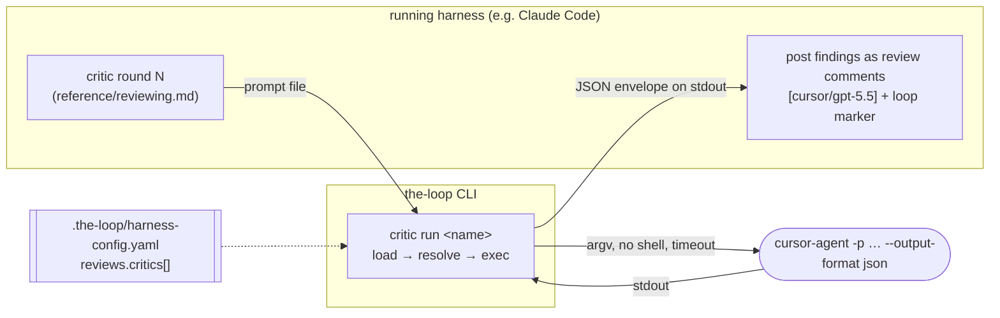

# Design: specify (and actually invoke) the critic harness

> Phase 2 of 3 (requirements → design → tasks). Derives from the approved
> requirements. MUST be reviewed and approved before moving to tasks breakdown.

## Overview

Three additions, one per question in the ticket:

| Ticket question | Answer |
|-----------------|--------|
| How is the critic harness specified? | A richer `reviews.critics[]` entry in `.the-loop/harness-config.yaml`, validated by the harness-config schema. |
| How are the command and its args exposed? | `command` + `args[]` with a closed set of `{placeholders}`; a `harness` matching a built-in adapter derives them for you. |
| How does the running harness get the output? | `the-loop critic run <name> --prompt-file <path>` prints **one JSON envelope** on stdout; the harness reads it with its ordinary shell tool. |

The seam is deliberately thin: the CLI turns *one* configured critic into *one* subprocess
and hands back *one* envelope. The review loop — how many rounds, when it converges, what
gets posted — stays in `reference/reviewing.md`, where it already lives. That split is what
keeps this from becoming a second, competing implementation of the review loop.



## Architecture

Two new modules plus two small edits to existing ones. Nothing in the daemon path changes.

| Component | Kind | Responsibility |
|-----------|------|----------------|
| `cli/the_loop/critics.py` | new | The critic model: load from config, resolve an invocation, run it, shape the result. |
| `cli/the_loop/commands/critic_cmd.py` | new | `the-loop critic list` / `the-loop critic run` — argparse surface over the above. |
| `cli/the_loop/harness/base.py` | edit | `oneshot_argv()` + `model_flag`, and two helpers promoted from private to package API. |
| `cli/the_loop/harness/claude_code.py`, `cursor_agent.py` | edit | Declare each harness's `model_flag`. |
| `.the-loop/harness-config.schema.json` | edit | The richer `reviews.critics[]` item. |
| `skills/the-loop/reference/reviewing.md` | edit | The critic-round procedure (R5). |

**Why the CLI and not the harness's own shell tool.** The config that says *which* critic
is YAML; without a resolver, every session would re-derive argv from that YAML by hand —
which is precisely the non-determinism the ticket is complaining about. One command makes a
round reproducible, testable, and centrally shell-free.

**Why this does not violate decision-032.** That decision forbids the plugin config feeding
the **daemon** (`gh-webhook`/`poll`/`sessions`/`events`), whose whole point is being
repo-independent. `critic` is a repo-scoped command like `scenarios` and `check`, which
already read `.the-loop/harness-config.yaml` for the repo they are invoked in.

## Components & interfaces

### `the_loop.critics`

```python
@dataclass(frozen=True)
class Critic:
    name: str
    harness: str = ""
    model: str = ""
    command: str = ""                 # explicit executable; wins over `harness`
    args: tuple[str, ...] = ()        # argv after the executable, with {placeholders}
    env: Mapping[str, str] = {}       # overlay on the inherited environment
    cwd: str = ""                     # default: the project root
    output_format: str = "text"       # text | json
    timeout_seconds: float = 900.0
    enabled: bool = True

    @property
    def attribution(self) -> str:     # "[cursor/gpt-5.5]" — reviewing.md's prefix
```

```python
class CriticConfigError(ValueError): ...        # fail-closed: never spawns anything

def load_critics(root: Path) -> list[Critic]    # reviews.critics[] (+ config.yaml fallback)
def find_critic(root: Path, name: str) -> Critic
def resolve_invocation(critic: Critic, values: Mapping[str, str]) -> list[str]
def run_critic(critic: Critic, values, *, root, timeout=None) -> CriticResult
```

- **`load_critics`** reads `.the-loop/harness-config.yaml`, falling back to the pre-rename
  `.the-loop/config.yaml` (issue-82) exactly as `commands/scenarios.py` does. A duplicate
  `name` raises `CriticConfigError` (R1.5). Per-entry shape errors are attached to the
  entry rather than raised, so `list` can show a bad entry with its reason (R4.3) while
  `run` refuses it.
- **`resolve_invocation`** is the security-critical function and is pure — argv in, argv
  out, no process:
  1. If `critic.command` → executable is `command`, argv tail is `critic.args`.
  2. Else if `critic.harness` is a built-in adapter → executable is the adapter's binary,
     argv tail is `adapter.oneshot_argv(prompt, model)` **plus** `critic.args` (so an
     operator can add flags to a built-in without restating the whole line).
  3. Else → `CriticConfigError` naming both remedies (R1.3).
  4. Placeholders are substituted **element-wise** with `string.Template`-style literal
     replacement of the closed set `{prompt}`, `{promptFile}`, `{model}`, `{workItem}`,
     `{specDir}`, `{cwd}`. An unknown `{name}` raises (R2.3); a set that mentions neither
     `{prompt}` nor `{promptFile}` raises (R2.2). The built-in path is exempt from R2.2 —
     the adapter's own argv carries the prompt.
- **`run_critic`** shells out with `subprocess.run(argv, shell=False, cwd=…, env=…,
  capture_output=True, text=True, timeout=…)`, times it, and never raises for a critic
  failure — a failure is a `CriticResult` with `ok=False` (R3.5).

```python
@dataclass
class CriticResult:
    critic: str; harness: str; model: str; attribution: str
    ok: bool; exit_code: int; duration_seconds: float
    output: str          # the reviewer's text
    error: str           # the diagnostic when ok is False
    usage: Usage         # reused from the harness adapters (token telemetry)
    def as_dict(self) -> dict
```

### `the-loop critic` (CLI surface)

```text
the-loop critic list [--root .] [--format table|json]
the-loop critic run <name> (--prompt TEXT | --prompt-file PATH)
                    [--root .] [--cwd DIR] [--work-item ID] [--spec-dir PATH]
                    [--timeout SECONDS] [--output-file PATH]
```

- `run` prints the envelope as pretty JSON on stdout and returns `0` when `ok`, `1`
  otherwise. Diagnostics go to the logger (stderr), so stdout stays a single parseable
  object (R3.6).
- `--prompt-file` is the expected path for a real round (review prompts are long, and it
  keeps the diff out of `ps` output); `--prompt` exists for quick checks. Exactly one is
  required.
- `{promptFile}` resolves to a path even when `--prompt` was used: the text is written to a
  temporary file for the duration of the call, so a critic CLI that only accepts a file
  works either way.
- `--output-file` additionally writes the envelope to disk — convenient when the harness
  wants the round on the filesystem for its execution-log entry.
- `run` refuses to run more than the one named critic (abuse case 2). There is no `--all`.

### `HarnessAdapter.oneshot_argv` (reuse, not a parallel table)

"How do you run harness X once, non-interactively, with JSON output" is knowledge the
adapters already hold (`_spawn_argv`). Rather than duplicating it in a critic-side table,
that knowledge is promoted to a documented method:

```python
class HarnessAdapter:
    model_flag: str = ""     # "--model" (claude), "-m" (cursor)

    def oneshot_argv(self, prompt: str, model: str = "") -> List[str]:
        """One non-interactive run of this harness, JSON out, no session semantics."""
        argv = self._spawn_argv(prompt)
        return argv + [self.model_flag, model] if model and self.model_flag else argv
```

`spawn()` keeps its session-registration semantics; `oneshot_argv` is the same argv without
them, which is exactly what a critic round needs.

Two helpers in `harness/base.py` gain a second consumer and are therefore promoted from
module-private to package API — `_parse_json_object` → `parse_json_object` and
`_usage_from_output` → `usage_from_output` — rather than reaching across modules for an
underscore name or growing a second JSON/usage parser. Call sites and
`tests/test_harness_usage.py` move with them; behaviour is unchanged.

## Data models

`reviews.critics[]` in `.the-loop/harness-config.schema.json` (every new key optional, so
existing configs keep validating):

| Key | Type | Default | Meaning |
|-----|------|---------|---------|
| `name` | string (required) | — | Unique id; `the-loop critic run <name>`. |
| `harness` | string | — | Free-form label, used in the attribution prefix. `claude`/`cursor` also derive the invocation. |
| `model` | string | — | Passed via the harness's model flag (built-ins) or `{model}` (explicit commands). |
| `command` | string | — | Executable to spawn. **Now argv[0], not a shell line.** Wins over `harness`. |
| `args` | string[] | `[]` | argv after the executable, with `{placeholders}`. |
| `env` | object&lt;string,string&gt; | `{}` | Overlay on the inherited environment. **Never secrets** — they stay ambient. |
| `cwd` | string | project root | Working directory for the round. |
| `outputFormat` | `text` \| `json` | `text` | How to read the critic's stdout. |
| `timeoutSeconds` | number ≥ 1 | `900` | Hard bound on the round. |
| `enabled` | boolean | `true` | Off without deleting the entry. |

**Breaking-change note.** `command` was documented as "optional explicit invocation" with
the example `"cursor-agent review"` — a *phrase*, ambiguously a shell line. It is now
strictly argv[0], with arguments in `args`. The old example is not valid argv[0] and would
now fail closed with a clear error, which is the right outcome: it never ran anything
before either. Called out in the schema description, the config template, the capability
doc and the PR briefing.

The envelope (`the-loop critic run` stdout):

```json
{
  "critic": "cursor-gpt", "harness": "cursor", "model": "gpt-5.5",
  "attribution": "[cursor/gpt-5.5]",
  "ok": true, "exitCode": 0, "durationSeconds": 42.7,
  "output": "…the critic's review text…", "error": "",
  "usage": {"inputTokens": 0, "outputTokens": 0, "cacheReadTokens": 0,
            "cacheWriteTokens": 0, "costUsd": 0.0, "present": false}
}
```

## Error handling

| Failure | Behaviour |
|---------|-----------|
| No such critic name | `CriticConfigError` listing the configured names; exit 2, nothing spawned. |
| Duplicate names / unknown placeholder / no prompt placeholder / neither command nor known harness | `CriticConfigError` naming the entry and the remedy; exit 2, nothing spawned. |
| Critic disabled | Refused with "disabled in config"; exit 2. |
| Executable not on `PATH` | Envelope with `ok:false`, `error:"critic CLI 'x' not found on PATH"`; exit 1. No fallback executable. |
| Non-zero exit | `ok:false`, `exitCode` preserved, stderr (else stdout) in `error`; exit 1. |
| Timeout | Child terminated, `ok:false`, `error:"… timed out after Ns"`; exit 1. |
| `outputFormat: json` but stdout is not JSON | Not an error — `output` falls back to raw stdout (R3.2). |

Every one of these still prints the envelope, so the harness always has a row for the
execution log's review table.

## Security design

- **AuthN/AuthZ:** none introduced. `critic run` is a local command run by whoever already
  has shell access to the checkout; it grants no new capability to a remote actor.
- **Input validation & injection surfaces:**
  - **Command injection — the primary surface.** `subprocess.run(argv, shell=False)`, an
    argv *list*, always. Placeholder substitution writes into a single argv element and can
    therefore never introduce a word boundary, a redirect or a second command. There is no
    `shell=True` anywhere in the new code, and a test asserts a metacharacter-laden prompt
    arrives as one literal argument.
  - **Config-as-code.** A `reviews.critics[]` entry *is* an executable declaration, and
    `harness-config.yaml` is repo-tracked, so a pull request can propose one. Mitigations:
    (a) nothing runs implicitly — the operator/harness names one critic per invocation and
    there is no run-all mode; (b) no shell; (c) the reviewing procedure and capability doc
    state plainly that a critic entry is reviewed like code. `autonomy.sensitivePaths`
    gains `.the-loop/harness-config.yaml` so a change to it raises the risk tier of the PR
    proposing it.
  - **Prompt injection (inbound).** The prompt quotes untrusted diff/comment text, but it
    only ever becomes one argv element or a file the critic reads — never a command.
  - **Prompt injection (outbound).** The critic's stdout is model-generated and untrusted.
    `reference/reviewing.md` states that critic output is *findings to evaluate*, never
    instructions to obey, and it is posted under the critic's attribution prefix so a
    reader can see whose words they are.
- **Secrets handling:** no secret is read from or written to the config. The child inherits
  the operator's environment (where the critic CLI's own credentials live); `env` is an
  overlay for non-secret knobs, documented as such in the schema, template and capability
  doc. The envelope carries the critic's stdout, which the harness posts — the procedure
  warns not to feed secrets into the prompt, the same rule that already applies to every
  comment the loop posts.
- **Least privilege:** the child gets the invoking user's privileges — the-loop adds no
  elevation, and notably does **not** add auto-approval/bypass flags on the operator's
  behalf (the same rule `routing.harnessArgs` follows: only what the operator configured).
- **Fail-closed behaviour:** every ambiguous or unusable configuration spawns nothing and
  exits non-zero; an unrunnable round is recorded `unavailable` and never counts as a
  passing critic round.
- **Abuse-case coverage:**

  | Abuse case | Mechanism | Negative test |
  |------------|-----------|---------------|
  | 1 — shell metacharacters in a placeholder value | argv list, `shell=False`, element-wise substitution | `test_placeholder_value_with_metacharacters_stays_one_argument` |
  | 2 — an added critic entry executes merely by existing | one named critic per invocation; no run-all | `test_run_requires_an_explicit_critic_name` |
  | 3 — executable absent from `PATH` | `shutil.which` check → `ok:false`, no fallback | `test_missing_binary_fails_closed` |
  | 4 — hung critic | `subprocess.run(timeout=…)` → terminate, `ok:false` | `test_timeout_is_reported_as_a_failed_round` |
  | 5 — critic output carrying instructions | procedural: output is findings, posted under attribution | documented in `reference/reviewing.md` (no code path to test) |

## Testing strategy

`cli/tests/test_critics.py` (unit) and `cli/tests/test_critics_integration.py` (integration,
matching `testing.integrationTestGlobs`, each test carrying a Gherkin docstring with a
`Requirement:` link back to this spec):

| Requirement | Test |
|-------------|------|
| R1.1 built-in derivation | `test_builtin_harness_derives_argv_from_the_adapter` |
| R1.2 command wins | `test_explicit_command_overrides_the_builtin` |
| R1.3/R1.5 fail closed | `test_unknown_harness_without_command_is_rejected`, `test_duplicate_names_are_rejected` |
| R1.4 disabled | `test_disabled_critic_refuses_to_run` |
| R2.1 substitution | `test_placeholders_are_substituted_element_wise` |
| R2.2/R2.3 | `test_args_without_a_prompt_placeholder_are_rejected`, `test_unknown_placeholder_is_rejected` |
| R2.4 no shell | `test_placeholder_value_with_metacharacters_stays_one_argument` |
| R2.5/R2.6 env & cwd | `test_env_overlays_the_inherited_environment`, `test_cwd_defaults_to_the_project_root` |
| R3.1–R3.4 envelope | `test_envelope_shape`, `test_json_output_format_extracts_the_text`, `test_json_fallback_to_raw_stdout`, `test_usage_is_carried_through` |
| R3.5 failures | `test_non_zero_exit_is_a_failed_round`, `test_missing_binary_fails_closed`, `test_timeout_is_reported_as_a_failed_round` |
| R3.6 stdout purity | `test_stdout_is_a_single_json_object` |
| R4 listing | `test_list_reports_availability`, `test_list_with_no_critics_exits_zero`, `test_list_shows_invalid_entries_with_a_reason` |

Integration scenarios (Gherkin) drive a **real subprocess** — a tiny Python script acting as
the critic — so the argv, env, cwd, timeout and JSON-envelope path are exercised end to end
rather than mocked:

- `Scenario: a configured critic CLI reviews the work and its findings reach the harness`
- `Scenario: a critic that is not installed fails the round closed`
- `Scenario: a hostile prompt cannot escape into a shell command`

Evidence: `make test` (full suite), `ruff`, `pyright`, `markdownlint`, and a live
`the-loop critic list` / `critic run` against a stub critic.

## Trade-offs & decisions

- **One round per invocation, not the whole loop.** Considered a `the-loop critic review`
  that loops `criticReviewCount` times and posts comments. Rejected: it would fork the
  review loop into two implementations (skill + CLI) that must agree on convergence,
  attribution and the loop-prevention marker. The CLI owns process invocation; the skill
  keeps owning the loop. Recorded as **decision-043**.
- **`command` + `args[]` rather than a shell string.** A single `command: "cursor-agent
  review --model x"` string would need shell splitting (or `shell=True`) and would make
  every placeholder an injection site. argv[0] + a list costs one extra YAML key and
  removes the entire class of problem. This narrows the old free-form `command`; see the
  breaking-change note above.
- **Overlay `env`, never secrets in config.** Rejected a `passEnv: [NAMES]` allow-list on
  top: the child inheriting the operator's environment is what makes `cursor-agent`/`claude`
  work at all, and a second mechanism would imply the config is a safe place for secret
  values. One mechanism, one documented rule.
- **Reuse the adapters instead of a critic-side argv table.** Promoting `_spawn_argv` to
  `oneshot_argv` keeps one source of truth for "how do you run harness X once", so a future
  adapter is usable as a critic for free.
- **No structured-finding parsing.** Critics write prose; the envelope carries it verbatim
  and the harness posts it. Parsing prose into structured findings would be a guess with a
  failure mode (dropped findings) worse than the problem it solves. YAGNI per
  `reference/minimalism.md`.
- **No critic-prompt template file.** The required prompt content is specified inline in
  `reference/reviewing.md` instead of a `templates/critic-prompt.md` the CLI never reads —
  one fewer file to drift.

## Open questions

None. Both drafting questions are resolved above.

## Review comments

> Appended by the-loop's `record-feedback` hook when a human gate approves with
> comments (issue-109). Append-only and attributed: an approval never silently
> discards a reviewer's suggestions, and the feedback travels with the document
> it concerns rather than living in a side-channel tracker.
