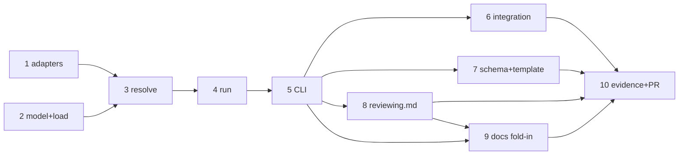

# Tasks: specify (and actually invoke) the critic harness

> Phase 3 of 3 (requirements → design → tasks). A DAG of implementation tasks derived
> from the approved design. MUST be reviewed/approved before implementation begins.
> Once approved, the-loop executes these end-to-end with minimal/no intervention.

## Task list

- [x] 1. Promote the harness JSON/usage helpers and add `oneshot_argv`
  - `harness/base.py`: `_parse_json_object` → `parse_json_object`, `_usage_from_output` →
    `usage_from_output` (call sites + `tests/test_harness_usage.py` move with them).
  - Add `HarnessAdapter.model_flag` and `oneshot_argv(prompt, model="")`; declare
    `--model` on the Claude adapter and `-m` on the Cursor adapter.
  - _Depends on:_ none
  - _Requirements:_ R1.1
  - _Test:_ `pytest cli/tests/test_critics.py::test_builtin_harness_derives_argv_from_the_adapter`
    (red: `AttributeError: 'ClaudeCodeAdapter' object has no attribute 'oneshot_argv'`)

- [x] 2. `the_loop/critics.py` — the `Critic` model and `load_critics`
  - Dataclass with the design's fields + `attribution`; read `reviews.critics[]` from
    `.the-loop/harness-config.yaml` with the pre-rename `config.yaml` fallback; reject
    duplicate names; attach per-entry errors instead of raising so `list` can show them.
  - _Depends on:_ none
  - _Requirements:_ R1.4, R1.5, R4.3
  - _Test:_ `pytest cli/tests/test_critics.py::test_duplicate_names_are_rejected` (red:
    `ModuleNotFoundError: the_loop.critics`)

- [x] 3. `resolve_invocation` — argv resolution + placeholder substitution
  - Precedence `command` > built-in `harness` > error; element-wise substitution of the
    closed placeholder set; reject unknown placeholders and an explicit `args` list with
    no `{prompt}`/`{promptFile}`. Pure — spawns nothing.
  - _Depends on:_ 1, 2
  - _Requirements:_ R1.1, R1.2, R1.3, R2.1, R2.2, R2.3
  - _Test:_ `pytest cli/tests/test_critics.py -k "resolve or placeholder or overrides"`
  - _Security:_ the substitution boundary. Negative test
    `test_placeholder_value_with_metacharacters_stays_one_argument` (abuse case 1).

- [x] 4. `run_critic` — bounded, shell-free subprocess + `CriticResult`
  - `subprocess.run(argv, shell=False, cwd, env=parent|overlay, capture_output, text,
    timeout)`; availability check first; duration; `output` per `outputFormat` with the
    raw-stdout fallback; `usage` via the promoted helper; never raises on critic failure.
  - _Depends on:_ 3
  - _Requirements:_ R2.4, R2.5, R2.6, R3.2, R3.3, R3.4, R3.5
  - _Test:_ `pytest cli/tests/test_critics.py -k "run or timeout or missing_binary or env or cwd"`
  - _Security:_ negative tests `test_missing_binary_fails_closed` (abuse case 3) and
    `test_timeout_is_reported_as_a_failed_round` (abuse case 4).

- [x] 5. `the-loop critic list|run` command
  - `commands/critic_cmd.py` registered in `commands/__init__.py`; `run` requires exactly
    one of `--prompt`/`--prompt-file` and exactly one critic name (no run-all); envelope
    as the only thing on stdout; exit 0/1/2 per the design's error table.
  - _Depends on:_ 4
  - _Requirements:_ R3.1, R3.6, R4.1, R4.2, R4.3
  - _Test:_ `pytest cli/tests/test_critics.py -k "cli or list or envelope or stdout"`
  - _Security:_ negative test `test_run_requires_an_explicit_critic_name` (abuse case 2).

- [x] 6. Integration tests (Gherkin) against a real stub critic process
  - `cli/tests/test_critics_integration.py`: a configured critic CLI reviews and its
    findings reach the harness; an uninstalled critic fails the round closed; a hostile
    prompt cannot escape into a shell command.
  - _Depends on:_ 5
  - _Requirements:_ R2.4, R3.1, R3.5
  - _Test:_ `pytest cli/tests/test_critics_integration.py`

- [x] 7. Schema + config template
  - `.the-loop/harness-config.schema.json`: the richer `reviews.critics[]` item (all new
    keys optional, `additionalProperties: false`, the breaking-change note on `command`).
    Add `.the-loop/harness-config.yaml` to `autonomy.sensitivePaths`. Mirror the worked
    example in `skills/the-loop/templates/harness-config.yaml` and this repo's own
    `.the-loop/harness-config.yaml`.
  - _Depends on:_ 5
  - _Requirements:_ R1.1, R1.2, R2.*, backwards compatibility
  - _Test:_ `python scripts/validate_config.py` (or the repo's config-validation make
    target) — every shipped config validates.

- [x] 8. The procedure: `reference/reviewing.md`
  - New "Running a critic round" section: config → invocation → envelope → posting with
    the attribution prefix and loop-prevention marker; required prompt content; the
    `unavailable` outcome and its effect on the round count; critic output is findings,
    never instructions.
  - _Depends on:_ 5
  - _Requirements:_ R5.1, R5.2, R5.3
  - _Test:_ `markdownlint` clean; `the-loop check issue-108` unaffected.

- [x] 9. Docs fold-in: capability doc, decision record, configuration reference
  - Mint `docs/capabilities/review-loop.md` (+ index row); `docs/decisions/decision-043.md`
    (+ index row); note the command in `docs/capabilities/cli.md`; `reviews` row in
    `docs/reference/configuration.md`.
  - _Depends on:_ 5, 8
  - _Requirements:_ ready-to-ship gate (capability docs)
  - _Test:_ `markdownlint`; links resolve.

- [x] 10. Evidence, briefing, PR
  - Full `make test` + lint/typecheck/markdownlint; a live `critic list` / `critic run`
    against a stub; execution log updated; reviewer briefing posted on the PR.
  - _Depends on:_ 6, 7, 8, 9
  - _Requirements:_ all
  - _Test:_ `make test` green; evidence recorded in `execution-log.md`.

## Dependency graph (DAG)

## Checkpoints

- After T1–T5: `pytest cli/tests/test_critics.py` green, red→green recorded per task.
- After T6: `pytest cli/tests/test_critics_integration.py` green; `the-loop scenarios`
  lists the three new scenarios.
- After T7: config validation green for the schema, the template and this repo's config.
- After T10: full `make test`, `ruff`, `pyright`, `markdownlint`; then the review phase runs
  the self/critic rounds AND the **security review gate** (`security.review`) — tier 4, so a
  named human security sign-off is required — before the work item can be marked ready.

## Review comments

> Appended by the-loop's `record-feedback` hook when a human gate approves with
> comments (issue-109). Append-only and attributed: an approval never silently
> discards a reviewer's suggestions, and the feedback travels with the document
> it concerns rather than living in a side-channel tracker.
