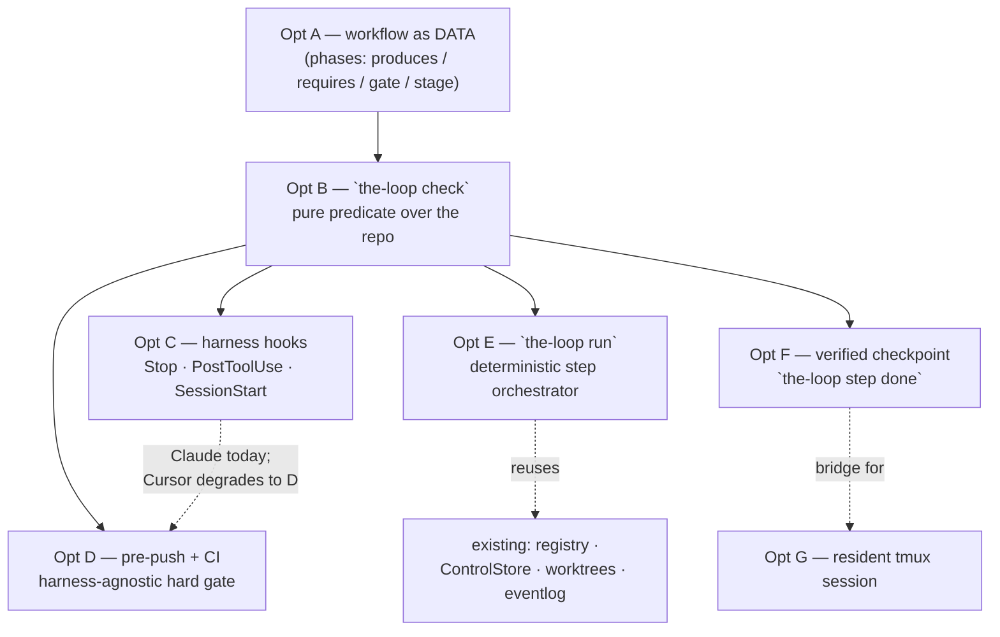
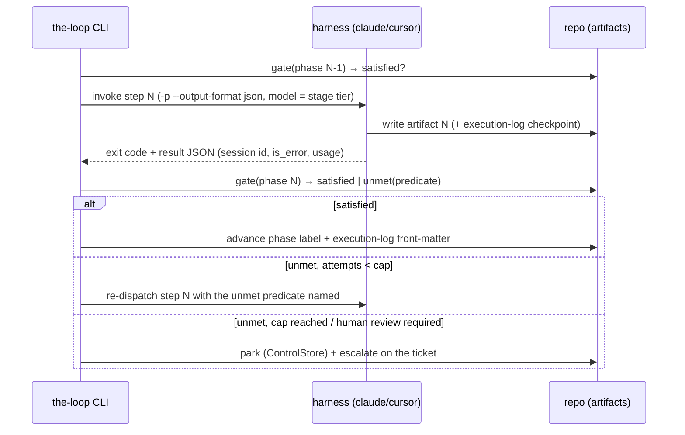

# Brainstorm: making the-loop deterministic — enforced steps, not remembered ones

> Root artifact for [issue #109](https://github.com/MadaraUchiha-314/the-loop/issues/109).
> The issue is explicitly exploratory ("how do we make these top level workflow more
> programmatic?"), so the loop starts here. This brainstorm establishes what the
> non-determinism actually costs today (with in-repo evidence), answers the ticket's
> mechanical questions about session management and completion detection, lays out the
> design space, and proposes a sequencing. Iterate with feedback; once locked, derive
> `requirements.md` for the subset the owner greenlights.

## Problem / opportunity

the-loop's PDLC — `(brainstorm) → requirements → design → tasks → implement → self/critic
review → evidence → complete → learn` — exists **only as prose**. `SKILL.md`,
`reference/workflow.md` and `commands/*.md` describe it; nothing evaluates it. Every phase
gate, every "iterate until locked", every "keep the checkmarks current" is an instruction
the model is asked to remember across a long, context-resetting run. The model is free to
skip a step, invent one, or declare a step done that isn't — and no code disagrees.

**This is measurable in this repository, today.** Counting the checked-in specs of work
already merged:

| Signal | Count | What it means |
|---|---|---|
| Spec folders under `docs/specs/` | 34 | — |
| …with `requirements.md` | 28 | 6 items produced no requirements artifact at all |
| …with `tasks.md` | 24 | 10 items skipped the tasks-breakdown artifact |
| …with `execution-log.md` | 25 | 9 items ran with no resume anchor / phase mirror |
| `requirements.md` still `status: draft` | 15 of 28 | design was derived from an **unlocked** upstream artifact |
| `design.md` still `status: draft` | 16 of 33 | same, one link further down the chain |
| `execution-log.md` with `phase: complete` | **0 of 25** | no work item was ever closed out in its own log |
| `execution-log.md` stuck at `phase: needs-review` | 22 of 25 | the log stops mid-state-machine |
| GitHub issues labelled `loop:complete` | 15 | the *label* mirror says the same items **are** complete |

The last two rows are the finding in miniature: the phase state machine is mirrored in two
places — the ticket label and the execution log's `phase` front-matter — the rules say to
keep them in sync, and **they disagree on 22 work items**. Nothing noticed, because
nothing is looking. One of those logs still carries the template's own inline comment
(`phase: needs-review          # not-started | brainstorming | …`), pasted through
untouched — a step performed as text-copying rather than as a state transition.

The opportunity is not to make the agent more obedient. It is to notice that **the-loop
already writes its state to disk in a structured, machine-readable form** — `status:` and
`phase:` front-matter, named artifact files, `- [ ]`/`- [x]` checkmarks, a phase label per
ticket — and that a state machine whose state is already materialized needs only a
**checker**, not a rewrite. The determinism is one pure function away; what is missing is
that nothing calls it.

Framed as the ticket's own two failure modes:

- **Skipping a step** — the artifact for phase N+1 is written while phase N's artifact is
  missing, unlocked, or incomplete. This is a *predicate over files*: decidable in code,
  cheaply, with no model in the loop.
- **Adding a step** — the agent invents work the workflow does not define (an extra review
  round, a refactor nobody asked for, a "phase" that isn't one). This is decidable only
  against a **declared** list of steps — which the-loop half has already
  (`workflow.phases` in `harness-config.yaml`) but which today names phases without saying
  what each one *produces* or *requires*.

## Context & constraints

What is already true, so we build on it rather than past it:

- **The artifact chain is already the hand-off protocol the issue asks for.** Each step
  already has exactly one durable output that the next step consumes:
  `brainstorm.md → requirements.md → design.md → tasks.md → code + execution-log.md`.
  The issue's own observation ("each step needs a clear output artifact… we kind of
  already do this") is correct and is the single most important asset here: **no new
  data model is needed to make the workflow programmatic.**
- **Front-matter is already a status register.** Every artifact template carries
  `status: draft | in-review | approved` and the execution log carries `phase:`. These
  were designed as human-readable metadata; they are equally machine-readable, and are
  precisely the fields a gate would read.
- **The CLI already owns durable, restart-surviving state.** `SessionRegistry`
  (work item → harness session id, cwd, runner, tmux target, recent deliveries),
  `ControlStore` (durable start/stop/pause/resume requests, issue-106), the JSONL event
  log (decision-025), per-work-item worktrees (issue-76) and delivery-id dedup all
  persist across daemon restarts. An orchestrator would not need to invent persistence —
  it would need to *use* what issue-106 just finished building.
- **Two runners exist, with opposite context economics** (decision-021):
  - `process` — each event is a fresh `claude -p … --resume <id> --output-format json`
    subprocess. Cold, but it **exits**, and the exit is a hard, parseable completion
    signal.
  - `tmux` — the harness TUI stays resident in `loop-<slug>`; events are bracketed-pasted
    in via `load-buffer`/`paste-buffer`/`send-keys`. Warm context (cheap), but there is
    **no exit event** to observe.
  This tension is the heart of the ticket's last question and is treated in its own
  section below.
- **Fresh context per step is already the *policy*, not a hazard to avoid.**
  `contextManagement.phaseBoundary: clear` deliberately starts implementation on a clean
  window that re-reads the locked spec from disk (plan-mode style), and
  `taskBoundary: compact` trims between tasks. The checked-in artifacts *are* the memory.
  So "how do we make sure each step is not fresh context?" partly inverts: the-loop's
  answer is that a step **should** be fresh, and `execution-log.md`'s latest `Next:` plus
  the locked upstream artifact are the cheap rehydration payload. What is missing is not
  continuity — it is a guarantee that the rehydration actually happened correctly.
- **`tokenEconomy.modelRouting.stages` already maps stages 1:1 onto the steps** this issue
  wants to programmatize (`brainstorm: frontier`, `tasks: standard`, `evidence: economy`,
  …). Today that mapping is advisory prose the harness may honour. A step-per-invocation
  runner is what would make it *actually* selected, because the invocation is the thing
  that carries `--model`.
- **Hard constraints that bound any solution:**
  - **Zero bundled runtime (decision-005, softened by decision-038).** the-loop
    subprocess-drives the *official* CLIs and adds no agent SDK or framework. Any answer
    is prompt/skill/config shaped, harness-native hooks, or thin Python in the existing
    CLI — never a reimplementation of an agent loop.
  - **Two harnesses, one source.** A lever that only works in Claude Code is half a lever.
    Hook coverage is *not* symmetric today (see below), so cross-harness parity is a
    design constraint, not an afterthought.
  - **The human gates are the point, not friction.** `requireHumanReviewPerPhase` and the
    risk-tiered autonomy gates must survive any orchestration; determinism must make the
    wait states *explicit*, never optimize them away.
  - **Advisory levers must stay advisory; gates must become real.** the-loop already
    distinguishes these (token economy: advisory; ready-to-ship: a gate). This work is
    about the second category only.

## The mechanical questions the ticket asks

These are answerable from the harnesses' documented behaviour and this repo's code, and
they constrain every option below — so they come before the options.

### How does Claude/Cursor session management actually work?

- **Claude Code, headless:** `claude -p "<prompt>" --output-format json` runs one turn to
  completion, prints a terminal result object (session id, `is_error`, usage/cost) and
  **exits**. `--resume <session-id>` continues a recorded conversation; resume lookup is
  scoped to the project directory, which is why `Session.cwd` is recorded and why the
  workspace/worktree layout (issue-76) matters. `--output-format stream-json` emits the
  same lifecycle as a stream of events ending in a terminal `result`.
- **Claude Code, interactive:** `--session-id <uuid>` pre-assigns the id (this is what
  lets the-loop register a tmux session *before* the harness reports anything), and
  `--resume <id>` without `-p` continues the conversation inside the TUI. The-loop
  already relies on both (`ClaudeCodeAdapter.interactive_argv` /
  `interactive_resume_argv`).
- **Cursor:** `cursor-agent -p … --resume <chat-id>` mirrors the headless shape; the-loop
  cannot pre-assign an interactive id, which is exactly why `interactive_argv` raises
  `UnsupportedRunnerError` for it and tmux-mode spawns fail cleanly rather than silently.
- **the-loop's layer on top:** a work item ref (`github:OWNER/REPO#N`) → one registered
  session; per-session FIFO queue with a global concurrency semaphore; at-most-once
  delivery via `X-GitHub-Delivery` dedup (in-memory cache + durable `recent_deliveries`);
  respawn-with-resume plus a liveness probe when a tmux session is found dead (issue-89);
  auto-close when the work item closes.

**Conclusion:** session management is already solved and durable. An orchestrator would be
adding *sequencing*, not *session plumbing*.

### How does the CLI know a step is complete — and how is that different from "waiting for the user"?

This is the sharpest question in the ticket, and it has a two-part answer.

**Part 1 — "the agent stopped" is observable, per mode:**

| Mode | "the agent stopped talking" | "the agent is waiting on a human" |
|---|---|---|
| `claude -p --output-format json` | process exit + terminal result JSON (`is_error`, `session_id`, usage) | *cannot happen* — headless never blocks on a human; it just ends |
| `--output-format stream-json` | terminal `result` event on the stream | — (same) |
| tmux TUI (resident) | `Stop` hook fires when Claude finishes responding; `Notification` with matcher `agent_completed` | `Notification` with matcher `agent_needs_input`, `permission_prompt`, or `idle_prompt` |
| `cursor-agent` TUI | `stop` hook exists in Cursor's hook set, **but CLI hook coverage is reported as partial** (community reports only shell-execution events firing in `cursor-agent`) — verify before designing on it | — (same caveat) |

So the distinction the ticket asks about is **already a first-class, documented signal in
Claude Code**: `Notification`'s matchers separate `agent_needs_input` / `permission_prompt`
/ `idle_prompt` from `agent_completed`, and `Stop` fires on turn end. In headless mode the
question dissolves entirely — the process exits, and a step that *should* wait for a human
ends by writing its artifact as `status: in-review` and parking the work item.

**Part 2 — and it does not matter as much as it looks, because "stopped" ≠ "done".**

A stop signal answers *did the turn end*. It never answers *did the step complete
correctly*. Only a predicate over the checked-in artifacts answers that:

> phase `design` is complete ⟺ `docs/specs/<id>/design.md` exists ∧ its front-matter is
> `status: approved` ∧ it contains a non-empty **Security design** section ∧ every trust
> boundary named in `requirements.md` appears in it ∧ the ticket label is `loop:design`
> ∧ `execution-log.md`'s `phase` agrees.

That predicate is pure, cheap, testable with pytest, harness-agnostic, and immune to a
model's opinion of its own work. **It is the load-bearing piece of every option below** —
which is why it is worth building even if no orchestrator is ever written.

### How do we recover from failure modes?

The ticket's own observation is right: an agent recovers well because it introspects
continuously; a rigid external driver recovers badly. The synthesis is that recovery
should be **deterministic in its decision and agentic in its repair** — code decides
*that* something is wrong and *what* is unmet; the agent decides *how* to fix it.

| Failure | Detected by | Recovery |
|---|---|---|
| Step process exits non-zero | exit code / `is_error` | bounded retry of the same step, with the error text appended to the prompt |
| Step "succeeded" but gate unmet | the gate predicate | re-dispatch the same step naming the **specific** unmet predicate — deterministic feedback beats "try harder" |
| Same gate failure twice running | attempt counter | escalate to a human (mirrors `reviews.escalateOnRepeatFinding`), record in `conflicts.md` |
| Harness/tmux session died | `has_live_session` probe | **already implemented**: respawn + `--resume` + `survived()` liveness probe, falling back to a fresh conversation (issue-89) |
| Agent blocked on a human | `Notification: agent_needs_input`, or the artifact landing at `status: in-review` | park the item; the durable `ControlStore` + webhook/poller already deliver the human's reply back into the same session |
| Daemon restart mid-run | — | state is files: registry + control store + execution log + spec front-matter. Resumption re-evaluates the gate and continues from the first unmet phase |
| Gate is unsatisfiable (a `Stop`-hook block loop) | attempt counter | hard cap → surface the failing predicate to a human. **Any blocking hook needs this cap**, or the loop burns tokens forever |

### Will this consume a lot of tokens?

Per-step invocation trades **warm context** for **determinism and cheap failure**. Four
things make the trade favourable, and all four already exist in-repo:

1. **The rehydration payload is small and already written** — the locked upstream artifact
   plus the execution log's latest `Next:` (`reference/context.md` was designed for exactly
   this).
2. **Phase-scoped progressive disclosure** (issue-37, Option B) means step N loads only its
   own reference file, not the whole corpus. A per-step invocation is what makes that
   *enforceable* rather than hoped-for.
3. **Per-step model routing becomes real** — `tokenEconomy.modelRouting.stages` already
   declares `evidence: economy`, `capability-docs: economy`, `design: frontier`. Steps that
   are separate invocations can actually be routed; steps inside one conversation cannot.
4. **A cheap failure is worth tokens.** Today a skipped step is discovered in human review,
   costing a full re-run. A gate that fails in milliseconds costs one re-dispatch.

And it is not all-or-nothing: continuity-hungry steps (self-review after implementation)
can `--resume` the previous step's session, while independent steps (evidence,
capability-doc fold-in) start fresh. That choice is per-step data, not a global mode.

## Ideas & options

`✅` leaning to adopt · `○` parked / optional · `✗` rejected

### Option A — Declare the workflow as data, not prose ✅ (foundation)

Promote `workflow.phases` from a list of names into a **machine-readable phase spec**:
each phase declares what it `produces`, what it `requires`, its `gate` predicates, its
command, its model tier and its autonomy gate. One declaration, read by **both** the skill
(rendered into the prompt) and the CLI (evaluated as code) — so prose and enforcement can
never drift.

```yaml
workflow:
  phases:
    - name: design
      produces: [design.md]
      requires: [requirements.md@approved]
      gate:
        - frontMatter: {status: approved}
        - sections: ["Security design"]
        - label: "loop:design"
      command: /the-loop:create-design
      stage: design            # → tokenEconomy.modelRouting.stages
      humanReview: true
```

*Pro:* answers "make it programmatic" at the data layer, which every other option needs
anyway; makes "no extra steps" decidable (a step not declared is not a step); costs
nothing at runtime. *Con:* a second schema surface to version and validate; over-modelling
risks a config nobody can read — keep the vocabulary tiny and let prose keep the nuance.

### Option B — The gate checker: `the-loop check <id> [--phase P]` ✅ (the increment that pays)

A pure function over the repo that evaluates Option A's predicates and reports, per phase,
`satisfied | unmet(<specific predicate>)`. No sessions, no harness, no network. Output in
`table|json` (json is what a hook or CI consumes). It is the single artifact that makes
every failure mode above *detectable*, and it is ~a few hundred lines of stdlib Python
plus pytest — the minimalism ladder's answer to "make the workflow programmatic".

*Pro:* immediately useful with zero orchestration; harness-agnostic; testable; retrofits
onto the 34 existing spec folders as a **drift report** (it would have caught all 22
`needs-review` logs on day one). *Con:* a checker that nothing calls changes nothing —
which is why it must ship *with* at least one enforcement point (Option C or D).

### Option C — Enforce where the harness cannot skip it: harness hooks ✅

Wire the checker into lifecycle points the model does not control:

- **`Stop`** — exit 2 blocks the stop and feeds the unmet predicate back, so the agent
  cannot end a turn having skipped a step. *This is the single highest-leverage hook for
  this issue.* Needs the attempt cap from the failure table.
- **`PostToolUse`** on writes under `docs/specs/**` — validate an artifact the moment it
  is written (catches an unlocked upstream immediately, not three phases later).
- **`SessionStart` / `UserPromptSubmit`** — inject the current phase and the *next
  required step* as `additionalContext`, so the agent never re-derives the workflow.
- **`PreToolUse`** on `git push` / PR creation — the last cheap moment before work becomes
  externally visible.

*Pro:* enforcement at the exact moment of deviation; uses documented harness features; no
new runtime. *Con:* **asymmetric across harnesses** — Claude Code's hook set is rich and
documented, while `cursor-agent`'s CLI hook coverage is reported as partial. Cursor must
degrade gracefully to Option D + prompt-level rules. A blocking `Stop` hook is also
genuinely dangerous without the cap; treat it as a safety-critical detail, not a footnote.

### Option D — Enforce at the boundary that is harness-agnostic: pre-push + CI ✅

Run `the-loop check` in `hooks.prePush` and as a required CI check: a PR whose diff touches
code without a locked spec, with a phase-label/execution-log mismatch, with unticked tasks,
or with no capability-doc update fails. Same command in both places (CI parity is already a
the-loop rule).

*Pro:* works for **every** harness and for a human contributor; impossible to prompt away;
the merge boundary is where skipping actually costs something. *Con:* late feedback — it
catches the omission after the work, so it complements Option C rather than replacing it.
Needs an escape hatch for legitimately exempt changes (a typo fix should not need a spec)
— which is what `autonomy` tiers are already for.

### Option E — `the-loop run <id>`: the CLI as step orchestrator ○ → ✅ (second increment)

The full answer to "can the-loop CLI orchestrate all this?": a deterministic Python loop
over Option A's phase list. For each phase — resolve the model tier, render the phase
prompt, invoke the harness **headless** (`-p --output-format json`, fresh or `--resume`
per the phase's declaration), then evaluate Option B's gate; advance, retry, or park.
Control flow lives in Python; the model never decides what comes next.

*Pro:* real ordering determinism; per-step model routing becomes enforceable; process exit
is an unambiguous completion signal, so no prose parsing anywhere; resumable by
construction (state is files + registry); reuses the dispatcher/registry/ControlStore
rather than adding a runtime. *Con:* the largest new surface here; human-review gates need
explicit park/resume states (fortunately: issue-106 just built durable pause/resume);
loses the resident-context economics of the tmux runner; and it is a genuine bet that
per-step prompts produce work as good as one continuous agent — which should be **measured
against the existing token telemetry**, not assumed.

### Option F — Agent self-reports step completion (`the-loop step done --phase P`) ○

The agent calls a CLI command to declare a step finished. *Pro:* trivial; works in the
resident tmux runner where no exit event exists. *Con:* **the completion signal is the
model's own claim** — precisely the non-determinism the issue is about. Only acceptable
*combined with* Option B: the command runs the gate and refuses the claim when unmet. In
that shape it is not self-reporting at all; it is a verified checkpoint, and it is a
reasonable bridge for tmux-mode sessions.

### Option G — Keep the resident session, drive it with typed step prompts ○

Middle path: keep one warm session per work item (already implemented), have the CLI paste
the next step's prompt, and detect completion via the `Stop`/`Notification` hooks of
Option C rather than process exit. *Pro:* cheapest in tokens; preserves the observability
and human-attachability that issue-32/86 were built for. *Con:* completion detection is
hook-dependent and therefore Claude-only today; no per-step model routing (one process,
one model); harder to reason about failure isolation.

### Rejected

- **Parsing the agent's prose for "step complete" ✗** — non-deterministic by construction;
  the exact failure mode this issue exists to remove. Structured output (exit code, result
  JSON, hook event) or a file predicate — never narration.
- **Reimplementing an agent loop / adopting an agent SDK to get control ✗** — contradicts
  decision-005 and duplicates what the harnesses already do well. the-loop's edge is the
  *process*, not the runtime.
- **One mega-prompt that performs the whole PDLC in a single turn ✗** — no checkpoints, no
  gates, maximal context rot, and a failure anywhere loses everything. It is the current
  behaviour's failure mode, amplified.
- **Removing the human review gates to make the loop fully automatic ✗** — determinism
  must make wait states explicit, not delete them. Risk-tiered autonomy already decides
  which items may complete unattended.
- **Enforcing determinism purely by writing stricter prompts ✗** — this is what exists
  today. The evidence table above is what it produces. Prompts remain necessary (they
  steer) but they cannot be the *gate*.

## Sketches & notes

Where each option sits, and the one dependency that matters (everything enforces the same
declared phase spec through the same checker):



The step contract an orchestrated run would follow — note that **every** arrow out of the
harness is a structured signal, never prose:



## Open questions

Raised for the owner on the ticket (paper trail); this brainstorm is not locked until they
are answered.

1. **Scope.** Epic (A → B → C/D → E as separate work items) or one PR? The recommendation
   below assumes an epic with a deliberately small first increment, but issue-37 precedent
   was "implement all suggestions in one PR".
2. **How hard should the gate be?** Warn-only, block-on-push, or block-the-turn
   (`Stop` hook exit 2)? Per risk tier, or uniform? A blocking gate is the whole point —
   and also the thing that can wedge an autonomous run.
3. **Is a Claude-first enforcement path acceptable?** Claude Code's hook set supports
   Option C fully; `cursor-agent`'s CLI hook coverage appears partial and needs verifying.
   Proposal: hooks where available, `the-loop check` in pre-push/CI everywhere — but this
   does mean the two harnesses are not equally protected in-session.
4. **Orchestration or verification?** Does the-loop *drive* the steps (`the-loop run`,
   Option E) or stay event-driven and merely *verify* (Options B–D)? These are genuinely
   different products; verification is strictly cheaper and composes with the existing
   webhook/poller model.
5. **Resident vs per-step sessions.** If we orchestrate: warm tmux session (cheap,
   hook-dependent completion) or per-step headless invocation (deterministic exit,
   per-step model routing, cold start)? Can be per-phase data rather than one global
   answer.
6. **How strict is "no extra steps"?** Should the gate merely *require* the declared
   artifacts, or also *reject* undeclared ones? The latter is stronger and riskier — a
   useful ad-hoc note becomes a gate failure.
7. **Retrofit policy.** `the-loop check` run over the 34 existing spec folders will report
   a lot of drift. Fix it in this work item, fix it opportunistically, or baseline it and
   only gate new work?

## Leaning / working hypothesis

**Verify first; orchestrate second — and never parse prose.**

The instinct the ticket starts from ("make the CLI drive the steps") is the *second* move,
not the first. The first move is cheaper, strictly composable, and independently valuable:

1. **Declare the workflow as data (Option A).** The phase list gains `produces` /
   `requires` / `gate` / `stage`. One source both the prompt and the code read. Nothing
   about the runtime changes.
2. **Ship `the-loop check` (Option B).** A pure, tested predicate over the repo. It turns
   "did the agent skip a step?" from a question a human notices in review into a fact a
   command reports in milliseconds. It also immediately produces a **drift report** for the
   34 existing spec folders — the evidence table at the top of this document is exactly
   what it would print.
3. **Enforce at two points (Options C + D).** Claude Code's `Stop` and `PostToolUse` hooks
   for in-session enforcement (with a hard attempt cap — a blocking hook without one is a
   token bonfire), and `prePush` + CI for the harness-agnostic hard gate. The same command
   in every position.
4. **Then evaluate `the-loop run` (Option E)** with real telemetry from steps 1–3, deciding
   between per-step headless invocation and the resident tmux session on measured cost and
   measured quality — not on intuition. The orchestrator needs the checker anyway, so
   nothing built earlier is wasted if the bet is not taken.

Two principles hold throughout:

- **Determinism belongs in the *gate*, not in the *work*.** Code decides whether a step is
  complete and what specifically is unmet; the agent decides how to do the step and how to
  fix it. This keeps the recovery quality the ticket rightly credits the agent with, while
  removing the model's discretion over *what happens next*.
- **The artifacts are the state.** the-loop's whole design already offloads state to disk —
  that is what makes context resets affordable, what makes work items resumable, and what
  makes this entire proposal a checker rather than a rewrite.

## Hand-off → requirements

Carries forward once locked: the **evidence-backed problem statement** (artifact and
phase-mirror drift as a measurable defect, not a worry); the **declared-phase-spec** data
model (Option A) as the foundation; **`the-loop check`** (Option B) as the first shippable
increment with its drift-report mode; the **two enforcement points** (harness hooks with a
mandatory attempt cap; pre-push/CI as the harness-agnostic gate); the **failure-mode →
recovery table** as the basis for error-handling acceptance criteria; the **completion-signal
matrix** (exit code / terminal result JSON / `Stop` + `Notification` matchers — never prose)
as a hard interface constraint; and the **measure-before-orchestrating** sequencing for
`the-loop run`.

The gating open questions requirements must resolve first: **scope** (epic vs one PR),
**gate hardness**, **verification-vs-orchestration**, and the **retrofit policy** for the
existing 34 spec folders.

Everything rejected here — prose parsing, an agent SDK/runtime, the mega-prompt, dropping
human gates, and "write stricter prompts" — stays in this document as the record of what
was considered and why it was dropped.

## References

- Claude Code — *Hooks reference* (<https://code.claude.com/docs/en/hooks>): the `Stop`,
  `SubagentStop`, `PostToolUse`, `UserPromptSubmit`, `SessionStart` and `Notification`
  events; exit-2 blocking semantics; the `agent_needs_input` / `permission_prompt` /
  `idle_prompt` / `agent_completed` notification matchers this issue's completion question
  turns on.
- Cursor 1.7 hooks — lifecycle events (`beforeShellExecution`, `beforeMCPExecution`,
  `beforeReadFile`, `afterFileEdit`, `stop`) and the JSON-over-stdio contract
  ([InfoQ](https://www.infoq.com/news/2025/10/cursor-hooks/),
  [deep dive](https://blog.gitbutler.com/cursor-hooks-deep-dive)); note the community
  report that `cursor-agent` delivers only the shell-execution events
  ([forum](https://forum.cursor.com/t/cursor-cli-doesnt-send-all-events-defined-in-hooks/148316))
  — **verify before designing on it**.
- In-repo: `skills/the-loop/reference/workflow.md` (the phase state machine and gates),
  `reference/context.md` (checkpoint-then-reset), `docs/specs/issue-37/brainstorm.md`
  (token levers; runner economics), `docs/decisions/decision-005.md` (no bundled runtime),
  `decision-021.md` (tmux runner), `decision-025.md` (JSONL event log),
  `decision-027.md` (context management), `decision-040.md` (durable execution control),
  `cli/the_loop/webhook/dispatcher.py`, `cli/the_loop/harness/base.py`,
  `cli/the_loop/runner.py`, `cli/the_loop/control.py`.
- [Issue #73](https://github.com/MadaraUchiha-314/the-loop/issues/73) — the earlier
  observation that the phase labels sit unused because work bypassed the loop; this issue
  is that observation generalized from labels to the whole workflow.
