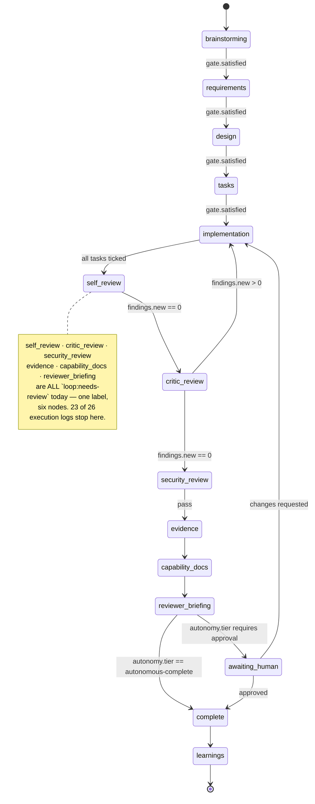
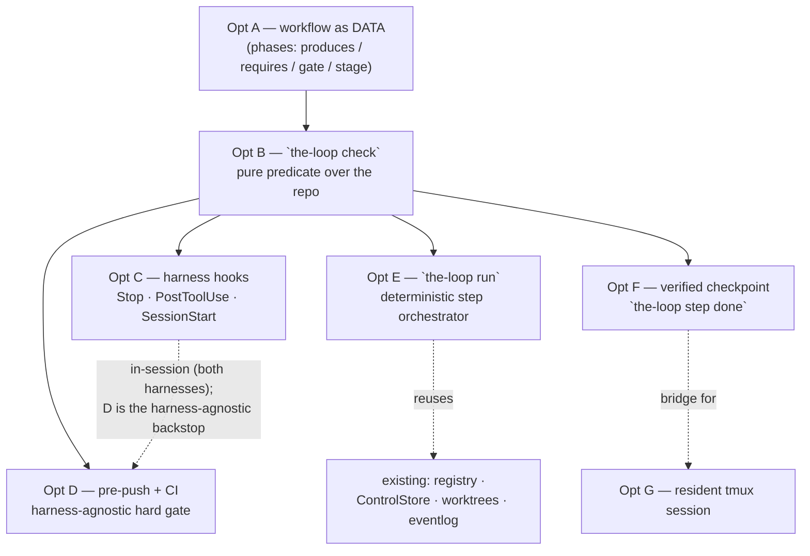
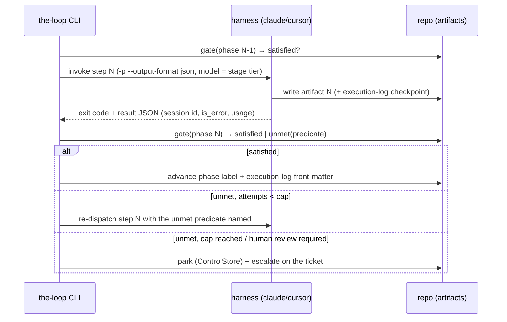

# Brainstorm: making the-loop deterministic — enforced steps, not remembered ones

> Root artifact for [issue #109](https://github.com/MadaraUchiha-314/the-loop/issues/109).
> The issue is explicitly exploratory ("how do we make these top level workflow more
> programmatic?"), so the loop starts here. This brainstorm establishes what the
> non-determinism actually costs today (with in-repo evidence), answers the ticket's
> mechanical questions about session management and completion detection, lays out the
> design space, and proposes a sequencing. Iterate with feedback; once locked, derive
> `requirements.md` for the subset the owner greenlights.
>
> **Direction set by the owner on PR #110:** model the process as an explicit **graph** of
> nodes with an orchestration layer determining the edges (static now, agent-selected
> later). See **§ Architecture: the-loop as a graph** — it supersedes the options list,
> which is re-cast as the architecture's layers.

## Problem / opportunity

the-loop's PDLC — `(brainstorm) → requirements → design → tasks → implement → self/critic
review → evidence → complete → learn` — exists **only as prose**. `SKILL.md`,
`reference/workflow.md` and `commands/*.md` describe it; nothing evaluates it. Every phase
gate, every "iterate until locked", every "keep the checkmarks current" is an instruction
the model is asked to remember across a long, context-resetting run. The model is free to
skip a step, invent one, or declare a step done that isn't — and no code disagrees.

**This is measurable in this repository, today.** Counting the checked-in specs of work
already merged:

| Signal | Count | What it means |
|---|---|---|
| Spec folders under `docs/specs/` | 34 | — |
| …with `requirements.md` | 28 | 6 items produced no requirements artifact at all |
| …with `tasks.md` | 24 | 10 items skipped the tasks-breakdown artifact |
| …with `execution-log.md` | 25 | 9 items ran with no resume anchor / phase mirror |
| `requirements.md` still `status: draft` | 15 of 28 | design was derived from an **unlocked** upstream artifact |
| `design.md` still `status: draft` | 16 of 33 | same, one link further down the chain |
| `execution-log.md` with `phase: complete` | **0 of 25** | no work item was ever closed out in its own log |
| `execution-log.md` stuck at `phase: needs-review` | 22 of 25 | the log stops mid-state-machine |
| GitHub issues labelled `loop:complete` | 15 | the *label* mirror says the same items **are** complete |

The last two rows are the finding in miniature: the phase state machine is mirrored in two
places — the ticket label and the execution log's `phase` front-matter — the rules say to
keep them in sync, and **they disagree on 22 work items**. Nothing noticed, because
nothing is looking. One of those logs still carries the template's own inline comment
(`phase: needs-review          # not-started | brainstorming | …`), pasted through
untouched — a step performed as text-copying rather than as a state transition.

The opportunity is not to make the agent more obedient. It is to notice that **the-loop
already writes its state to disk in a structured, machine-readable form** — `status:` and
`phase:` front-matter, named artifact files, `- [ ]`/`- [x]` checkmarks, a phase label per
ticket — and that a state machine whose state is already materialized needs only a
**checker**, not a rewrite. The determinism is one pure function away; what is missing is
that nothing calls it.

Framed as the ticket's own two failure modes:

- **Skipping a step** — the artifact for phase N+1 is written while phase N's artifact is
  missing, unlocked, or incomplete. This is a *predicate over files*: decidable in code,
  cheaply, with no model in the loop.
- **Adding a step** — the agent invents work the workflow does not define (an extra review
  round, a refactor nobody asked for, a "phase" that isn't one). This is decidable only
  against a **declared** list of steps — which the-loop half has already
  (`workflow.phases` in `harness-config.yaml`) but which today names phases without saying
  what each one *produces* or *requires*.

## Context & constraints

What is already true, so we build on it rather than past it:

- **The artifact chain is already the hand-off protocol the issue asks for.** Each step
  already has exactly one durable output that the next step consumes:
  `brainstorm.md → requirements.md → design.md → tasks.md → code + execution-log.md`.
  The issue's own observation ("each step needs a clear output artifact… we kind of
  already do this") is correct and is the single most important asset here: **no new
  data model is needed to make the workflow programmatic.**
- **Front-matter is already a status register.** Every artifact template carries
  `status: draft | in-review | approved` and the execution log carries `phase:`. These
  were designed as human-readable metadata; they are equally machine-readable, and are
  precisely the fields a gate would read.
- **The CLI already owns durable, restart-surviving state.** `SessionRegistry`
  (work item → harness session id, cwd, runner, tmux target, recent deliveries),
  `ControlStore` (durable start/stop/pause/resume requests, issue-106), the JSONL event
  log (decision-025), per-work-item worktrees (issue-76) and delivery-id dedup all
  persist across daemon restarts. An orchestrator would not need to invent persistence —
  it would need to *use* what issue-106 just finished building.
- **Two runners exist, with opposite context economics** (decision-021):
  - `process` — each event is a fresh `claude -p … --resume <id> --output-format json`
    subprocess. Cold, but it **exits**, and the exit is a hard, parseable completion
    signal.
  - `tmux` — the harness TUI stays resident in `loop-<slug>`; events are bracketed-pasted
    in via `load-buffer`/`paste-buffer`/`send-keys`. Warm context (cheap), but there is
    **no exit event** to observe.
  This tension is the heart of the ticket's last question and is treated in its own
  section below.
- **Fresh context per step is already the *policy*, not a hazard to avoid.**
  `contextManagement.phaseBoundary: clear` deliberately starts implementation on a clean
  window that re-reads the locked spec from disk (plan-mode style), and
  `taskBoundary: compact` trims between tasks. The checked-in artifacts *are* the memory.
  So "how do we make sure each step is not fresh context?" partly inverts: the-loop's
  answer is that a step **should** be fresh, and `execution-log.md`'s latest `Next:` plus
  the locked upstream artifact are the cheap rehydration payload. What is missing is not
  continuity — it is a guarantee that the rehydration actually happened correctly.
- **`tokenEconomy.modelRouting.stages` already maps stages 1:1 onto the steps** this issue
  wants to programmatize (`brainstorm: frontier`, `tasks: standard`, `evidence: economy`,
  …). Today that mapping is advisory prose the harness may honour. A step-per-invocation
  runner is what would make it *actually* selected, because the invocation is the thing
  that carries `--model`.
- **Hard constraints that bound any solution:**
  - **Zero bundled runtime (decision-005, softened by decision-038).** the-loop
    subprocess-drives the *official* CLIs and adds no agent SDK or framework. Any answer
    is prompt/skill/config shaped, harness-native hooks, or thin Python in the existing
    CLI — never a reimplementation of an agent loop.
  - **Two harnesses, one source.** A lever that only works in Claude Code is half a lever.
    Both harnesses expose a hook set covering the enforcement points this issue needs,
    but with **different dialects and different continuation semantics** (see below), so
    the shared piece must be the checker and the divergence must live in a thin wrapper.
  - **The human gates are the point, not friction.** `requireHumanReviewPerPhase` and the
    risk-tiered autonomy gates must survive any orchestration; determinism must make the
    wait states *explicit*, never optimize them away.
  - **Advisory levers must stay advisory; gates must become real.** the-loop already
    distinguishes these (token economy: advisory; ready-to-ship: a gate). This work is
    about the second category only.

## The mechanical questions the ticket asks

These are answerable from the harnesses' documented behaviour and this repo's code, and
they constrain every option below — so they come before the options.

### How does Claude/Cursor session management actually work?

- **Claude Code, headless:** `claude -p "<prompt>" --output-format json` runs one turn to
  completion, prints a terminal result object (session id, `is_error`, usage/cost) and
  **exits**. `--resume <session-id>` continues a recorded conversation; resume lookup is
  scoped to the project directory, which is why `Session.cwd` is recorded and why the
  workspace/worktree layout (issue-76) matters. `--output-format stream-json` emits the
  same lifecycle as a stream of events ending in a terminal `result`.
- **Claude Code, interactive:** `--session-id <uuid>` pre-assigns the id (this is what
  lets the-loop register a tmux session *before* the harness reports anything), and
  `--resume <id>` without `-p` continues the conversation inside the TUI. The-loop
  already relies on both (`ClaudeCodeAdapter.interactive_argv` /
  `interactive_resume_argv`).
- **Cursor:** `cursor-agent -p … --resume <chat-id>` mirrors the headless shape; the-loop
  cannot pre-assign an interactive id, which is exactly why `interactive_argv` raises
  `UnsupportedRunnerError` for it and tmux-mode spawns fail cleanly rather than silently.
- **the-loop's layer on top:** a work item ref (`github:OWNER/REPO#N`) → one registered
  session; per-session FIFO queue with a global concurrency semaphore; at-most-once
  delivery via `X-GitHub-Delivery` dedup (in-memory cache + durable `recent_deliveries`);
  respawn-with-resume plus a liveness probe when a tmux session is found dead (issue-89);
  auto-close when the work item closes.

**Conclusion:** session management is already solved and durable. An orchestrator would be
adding *sequencing*, not *session plumbing*.

### How does the CLI know a step is complete — and how is that different from "waiting for the user"?

This is the sharpest question in the ticket, and it has a two-part answer.

**Part 1 — "the agent stopped" is observable, per mode:**

| Mode | "the agent stopped talking" | "the agent is waiting on a human" |
|---|---|---|
| `claude -p --output-format json` | process exit + terminal result JSON (`is_error`, `session_id`, usage) | *cannot happen* — headless never blocks on a human; it just ends |
| `--output-format stream-json` | terminal `result` event on the stream | — (same) |
| tmux TUI (resident) | `Stop` hook fires when Claude finishes responding; `Notification` with matcher `agent_completed` | `Notification` with matcher `agent_needs_input`, `permission_prompt`, or `idle_prompt` |
| `cursor-agent` TUI | `stop` hook fires at the end of **each agent turn** (not at chat close) | — (Cursor exposes no documented needs-input notification; the gate predicate covers it) |

So the distinction the ticket asks about is **already a first-class, documented signal in
Claude Code**: `Notification`'s matchers separate `agent_needs_input` / `permission_prompt`
/ `idle_prompt` from `agent_completed`, and `Stop` fires on turn end. In headless mode the
question dissolves entirely — the process exits, and a step that *should* wait for a human
ends by writing its artifact as `status: in-review` and parking the work item.

**Both harnesses can also be made to *continue* — by different mechanisms with the same
effect.** This matters more than detection, because it is what turns a gate from a report
into an enforcement point:

| Harness | Continuation mechanism | Runaway protection |
|---|---|---|
| Claude Code | `Stop` hook exit 2 / `decision: "block"` — **prevents** the stop and the reason goes back to the model; `hookSpecificOutput.additionalContext` continues non-blockingly | **none built in** — the-loop must impose the attempt cap |
| Cursor | `stop` hook **cannot block**, but returns `followup_message`, which Cursor auto-submits as the next user turn | **built in** — a configurable `loop_limit`, capped by Cursor at 5 auto-followups |

Either way the loop closes the same: the agent finishes a turn → the hook runs
`the-loop check` → an unmet predicate goes back to the agent as its next input → the agent
repairs. Neither harness needs the-loop to parse a single sentence of prose. The one
asymmetry worth designing around is the *runaway* case, and it points the opposite way
from the obvious guess: Cursor caps auto-followups natively, so it is **Claude Code** that
needs the-loop to enforce the attempt cap itself.

**Part 2 — and it does not matter as much as it looks, because "stopped" ≠ "done".**

A stop signal answers *did the turn end*. It never answers *did the step complete
correctly*. Only a predicate over the checked-in artifacts answers that:

> phase `design` is complete ⟺ `docs/specs/<id>/design.md` exists ∧ its front-matter is
> `status: approved` ∧ it contains a non-empty **Security design** section ∧ every trust
> boundary named in `requirements.md` appears in it ∧ the ticket label is `loop:design`
> ∧ `execution-log.md`'s `phase` agrees.

That predicate is pure, cheap, testable with pytest, harness-agnostic, and immune to a
model's opinion of its own work. **It is the load-bearing piece of every option below** —
which is why it is worth building even if no orchestrator is ever written.

### How do we recover from failure modes?

The ticket's own observation is right: an agent recovers well because it introspects
continuously; a rigid external driver recovers badly. The synthesis is that recovery
should be **deterministic in its decision and agentic in its repair** — code decides
*that* something is wrong and *what* is unmet; the agent decides *how* to fix it.

| Failure | Detected by | Recovery |
|---|---|---|
| Step process exits non-zero | exit code / `is_error` | bounded retry of the same step, with the error text appended to the prompt |
| Step "succeeded" but gate unmet | the gate predicate | re-dispatch the same step naming the **specific** unmet predicate — deterministic feedback beats "try harder" |
| Same gate failure twice running | attempt counter | escalate to a human (mirrors `reviews.escalateOnRepeatFinding`), record in `conflicts.md` |
| Harness/tmux session died | `has_live_session` probe | **already implemented**: respawn + `--resume` + `survived()` liveness probe, falling back to a fresh conversation (issue-89) |
| Agent blocked on a human | `Notification: agent_needs_input`, or the artifact landing at `status: in-review` | park the item; the durable `ControlStore` + webhook/poller already deliver the human's reply back into the same session |
| Daemon restart mid-run | — | state is files: registry + control store + execution log + spec front-matter. Resumption re-evaluates the gate and continues from the first unmet phase |
| Gate is unsatisfiable (a `Stop`-hook block loop) | attempt counter | hard cap → surface the failing predicate to a human. **Any blocking hook needs this cap**, or the loop burns tokens forever |

### Will this consume a lot of tokens?

Per-step invocation trades **warm context** for **determinism and cheap failure**. Four
things make the trade favourable, and all four already exist in-repo:

1. **The rehydration payload is small and already written** — the locked upstream artifact
   plus the execution log's latest `Next:` (`reference/context.md` was designed for exactly
   this).
2. **Phase-scoped progressive disclosure** (issue-37, Option B) means step N loads only its
   own reference file, not the whole corpus. A per-step invocation is what makes that
   *enforceable* rather than hoped-for.
3. **Per-step model routing becomes real** — `tokenEconomy.modelRouting.stages` already
   declares `evidence: economy`, `capability-docs: economy`, `design: frontier`. Steps that
   are separate invocations can actually be routed; steps inside one conversation cannot.
4. **A cheap failure is worth tokens.** Today a skipped step is discovered in human review,
   costing a full re-run. A gate that fails in milliseconds costs one re-dispatch.

And it is not all-or-nothing: continuity-hungry steps (self-review after implementation)
can `--resume` the previous step's session, while independent steps (evidence,
capability-doc fold-in) start fresh. That choice is per-step data, not a global mode.

## Ideas & options

`✅` leaning to adopt · `○` parked / optional · `✗` rejected

> **Superseded as a menu, retained as a record.** The owner set the direction on PR #110:
> an explicit graph with an orchestration layer over it. These options are no longer
> alternatives to choose between — each became a **layer** of the architecture in
> § *Architecture: the-loop as a graph* (see the mapping table there). They stay here for
> the reasoning behind each, and for the rejected list, which still holds.

### Option A — Declare the workflow as data, not prose ✅ (foundation)

Promote `workflow.phases` from a list of names into a **machine-readable phase spec**:
each phase declares what it `produces`, what it `requires`, its `gate` predicates, its
command, its model tier and its autonomy gate. One declaration, read by **both** the skill
(rendered into the prompt) and the CLI (evaluated as code) — so prose and enforcement can
never drift.

```yaml
workflow:
  phases:
    - name: design
      produces: [design.md]
      requires: [requirements.md@approved]
      gate:
        - frontMatter: {status: approved}
        - sections: ["Security design"]
        - label: "loop:design"
      command: /the-loop:create-design
      stage: design            # → tokenEconomy.modelRouting.stages
      humanReview: true
```

*Pro:* answers "make it programmatic" at the data layer, which every other option needs
anyway; makes "no extra steps" decidable (a step not declared is not a step); costs
nothing at runtime. *Con:* a second schema surface to version and validate; over-modelling
risks a config nobody can read — keep the vocabulary tiny and let prose keep the nuance.

### Option B — The gate checker: `the-loop check <id> [--phase P]` ✅ (the increment that pays)

A pure function over the repo that evaluates Option A's predicates and reports, per phase,
`satisfied | unmet(<specific predicate>)`. No sessions, no harness, no network. Output in
`table|json` (json is what a hook or CI consumes). It is the single artifact that makes
every failure mode above *detectable*, and it is ~a few hundred lines of stdlib Python
plus pytest — the minimalism ladder's answer to "make the workflow programmatic".

*Pro:* immediately useful with zero orchestration; harness-agnostic; testable; retrofits
onto the 34 existing spec folders as a **drift report** (it would have caught all 22
`needs-review` logs on day one). *Con:* a checker that nothing calls changes nothing —
which is why it must ship *with* at least one enforcement point (Option C or D).

### Option C — Enforce where the harness cannot skip it: harness hooks ✅

Wire the checker into lifecycle points the model does not control:

- **`Stop`** — exit 2 blocks the stop and feeds the unmet predicate back, so the agent
  cannot end a turn having skipped a step. *This is the single highest-leverage hook for
  this issue.* Needs the attempt cap from the failure table.
- **`PostToolUse`** on writes under `docs/specs/**` — validate an artifact the moment it
  is written (catches an unlocked upstream immediately, not three phases later).
- **`SessionStart` / `UserPromptSubmit`** — inject the current phase and the *next
  required step* as `additionalContext`, so the agent never re-derives the workflow.
- **`PreToolUse`** on `git push` / PR creation — the last cheap moment before work becomes
  externally visible.

**This is a cross-harness lever, not a Claude-only one.** Cursor's hook set covers the same
ground (session lifecycle, tool/shell/MCP surrounds, file read and edit, prompt submission,
compaction, and `stop`), so the same `the-loop check` invocation sits at the same places.
The mechanisms differ where the previous section describes — Claude blocks the stop, Cursor
returns a `followup_message` Cursor auto-submits — but the enforcement loop is identical.

*Pro:* enforcement at the exact moment of deviation; uses documented harness features on
**both** harnesses; no new runtime. *Con:* two hook dialects to keep in step (a shared
`the-loop check --format json` keeps the divergence to the wrapper, not the logic); the
harnesses' hook *bodies* differ in schema, so a shared checker with per-harness adapters is
the shape to aim for; and the runaway risk is real and asymmetric — Cursor caps
auto-followups at 5, Claude Code caps nothing, so the-loop must impose the attempt cap on
the Claude path. Treat that cap as a safety-critical detail, not a footnote. The one thing
still to **verify empirically**: that `stop` is delivered in the `cursor-agent` **CLI**
surface (which is what the-loop drives) and not only in the IDE — reports on this conflict
and are of different vintages, so it is a five-minute experiment rather than a literature
search.

### Option D — Enforce at the boundary that is harness-agnostic: pre-push + CI ✅

Run `the-loop check` in `hooks.prePush` and as a required CI check: a PR whose diff touches
code without a locked spec, with a phase-label/execution-log mismatch, with unticked tasks,
or with no capability-doc update fails. Same command in both places (CI parity is already a
the-loop rule).

*Pro:* works for **every** harness and for a human contributor; impossible to prompt away;
the merge boundary is where skipping actually costs something. *Con:* late feedback — it
catches the omission after the work, so it complements Option C rather than replacing it.
Needs an escape hatch for legitimately exempt changes (a typo fix should not need a spec)
— which is what `autonomy` tiers are already for.

### Option E — `the-loop run <id>`: the CLI as step orchestrator ○ → ✅ (second increment)

The full answer to "can the-loop CLI orchestrate all this?": a deterministic Python loop
over Option A's phase list. For each phase — resolve the model tier, render the phase
prompt, invoke the harness **headless** (`-p --output-format json`, fresh or `--resume`
per the phase's declaration), then evaluate Option B's gate; advance, retry, or park.
Control flow lives in Python; the model never decides what comes next.

*Pro:* real ordering determinism; per-step model routing becomes enforceable; process exit
is an unambiguous completion signal, so no prose parsing anywhere; resumable by
construction (state is files + registry); reuses the dispatcher/registry/ControlStore
rather than adding a runtime. *Con:* the largest new surface here; human-review gates need
explicit park/resume states (fortunately: issue-106 just built durable pause/resume);
loses the resident-context economics of the tmux runner; and it is a genuine bet that
per-step prompts produce work as good as one continuous agent — which should be **measured
against the existing token telemetry**, not assumed.

### Option F — Agent self-reports step completion (`the-loop step done --phase P`) ○

The agent calls a CLI command to declare a step finished. *Pro:* trivial; works in the
resident tmux runner where no exit event exists. *Con:* **the completion signal is the
model's own claim** — precisely the non-determinism the issue is about. Only acceptable
*combined with* Option B: the command runs the gate and refuses the claim when unmet. In
that shape it is not self-reporting at all; it is a verified checkpoint, and it is a
reasonable bridge for tmux-mode sessions.

### Option G — Keep the resident session, drive it with typed step prompts ○

Middle path: keep one warm session per work item (already implemented), have the CLI paste
the next step's prompt, and detect completion via the `Stop`/`Notification` hooks of
Option C rather than process exit. *Pro:* cheapest in tokens; preserves the observability
and human-attachability that issue-32/86 were built for. *Con:* completion detection is
hook-dependent and therefore Claude-only today; no per-step model routing (one process,
one model); harder to reason about failure isolation.

### Rejected

- **Parsing the agent's prose for "step complete" ✗** — non-deterministic by construction;
  the exact failure mode this issue exists to remove. Structured output (exit code, result
  JSON, hook event) or a file predicate — never narration.
- **Reimplementing an agent loop / adopting an agent SDK to get control ✗** — contradicts
  decision-005 and duplicates what the harnesses already do well. the-loop's edge is the
  *process*, not the runtime.
- **One mega-prompt that performs the whole PDLC in a single turn ✗** — no checkpoints, no
  gates, maximal context rot, and a failure anywhere loses everything. It is the current
  behaviour's failure mode, amplified.
- **Removing the human review gates to make the loop fully automatic ✗** — determinism
  must make wait states explicit, not delete them. Risk-tiered autonomy already decides
  which items may complete unattended.
- **Enforcing determinism purely by writing stricter prompts ✗** — this is what exists
  today. The evidence table above is what it produces. Prompts remain necessary (they
  steer) but they cannot be the *gate*.

## Architecture: the-loop as a graph (owner direction, PR #110)

> Owner steer on PR #110: *"there's no clear definition and hooks around logical 'node'
> boundaries… the hooks provided by the agent harnesses are too fine grained and lack the
> appropriate details to figure out which phase of the-loop we are in… create a 'graph' of
> all these disjointed nodes of the-loop's process and have an orchestration on top that
> determines the edges. For now static edges, later dynamic using the same agent harness."*
> This section supersedes the options above as the chosen direction; they are re-cast as
> **layers of this architecture**, not as alternatives to it.

### The gap this names, stated precisely

The critique is right and it is sharper than "the workflow is only prose". Two distinct
event spaces have been conflated:

| | Harness lifecycle | the-loop lifecycle |
|---|---|---|
| Events | turn ended, tool called, session started, prompt submitted | **node entered / node exited / gate failed / awaiting human / escalated** |
| Granularity | many per node — a `Stop` fires on every turn | one per node, possibly spanning days |
| Knows the phase? | **no** — the payload carries `session_id`, `cwd`, `transcript_path`; nothing about `loop:design` | by definition |
| Exists today? | yes, in both harnesses | **no — nowhere in the-loop** |

**There is no "the brainstorming node completed" event anywhere in the system.** That is
the actual defect. A `Stop` hook cannot be it, because it fires many times per node and
carries no phase; a phase *label* cannot be it either, because a label is a state, not a
transition, and nothing emits on change. So the-loop has no place to hang the very things
the owner names: check the node produced its artifact, notify the collaborators, advance.

**The evidence table at the top of this document is this defect's fingerprint.** Of 26
execution logs, **23 sit at `phase: needs-review`** — and `needs-review` is one label
covering *at least six distinct pieces of work*: self-review ×3, critic-review ×3, the
security-review gate, evidence, capability-doc fold-in, the reviewer briefing, and
learnings. The state machine simply has no vocabulary past that point, so the log stops
there. The drift is not randomly distributed; **it piles up exactly where the node
granularity runs out.** The declared phase list is 8 names for a process with roughly
twice as many logical nodes, and the un-named ones are precisely the ones that get skipped.

### Layer 1 — The graph (data)

A **node** is one logical unit of the PDLC with exactly one durable output. Nodes that
today hide inside `implementation` and `needs-review` become first-class and therefore
addressable, gateable and notifiable:

```yaml
workflow:
  graph:
    nodes:
      - id: design
        produces: {artifact: design.md, locked: true}
        requires: [requirements]
        actor: agent                 # agent | human | code
        stage: design                # → tokenEconomy.modelRouting.stages
        gate:
          - frontMatter: {status: approved}
          - sections: ["Security design"]
          - enforcesBoundariesFrom: requirements.md
        notify: {onEnter: [], onAwaitHuman: [approver], onGateFail: []}
        humanReview: true
        maxAttempts: 3

      - id: critic-review           # today: invisible inside `needs-review`
        produces: {artifact: execution-log.md, section: "Review cycles", rows: ">=1"}
        requires: [self-review]
        actor: agent
        stage: critic-review
        gate: [{reviewRounds: {type: critic, min: 1, stopOnNoNewFindings: true}}]
        notify: {onEscalate: [approver]}
```

An **edge** is a typed transition whose `when` is evaluated over graph state — static
today, agent-evaluated later:

```yaml
    edges:
      - {from: design, to: tasks-breakdown, when: "gate.satisfied"}
      - {from: design, to: design,          when: "gate.failed && attempts < maxAttempts"}
      - {from: design, to: escalated,       when: "gate.failed && attempts >= maxAttempts"}
      - {from: critic-review, to: implementation, when: "findings.new > 0"}   # a cycle, deliberately
      - {from: critic-review, to: security-review, when: "findings.new == 0"}
```

Two properties worth stating, because they are the whole point:

- **Cycles are first-class, not a modelling failure.** review → fix → review *is* the loop;
  a DAG cannot express it. This matches where the literature landed (below).
- **"No extra steps" becomes decidable.** A transition the graph does not declare cannot
  be taken. This is the half of issue #109 that prose can never enforce, and it falls out
  of the data model for free.

### Layer 2 — Graph state (the checkpoint)

Per work item, a durable record of *where in the graph we are*: `currentNode`, per-node
`attempts`, entered/exited timestamps, the artifact digest each gate last saw, and the
parked reason when waiting on a human. It lives beside the artifacts and is checked in —
the-loop's existing bet that **the repository is the memory**. This is the one genuine
addition to the data model; everything else already exists on disk.

### Layer 3 — Node-lifecycle hooks (what the owner asked for)

the-loop's **own** extension points, harness-independent, fired by the runtime at node
boundaries — the layer that does not exist today:

| Hook | Fires | Does |
|---|---|---|
| `onEnter(node)` | transition into a node | set the phase label, open the execution-log entry, disclose *only* that node's reference file, select the model tier |
| `onExit(node)` | node claims completion | evaluate the gate → `satisfied` / `unmet(predicate)` |
| `onGateFail(node)` | gate unmet | take the retry edge, feeding the unmet predicate back as the agent's next input |
| `onAwaitHuman(node)` | node needs a decision | park; **notify the roles in `notifications.events` via `collaborators.yaml`** |
| `onEscalate(node)` | attempts exhausted / repeat finding | log to `conflicts.md`, notify, stop advancing |
| `onExitGraph()` | terminal node | close the session, final evidence, learnings |

`notifications.events` and `collaborators.yaml` already exist and already declare
*decision-pending → approver*, *phase-approval-pending → approver* — **nothing fires
them programmatically today**. Node-lifecycle hooks are the missing emitter, which is
exactly the owner's "notifies the user and collaborators through the channels".

### Layer 4 — Triggers: how a boundary is *detected*

This is where the harness hooks are rescued rather than discarded. **The harness hook is a
clock; the graph is the state; the gate is the decision.** A `Stop` hook does not need to
know which phase it is in — it asks the-loop, which reads `currentNode` from graph state.
That inverts the owner's objection into the design:

| Transport | Boundary signal | Fidelity |
|---|---|---|
| **Orchestrated** (`the-loop run`, node = one headless invocation) | process exit + terminal result JSON | **exact** — no inference |
| **Resident session** (tmux) | `Stop` / `stop` hook as a tick → resolve `currentNode` → evaluate that node's gate only | good — the hook supplies timing, the graph supplies meaning |
| **Event-driven** (webhook / poller) | a review comment, CI result or label change is an *edge input* | good — already built |
| **Backstop** (pre-push / CI) | `the-loop check` over the whole graph | late but unskippable, harness-agnostic |

### Layer 5 — Dynamic edges, safely

The owner's "later, edges created dynamically by the same agent harness" works — with one
constraint that preserves determinism:

```yaml
      - from: implementation
        when: {agent: "Which node should run next given the gate report?"}
        choices: [self-review, tasks-breakdown, escalated]   # the agent picks FROM this set
```

The agent may **select among declared edges**; it may not **invent** one. Structured
output (an enum of node ids), never prose; the choice is logged to the event log with its
reason; an unparseable or out-of-set answer falls back to the static edge. Non-determinism
is thereby confined to *routing among sanctioned options* — which is judgement, the thing
models are good at — while the set of reachable states stays fixed, which is the guarantee
issue #109 wants.

### How the earlier options map in

Nothing above discards the earlier increments; it gives them a home:

| Earlier option | Role in the graph architecture |
|---|---|
| A — workflow as data | **becomes** the node/edge schema (Layer 1) — richer, but the same idea |
| B — `the-loop check` | **becomes** the gate evaluator the runtime calls at `onExit` |
| C — harness hooks | **demoted** from enforcement mechanism to *trigger transport* (Layer 4) |
| D — pre-push / CI | **kept** as the harness-agnostic backstop |
| E — `the-loop run` | **promoted** to the graph runtime — the orchestrator (Layers 2–3) |
| F — verified checkpoint | **becomes** the resident-session `onExit` trigger |
| G — resident session | **kept** as one transport, not a competing design |

### Is this "graph engineering"?

**Yes — and the term is current, not speculative.** The lineage in the literature runs
*prompt engineering → flow engineering → graph engineering*:

- **Flow engineering** (AlphaCodium, 2024) established that structuring an LLM task as a
  multi-step iterative flow beats a single well-designed prompt — reported as roughly
  doubling accuracy on the same model, and as a larger gain than the model upgrade itself.
- **Graph engineering** (2026) is the current framing: designing an agent's control flow as
  an explicit directed graph where nodes do work (deterministic code, one LLM call, a tool
  call, or a whole sub-agent) and edges — deterministic *or* conditional on node results,
  state, or an external signal — define what happens next. The industry has moved from
  open-ended multi-agent chat loops toward **explicit workflow graphs modelled as state
  machines**, and the canonical representation is the **stateful directed graph with typed
  nodes, conditional edges and persistent checkpoints**. Cycles are treated as a feature,
  not a bug.

The owner's proposal is that shape, and the vocabulary maps 1:1: typed nodes, static edges
now / conditional edges later, checkpoints (Layer 2).

**But the-loop should implement it, not import it.** Taking a LangGraph-style dependency
would be the wrong call here, and not only because of decision-005:

- the-loop's nodes are **subprocess invocations of official harness CLIs**, not in-process
  Python callables. The graph runtime's job is `argv` + exit code + file predicates.
- the-loop's checkpoints are **checked-in files in the user's repository**, not a
  serialized runtime object in a database. That is a genuine differentiator: the-loop's
  graph survives a machine change, a session change and a three-day human review, and is
  reviewable in a PR diff — which no in-process graph library gives you.
- the-loop's nodes have **human actors**. `onAwaitHuman` is a first-class node state that
  can last days; general graph runtimes model this as an awkward interrupt.

So: adopt the *model* and the *vocabulary* (they are well-tested and now standard), write
the runtime as thin Python over the existing registry/ControlStore/event-log, and take no
new dependency.

## Sketches & notes

The graph, as the architecture above would declare it — nodes the current phase list cannot
name are dashed, and the review cycle is a genuine loop:



Where each option sits, and the one dependency that matters (everything enforces the same
declared phase spec through the same checker):



The step contract an orchestrated run would follow — note that **every** arrow out of the
harness is a structured signal, never prose:



## Open questions

Raised for the owner on the ticket (paper trail); this brainstorm is not locked until they
are answered.

1. **Scope.** Epic (A → B → C/D → E as separate work items) or one PR? The recommendation
   below assumes an epic with a deliberately small first increment, but issue-37 precedent
   was "implement all suggestions in one PR".
2. **How hard should the gate be?** Warn-only, block-on-push, or block-the-turn
   (`Stop` hook exit 2)? Per risk tier, or uniform? A blocking gate is the whole point —
   and also the thing that can wedge an autonomous run.
3. **How do we hold the two hook dialects together?** Both harnesses support the
   enforcement loop (Claude blocks the stop; Cursor auto-submits a `followup_message`), so
   Option C is cross-harness — but the config format, event names and hook-body schemas
   differ. Proposal: one `the-loop check --format json` as the shared core, with a thin
   per-harness wrapper shipped in `hooks/` and `.cursor/hooks.json`. Two things to settle:
   is that split acceptable, and **does `stop` fire in the `cursor-agent` CLI** (what
   the-loop actually drives) or only in the IDE? The second is an experiment, not a
   discussion — worth running before requirements lock.
4. ~~**Orchestration or verification?**~~ **Resolved by the owner on PR #110:
   orchestration, over an explicit graph.** the-loop *drives* the nodes; verification
   becomes the gate evaluator inside the runtime rather than a competing product.
   Remaining sub-questions are 8–11.
5. **Resident vs per-step sessions.** If we orchestrate: warm tmux session (cheap,
   hook-dependent completion) or per-step headless invocation (deterministic exit,
   per-step model routing, cold start)? Can be per-phase data rather than one global
   answer.
6. **How strict is "no extra steps"?** Should the gate merely *require* the declared
   artifacts, or also *reject* undeclared ones? The latter is stronger and riskier — a
   useful ad-hoc note becomes a gate failure.
7. **Retrofit policy.** `the-loop check` run over the 34 existing spec folders will report
   a lot of drift. Fix it in this work item, fix it opportunistically, or baseline it and
   only gate new work?

   *The remaining questions were opened by the graph architecture (owner direction,
   PR #110).*

8. **Node granularity — how far do we split?** The evidence says `needs-review` is doing
   the work of six nodes. But splitting has a cost: every node is a label, a gate, a
   notification surface and a potential wedge point. Proposal: split exactly where a
   *distinct artifact or a distinct human decision* exists (self-review, critic-review,
   security-review, evidence, capability-docs, reviewer-briefing all qualify), and no
   further. Is that the right line — and do the new nodes each get a `loop:` label, or
   does the label stay coarse while graph state carries the fine detail?
9. **Where does graph state live?** A new checked-in `graph-state` file per work item, or
   an extension of `execution-log.md`'s front-matter? The log is already the resume anchor
   and already reviewed in the PR diff, which argues for extending it; a separate file is
   cleaner to parse and harder for a human to accidentally corrupt.
10. **Does the graph replace `workflow.phases` or sit beside it?** A migration question
    with a compatibility cost: existing projects have the 8 labels wired into their
    tickets. Proposal: the graph is authoritative and the phase list is *derived* from it
    (each node declares the label it maps to), so old labels keep working.
11. **When do dynamic edges arrive, and how are they bounded?** Confirmed as a later
    increment. The proposal above constrains the agent to *selecting among declared
    edges* with structured output, never inventing one. Is that the right bound, or should
    the first version have no agent-evaluated edges at all?

## Leaning / working hypothesis

**Model the process as an explicit graph; give the graph its own node-boundary lifecycle;
let the harness hooks be the clock, never the state — and never parse prose.**

The owner's steer on PR #110 settles the open orchestration question and, more usefully,
relocates the defect: the problem is not only that the workflow is unenforced, it is that
**the-loop has no node boundaries to enforce anything at.** The build order follows the
layers, each independently useful:

1. **Declare the graph (Layer 1).** Nodes with `produces` / `requires` / `gate` / `actor` /
   `stage` / `notify`, and edges with `when`. This is the earlier "workflow as data" made
   honest about granularity: the six nodes currently hiding inside `needs-review` become
   addressable, which is where the measured drift concentrates.
2. **Add graph state (Layer 2).** `currentNode` + per-node attempts, checked in beside the
   artifacts. Small, and it is what makes every later layer resumable across sessions,
   machines and multi-day human waits.
3. **Implement the node-lifecycle hooks (Layer 3) with the gate evaluator inside them.**
   `onEnter` / `onExit` / `onGateFail` / `onAwaitHuman` / `onEscalate`. The earlier
   `the-loop check` is not dropped — it *is* the `onExit` gate. And `onAwaitHuman` is what
   finally fires `notifications.events`, which has been declared-but-inert since it was
   written.
4. **Wire the transports (Layer 4), strongest first.** `the-loop run` where a node is one
   headless invocation and the boundary is a process exit; the resident session's
   `Stop`/`stop` hook as a tick that asks the graph what node it is in; webhook/poller
   events as edge inputs; pre-push + CI as the unskippable backstop.
5. **Dynamic edges last (Layer 5)**, bounded to *selecting among declared edges* with
   structured output.

Three principles hold throughout:

- **Determinism belongs in the *topology*, not in the *work*.** The graph fixes the set of
  reachable states and who may move between them; the agent decides how to do a node and
  how to repair a failed gate. That keeps the recovery quality the ticket rightly credits
  the agent with, while removing its discretion over *what happens next*.
- **The artifacts are the state.** the-loop already offloads state to disk — that is what
  makes context resets affordable and work items resumable, and it is why the-loop should
  write this graph runtime rather than import one: checked-in checkpoints survive a machine
  change, a session change and a three-day human review, and are reviewable in a PR diff.
- **Harness hooks are a clock, not a state machine.** They supply *when* to look; the graph
  supplies *what we are looking at*. Conflating the two is what made the earlier draft
  treat a fine-grained, phase-blind `Stop` event as if it were a node boundary.

## Hand-off → requirements

Carries forward once locked: the **evidence-backed problem statement** — artifact and
phase-mirror drift as a measurable defect, with the finding that it **concentrates exactly
where node granularity runs out** (23 of 26 logs at `needs-review`, one label for six
nodes); the **five-layer graph architecture** (graph data → graph state → node-lifecycle
hooks → transports → dynamic edges) as the design, with the earlier options re-cast as its
layers; the **node and edge schemas** including cycles as first-class and the
"a transition not declared cannot be taken" property that makes *no extra steps* decidable;
the **node-lifecycle hook table** as the contract, with `onAwaitHuman` as the emitter that
finally fires the long-declared `notifications.events`; the **failure-mode → recovery
table** as the basis for error-handling acceptance criteria; the **completion-signal
matrix** (exit code / terminal result JSON / `Stop` + `Notification` matchers / Cursor's
`stop` — never prose) and the **continuation matrix** (Claude blocks the stop; Cursor
auto-submits a `followup_message`) as hard interface constraints, with the attempt cap
required on the Claude path because Cursor caps natively; the **hooks-are-a-clock**
principle that keeps harness hooks useful without letting them carry state; and the
decision to **implement the graph model rather than import a graph library**, because
the-loop's nodes are CLI subprocesses and its checkpoints are checked-in files.

The gating open questions requirements must resolve first: **scope** (epic vs one PR),
**gate hardness**, **node granularity** (Q8), **where graph state lives** (Q9), **graph vs
the existing `workflow.phases`** (Q10), and the **retrofit policy** for the existing 34
spec folders.

Everything rejected here — prose parsing, an agent SDK/runtime, the mega-prompt, dropping
human gates, and "write stricter prompts" — stays in this document as the record of what
was considered and why it was dropped.

## References

- Claude Code — *Hooks reference* (<https://code.claude.com/docs/en/hooks>): the `Stop`,
  `SubagentStop`, `PostToolUse`, `UserPromptSubmit`, `SessionStart` and `Notification`
  events; exit-2 blocking semantics; the `agent_needs_input` / `permission_prompt` /
  `idle_prompt` / `agent_completed` notification matchers this issue's completion question
  turns on.
- Cursor — *Hooks* (<https://cursor.com/docs/hooks#hook-categories>): the hook categories
  (session lifecycle, generic tool hooks, shell/MCP surrounds, file read and edit, prompt
  submission, compaction, `stop`) and the JSON-over-stdio contract, configured in
  `.cursor/hooks.json` / `~/.cursor/hooks.json`. The `stop` hook fires at the end of **each
  agent turn**; it cannot block completion, but its `followup_message` is auto-submitted as
  the next user turn — bounded by a configurable `loop_limit` and Cursor's own maximum of 5
  auto-followups. Background:
  [InfoQ](https://www.infoq.com/news/2025/10/cursor-hooks/),
  [deep dive](https://blog.gitbutler.com/cursor-hooks-deep-dive),
  [stop-hook walkthrough](https://lirantal.com/blog/cursor-stop-hook-lint-build-verification).
  **Open, and empirically checkable:** whether `stop` is delivered in the `cursor-agent`
  **CLI** surface or only in the IDE — reports conflict
  ([Jan-2026 request](https://forum.cursor.com/t/cursor-cli-hooks/148511),
  [earlier report](https://forum.cursor.com/t/cursor-cli-doesnt-send-all-events-defined-in-hooks/148316)).
- In-repo: `skills/the-loop/reference/workflow.md` (the phase state machine and gates),
  `reference/context.md` (checkpoint-then-reset), `docs/specs/issue-37/brainstorm.md`
  (token levers; runner economics), `docs/decisions/decision-005.md` (no bundled runtime),
  `decision-021.md` (tmux runner), `decision-025.md` (JSONL event log),
  `decision-027.md` (context management), `decision-040.md` (durable execution control),
  `cli/the_loop/webhook/dispatcher.py`, `cli/the_loop/harness/base.py`,
  `cli/the_loop/runner.py`, `cli/the_loop/control.py`.
- **Graph engineering** (the owner's question on PR #110 — the term is current):
  LangChain, *3 Years of Graph Engineering with LangGraph*
  (<https://www.langchain.com/blog/3-years-of-graph-engineering-with-langgraph>) — nodes do
  work (code, one LLM call, a tool call, or a whole agent), edges are deterministic or
  conditional on node result / state / external signal;
  [Graph Engineering for AI Agents](https://www.eigent.ai/blog/graph-engineering-ai-agents);
  [Graph-Based Agent Workflow Orchestration in Production: the 2026 Landscape](https://zylos.ai/research/2026-04-14-graph-based-agent-workflow-orchestration-production/)
  — the move from open-ended multi-agent chat loops to explicit workflow graphs modelled as
  state machines, with the stateful directed graph (typed nodes, conditional edges,
  persistent checkpoints) as the canonical representation and cycles as a feature;
  [Graph Engineering for Multi-Agent Systems](https://www.truefoundry.com/blog/graph-engineering-enterprise-guide).
- **Flow engineering** (the predecessor term): Ridnik et al., *Code Generation with
  AlphaCodium: From Prompt Engineering to Flow Engineering*
  (<https://arxiv.org/abs/2401.08500>) — structuring the task as a multi-step iterative
  flow roughly doubled accuracy on the same model, a larger gain than the model upgrade.
- [Issue #73](https://github.com/MadaraUchiha-314/the-loop/issues/73) — the earlier
  observation that the phase labels sit unused because work bypassed the loop; this issue
  is that observation generalized from labels to the whole workflow.
