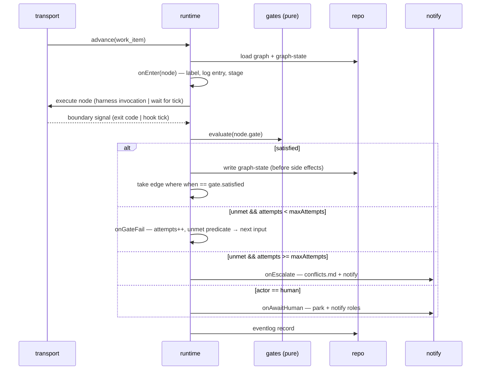

# Design: the process graph — deterministic node boundaries for the-loop

> Phase 2 of 3 (requirements → design → tasks). Derives from
> [`requirements.md`](requirements.md).
>
> **Sequencing note (paper trail).** the-loop's rule is that a downstream artifact is only
> derived from a *locked* upstream one. Here the owner directed *"let's go ahead with the
> requirements and design"* (PR #110), so both artifacts were produced in one pass and are
> reviewed together in the same PR. The rule is deliberately relaxed by the owner, not
> overlooked; if the requirements review changes anything material, this design is revised
> before tasks are derived.

## Overview

The-loop's process becomes an explicit, declared **graph**. A *node* is one logical unit of
work with exactly one durable output artifact; an *edge* is a transition whose condition is
evaluated over graph state. A small runtime enters nodes, evaluates gates at their
boundaries, notifies, and advances — emitting the node-lifecycle events that the-loop has
never had.

The design's organising principle, from the locked brainstorm:

> **The harness hook is a clock. The graph is the state. The gate is the decision.**

Nothing infers a node boundary from prose. A boundary is either a process exit
(orchestrated transport), a hook tick that then *asks the graph* what node it is in
(resident transport), or a recomputation from artifacts (repository-boundary transport).

## Architecture

```mermaid
flowchart TB
    subgraph decl["Declaration (per repo)"]
        CFG["harness-config.yaml<br/>workflow.graph"]
        SCH[".the-loop/harness-config.schema.json"]
        CFG -. validated by .-> SCH
    end

    subgraph core["the_loop.graph (new, stdlib + PyYAML)"]
        MODEL["model.py<br/>Node · Edge · Graph · load+validate"]
        GATES["gates.py<br/>closed predicate vocabulary"]
        GSTATE["state.py<br/>GraphState (currentNode, attempts)"]
        RT["runtime.py<br/>transition engine + lifecycle hooks"]
        NOTIFY["notify.py<br/>roles → channels"]
        MODEL --> RT
        GATES --> RT
        GSTATE --> RT
        RT --> NOTIFY
    end

    subgraph transports["Transports (how a boundary is detected)"]
        CHECK["`the-loop check`<br/>pure, read-only"]
        RUN["`the-loop run`<br/>node = 1 headless invocation"]
        HOOK["harness stop-hook wrapper<br/>(tick → ask the graph)"]
        CI["pre-push / CI<br/>`check --recompute`"]
    end

    subgraph existing["Existing CLI (reused, unchanged)"]
        REG["SessionRegistry"]
        CTRL["ControlStore"]
        EVT["eventlog (JSONL)"]
        ADPT["harness adapters"]
    end

    CFG --> MODEL
    RT --> CHECK
    RT --> RUN
    RT --> HOOK
    RT --> CI
    RUN --> ADPT
    RT --> EVT
    RUN --> REG
    RUN --> CTRL
    GSTATE -.->|"checked in"| REPO[("docs/specs/&lt;id&gt;/<br/>graph-state.json")]
```

Two deliberate shapes:

- **`gates.py` is pure.** It takes a repository path and a node, and returns a verdict. No
  network, no subprocess, no mutation (R3.4). That is what lets it run on every turn, in
  CI, and inside `run` without three implementations.
- **The runtime owns transitions; the transports own timing.** Adding a fifth transport
  later (an IDE integration, a different daemon) means writing a caller, not a state
  machine.

### Node lifecycle



## Components & interfaces

| Component | Responsibility | Interface |
|---|---|---|
| `the_loop/graph/model.py` | Parse and validate `workflow.graph`; expose the typed graph | `load_graph(root) -> Graph`; `Graph.node(id)`, `Graph.edges_from(id)`; raises `GraphConfigError` |
| `the_loop/graph/gates.py` | Evaluate one node's gate against the repo | `evaluate(root, work_item, node) -> Verdict(satisfied: bool, unmet: list[str])` — pure |
| `the_loop/graph/state.py` | Load/save `graph-state.json`; reconstruct from artifacts | `load(root, id) -> GraphState`; `reconstruct(root, id, graph)`; `save(...)` (atomic write) |
| `the_loop/graph/runtime.py` | Transitions + the five lifecycle hooks | `advance(root, id, transport) -> Outcome`; `current_node(root, id)` |
| `the_loop/graph/notify.py` | Resolve `notifications.events` → roles → `collaborators.yaml` channels | `notify(event, work_item, node)` — best-effort, never raises |
| `the_loop/commands/check.py` | `the-loop check` | `--format table\|json`, `--all`, `--recompute`, `--phase` |
| `the_loop/commands/run.py` | `the-loop run` | `--work-item`, `--harness`, `--max-nodes`, `--dry-run` |
| `hooks/` + `.cursor/hooks.json` | Per-harness stop-hook wrappers | shell wrapper → `the-loop check --format json` → harness-specific continuation payload |

**Reuse, not reinvention.** `runtime.py` calls the existing `HarnessAdapter` for
invocation, `SessionRegistry` for session identity, `ControlStore` for pause/stop, and
`eventlog.emit` for records. The only genuinely new persistence is `graph-state.json`.

## UI/UX design

N/A — the-loop ships a CLI and markdown artifacts; this work item has no user-facing visual
surface (`design.uiArtifacts` applies to product UI, of which the-loop has none). Human
touchpoints are the CLI's table output, the ticket label, and the notification message,
all of which are covered by the testing strategy below.

## Data models

### `workflow.graph` (per repo, schema-validated)

```yaml
workflow:
  graph:
    nodes:
      - id: design                     # required, unique
        produces:                      # required — the one durable artifact
          artifact: design.md
          locked: true                 # gate requires front-matter status: approved
        requires: [requirements]       # node ids
        actor: agent                   # agent | human | code
        stage: design                  # → tokenEconomy.modelRouting.stages
        label: "loop:design"           # optional — omit for fine-grained nodes (Q8)
        command: create-design         # MUST be a member of the closed vocabulary
        gate:
          - frontMatter: {status: approved}
          - sections: ["Security design"]
        notify: {onAwaitHuman: [approver], onEscalate: [approver]}
        humanReview: true
        maxAttempts: 3
    edges:
      - {from: design, to: tasks-breakdown, when: gate.satisfied}
      - {from: design, to: design,          when: gate.failed.retriable}
      - {from: design, to: escalated,       when: gate.failed.exhausted}
```

**`command` is an enum, not a string to execute.** Its permitted values are the-loop's own
granular commands (`brainstorm`, `new-requirement`, `create-design`, `create-tasks-plan`,
`execute-tasks`, `finish-tasks`, …). The runtime maps the enum to an invocation it
constructs itself. This is the mechanism that closes security boundary 1 — see below.

**`when` is a closed vocabulary**: `gate.satisfied`, `gate.failed.retriable`,
`gate.failed.exhausted`, `awaiting.human`, `findings.new`, `findings.none`. A value outside
it fails validation (abuse case 5). A reserved `agent:` form is accepted by the schema and
**rejected by the runtime** in this work item (Q11, out of scope) — forward compatibility
without an unimplemented execution path.

### Gate predicate vocabulary

| Predicate | Satisfied when |
|---|---|
| `exists` | the node's `produces.artifact` is present |
| `frontMatter: {k: v}` | the artifact's YAML front-matter matches every pair |
| `sections: [..]` | each named heading exists **and has non-empty body** |
| `checkmarks: complete` | no `- [ ]` remains in the artifact |
| `reviewRounds: {type, min}` | the execution log's review table has ≥ `min` rows of that type |
| `enforcesBoundariesFrom: <file>` | every trust boundary named upstream appears downstream |
| `labelInSync` | the ticket label matches the node's declared `label` |

Each is a small pure function; the set is closed and extended only by code review.

### `docs/specs/<id>/graph-state.json`

```json
{
  "version": 1,
  "workItem": "issue-109",
  "currentNode": "design",
  "nodes": {
    "requirements": {"attempts": 1, "enteredAt": "...", "exitedAt": "...", "outcome": "satisfied"},
    "design": {"attempts": 1, "enteredAt": "...", "outcome": "in-progress"}
  },
  "parked": {"reason": "awaiting-human", "since": "...", "notified": ["approver"]}
}
```

Written atomically (temp file + rename), **before** any dependent side effect (R2.2).
Checked in, so it survives a machine change and is reviewable in the PR diff.

## Error handling

| Failure | Detection | Response | Surfaced as |
|---|---|---|---|
| Graph unparseable / invalid | `load_graph` | refuse to advance **any** work item; do not fall back to unchecked behaviour (R8.3) | `GraphConfigError`, exit ≠ 0, `graph.config_invalid` event |
| Edge names an unknown node | validation | reject config with the offending id (R1.5) | as above |
| `graph-state.json` unparseable | `state.load` | treat as missing, reconstruct from artifacts, keep the file (R2.4) | warning + `graph.state_reconstructed` |
| Gate predicate unevaluable | `gates.evaluate` | report **unmet** (R3.3) | `unmet(<predicate>)` in the verdict |
| Node invocation exits non-zero | `run` | retry ≤ `maxAttempts` with the error appended (R5.2) | `graph.node_failed` |
| Same predicate fails twice | runtime counter | escalate instead of a third attempt (R8.2) | `graph.escalated` + `conflicts.md` |
| Harness session died mid-node | existing liveness probe | respawn/resume and **re-enter the same node** (R8.4) | existing `session.respawned` |
| Notification channel fails | `notify` | best-effort; log and continue — a channel outage must not wedge the graph | `graph.notify_failed` (warning) |

Levels follow `observability` (dev == runtime): `debug` for evaluation detail, `info` for
transitions, `warning` for degraded paths, `error` for refusals.

## Security design

Each boundary from `requirements.md` § Security considerations, with the mechanism that
enforces it and the negative test that proves it.

- **AuthN/AuthZ.** Unchanged and inherited: control commands still require an authorized
  actor (`authz.is_authorized`), and the-loop's own comments still carry the self-marker.
  This work item adds **no** new authentication surface and grants no new permission.
- **Boundary 1 — config → process execution.** *Mechanism:* `command` is a **closed enum**
  validated by the schema and re-checked by the runtime; the runtime constructs the argv
  itself and never interpolates configuration into a shell. No `shell=True` anywhere; all
  invocation goes through the existing `HarnessAdapter`, which already takes an argv list.
  A value outside the enum fails validation and nothing executes (abuse case 1).
  *Residual risk:* an operator who needs a custom node command has no route — recorded as
  requirements open question 1 rather than solved by a general escape hatch, because a
  general escape hatch is exactly the vulnerability.
- **Boundary 2 — agent → graph state.** *Mechanism:* graph state is a **cache, not an
  authority**. `--recompute` derives completion from artifacts alone, and the
  repository-boundary check (R7.2) always uses it, so a tampered or optimistic state file
  cannot survive review. `reconstruct` is also the recovery path for corruption, so the
  same code is exercised on the happy path rather than only in an emergency (abuse case 2).
- **Boundary 3 — gate result → harness input.** *Mechanism:* the text fed back to the agent
  is composed from the-loop's own predicate descriptions (a fixed vocabulary) plus file
  paths from the graph — never from webhook payloads, comment bodies, or artifact contents
  (abuse case 3). This preserves the existing rule that payload text is data, never
  instruction.
- **Boundary 4 — node events → external channels.** *Mechanism:* recipients resolve only
  through `notifications.events` → roles → `collaborators.yaml`. There is no code path from
  a payload, an artifact, or the graph file to a recipient address (abuse case 4). Message
  bodies name the work item, node and reason — not artifact contents.
- **Least privilege.** `check` is read-only and needs no credentials or network. `run`
  inherits exactly the harness permissions the operator already configured in
  `routing.harnessArgs`; it widens nothing. `notify` reuses the existing channels.
- **Secrets handling.** None introduced. The graph declaration and graph state are
  checked-in files and MUST NOT carry credentials; the schema declares no secret-bearing
  field, and no secret is logged (node ids and predicate names only).
- **Fail-closed behaviour.** Every ambiguity halts advancement: unparseable graph, unknown
  node, unevaluable predicate, unknown `when` value, state naming a node the graph lacks,
  missing collaborator entry. The default on doubt is *do not advance*, never *advance
  unchecked* (abuse cases 5–6).
- **New attack surface — stated, not implied.** This work item **does** add surface: a new
  parsed configuration section, a new checked-in state file, a new component that spawns
  harness processes, and hook wrappers that execute on every turn. The mitigations above
  are what keep it proportionate. The risk tier is **4**, which requires a named human
  security sign-off before completion (`security.review.humanSignOffMinTier`).

## Testing strategy

Unit tests (pytest, `cli/tests/`) for every pure part; integration tests carrying Gherkin
docstrings with a `Requirement:` link, matching `testing.integrationTestGlobs`
(`cli/tests/test_*_integration.py`).

| Requirement | Unit | Integration scenario (Gherkin `Scenario:`) |
|---|---|---|
| R1 | graph parse/validate, cycle acceptance, unknown-endpoint rejection | *A repository with no workflow.graph falls back to the built-in default graph* |
| R2 | state round-trip, atomic write, reconstruct-from-artifacts | *A work item with a deleted graph-state file resumes at the node its artifacts imply* |
| R3 | each predicate in the vocabulary, satisfied and unmet | *check reports the specific unmet predicate for a design node missing its Security design section* |
| R4 | hook dispatch order, attempt counting | *A node whose actor is human parks the work item and notifies the approver role* |
| R5 | edge selection, retry accounting | *run advances a work item node by node and stops at a human-review node* |
| R6 | wrapper payload shaping per harness | *A resident session's stop tick returns the unmet predicate through the harness's continuation mechanism* |
| R7 | exit codes, baseline exemption | *CI fails a work item whose graph-state claims a node complete that the artifacts contradict* |
| R8 | escalation on repeat finding, cap enforcement | *A node failing the same predicate twice escalates instead of retrying* |
| R9 | label sync for labelled nodes only | *An existing repository keeps its loop: labels when the graph is adopted* |
| R10 | event record shape | *Every node transition emits a JSONL event-log record* |

**Negative tests are first-class** — one per abuse case in `requirements.md`, red→green like
any other task (`reference/security.md`). Test-first per `tdd.mode: standard`.

**Evidence for acceptance:** `make check` green (ruff, ruff-format, pyright, config
validation, pytest); `the-loop check --all` run over this repository's 34 spec folders,
with its drift report attached to the PR as the R3.5 evidence; and a recorded `the-loop
run --dry-run` transcript for a sample work item.

## Trade-offs & decisions

- **Implement the graph model; do not import a graph framework.** LangGraph-style runtimes
  assume nodes are in-process callables and checkpoints are serialized runtime objects.
  the-loop's nodes are subprocess invocations of official harness CLIs, its checkpoints are
  checked-in files, and its nodes have human actors whose waits last days. Importing would
  add a dependency (against decision-005/038's spirit) to model something it does not model
  well. **Adopt the vocabulary, write the runtime.** → `docs/decisions/decision-041.md`.
- **Graph state is a cache, not an authority.** Costs a recomputation path; buys immunity to
  the agent editing its own scorecard, which is the sharpest threat here.
- **`command` as a closed enum.** Costs operator flexibility (open question 1); buys the
  elimination of config-driven command execution — the single largest new attack surface.
- **A separate `graph-state.json` rather than execution-log front-matter.** Costs one more
  file per spec; buys a parser that does not have to survive humans editing prose around it.
- **Advisory in-session, hard at the repository boundary.** Costs later feedback for the
  skipped-step case; buys an enforcement point no harness can decline, and avoids a blocking
  hook wedging an unattended run.
- **Coarse labels, fine graph state.** Costs at-a-glance ticket visibility for sub-nodes;
  buys no label explosion and no migration for existing tickets (Q8/Q10).

## Open questions

Carried from `requirements.md`; none blocks tasks breakdown, each has a stated assumption.

1. The **closed command vocabulary** vs. operator-defined node commands (requirements Q1) —
   if operators need custom commands, the allowlist must be designed now, not retrofitted.
2. `graph-state.json` vs. extending `execution-log.md` front-matter (Q9).
3. The **named human security sign-off** for risk tier 4 (`security.review`).
