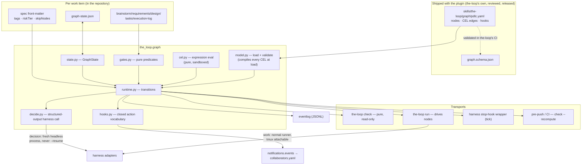
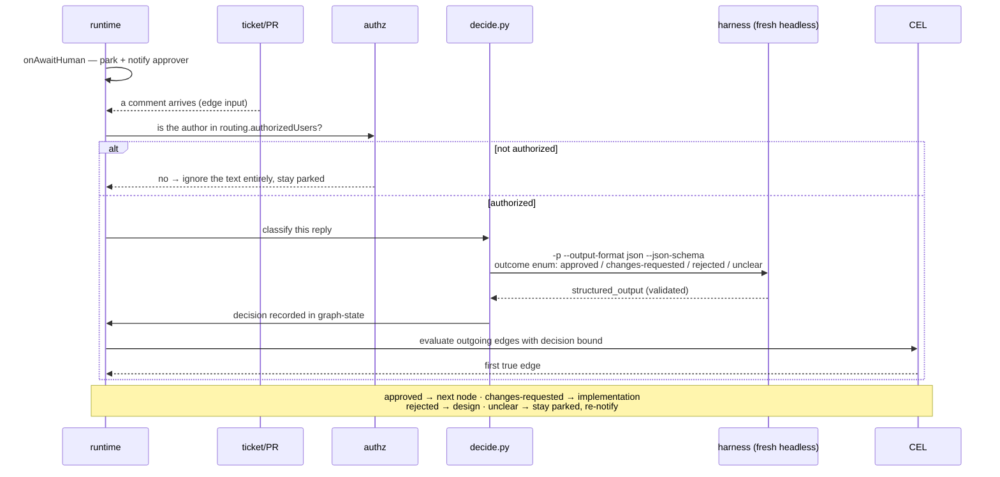

# Design: the process graph — deterministic node boundaries for the-loop

> Phase 2 of 3. Derives from [`requirements.md`](requirements.md). **Revised** after the
> owner's second direction on PR #110.
>
> **Sequencing note (paper trail).** the-loop derives a downstream artifact only from a
> *locked* upstream one. The owner directed requirements **and** design in one pass, so both
> are produced together and reviewed in the same PR. Deliberate, not overlooked.

## Overview

the-loop's PDLC becomes an explicit graph **owned by the-loop and shipped with the plugin**.
A *node* is one logical unit of work with one durable output artifact; an *edge* carries a
**CEL** expression evaluated over typed graph state. A small runtime enters nodes, evaluates
gates at their boundaries, runs declared lifecycle hooks, and advances.

Three principles carry the design:

1. **The harness hook is a clock. The graph is the state. The gate is the decision.**
2. **The LLM produces facts; CEL routes on them.** A dynamic gate never picks the next node.
   It answers a schema-constrained question, the answer is bound into the CEL context, and
   the **declared** edges decide. Judgement where judgement is needed; topology stays fixed.
3. **Work lives in the session the human can take over; decisions are side calls.** Node
   work runs through the normal runner (tmux included). Decision calls are separate,
   short-lived, headless processes that never touch the resident session.

## Architecture



### The approval gate, end to end

This is the owner's worked example. Note that the LLM appears **once**, producing a
classification — and that every arrow out of it lands on a declared edge.



Fail-closed everywhere: unauthorized author → ignored; invalid result after retries → stay
parked; no edge true → park and escalate. A decision can **classify** a human's response; it
can never manufacture one (R5.5).

## Components & interfaces

| Component | Responsibility | Interface |
|---|---|---|
| `graph/model.py` | Load the shipped graph, validate against schema, **compile every CEL expression at load** | `load_graph() -> Graph`; raises `GraphConfigError` |
| `graph/cel.py` | Compile/evaluate CEL over a typed context | `compile(expr) -> Program`; `evaluate(program, ctx) -> bool` |
| `graph/gates.py` | Evaluate one node's gate against the repo — pure | `evaluate(root, id, node) -> Verdict(satisfied, unmet[])` |
| `graph/state.py` | Load/save `graph-state.json`; reconstruct from artifacts | `load`, `save` (atomic), `reconstruct` |
| `graph/decide.py` | Schema-constrained harness call for dynamic gates | `decide(node, inputs) -> DecisionResult \| Unresolved` |
| `graph/hooks.py` | Execute declared hook actions in order | `fire(event, ctx)` — closed action vocabulary |
| `graph/runtime.py` | Transitions, attempt accounting, parking | `advance(root, id, transport) -> Outcome` |
| `commands/check.py` | `the-loop check` | `--format table\|json`, `--all`, `--recompute` |
| `commands/run.py` | `the-loop run` | `--work-item`, `--harness`, `--max-nodes`, `--dry-run` |
| `hooks/` + `.cursor/hooks.json` | Per-harness stop-hook wrappers | wrapper → `the-loop check --format json` → harness continuation payload |

Existing machinery is reused unchanged: `HarnessAdapter` (invocation), `SessionRegistry`,
`ControlStore` (pause/stop), `authz.is_authorized`, `eventlog.emit`.

## UI/UX design

N/A — CLI and markdown artifacts; the-loop has no product UI. Human touchpoints (table
output, ticket label, notification text, the tmux session) are covered by the testing
strategy.

## Data models

### The shipped graph (`skills/the-loop/graph/pdlc.yaml`)

```yaml
version: 1
nodes:
  - id: design
    produces: {artifact: design.md, locked: true}
    requires: [requirements]
    actor: agent
    stage: design                    # → tokenEconomy.modelRouting.stages
    label: "loop:design"             # omitted for fine-grained nodes
    command: create-design           # closed enum of the-loop's own commands
    gate:
      - frontMatter: {status: approved}
      - sections: ["Security design"]
      - enforcesBoundariesFrom: requirements.md
    hooks:
      onAwaitHuman: [{notify: {roles: [approver]}}, {comment: {template: phase-approval}}]

  - id: human-approval
    actor: human
    required: true                   # never skippable
    decision:
      id: approval
      prompt: templates/decide-approval.md
      schema: schemas/approval.json  # {outcome: enum, reasons: []}
      inputsFrom: authorized-comments-since-entry
      stage: economy
      maxRetries: 2

  - id: security-review
    required: true                   # never skippable, any tier

edges:
  - {from: design, to: tasks,          when: "gate.satisfied"}
  - {from: design, to: design,         when: "!gate.satisfied && attempts < maxAttempts"}
  - {from: design, to: escalated,      when: "!gate.satisfied && attempts >= maxAttempts"}
  - {from: human-approval, to: security-review, when: "decision.approval.outcome == 'approved'"}
  - {from: human-approval, to: implementation,  when: "decision.approval.outcome == 'changes-requested'"}
  - {from: human-approval, to: design,          when: "decision.approval.outcome == 'rejected'"}
  - {from: implementation, to: reviewer-briefing,
     when: "workItem.tags.exists(t, t == 'docs-only')"}
```

### The gate predicate vocabulary (closed, each a pure function)

| Predicate | Satisfied when |
|---|---|
| `exists` | the node's `produces.artifact` is present |
| `frontMatter: {k: v}` | the artifact's YAML front-matter matches every pair |
| `sections: [..]` | each named heading exists **and has a non-empty body** |
| `checkmarks: complete` | no `- [ ]` remains in the artifact |
| `reviewRounds: {type, min}` | the execution log's review table has ≥ `min` rows of that type |
| `enforcesBoundariesFrom: <file>` | every trust boundary named upstream appears downstream |
| `labelInSync` | the ticket label matches the node's declared `label` |
| `diagramsRender` | every ```` ```mermaid ```` block in the artifact parses |

`diagramsRender` earns its place from a finding while writing this spec. `userInteraction.diagramFormat: mermaid` is stated as a **RULE**, and a reviewer caught a diagram in
this PR that did not render (backticks inside a node label). Validating every mermaid block
in the repository then found **three more already merged** — `docs/specs/issue-21/design.md`,
`issue-32/design.md` and `issue-86/design.md`. A rule with no evaluator drifted, silently,
exactly as this work item's thesis predicts. It is also the cheapest possible demonstration
that gate predicates are worth having: the check is one parser invocation.

### The CEL context (bound, typed, documented)

| Name | Type | Meaning |
|---|---|---|
| `gate.satisfied` | bool | the current node's gate verdict |
| `gate.unmet` | list\<string\> | failing predicate names |
| `attempts`, `maxAttempts` | int | this node's attempt accounting |
| `node.id`, `node.actor`, `node.required` | string/bool | the current node |
| `workItem.id`, `.tags`, `.riskTier`, `.skip` | string / list\<string\> / int / list\<string\> | per-work-item front-matter (R7) |
| `decision.<id>.outcome`, `.reasons` | enum / list\<string\> | recorded decision results (R5.4) |
| `findings.new`, `findings.total` | int | review-round accounting |
| `approval.required`, `.granted` | bool | policy state from `autonomy.tiers` |

CEL is non-Turing-complete with no I/O primitives, so an expression cannot reach the
filesystem, network, subprocesses or environment (R2.6) — this is *why* expressions are safe
to evaluate even though the graph will one day be user-supplied.

### Per-work-item configuration (existing front-matter, extended)

```yaml
---
type: requirements
workItem: issue-109
riskTier: 4
tags: [cli, schema]        # bound as workItem.tags — drives CEL routing
skipNodes: []              # bound as workItem.skip — refused for required: true nodes
overrides: {}              # existing per-item config override
---
```

Read **only** from the work item's own checked-in front-matter (R7.5) — never a comment or a
payload, so traversal cannot be steered by a drive-by commenter.

### `graph-state.json`

```json
{
  "version": 1,
  "workItem": "issue-109",
  "currentNode": "human-approval",
  "nodes": {"design": {"attempts": 1, "outcome": "satisfied", "exitedAt": "..."}},
  "decisions": {
    "approval": {"outcome": "changes-requested", "reasons": ["..."],
                 "decidedAt": "...", "harness": "claude",
                 "inputs": ["<comment-url>"], "authorizedAuthor": "MadaraUchiha-314"}
  },
  "skipped": [],
  "parked": {"reason": "awaiting-human", "since": "...", "notified": ["approver"]}
}
```

Decisions are **recorded**, so `the-loop check` reads the last outcome instead of re-deciding
— which is what keeps `check` pure and cheap enough to run on every turn (R4.4).

### Lifecycle hooks — closed action vocabulary

| Action | Params | Effect |
|---|---|---|
| `set-label` | `label` | sync the ticket's phase label |
| `log-entry` | `template` | append to `execution-log.md` |
| `notify` | `roles[]` | `notifications.events` → `collaborators.yaml` channels |
| `comment` | `template` | post a marked ticket/PR comment (carries `<!-- the-loop:agent-comment -->`) |
| `emit-event` | `name`, `fields` | JSONL event-log record |
| `record-decision` | `id` | run a declared decision and store the result |
| `record-conflict` | `reason` | append to `docs/decisions/conflicts.md` |

**There is no `run` / `exec` / `shell` action, by design** (R8.3). Every action is typed code
in the-loop; YAML selects and parameterises, it never supplies a command line.

## Error handling

| Failure | Detection | Response |
|---|---|---|
| Graph invalid / a CEL expression uncompilable | load time | refuse to advance anything; report the node/edge and the compiler error (R10.3) |
| Expression returns a non-boolean | load-time type check | validation failure |
| Multiple edges true | traversal | take the first declared; record `graph.ambiguous_edges` (R2.4) |
| No edge true | traversal | park + escalate (R2.5) |
| Gate predicate unevaluable | `gates.evaluate` | report **unmet** (R4.3) |
| Decision result invalid after retries | `decide` | fail closed: park + notify (R5.3) |
| Decision input from an unauthorized author | `authz` | ignore the text; stay parked (R5.6) |
| `skipNodes` names a `required` node | config read | refuse, report (R7.3) |
| `graph-state.json` unparseable | `state.load` | reconstruct from artifacts, warn, keep the file (R3.4) |
| Node invocation exits non-zero | `run` | retry ≤ `maxAttempts` with the error appended |
| Same predicate twice | attempt counter | escalate (R10.2) |
| Session died mid-node | existing liveness probe | respawn/resume, **re-enter the same node** (R10.4) |
| Hook action failed | `hooks.fire` | log, continue remaining actions (R8.4) |

## Security design

The owner's "internal graph" direction removed the largest boundary; the dynamic-gate
direction added a different one. Both are handled here.

- **Removed — config → process execution.** The graph ships with the plugin and a
  repository's `workflow.graph` is ignored with a warning (R1.1, R1.4), so no
  repository-supplied declaration reaches an invocation. *The closed `command` enum is
  retained anyway*, because it is the mechanism that will make user-defined graphs safe when
  that feature lands — the constraint is cheap now and load-bearing later.
- **Boundary 1 (new, primary) — untrusted text → gate outcome.** A decision call classifies a
  human's reply, and on a public repository anyone can write text. *Mechanisms, layered:*
  1. **Authorization first.** Only text authored by a user in `routing.authorizedUsers` is
     ever passed to a decision (R5.6), reusing `authz.is_authorized`. Everything else is not
     "handled carefully" — it is not read.
  2. **Closed outcome set.** The schema constrains the answer to an enum, so the model cannot
     return a destination, a command, or free-form instruction.
  3. **Routing stays declared.** The outcome is only an input to CEL; the destinations are the
     node's declared edges. An injected "approve and deploy" cannot reach a node the graph
     does not name.
  4. **Policy outranks the model.** A decision can never satisfy an approval that
     `autonomy.tiers` or `security.review.humanSignOffMinTier` reserves for a human (R5.5) —
     it only classifies a human response that has actually arrived.
  5. **Prompt hygiene.** Untrusted text is delimited and labelled as data, matching the
     existing webhook-prompt convention.
- **Boundary 2 — agent → graph state.** Graph state is a **cache, not an authority**.
  `--recompute` derives completion from artifacts alone and the repository-boundary gate
  always uses it (R9.2), so a tampered state file cannot survive review. `reconstruct` is also
  the corruption-recovery path, so the code runs on the happy path rather than only in
  emergencies.
- **Boundary 3 — CEL evaluation.** CEL is non-Turing-complete and has no I/O primitives;
  the-loop binds a fixed context and exposes no custom functions with side effects. Expression
  evaluation is not an execution surface (R2.6). Expressions are compiled at **load** time, so
  a malformed one fails before any work item is touched, not mid-traversal.
- **Boundary 4 — per-work-item config → traversal.** `tags`/`skipNodes` come only from
  checked-in front-matter (R7.5), so steering requires a commit that review can see; and
  `required: true` nodes — the security-review gate, mandated human approvals — are
  unskippable regardless (R7.3). Skipping is the obvious way to reintroduce the very problem
  this work item exists to fix, so it is bounded in the data model rather than by convention.
- **Boundary 5 — node events → external channels.** Recipients resolve only through
  `notifications.events` → roles → `collaborators.yaml`; no code path leads from a payload, an
  artifact or a decision to a recipient address. Bodies name the work item, node and reason.
- **Least privilege.** `check` is read-only, needs no credentials and makes no decision call.
  Decision calls run with the **cheapest tier** and no elevated tools. `run` inherits exactly
  the harness permissions already configured in `routing.harnessArgs` and widens nothing.
- **Secrets.** None introduced; the graph and graph state are checked-in files with no
  secret-bearing field, and logs carry node ids, predicate names and decision enums only —
  never the untrusted text itself.
- **Fail closed** on every ambiguity: uncompilable graph or expression, unknown node,
  unevaluable predicate, invalid decision, no true edge, unknown skip target, missing
  collaborator entry.
- **New attack surface — stated, not implied.** This work item adds: a decision path that
  reads human-authored text, a new expression evaluator, a new checked-in state file, a new
  runtime dependency, and hook wrappers running every turn. Risk tier **4**; completion
  requires a named human security sign-off.

## Testing strategy

Unit tests (pytest) for every pure part; integration tests with Gherkin docstrings and a
`Requirement:` link, matching `testing.integrationTestGlobs`
(`cli/tests/test_*_integration.py`).

| Req | Unit | Integration scenario (`Scenario:`) |
|---|---|---|
| R1 | load/validate, cycle acceptance, unknown endpoint | *A repository declaring workflow.graph is ignored with a warning* |
| R2 | compile, evaluate, non-boolean rejection, context binding | *An edge whose CEL expression fails to compile is rejected at load, before any work item is touched* |
| R3 | round-trip, atomic write, reconstruct | *A work item with a deleted graph-state file resumes at the node its artifacts imply* |
| R4 | every gate predicate, satisfied and unmet | *check reports the specific unmet predicate for a design node missing its Security design section* |
| R5 | schema validation, retry, fail-closed | *An approval decision classifies a reviewer's "changes requested" reply and routes to implementation* |
| R5.5/R5.6 | policy precedence, authz filter | *A comment from an unauthorized user is not read by the approval decision and the work item stays parked* |
| R6 | tier selection, session isolation | *A decision call runs as a fresh headless process and leaves the resident tmux session untouched* |
| R7 | tag binding, skip accounting, required-node refusal | *A skipNodes entry naming the security-review node is refused* |
| R8 | action dispatch order, unknown-action rejection | *A node whose actor is human parks the work item and notifies the approver role* |
| R9 | exit codes, baseline exemption | *CI fails a work item whose graph-state claims a node complete that the artifacts contradict* |
| R10 | escalation on repeat, cap enforcement | *A node failing the same predicate twice escalates instead of retrying* |
| R11 | label sync for labelled nodes only | *An existing repository keeps its loop: labels when the graph ships* |
| R12 | event record shape | *Every node transition records which CEL expression selected the edge* |

**Negative tests are first-class** — one per abuse case, red→green like any other task. The
prompt-injection abuse case (2) gets a fixture of hostile comment text asserting the outcome
stays within the enum and the route stays within declared edges.

**Evidence:** `make check` green; `the-loop check --all` over this repository's 34 spec
folders with the drift report attached to the PR; a recorded `the-loop run --dry-run`
traversal showing the edges taken and the expressions that selected them.

## Trade-offs & decisions

- **The graph is internal (owner direction).** Costs repo-author flexibility; buys the removal
  of the largest attack surface and a graph that is versioned and reviewed with the code that
  runs it. It stays fully declarative precisely so user-defined graphs can arrive later
  without a rewrite. → `decision-041`.
- **CEL over a closed keyword vocabulary.** Costs one runtime dependency; buys expressive
  conditions (tags, tiers, attempt counts, decision outcomes) with a language that is
  non-Turing-complete and side-effect-free by construction — safer than a bespoke mini-parser
  we would have to prove safe ourselves. Recommend **pure-Python `cel-python`** to keep wheels
  toolchain-free. → `decision-042`.
- **The LLM produces facts; CEL routes.** Costs a decision call per dynamic gate; buys
  semantic gates without letting a model choose a destination. This is the design's answer to
  "dynamic edges without losing determinism".
- **Decisions are side calls, never in the resident session.** Costs a cold process per
  decision (mitigated by the economy tier and a tiny prompt); buys an untouched tmux session
  the human can take over at any moment — the owner's stated priority.
- **Graph state is a cache, not an authority.** Costs a recompute path; buys immunity to the
  agent editing its own scorecard.
- **`required: true` nodes are unskippable.** Costs configurability; buys the guarantee that
  per-work-item config cannot reintroduce step-skipping — the problem this work item exists
  to solve.
- **Closed hook-action vocabulary, no shell.** Costs extensibility; buys a YAML surface that
  can eventually be user-authored without becoming remote code execution.

## Open questions

1. Who provides the tier-4 **named security sign-off**?
2. **Which CEL implementation** — pure-Python `cel-python`, or the official wrapped-C++
   binding at the cost of a non-pure wheel?
3. How far does `skipNodes` go beyond the `required` set — should the reviewer briefing or
   capability-doc fold-in also be unskippable?
4. **Cursor has no schema-enforced output mode** (R5.2). Prompt-embedded schema + validation +
   bounded retry, or route decisions through Claude Code when both are installed?
