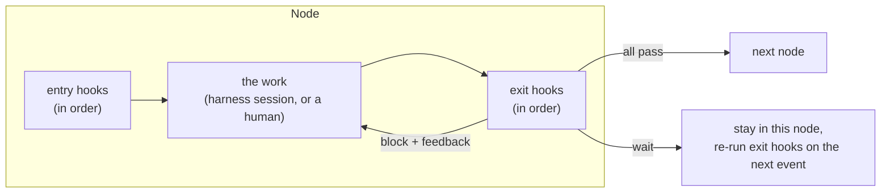
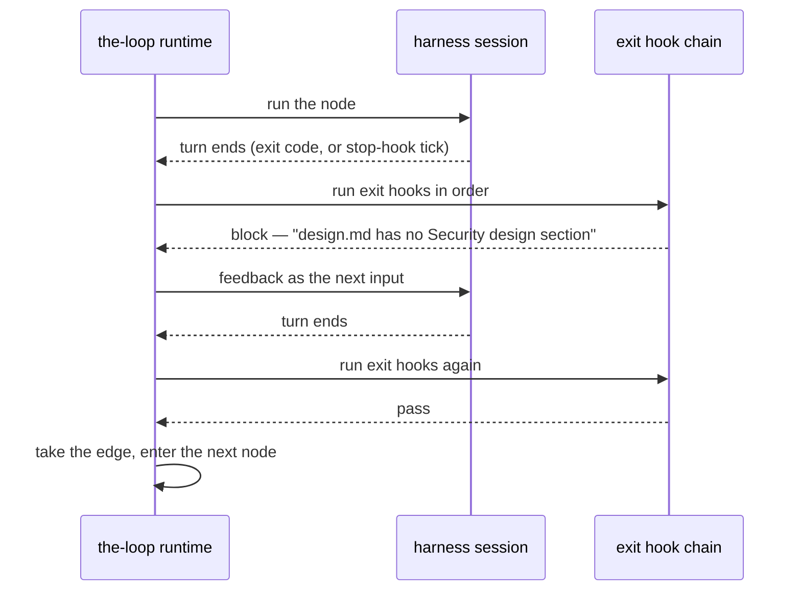
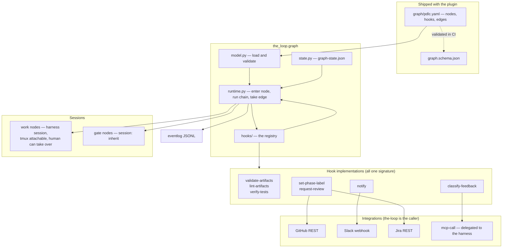

# Design: the-loop as a graph of nodes with entry/exit hooks

> Phase 2 of 3. Derives from [`requirements.md`](requirements.md).
>
> **Rewritten from a fresh slate** on the owner's direction (PR #110): *"I want to simplify
> the concepts here… a graph with entry and exit hooks, and then each of these validations
> that we want are hooks that are chained together… delete any bias that might have crept in
> till now."* Anchored on that comment and on the original bullets in
> [issue #109](https://github.com/MadaraUchiha-314/the-loop/issues/109).
>
> **Sequencing note.** the-loop derives a downstream artifact only from a *locked* upstream
> one; the owner directed requirements and design in one pass, so both are reviewed together.

## Overview

**There are exactly two runtime concepts, and one contract.**

| Concept | What it is |
|---|---|
| **Node** | A step of the PDLC. A place the work item *is*. Has `entry` hooks and `exit` hooks. |
| **Hook** | A unit of work with a fixed signature, chained in order at a node boundary. |
| **HookResult** | The contract every hook returns. It is what decides whether the work item moves. |

Everything else is an instance of those. Validating that an artifact exists is a hook.
Linting an artifact is a hook. Updating a GitHub label is a hook. Posting a review request,
messaging Slack, updating Jira — hooks. There is no separate "action vocabulary", no
"lifecycle event system", no "gate subsystem". One shape, used everywhere.

This directly answers the ticket's sharpest question — *how does the CLI know a step is
complete, versus waiting for the user?*

> **A node is complete when its exit hooks all pass. It is waiting when one returns `wait`.
> It is blocked when one returns `block`.** No prose is parsed, ever.

## The two-concept model



- **Entry hooks** prepare the node: set the phase label, open the execution-log entry, post
  the "review please" comment, select the model tier, notify.
- **The work** is either a harness session (agent nodes) or a human (gate nodes).
- **Exit hooks** decide whether the node is done: artifacts exist, front-matter is locked,
  markdown lints, diagrams render, review rounds happened, the human approved.

## The hook contract

The owner asked for the signature and the output to be defined. This is the load-bearing
piece of the whole design.

```python
def hook(ctx: HookContext) -> HookResult: ...
```

### `HookContext` (input — everything a hook may see, nothing more)

| Field | Meaning |
|---|---|
| `work_item` | ref, id, tags, risk tier, spec directory |
| `node` | id, phase, actor, the node's own config block |
| `boundary` | `entry` or `exit` |
| `repo` | absolute path to the checkout |
| `artifacts` | resolved paths of the node's declared inputs/outputs |
| `session` | the harness session bound to this node (id, runner, cwd) — may be `None` |
| `event` | the event that triggered this evaluation (a comment, a CI result, a tick) |
| `results` | the `HookResult`s of hooks already run in this chain |
| `config` | harness config + resolved secrets handles (never raw secrets) |

### `HookResult` (output — the contract)

```python
@dataclass
class HookResult:
    status: Literal["pass", "block", "wait", "skip"]
    hook: str                      # which hook produced this
    messages: list[Message]        # human/agent-readable findings, in priority order
    data: dict                     # structured output other hooks and edges may read
    retriable: bool = True         # may the harness try again, or is this terminal?
```

| `status` | Meaning | Effect on the chain |
|---|---|---|
| `pass` | this hook is satisfied | continue to the next hook |
| `block` | a requirement is unmet | **stop the chain**; the node does not advance; `messages` go back to the harness as its next input |
| `wait` | nothing is wrong, but we cannot proceed yet (a human has not replied) | park the node; re-run the exit chain on the next inbound event |
| `skip` | this hook does not apply to this work item | continue, recorded |

**Chain semantics.** Hooks run in declared order and the first non-`pass` short-circuits.
Aggregation of many findings is the *hook's* job, not the chain's: `validate-artifacts`
returns every unmet requirement in one `HookResult` so the agent gets the complete list in a
single round rather than discovering them one at a time. This is why `messages` is a list.

**Feedback to the harness.** A `block` is not just a stop — its `messages` are rendered into
the agent's next input, so the loop is *do → check → repair → check*. The rendering is
the-loop's own text plus paths and hook names; never untrusted payload text.



## Is the human gate a node or a hook?

The owner asked directly. **It is a node.** Five reasons, in the order that convinced me:

1. **Duration.** A hook is a function that runs and returns; a human gate is a state you
   *sit in*, for days. Expressing that as a hook means inventing a suspend-and-resume
   return — which is a node, with extra steps.
2. **It receives events.** Comments, reviews and CI results arrive *while in* the gate. A
   node is a delivery target; hooks fire at boundaries and are gone.
3. **It has an internal loop.** Approve-with-comments, changes-requested, partial reviews
   arriving over hours. That is a state machine, and nodes are what the-loop uses for those.
4. **It produces artifacts** — the review thread, the recorded decision, the execution-log
   review row. Nodes produce; hooks check.
5. **Symmetry.** Every other step of the PDLC is a node, and `needs-review` is already a
   declared phase. A gate-as-hook would be the one special case.

**But the owner's instinct about session binding is exactly right, and it becomes one field
rather than a new concept.** The feedback at a gate is about the artifacts the *previous*
node produced, so the gate node declares:

```yaml
- id: design-approval
  actor: human
  session: inherit        # reuse the producing node's harness session
```

`session: inherit` means the gate does not start a fresh conversation — it reuses the
session that produced the artifacts, so when the reviewer says *"this section is thin"*, the
agent that wrote it still has the context to fix it. That is the whole reason the binding
matters, and it costs one enum value.

### The human gate node, in detail

```mermaid
stateDiagram-v2
    [*] --> waiting: entry hooks<br/>(comment asking for review, label, notify)
    waiting --> waiting: feedback arrives but is not decisive<br/>(partial review, a question, unclear)
    waiting --> approved: classified approved
    waiting --> approved_with_comments: classified approved, with follow-ups
    waiting --> changes_requested: classified changes requested
    approved --> [*]: advance
    approved_with_comments --> [*]: advance;<br/>comments recorded in the artifact
    changes_requested --> [*]: return to the producing node,<br/>feedback becomes its next input
```



Four behaviours the owner called out, and how each is served:

- **Iterative feedback in parts.** The gate stays in `waiting` and re-runs its exit chain on
  *every* inbound event. It only transitions when the classification is decisive; an
  ambiguous or partial comment returns `wait`, not a guess.
- **Approved with comments — the comments land *in the artifact*.** Owner decision:
  *"approval and comments can be a section in the final artifact that's generated… a comments
  section at the bottom of each doc like design, requirements, etc."* So a
  `record-feedback` exit hook appends the review to a **`## Review comments`** section of the
  artifact the gate approved, and the work item advances. This is a better answer than the
  mandatory-vs-advisory framing the question offered: the feedback becomes part of the
  durable, checked-in record rather than a side-channel to-do list, it travels with the
  document it is about, and it is reviewable in the PR diff like everything else. Nothing is
  silently swallowed, and nothing needs a separate follow-up mechanism to track.
- **Rejected/changes-requested with comments.** Returns to the producing node with the
  comments as that node's next input — which works precisely because of `session: inherit`.
- **Tied to the previous node's session.** As above.

The recorded section is append-only and attributed:

```markdown
## Review comments

### 2026-07-28 — @reviewer — approved with comments
- The Security design section should name the fail-closed behaviour explicitly.
- Consider splitting the error-handling table by severity.
```

`validate-artifacts` treats this section as a required part of any artifact that has passed
through a gate, so a lost review is a blocking finding rather than a silent omission.

**Classifying the reply.** "Did they approve?" is judgement over English, so one exit hook
(`classify-feedback`) asks the harness with a schema-constrained prompt and returns the
outcome in `data`. Two rules keep this from becoming a hole:

- Only text from an **authorized** author is read at all.
- The classification is a *fact*, not a destination — edges route on it, and every
  destination is declared in the graph.

## Edges

Routing is deliberately boring, because the hooks did the work:

```yaml
edges:
  - {from: design, to: design-approval, on: pass}
  - {from: design-approval, to: tasks, on: approved}
  - {from: design-approval, to: tasks, on: approved-with-comments}
  - {from: design-approval, to: design, on: changes-requested}
  - {from: implementation, to: reviewer-briefing, on: docs-only}   # from a named hook
```

**Every edge routes on a hook outcome. There is no expression language** (owner decision:
*"Remove CEL"*). A condition that would have needed an expression becomes a **named hook**
that returns the outcome — `is-docs-only` inspects the work item and returns
`docs-only` or `pass`. That keeps one mechanism instead of two, drops the dependency
entirely, and makes every condition unit-testable like any other hook.

Two earlier drafts sat on this: the first put an expression on *every* edge, the second kept
one for a "compound minority". Both were a second language for something the hook contract
already expresses. The named-hook form is strictly simpler and strictly more testable.

## Default hooks the-loop ships

All three the owner named, plus the validators the PDLC needs. Each is an ordinary hook
implementing the same signature.

| Hook | Boundary | Purpose |
|---|---|---|
| `set-phase-label` | entry | GitHub/Jira label for the current phase |
| `request-review` | entry (gate nodes) | post the review/approval comment, marked as the-loop's own |
| `notify` | entry / on wait | Slack (and any configured channel) for the roles in `notifications.events` |
| `log-entry` | entry, exit | append the execution-log checkpoint |
| `validate-artifacts` | exit | the node's declared outputs exist, are locked, carry required sections — **all findings in one result** |
| `lint-artifacts` | exit | markdownlint, and `diagramsRender` (mermaid actually parses) |
| `verify-tests` | exit | the node's declared test command passed |
| `classify-feedback` | exit (gate nodes) | schema-constrained classification of an authorized human's reply |
| `record-feedback` | exit (gate nodes) | append the review to the artifact's `## Review comments` section |
| `record-decision` | exit (gate nodes) | persist the outcome and its inputs to graph state |

`lint-artifacts` earns `diagramsRender` from an incident in this very PR: a reviewer caught
a diagram that would not render, and checking the whole repository then found **three more
already merged** (`issue-21`, `issue-32`, `issue-86` designs). `diagramFormat: mermaid` is
written as a RULE and enforced by nothing. A rule with no hook drifts — which is this work
item's thesis, demonstrated on a rule nobody thought to check.

## Tool access: the-loop is the caller now

The owner's point stands: with the-loop driving rather than the harness, tool access is
the-loop's choice, and it is not bound by CLI or MCP. One interface, three opinionated
defaults:

```python
class Integration(Protocol):
    def call(self, op: str, **params) -> dict: ...
```

| Target | Decision | Why |
|---|---|---|
| **GitHub** | **REST API over stdlib HTTP** — not `gh` | No binary dependency, no CLI version drift, no shell quoting, structured errors, works in a bare container. Auth from `GH_TOKEN`/`GITHUB_TOKEN`; if absent and `gh` is installed, shell out **once** to `gh auth token` purely as a credential source. Best of both: `gh`'s auth ergonomics without depending on `gh` at call time. |
| **Slack** | **Incoming webhooks** | A URL in config/env. No OAuth app, no scope negotiation, no token refresh. Exactly the right weight for "post a notification". |
| **Jira** | **REST API + API token** | Same reasoning as GitHub; no CLI exists worth depending on. |

All three are hooks. Swapping GitHub for Jira is swapping which hooks a node declares — not
a code path through the runtime.

### What if MCP is the only available route?

The owner's open question, and it deserves a straight answer: **MCP is a protocol for
*agents* to call tools.** It assumes a model-driven client with a session; a daemon
speaking it is against its grain. Two options:

1. **Delegate through the harness (recommended default).** the-loop already spawns Claude
   Code / Cursor, and both are MCP clients with the operator's servers already configured.
   An `mcp-call` hook asks the harness — headless, schema-constrained output — to perform
   the call and return the result. the-loop never implements the protocol; the harness is
   the client, which is what it is for.
2. **Implement a minimal MCP client** (stdio JSON-RPC) in the CLI. Feasible — stdio
   transport is simple — but it adds protocol code, server lifecycle management and
   credential handling to a daemon, for capability we can already reach via (1).

**Recommendation: ship (1), keep (2) on the shelf.** Delegation costs one harness
invocation, reuses machinery that already exists, and keeps the-loop out of a protocol whose
lifecycle it would otherwise have to own. Revisit if the delegation latency ever matters,
which for notification-shaped calls it will not.

## Architecture



## Data models

### A node

```yaml
- id: design
  phase: design                    # the label hooks sync
  actor: agent                     # agent | human
  produces: [design.md]
  command: create-design           # closed enum of the-loop's own commands
  stage: design                    # model tier
  entry: [set-phase-label, log-entry]
  exit:
    - {hook: validate-artifacts, with: {locked: true, sections: ["Security design"]}}
    - {hook: lint-artifacts}
    - {hook: log-entry}

- id: design-approval
  actor: human
  session: inherit                 # the owner's observation, as one field
  entry: [set-phase-label, request-review, notify]
  exit:
    - {hook: classify-feedback, with: {outcomes: [approved, approved-with-comments, changes-requested]}}
    - {hook: record-feedback, with: {into: design.md, section: "Review comments"}}
    - {hook: record-decision}
```

The artifact templates gain a `## Review comments` section so the shape exists before the
first review lands. That is an implementation task, not a runtime concern.

### `graph-state.json`

Per work item, checked in — `currentNode`, per-node attempts and outcomes, recorded hook
results and decisions, the bound session id, and the parked reason. It is a **cache, not an
authority**: `the-loop check --recompute` re-runs the validating hooks against the artifacts
and CI always uses it, so an agent editing its own scorecard cannot pass a gate.

## How this answers issue #109's original bullets

| Original question | Answer |
|---|---|
| "make the top level workflow programmatic" | The graph is data; the runtime walks it. |
| "each step needs a clear output artifact to pass on" | `produces`, checked by `validate-artifacts`. |
| "how do we make sure each step is not fresh context" | Work nodes bind a session; gate nodes `inherit` it. Fresh context is a per-node choice, not a global mode. |
| "can the CLI orchestrate deterministically, one or many sessions" | Yes — the runtime owns ordering; sessions are per-node and declared. |
| "how does session management work" | Existing registry/ControlStore, unchanged; nodes bind to session ids. |
| "how do we recover from failure modes" | `block` + `messages` → the harness repairs; bounded attempts then escalate. |
| **"how does the CLI know a step is complete vs waiting for input"** | **Exit hooks: all `pass` = complete; any `wait` = waiting; any `block` = needs repair.** |
| "will this consume a lot of tokens" | Hooks are code, not model calls — only `classify-feedback` invokes a model, at the economy tier. |

## Error handling

| Failure | Response |
|---|---|
| Graph or hook config invalid | refuse to advance anything; report at load time |
| Unknown hook name | load-time validation failure |
| Hook raises | treat as `block`, `retriable=False`, escalate — never as `pass` |
| Hook times out | `block`, retriable, bounded by the node's attempts |
| Same `block` message twice consecutively | escalate to a human (mirrors `escalateOnRepeatFinding`) |
| `classify-feedback` returns invalid output after retries | `wait` — never assume an outcome |
| Unauthorized author's text | not read; stay `wait` |
| Graph state unparseable | reconstruct by re-running validators; warn; keep the file |
| Session died mid-node | existing respawn-and-resume; re-enter the **same** node |
| Notification hook fails | record and continue — a Slack outage must not wedge the graph |

## Security design

- **Untrusted text → gate outcome (primary boundary).** Only authorized authors' text is
  read; the classification schema is a closed enum; the outcome is a fact, not a
  destination; and policy outranks the model — a classification can never satisfy an
  approval that `autonomy.tiers` or `security.review.humanSignOffMinTier` reserves for a
  human. Untrusted text is never echoed into feedback rendered back to the harness.
- **Hooks are code, not configuration.** YAML names a hook from a registry and passes typed
  params. There is no shell hook, no `exec`, no argv from configuration — so the graph
  (shipped with the plugin today, user-authored later) can never become code execution.
- **Agent → graph state.** State is a cache; `--recompute` re-derives from artifacts and CI
  always uses it.
- **Secrets.** Tokens and webhook URLs come from env or a secret store, never the repo,
  never graph state, never logs. `HookContext` carries handles, not values.
- **Least privilege.** Validation hooks are read-only. Integration hooks hold only the
  scopes their operation needs. `the-loop check` makes no network call and no model call.
- **Fail closed.** Unknown hook, invalid config, unevaluable condition, no matching edge,
  invalid classification, missing collaborator — all stop advancement and report.
- **New surface, stated:** outbound HTTP to GitHub/Slack/Jira, a model call for
  classification, and a new state file. Risk tier **4**; a named human security sign-off is
  required before completion.

## Testing strategy

Unit tests for every hook (they are pure functions of `HookContext` — this is the main
payoff of the contract). Integration tests with Gherkin docstrings under
`cli/tests/test_*_integration.py`.

| Area | Integration scenario |
|---|---|
| Chain semantics | *A blocking exit hook stops the chain and its messages reach the harness as the next input* |
| Aggregation | *validate-artifacts reports every unmet requirement in one result rather than one per round* |
| Human gate | *A partial review comment leaves the gate waiting rather than advancing* |
| Approve-with-comments | *An approval carrying suggestions advances the node and carries the follow-ups forward* |
| Session inheritance | *A changes-requested outcome returns to the producing node in the same harness session* |
| Authorization | *An unauthorized comment is not read by classify-feedback and the gate stays waiting* |
| Lint hook | *A design artifact with an unparseable mermaid block blocks the node* |
| Integrations | *A Slack webhook failure records and continues without wedging the graph* |
| Recompute | *CI fails a work item whose graph-state claims a node complete that the artifacts contradict* |

## Trade-offs & decisions

- **Two concepts, not five.** Costs some expressive precision; buys an architecture that
  fits on one page and one extension point instead of several. → `decision-041` (revised).
- **Human gate as a node, not a hook.** Costs the neatness of "everything is a hook"; buys
  correct modelling of a multi-day, event-receiving, iterative state.
- **`session: inherit` rather than a new binding concept.** One enum value expresses the
  owner's observation that gate feedback belongs to the previous node's session.
- **Every edge routes on a hook outcome; no expression language.** Costs a hook per
  non-trivial condition; buys one mechanism instead of two, **zero new runtime
  dependencies**, and conditions that are unit-testable like everything else.
  → `decision-042` (revised).
- **GitHub REST over `gh`, Slack webhooks over an app.** Costs some convenience; buys no
  binary dependencies and no version drift, with `gh auth token` retained purely as an
  optional credential source.
- **MCP by delegation to the harness.** Costs one harness invocation per call; buys not
  owning a protocol implementation and its server lifecycle.
- **Hooks are registered code, never shell.** Costs operator extensibility today; buys a
  YAML surface that can safely become user-authored later.

## Open questions

**None outstanding.** All four were resolved by the owner on PR #110 and are folded into the
design above — see `requirements.md` § Open questions for the record of what each was and how
it was answered: the meaning of the tier-4 sign-off, review comments recorded *in the
artifact*, `session: inherit` falling back to a fresh session seeded with the artifacts, and
**CEL removed** in favour of routing on hook outcomes.

The only thing between this design and `tasks.md` is phase approval.
