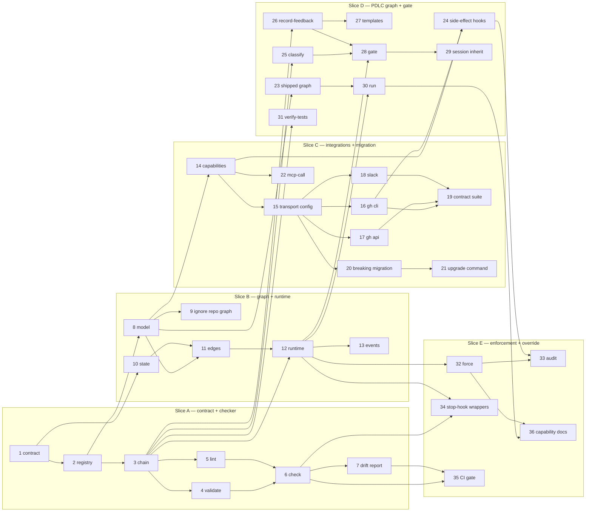

# Tasks: the-loop as a graph of nodes with entry/exit hooks

> Phase 3 of 3. Derived from the **locked** [`requirements.md`](requirements.md) and
> [`design.md`](design.md) (both approved by @MadaraUchiha-314 on PR #110).
>
> **Delivery shape.** This is epic-sized — a runtime, a hook registry, nine shipped hooks,
> three integration transports, a breaking config migration and an escape hatch. It is
> therefore sequenced as **five vertical slices**, each independently mergeable, each leaving
> the repository working. Slice A alone is useful (it is the drift report this whole work
> item started from); nothing later is wasted if priorities change.

## Delivery slices

| Slice | Delivers | Useful on its own? |
|---|---|---|
| **A** | hook contract + registry + validating hooks + `the-loop check` | **yes** — the drift report over all 34 spec folders |
| **B** | graph model, graph state, runtime, edges | yes — `the-loop graph status` |
| **C** | integrations (transport config, GitHub/Slack/Jira) + the breaking migration | yes — removes triplicated config |
| **D** | the shipped PDLC graph, side-effecting hooks, human gate, `the-loop run` | yes — the loop actually runs |
| **E** | escape hatch, harness stop-hook wrappers, CI gate | yes — enforcement + override |

## Task list

TDD invariant (`tdd.mode: standard`): **no production code without a failing test that
motivates it**. Security-relevant tasks name the **negative** test proving the boundary.

### Slice A — the contract and the checker

- [x] 1. `HookContext` / `HookResult` dataclasses and the `Message` type
  - `cli/the_loop/graph/contract.py`; `status` is `pass|block|wait|skip`; `messages` ordered;
    `data` free-form; `retriable` defaulting true. Secret **handles** only (R2.7).
  - _Depends on:_ none
  - _Requirements:_ R2.1, R2.2, R2.7
  - _Test:_ `pytest cli/tests/test_graph_contract.py` (red→green)
- [x] 2. Hook registry — `@hook("name")`, `_REGISTRY`, `get_hook()`, `iter_hooks()`
  - Mirrors `commands/base.py`'s `Command`/`@register` pattern exactly (R6b.2). Duplicate
    name is a `ValueError` at import, as the command registry already does.
  - _Depends on:_ 1
  - _Requirements:_ R6b.2
  - _Test:_ `pytest cli/tests/test_graph_registry.py` — registration, lookup, duplicate refusal
- [x] 3. Chain executor — run hooks in order, short-circuit on first non-`pass`
  - A raising or timing-out hook becomes `block` with `retriable=False` — **never** `pass`.
  - _Depends on:_ 1, 2
  - _Requirements:_ R2.6, R3.1, R3.2, R3.4
  - _Test:_ `pytest cli/tests/test_graph_chain.py`; **negative:** a hook that raises yields
    `block`, not `pass` (abuse case 6)
- [x] 4. `validate-artifacts` hook — existence, front-matter lock, required sections
  - **Aggregates**: every unmet requirement in one result, not one per round (R3.5).
  - _Depends on:_ 2, 3
  - _Requirements:_ R5.2, R3.5
  - _Test:_ `pytest cli/tests/test_hook_validate_artifacts.py` — asserts a doc missing two
    sections yields **one** result with **two** messages
- [x] 5. `lint-artifacts` hook — markdownlint + `diagramsRender`
  - Mermaid blocks extracted and parsed; the incident that motivated this is in `design.md`.
  - _Depends on:_ 2, 3
  - _Requirements:_ R5.4
  - _Test:_ `pytest cli/tests/test_hook_lint_artifacts.py` — a fixture with a backticked
    mermaid label blocks
- [x] 6. `the-loop check` command — `--format table|json`, `--all`, `--recompute`
  - Read-only: **no network, no subprocess, no mutation** (R8.8).
  - _Depends on:_ 3, 4, 5
  - _Requirements:_ R8.8, R8.4
  - _Test:_ `pytest cli/tests/test_check_integration.py`; **Scenario:** _check reports the
    specific unmet predicate for a design node missing its Security design section_
- [x] 7. Run `the-loop check --all` over this repository and record the drift report
  - This is the evidence the work item promised: the 34 existing spec folders, baselined.
  - _Depends on:_ 6
  - _Requirements:_ R8.4
  - _Test:_ output attached to the PR as evidence

### Slice B — the graph and the runtime

- [x] 8. Graph model + loader — parse, validate, resolve, index, freeze
  - Every structural failure is a **startup** failure naming the offending element (R6b.1).
    Cycles accepted (R1.6).
  - _Depends on:_ 2
  - _Requirements:_ R1.1, R1.2, R1.3, R1.5, R1.6, R6b.1
  - _Test:_ `pytest cli/tests/test_graph_model.py`; **negative:** an edge naming an
    undeclared node fails at load with the id (abuse case 5)
- [x] 9. Repo-supplied graph is ignored with a warning
  - _Depends on:_ 8
  - _Requirements:_ R1.4
  - _Test:_ **negative** — `test_repo_graph_ignored`; **Scenario:** _A repository declaring
    workflow.graph is ignored with a warning_
- [x] 10. `GraphState` — load/save (atomic), `reconstruct()` from artifacts
  - Persist **before** the dependent side effect (R8.2). Unparseable → reconstruct, warn,
    **keep** the file (R8.3).
  - _Depends on:_ 1
  - _Requirements:_ R8.1, R8.2, R8.3
  - _Test:_ `pytest cli/tests/test_graph_state.py`; **Scenario:** _A work item with a deleted
    graph-state file resumes at the node its artifacts imply_
- [x] 11. Edge resolution — `on: <outcome>`, first-declared wins, no-match parks + escalates
  - _Depends on:_ 8, 10
  - _Requirements:_ R1.5
  - _Test:_ `pytest cli/tests/test_graph_edges.py`
- [x] 12. Runtime `advance()` + attempt accounting + escalation
  - Same predicate twice consecutively, or `maxAttempts`, escalates and stops (R8.5).
  - _Depends on:_ 3, 10, 11
  - _Requirements:_ R8.5, R8.6
  - _Test:_ `pytest cli/tests/test_graph_runtime.py`; **Scenario:** _A node failing the same
    predicate twice escalates instead of retrying_
- [x] 13. Event-log records for every transition, hook non-`pass`, and edge taken
  - _Depends on:_ 12
  - _Requirements:_ R8.7
  - _Test:_ `pytest cli/tests/test_graph_eventlog.py`

### Slice C — integrations and the breaking migration

- [x] 14. `Integration` protocol + capability declaration + load-time capability check
  - A graph needing an unimplemented op fails **at startup** naming op, target and both
    fixes (R6.9).
  - _Depends on:_ 8
  - _Requirements:_ R6.8, R6.9, R6.10
  - _Test:_ `pytest cli/tests/test_integration_capabilities.py`
- [x] 15. `integrations` config block + `auto` resolution + fail-closed
  - `auto` = token → binary → fail naming **both** remedies; explicit transport never
    silently degrades (R6.3, R6.4).
  - _Depends on:_ 14
  - _Requirements:_ R6.2, R6.3, R6.4
  - _Test:_ `pytest cli/tests/test_integration_config.py`
- [x] 16. GitHub `cli` transport — wrap the existing `gh` paths as a provider
  - Reuses `announce`/`comments`/`control`/`reactions`/`poller` code rather than replacing
    it (R6.14).
  - _Depends on:_ 15
  - _Requirements:_ R6.6, R6.14
  - _Test:_ shared contract suite (task 19)
- [x] 17. GitHub `api` transport — stdlib HTTP + token, `gh auth token` as credential source
  - _Depends on:_ 15
  - _Requirements:_ R6.6
  - _Test:_ shared contract suite (task 19)
- [x] 18. Slack `sdk` transport (official `slack-sdk`) + dependency-free `webhook` transport
  - Adds the work item's **only** new runtime dependency; zero transitive.
  - _Depends on:_ 15
  - _Requirements:_ R6.5
  - _Test:_ `pytest cli/tests/test_integration_slack.py`; **Scenario:** _A Slack webhook
    failure records and continues without wedging the graph_
- [ ] 19. Shared integration **contract test suite** — every provider, every operation
  - Proves `api` and `cli` behave identically rather than assuming it.
  - _Depends on:_ 16, 17, 18
  - _Requirements:_ R6.10
  - _Test:_ `pytest cli/tests/test_integration_contract.py` parametrized over providers
- [ ] 20. **Breaking** config migration — remove `ghBinary`, bump `version`, refuse old configs
  - Runtime refuses to start naming key, replacement and `/the-loop:upgrade-the-loop` (R6a.6).
  - _Depends on:_ 15
  - _Requirements:_ R6a.1–R6a.6
  - _Test:_ **negative** — `test_runtime_refuses_unmigrated_config` (R6a.8)
- [ ] 21. Teach `/the-loop:upgrade-the-loop` the migration; update both config templates
  - Deterministic key move, idempotent, `--dry-run`, reports what it changed (R6a.7).
  - _Depends on:_ 20
  - _Requirements:_ R6a.7, R6a.8
  - _Test:_ old-config fixture → expected new config; run twice, assert idempotent
- [ ] 22. `mcp-call` hook — delegate to the harness with schema-constrained output
  - _Depends on:_ 14
  - _Requirements:_ R6.11
  - _Test:_ `pytest cli/tests/test_hook_mcp_call.py`

### Slice D — the PDLC graph, side effects and the human gate

- [x] 23. Author the shipped graph `skills/the-loop/graph/pdlc.yaml` + its schema; validate in CI
  - Splits the six nodes currently hiding inside `needs-review`.
  - _Depends on:_ 8
  - _Requirements:_ R1.1, R1.2, R6b.6
  - _Test:_ CI validates the shipped graph; `pytest cli/tests/test_shipped_graph.py`
- [x] 24. `set-phase-label`, `log-entry`, `notify`, `request-review` hooks
  - Comments carry the self-authored marker (R5.6); recipients only from
    `collaborators.yaml` (R5.7).
  - _Depends on:_ 14, 16
  - _Requirements:_ R5.1, R5.5, R5.6, R5.7, R9.2
  - _Test:_ **negative** — a recipient not in `collaborators.yaml` is refused (abuse case 8)
- [x] 25. `classify-feedback` hook — schema-constrained, **authorized authors only**
  - Claude Code `--json-schema`; Cursor embeds schema + validates + bounded retry. Invalid
    after retries → `wait`, never an assumed outcome.
  - _Depends on:_ 3
  - _Requirements:_ R4.8, R4.9
  - _Test:_ **negative** — `test_unauthorized_comment_not_read` (abuse cases 1–3);
    **Scenario:** _A comment from an unauthorized user is not read and the gate stays waiting_
- [x] 26. `record-feedback` hook — append to the artifact's `## Review comments`
  - Append-only, attributed, dated; never rewrites earlier entries.
  - _Depends on:_ 3
  - _Requirements:_ R4.5, R5.3
  - _Test:_ `pytest cli/tests/test_hook_record_feedback.py`
- [ ] 27. Add `## Review comments` to the artifact templates
  - _Depends on:_ 26
  - _Requirements:_ R5.2
  - _Test:_ `validate-artifacts` requires the section on a gated artifact
- [x] 28. Human-gate node behaviour — `wait` on indecisive, three decisive outcomes
  - _Depends on:_ 12, 25, 26
  - _Requirements:_ R4.1–R4.6
  - _Test:_ **Scenario:** _A partial review comment leaves the gate waiting rather than
    advancing_
- [ ] 29. `session: inherit` + fallback to fresh seeded with the artifacts
  - _Depends on:_ 28
  - _Requirements:_ R4.7, R7.3, R7.4
  - _Test:_ **Scenario:** _A changes-requested outcome returns to the producing node in the
    same harness session_
- [ ] 30. `the-loop run` — drive nodes; `--dry-run`; respect `ControlStore` pause/stop
  - _Depends on:_ 12, 23
  - _Requirements:_ R7.1, R7.5
  - _Test:_ `pytest cli/tests/test_run_integration.py`
- [x] 31. `verify-tests` hook
  - _Depends on:_ 3
  - _Requirements:_ R5.1
  - _Test:_ `pytest cli/tests/test_hook_verify_tests.py`

### Slice E — enforcement and the escape hatch

- [x] 32. `the-loop graph force` — the escape hatch
  - **Moves the pointer, never forges a verdict**: records `forced`, leaves the gate's real
    verdict intact so `--recompute` still reports it unmet. `--reason` required. Unknown node
    refused. Undeclared transition warned. `required`-gate bypass warned explicitly.
  - _Depends on:_ 12
  - _Requirements:_ R10.1–R10.9
  - _Test:_ `pytest cli/tests/test_graph_force.py`; **negative:**
    `test_force_does_not_mark_gate_satisfied` — after forcing, `check --recompute` still
    reports the bypassed gate as unmet (R10.4)
- [ ] 33. Force audit trail — graph state, execution log, event log, marked ticket comment
  - _Depends on:_ 32, 24
  - _Requirements:_ R10.5
  - _Test:_ asserts all four records exist
- [ ] 34. Harness stop-hook wrappers — `hooks/` (Claude) and `.cursor/hooks.json` (Cursor)
  - Claude blocks the stop; Cursor returns `followup_message`. Attempt cap enforced on the
    Claude path (Cursor caps natively).
  - _Depends on:_ 6, 12
  - _Requirements:_ R3.2
  - _Test:_ `pytest cli/tests/test_harness_hook_wrappers.py`
- [ ] 35. CI + pre-push gate running `the-loop check --recompute`; baseline the existing 34
  - _Depends on:_ 6, 7
  - _Requirements:_ R8.4
  - _Test:_ **Scenario:** _CI fails a work item whose graph-state claims a node complete that
    the artifacts contradict_
- [ ] 36. Capability docs + `reference/` updates in the same PR as the behaviour
  - `docs/capabilities/spec-workflow.md`, `cli.md`, and the workflow reference's
    "open design question" now answered by `decision-041`.
  - _Depends on:_ 30, 32
  - _Requirements:_ —
  - _Test:_ ready-to-ship gate item

## Dependency graph (DAG)

## Delivery status (2026-07-28)

**25 of 36 tasks complete**, in one implementation pass. `make check` green: ruff,
ruff-format, pyright, markdownlint (250 files), config validation, **658 tests**.

| Slice | State |
|---|---|
| **A** — contract, registry, chain, validators, `check` | **complete**, drift report produced |
| **B** — model, state, runtime, edges, events | **complete** |
| **C** — integrations | transports + resolution + capability declaration **complete**; the **breaking config migration (20, 21)** and `mcp-call` (22) outstanding |
| **D** — shipped graph, hooks, human gate | graph + hooks + gate **complete**; `## Review comments` templates (27), `session: inherit` fallback (29), `the-loop run` (30) outstanding |
| **E** — escape hatch, enforcement | `graph force` + state/event audit **complete**; ticket-comment audit (33), stop-hook wrappers (34), CI gate (35), capability docs (36) outstanding |

Outstanding: **11 tasks** — 20, 21, 22, 27, 29, 30, 33, 34, 35, 36 (and 19's shared
contract suite, currently covered per-provider rather than parametrized).

## Checkpoints

Tests run and the execution log is updated at **every slice boundary**, and at each task
inside a slice per `contextManagement.taskBoundary: compact`. Each task records its test
command and its **red→green** transition as evidence.

| Checkpoint | Gate |
|---|---|
| End of A | `make check` green; drift report attached to the PR |
| End of B | `make check` green; `graph status` walks a fixture work item |
| End of C | contract suite green across providers; migration idempotent; runtime refuses old config |
| End of D | the loop runs a work item end to end in `--dry-run` |
| End of E | force leaves `--recompute` honest; CI gate active; capability docs updated |

After the last task: self-review ×3, critic-review ×3, then the **security review gate**
(`security.review`) recorded in the execution log — with a **named human sign-off** required
at risk tier 4 before the work item can be marked ready.
