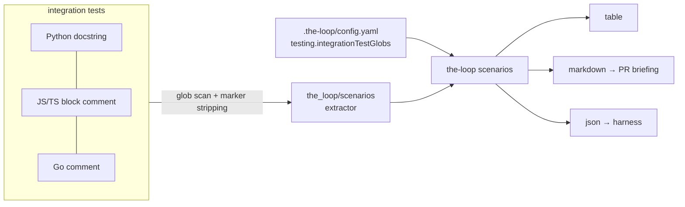

# Design: Integration tests and OpenAPI specs

> Phase 2 of 3. Derives from the approved requirements in `requirements.md`.

## Overview

Two conventions, one query surface:

1. **Scenario docstrings** (R1) — a documentation convention codified in
   `skills/the-loop/reference/testing.md`, driven by a new `testing` config section.
2. **`the-loop scenarios`** (R2) — a stdlib-only CLI command that extracts those
   docstrings and renders a table/markdown/JSON view.
3. **Contract-first API specs** (R3/R4) — a new `apiSpecs` config section
   (`rest: specs/openapi` + `graphql: specs/graphql`, both with generated docs),
   codified in the same reference file and recorded as `decision-014`.

## Architecture

## Components & interfaces

- `cli/the_loop/scenarios/__init__.py` — pure extraction library:
  `extract_from_text(text) -> [Scenario]`, `collect_scenarios(root, globs)`,
  `DEFAULT_GLOBS`. Line-based; strips comment markers (`#`, `//`, `*`, triple-quotes,
  `/* */`) before matching `Feature:` / `Scenario:` / `Requirement:` / step keywords —
  this is what makes it language-agnostic without per-language parsers.
- `cli/the_loop/commands/scenarios.py` — the registered `Command`; resolves globs
  (`--glob` > `testing.integrationTestGlobs` > `DEFAULT_GLOBS`) and renders
  table/markdown/json.
- `.the-loop/config.schema.json` — new `testing` and `apiSpecs` sections (mirrored in
  the template and the repo's own config).
- `skills/the-loop/reference/testing.md` — the conventions, referenced from `SKILL.md`.

## Data models

`Scenario { feature, scenario, requirement, steps[], file, line }` — serialised as-is
for `--format json`.

## Error handling

Unreadable/undecodable files are skipped; a missing/unparsable config falls back to
built-in globs with a logged warning; an empty result renders an empty table plus a
warning on stderr (exit 0 — "no scenarios" is an answer, not a failure).

## Testing strategy

- Extractor unit tests: Python docstring, JS block comment, feature carry-over,
  requirement-before and requirement-after placement.
- Command tests: registration, table and JSON output against a fixture integration
  test that itself follows the convention (`cli/tests/fixtures/`).

## Trade-offs & decisions

Text extraction over a BDD framework; spec-first over code-first APIs; SDL-first
GraphQL. See `docs/decisions/decision-014.md`.

## Open questions

- Should `the-loop scenarios` gain a `--check` mode that fails when an integration test
  has no scenario docstring (mechanical enforcement of R1)? Deferred.
