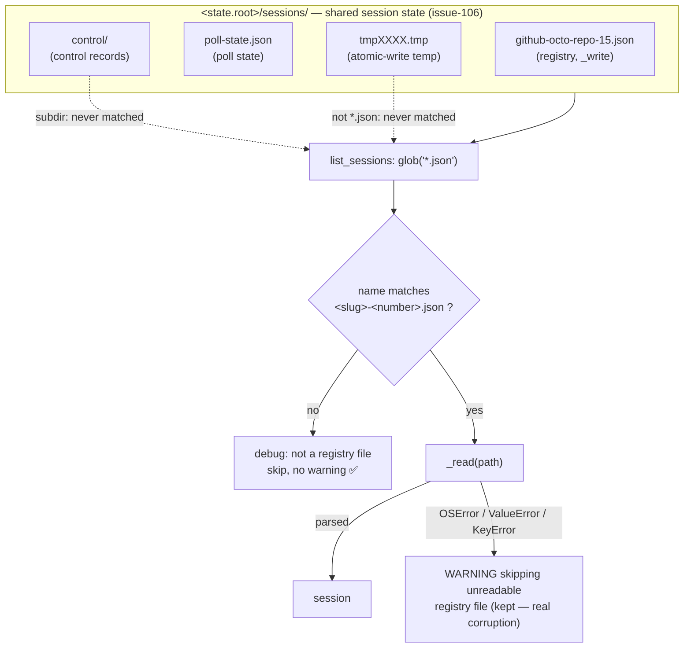

# Design: the registry lists the files it wrote, not the directory it sits in

> Phase 2 of 3 (requirements → design → tasks). Derives from the approved
> bug-shaped `requirements.md`.

## Architecture

`list_sessions` is the only place in the codebase that scans a directory
(`grep -n 'glob(' cli/the_loop/` returns it and one unrelated scenario loader),
and it is the only place that assumes the registry directory contains nothing
but sessions. The fix is to make that scan **name-aware** using the very naming
rule `_write` already follows.

The registry writes `f"{item.slug}.json"`, and `WorkItemRef.slug` is
`f"{provider}-{owner}-{repo}-{number}"` sanitised to `[A-Za-z0-9._-]`. Two
properties follow, and they are what make a filename check sound rather than a
heuristic:

- every file the registry writes ends in `-<digits>.json`; and
- the sanitiser guarantees the rest of the name is `[A-Za-z0-9._-]`.

So `^[A-Za-z0-9._-]+-\d+\.json$` is a **superset** of what `_write` can produce:
no session file can fail it, which is the direction that matters (a false
negative would hide a live session). `poll-state.json` fails it — the segment
before `.json` does not end in `-<digits>` — and so does any name-shaped
neighbour that is not a work-item slug.



Before this change the *no* branch did not exist: `poll-state.json` went straight
to `_read`, failed on `data['workItem']`, and produced the reported warning on
every cycle.

### 1. `registry.py` — one anchored pattern, applied in the scan

Beside the existing `_REF_RE`:

```python
# The registry directory is shared session-related state, not this class's
# private space: the poll state sits beside these files by design (issue-106,
# state.StateLayout.poll_state) and control records in a subdirectory. So a
# scan must recognise the files the registry itself *wrote* rather than assume
# every *.json is a session record (issue-111). ``_write`` names each one
# ``<slug>.json``, and ``WorkItemRef.slug`` always ends in ``-<number>``, so
# this is a superset of what the registry produces: a session file can never
# fail it.
_REGISTRY_FILE_RE = re.compile(r"[A-Za-z0-9._-]+-\d+\.json")
```

and in `list_sessions`:

```python
for path in sorted(self.root.glob("*.json")):
    if not _REGISTRY_FILE_RE.fullmatch(path.name):
        # Someone else's file in a directory we share — not corruption.
        logger.debug("ignoring non-registry file %s", path)
        continue
    session = self._read(path)
```

Design points:

- **Filter on the name, before opening the file.** The distinction being drawn
  is "is this file mine?", which the name answers; opening it and inspecting its
  keys would conflate *not mine* with *mine and broken* — precisely the
  conflation that produced the bug.
- **`fullmatch`, not `match`.** `match` would accept `poll-state.json42x`-style
  trailing junk; the pattern is a statement about the whole name.
- **Superset, not an exact reconstruction of the slug.** The pattern does not
  re-derive `<provider>-<owner>-<repo>-<number>` field by field. That would
  duplicate `WorkItemRef.slug`'s sanitising logic in a second place and could
  drift into excluding a real session file. The weaker check has the failure
  direction that is safe: it may let an oddly-named neighbour through to `_read`
  (where it warns, as any unparseable file does), and can never drop a session.
- **`debug`, not `warning` (AC2).** A neighbour is expected, not exceptional.
  `observability.runtimeLevel: info` keeps it out of daemon logs while
  `devLevel: debug` still shows it when someone is debugging the directory.
- **The warning is untouched (AC4).** `_read` and its handler are not modified,
  so a registry-named file that is unreadable, invalid JSON or missing
  `workItem` warns exactly as it does today.
- **Nothing else changes (AC5).** `find_by_work_item` addresses its file through
  `_path_for` and never scans; `register` / `pause` / `resume` / `close` /
  `touch` all route through it.

### 2. Components and interfaces

| Component | Change |
|-----------|--------|
| `the_loop.sessions.registry` | **new** module-level `_REGISTRY_FILE_RE`; `list_sessions` skips non-matching names before reading |
| `the_loop.sessions.registry.Session` / `WorkItemRef` | none — the naming rule is read from `slug`, not changed |
| `the_loop.state` | none — the layout stays as issue-106 defined it |
| `the_loop.poller.poller` | none — benefits automatically (its per-cycle `list_sessions` stops warning) |
| `the_loop.commands.sessions_cmd` | none — same |
| `the_loop.control.ControlStore` | none — `sessions/control/` is a subdirectory and it addresses files directly |

No public API, config key, schema or on-disk format changes.

## Data model

Unchanged. The registry file format, its naming rule (`WorkItemRef.slug`) and the
directory layout (`state.StateLayout`) are all exactly as before. This change
only *reads* the naming rule that already governs writes — which is why the
regression test drives its expectations from `slug` rather than from a literal
filename, so the two cannot drift apart silently.

## Error handling

| Case | Behaviour |
|------|-----------|
| Neighbour file (`poll-state.json`, anything not `<slug>.json`) | skipped before opening; `debug` line; no warning |
| Registry-named file, unreadable / invalid JSON / missing `workItem` | unchanged: `_read` returns `None` and logs the existing warning |
| Registry directory absent | unchanged: `list_sessions` returns `[]` (`self.root.is_dir()` guard) |
| Subdirectories (`control/`) and `*.tmp` files | unchanged: outside the non-recursive `*.json` glob |

## Testing strategy

| Test | Covers |
|------|--------|
| a directory with one registered session **and** a `poll-state.json` lists exactly the session, and `caplog` records **no** warning | AC2, AC3, AC6 |
| a registry-named file with unparseable content (`{not json`) and one with valid JSON but no `workItem` are both skipped **with** the existing warning | AC4 |
| every ref shape the registry can write — multi-digit numbers, dots/hyphens in owner/repo, characters the slug sanitises — round-trips through `register` → `list_sessions`, asserting the filter never excludes a file `_write` produced | AC1 |
| the existing registry suite (`cli/tests/test_routing.py`) stays green: register/find/close/pause/resume/touch | AC5 |

The first test is the regression: before the change it fails on the `caplog`
assertion (the bogus warning is emitted). `test_registry_skips_corrupt_file`
currently writes `garbage.json` — a name that is *not* registry-shaped, so after
this change it would exercise the new skip path rather than the corruption path
it is named for. It is renamed to a registry-shaped file so it keeps testing
corruption, and the neighbour case gets its own test; both assertions on the log
are explicit so the two paths can never be confused again.

## Security design

The **trust boundary** named in `requirements.md` is *what the daemon accepts as
a routing record*, and this design enforces it by narrowing the scan rather than
by trusting the directory's contents.

- **Strictly narrowing.** The change can only ever cause **fewer** files to be
  read as sessions. Nothing previously rejected becomes accepted, so no new
  dispatch target can be introduced by it.
- **Fail-closed direction, proved by a test.** The dangerous direction for a
  filename filter is excluding a real session (a live work item silently missing
  from a listing, hence never reconciled or closed). The pattern is a superset of
  what `_write` produces, and the AC1 test drives its inputs from
  `WorkItemRef.slug` itself rather than from hand-written names, so a future
  change to the slug rule that broke the assumption fails the suite.
- **Least work on untrusted input.** The check is an anchored `fullmatch` over a
  filename, with no alternation or nested quantifiers (no catastrophic
  backtracking) and no user-supplied pattern. It runs *before* the file is
  opened, so the net effect is one less JSON parse of one less file.
- **No new privilege, ingress or dependency.** No network, subprocess,
  credential, config key or file is added; `re` is already imported in the
  module.
- **Log integrity.** Keeping the warning for registry-named files (AC4) is the
  security-relevant half: a tampered or truncated session record must stay
  visible, and it only stays visible if the channel is not saturated by a benign
  per-cycle false positive.
- **Abuse case as a test.** A file that is not registry-named is never read as a
  routing record, and a registry-named file that fails to parse is never silently
  dropped — the two negative tests above.

## Minimalism

One compiled pattern and a two-line guard in the single function that scans a
directory. Rejected alternatives:

- **Blocklist `poll-state.json`** — fixes the one file that exists today and
  leaves the next session-related neighbour to re-introduce the bug; the bugfix
  spec identifies that generality as the actual defect.
- **Move the poll state out of `sessions/`** — reverses an issue-106 decision and
  risks re-baselining every watched thread on upgrade (out of scope).
- **Sniff content instead of the name** (`"workItem" in data`) — makes *not mine*
  indistinguishable from *mine and corrupt*, silencing AC4's warning.
- **A `SessionFile`/`RegistryLayout` abstraction** — an interface with one
  implementation for a naming rule that is already one expression.

## UI/UX artifacts

None — a daemon/library change with no user-facing surface
(`design.uiArtifacts` applies to user-facing work items). The only observable
difference is the absence of a log line.
