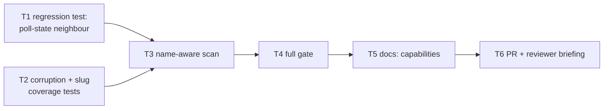

# Tasks: the registry lists the files it wrote (issue-111)

> Phase 3 of 3. Derived from the locked `design.md`. TDD (`tdd.mode: standard`):
> the failing test comes first for every behavioural task.

## DAG

## Task list

- [x] **T1 — Failing regression test** (`cli/tests/test_routing.py`, beside the
  existing registry cases): a registry directory holding one registered session
  **and** a `poll-state.json` lists exactly that session and emits **no**
  warning (`caplog.at_level(logging.WARNING)`). Fails before T3 on the log
  assertion. *(AC2, AC3, AC6)*
- [x] **T2 — Corruption + slug-coverage tests**: (a) rename the existing
  `garbage.json` case to a registry-shaped filename so it keeps exercising the
  corruption path, and assert the warning **is** logged — plus a registry-shaped
  file that is valid JSON but has no `workItem`; (b) a test that registers every
  ref shape the registry can write (multi-digit numbers, dots and hyphens in
  owner/repo, characters `slug` sanitises) and asserts each one lists, with the
  expectation driven from `WorkItemRef.slug` rather than literal names. *(AC1, AC4)*
- [x] **T3 — Name-aware scan** in `cli/the_loop/sessions/registry.py`:
  module-level `_REGISTRY_FILE_RE` (anchored `fullmatch`, documented as a
  superset of what `_write` produces and why the directory is shared), and a
  `debug`-level skip in `list_sessions` before `_read`. No other function
  changes. *(AC1, AC2, AC3, AC5)*
- [x] **T4 — Full gate from the repo root** (`make check`): `ruff check`,
  `markdownlint`, `ruff format --check`, `pyright`, `validate_config`, `pytest`.
  Record the red→green evidence in the execution log. *(AC6)*
- [x] **T5 — Documentation**: `docs/capabilities/cli.md` and
  `docs/capabilities/webhook-triggers.md` — the `<root>/sessions/` directory is
  **shared** session-related state and the registry reads only the files it
  wrote, with the corruption warning reserved for those; history rows added.
  *(AC7)*
- [x] **T6 — PR + reviewer briefing** from
  `skills/the-loop/templates/pr-briefing.md`; execution log finalised; label →
  `loop:needs-review`. *(ready-to-ship gate)*

## Verification

Each behavioural task's evidence is its test command's red→green transition,
recorded in `execution-log.md`. The work item is ready to ship when the full gate
is green, the capability docs are updated in this same PR, the security review is
recorded, and the briefing is posted.
