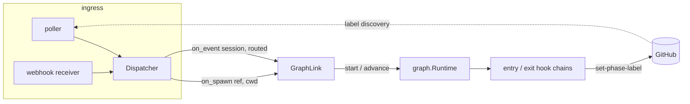

# Design: wire the ingress to the process graph

> Phase 2 of 3. Derived from [`requirements.md`](requirements.md).

## Overview

One new module — `cli/the_loop/graphlink.py` — is the seam between two subsystems that
must not learn about each other. The dispatcher calls it at exactly two points; it calls
the graph runtime. Neither the graph nor the ingress gains a dependency on the other's
concepts.



The dotted edge is the loop that today only closes by hand: the graph writes the phase
label, and the poller discovers by label.

**Why the dispatcher and not the poller.** The dispatcher is the single component both
ingresses share — the poller exists specifically to reuse it (`poller/poller.py:2-9`).
Wiring the poller alone would give webhook deployments a graph that never moves (AC10).

**Why a module and not dispatcher methods.** Three reasons that are all failure-mode
reasons, not aesthetic ones: the coupling must be individually disable-able (AC12), it
must swallow every exception without touching dispatch (AC11), and it needs a repo root
the dispatcher has no other reason to know about. A named seam makes all three testable
in isolation.

## Components and interfaces

### `cli/the_loop/graphlink.py` (new)

```python
@dataclass
class GraphLinkConfig:
    enabled: bool = True
    spec_dir: str = "docs/specs"

    @classmethod
    def from_mapping(cls, data: Optional[dict]) -> "GraphLinkConfig": ...


class GraphLink:
    """Best-effort bridge: ingress events → process-graph transitions."""

    def __init__(self, config: GraphLinkConfig, control=None, control_store=None): ...

    def on_spawn(self, work_item: WorkItemRef, cwd: str) -> None:
        """A session was just spawned — enter the start node (AC1-AC3)."""

    def on_event(self, work_item: WorkItemRef, cwd: str, routed: RoutedEvent) -> None:
        """An event reached an existing session — advance one node (AC5-AC7)."""
```

Both entry points are `-> None` and never raise: the dispatcher's control flow is not
allowed to depend on them (AC11). Both are no-ops when `enabled` is false (AC12).

**Free functions, unit-testable without a dispatcher:**

| Function | Responsibility |
|---|---|
| `spec_id_for(ref: WorkItemRef) -> Optional[str]` | `github:o/r#113` → `"issue-113"`; `None` for a non-GitHub provider (AC8) |
| `comments_from(routed: RoutedEvent) -> List[dict]` | payload → `[{"author", "body"}]` for `issue_comment` / `pull_request_review_comment` / `pull_request_review` |

### `Runtime.start()` (new, `cli/the_loop/graph/runtime.py`)

`advance()` evaluates the *current* node's **exit** chain. There is no API for "this work
item is beginning" — which is why nothing enters the start node. `start()` is that
missing counterpart:

```python
def start(self, work_item_id: str, ref: str = "") -> Optional[NodeReport]:
    """Enter the start node for a work item that has not begun (AC1-AC3).

    Returns None when the work item already has a pointer — starting is
    idempotent, never a reset.
    """
```

Semantics, mirroring `advance()`'s existing discipline:

1. Load state. If `state.current_node` is non-empty → return `None` (AC3).
2. `state.enter(graph.start)`, then `state.save()` — **persist before any dependent
   side effect** (R8.2), so a hook that dies mid-chain cannot leave a labelled ticket
   with no recorded pointer.
3. `run_chain(node.entry, ...)` for the start node (AC2).
4. Emit `graph.advanced`-style telemetry via a new `graph.started` event.

This is deliberately *not* folded into `advance()`: `advance` means "evaluate a gate and
move", `start` means "begin". Overloading the first would make an un-started work item's
first `advance` silently run an entry chain, which is exactly the kind of implicit
behaviour issue-109 set out to remove.

### `Dispatcher` (modified, 2 call sites + construction)

- `__init__` builds `self.graphlink = GraphLink(config.graph, config.control, self.control_store)`.
- `_spawn_for(...)`: after a successful spawn and registry write, `self.graphlink.on_spawn(work_item, cwd)`.
- `_dispatch_to(...)`: after a successful delivery, `self.graphlink.on_event(session.work_item, session.cwd, routed)`.

Both calls sit **after** the dispatch outcome is known, so nothing about delivery
depends on them.

### `RoutingConfig` (modified)

One new optional block, parsed like the others:

```yaml
webhooks:
  ghWebhook:
    routing:
      graph:
        enabled: true          # default; false restores pre-issue-113 behaviour
        specDir: docs/specs    # matches workflow.specDir in the harness config
```

`polling` reuses `webhooks.ghWebhook.routing` wholesale (`poll.py:_build_dispatcher`),
so the poller inherits this with no separate knob — consistent with how every other
dispatch behaviour is configured.

### Two changes the build added to this plan

**`Runtime.advance(..., event=...)`.** `HookContext.event` needs a writer, and the write
happens where the context is built — so `advance` and `evaluate` gained an optional
`event`, threaded into `_context`. `the-loop check` passes none, which is what keeps it
honest: a gate awaiting human feedback reads as `wait` there and resolves only when a
real event carries the reply.

**`graph/bootstrap.py`.** The runtime's `config` is what carries `authorizedUsers` to
`classify-feedback`, and `commands/graph_cmd.py` was assembling it privately. A second
assembly in the link would have failed closed on every human gate while `check` worked
fine. The assembly moved to `graph/bootstrap.build_runtime()`, which both call; the
daemon passes its own already-parsed `authorizedUsers` so a `--config` override is
honoured.

## Data model

No new persisted state. The coupling writes only through `GraphState`, whose file
(`docs/specs/<id>/graph-state.json`) and atomic-write discipline are unchanged.

**Which repo root.** The graph runtime is rooted at the **session's checkout**, not the
daemon's cwd: `session.cwd` for events, and the freshly prepared `cwd` for a spawn. With
`routing.workspace` enabled that is a per-work-item git worktree, so `graph-state.json`
lands in the same tree the agent is working in and gets committed with the rest of the
spec — which is what makes the state reviewable in a PR diff (state.py's stated intent).

**Identity mapping.** `WorkItemRef.number` is an `int` parsed by `WorkItemRef.parse`, so
`f"issue-{ref.number}"` cannot contain a path separator regardless of what arrived on the
wire (A5). The mapping is then validated against an existing directory (AC9) — the
coupling never creates a spec directory, because a work item with no spec is one the loop
has not started, and inventing a directory would fake that.

## Error handling

| Condition | Behaviour | AC |
|---|---|---|
| Coupling disabled | Return immediately, no import cost | AC12 |
| Non-GitHub provider ref | Skip, debug log | AC8 |
| No spec directory for the mapped id | Skip, debug log | AC9 |
| Start not requested (control gate) | Skip, debug log | AC4 |
| Work item already has a pointer (`on_spawn`) | Skip — idempotent | AC3 |
| Exit chain returns `block` / `wait` | `advance()` parks or records; the link reports nothing and does not retry | AC7 |
| **Any exception** from the runtime or a hook | Caught, logged at `error`, `graph.link_failed` emitted, delivery unaffected | AC11 |

The blanket `except Exception` is deliberate and is the point of the seam: hooks run
lint, subprocesses and outbound HTTP, so their failure modes are open-ended, and none of
them is a reason to drop a webhook delivery. It is paired with a narrow scope (two
call sites) and an event-log record, so a swallowed failure is still visible in
`the-loop events`.

## Security design

Each trust boundary from `requirements.md` § Security considerations, and how it is
enforced:

**B1 — comment text → graph hook chain (the new boundary).** `comments_from()` extracts
`{"author", "body"}` pairs and passes them **through unfiltered**, because
`classify-feedback` already implements the authorization decision
(`hooks/feedback.py:37-62`): `authorizedUsers` membership, `is_self_authored` drop, and a
closed outcome set that the node's *declared* edges route. Pre-filtering in the link
would duplicate that decision in a second place, and a duplicated authorization check is
one that will eventually disagree with itself. The link's obligation is narrower and
absolute: it MUST always supply the author alongside the body, never a bare string, so
the hook's filter has the field it filters on. An unattributed comment is dropped by the
link rather than passed with an empty author (A1).

**B2 — self-authored re-entry.** Unchanged and doubly covered: the poller drops
self-marked comments before forwarding (`poller.py:490-495`), and `classify-feedback`
drops them again before reading (A2).

**B3 — daemon → outbound integrations.** Entry chains now fire from an unattended
process. Gated by AC4: the link consults the same `control.require_start_command` +
`control_store.start_requested(ref)` pair the spawn path uses (`_spawn_refusal`,
`_awaiting_start`), so an item nobody started reaches no hook (A3). Integration
credentials are unchanged — `config` carries env-var *handles*, never values (R2.7).

**B4 — filesystem.** Spec id derived from an `int` (A5); target directory must already
exist (AC9); writes go only through `GraphState.save`'s atomic temp-file-plus-rename.

**B5 — availability.** A hook that raises, hangs on a subprocess or fails an outbound
call cannot cost a delivery (AC11, A4).

**Fail-closed check.** Every skip path above leaves the graph *where it was*. There is no
input to this code that causes a work item to move **forward** — inputs can only cause a
move to not happen. That asymmetry is what makes the new boundary safe to open.

## Testing strategy

Per `tdd.mode: standard` — red→green per task.

**Unit** (`cli/tests/test_graphlink.py`, new):
- `spec_id_for` mapping and the non-GitHub `None` case (AC8).
- `comments_from` across `issue_comment`, `pull_request_review_comment`,
  `pull_request_review`, and an unrelated event → `[]`.
- A comment with no author is dropped (B1).
- Disabled config → no runtime call (AC12).
- Missing spec dir → no runtime call (AC9).
- Control gate unsatisfied → no runtime call (AC4).
- A runtime that raises → caught, delivery-side caller unaffected (AC11).

**Unit** (`cli/tests/test_graph_runtime.py`, extended):
- `start()` enters the start node and runs its entry chain (AC1, AC2).
- `start()` on a work item with an existing pointer returns `None` and mutates nothing (AC3).
- `start()` persists `currentNode` before the entry chain runs (R8.2) — asserted with an
  entry hook that reads the state file from disk mid-chain.

**Integration** (`cli/tests/test_graphlink_integration.py`, new, Gherkin docstrings per
`testing.gherkinDocstrings: required`):
- *Spawning a session starts the work item's graph* — poller presence → spawn → start
  node entered, phase label hook invoked (AC1, AC2, AC10).
- *A reviewer's approval reaches the waiting gate* — session at a human-approval node,
  authorized comment arrives → gate resolves; an unauthorized one leaves it waiting
  (AC5, AC6, A1).
- *A failing hook does not cost the delivery* (AC11).

## Minimalism notes

Per `reference/minimalism.md`: no new dependency; no new persisted file; no scheduler.
One new module (~150 lines), one new `Runtime` method, one new config block, two call
sites. The alternative considered and rejected was having the poller shell out to
`the-loop graph advance` — rejected because it doubles process spawns per event, loses
the exception boundary, and cannot pass `event.comments` through a CLI argv without
putting attacker-controlled text on a command line.
