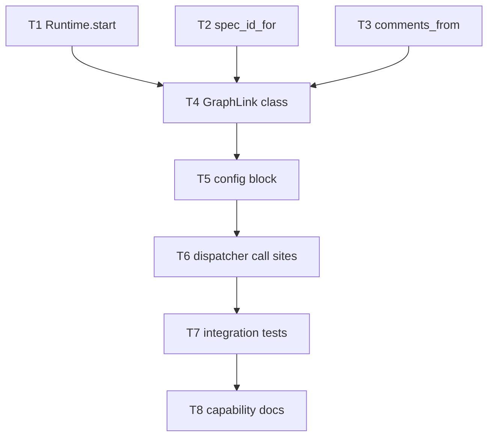

# Tasks: wire the ingress to the process graph

> Phase 3 of 3. Derived from [`design.md`](design.md). DAG — a task may start once its
> dependencies are ticked. `tdd.mode: standard`: each task writes its failing test first.

## Task list

### T1 — `Runtime.start()` — enter the start node

- **Requirements:** AC1, AC2, AC3
- **Depends on:** —
- **Red:** `test_graph_runtime.py::test_start_enters_start_node_and_runs_entry_chain`,
  `::test_start_is_idempotent_when_pointer_exists`,
  `::test_start_persists_pointer_before_entry_chain`
- **Green:** add `start()` to `cli/the_loop/graph/runtime.py`; add `graph.started` to
  `eventlog.EVENT_TYPES` (the drift test in `test_eventlog.py` enforces this).
- [x] Done

### T2 — `spec_id_for()` — ref → spec-directory id

- **Requirements:** AC8, A5
- **Depends on:** —
- **Red:** `test_graphlink.py::test_spec_id_for_github_ref`, `::test_spec_id_for_other_provider_is_none`
- **Green:** derive `issue-<int>` from the parsed ref; `None` for non-GitHub providers.
- [x] Done

### T3 — `comments_from()` — payload → attributed comments

- **Requirements:** AC5, B1
- **Depends on:** —
- **Red:** `test_graphlink.py::test_comments_from_each_event_shape`,
  `::test_comment_without_author_is_dropped`, `::test_unrelated_event_yields_no_comments`
- **Green:** extract `issue_comment` / `pull_request_review_comment` / `pull_request_review`
  bodies with their authors; drop any entry missing an author or a body.
- [x] Done

### T4 — `GraphLink` — the seam, with every skip path

- **Requirements:** AC4, AC9, AC11, AC12
- **Depends on:** T1, T2, T3
- **Red:** `test_graphlink.py::test_disabled_link_does_nothing`,
  `::test_missing_spec_dir_is_skipped`, `::test_awaiting_start_is_skipped`,
  `::test_runtime_exception_is_swallowed`, `::test_on_event_advances_with_comments`
- **Green:** `cli/the_loop/graphlink.py` — `GraphLinkConfig`, `GraphLink.on_spawn`,
  `GraphLink.on_event`; add `graph.link_failed` to `eventlog.EVENT_TYPES`.
- [x] Done

### T5 — `routing.graph` config block

- **Requirements:** AC12
- **Depends on:** T4
- **Red:** `test_graphlink.py::test_routing_config_parses_graph_block`
- **Green:** `GraphLinkConfig` field on `RoutingConfig.from_mapping`; document the block
  in `.the-loop/cli-config.schema.json` and `skills/the-loop/templates/cli-config.yaml`.
- [x] Done

### T6 — Dispatcher call sites

- **Requirements:** AC1, AC5, AC10, AC11
- **Depends on:** T5
- **Red:** `test_graphlink.py::test_dispatcher_starts_graph_on_spawn`,
  `::test_dispatcher_advances_graph_on_delivery`
- **Green:** construct `GraphLink` in `Dispatcher.__init__` (and rebuild it in the
  hot-reload path); call `on_spawn` after a successful spawn, `on_event` after a
  successful delivery.
- [x] Done

### T7 — Integration tests (Gherkin)

- **Requirements:** AC2, AC6, AC10, AC11, A1
- **Depends on:** T6
- **Red/Green:** `cli/tests/test_graphlink_integration.py` — spawn-starts-graph,
  reviewer-approval-reaches-the-gate (authorized vs unauthorized), failing-hook-does-not-
  cost-the-delivery.
- [x] Done

### T9 — Let a passing gate's verdict reach its edges

> **Discovered by T7, not planned.** The first integration test to advance a *real*
> human-approval node parked with `no edge from requirements-approval on 'pass'`.
> `ChainOutcome.outcome` read the routing value only from a **blocking** result, but
> `classify-feedback` returns `pass` *carrying* `data["outcome"] = "approved"` — so the
> verdict was discarded and all three approval nodes in `pdlc.yaml`, whose edges are
> declared `on: approved` / `on: changes-requested`, could never route. Pre-existing
> since issue-109 and never caught, because every existing test calls the hook directly
> rather than through `advance()`. In scope: AC6 cannot hold without it.

- **Requirements:** AC6
- **Depends on:** T7
- **Red:** `test_graph_chain.py::test_a_passing_hooks_explicit_outcome_is_what_edges_route_on`,
  `::test_a_chain_of_plain_passes_still_routes_on_pass`
- **Green:** `ChainOutcome.outcome` falls back to the last result that declared an
  explicit `data["outcome"]`; a plain `HookResult.ok` still reports `pass`.
- [x] Done

### T10 — Refuse a checkout that is not the work item's own repo

> **Found by CI on this PR, not by design review.** The gate reported three work
> items instead of one: running the suite had written `graph-state.json` into the
> real `docs/specs/issue-1` and `issue-15`. Cause — the dispatcher tests use
> `github:octo/repo#15`, which maps to `issue-15`, and their session `cwd` is `.`.
> That is a production hazard, not test noise: with the default `spawnWorkdir: "."`
> an event about any repo's issue #15 drives the operator's own `issue-15`.

- **Requirements:** AC14, A6
- **Depends on:** T4
- **Red:** `test_graphlink.py::test_a_checkout_of_another_repo_is_never_coupled`,
  `::test_a_checkout_with_no_origin_is_skipped`,
  `::test_a_directory_that_is_not_a_checkout_is_skipped`,
  `::test_the_work_items_own_checkout_is_coupled`
- **Green:** `_checkout_belongs_to` + `_repo_slug` in `graphlink.py`, failing closed;
  the test fixtures became real checkouts with an origin.
- [x] Done

### T8 — Capability docs + spec fold-in

- **Requirements:** ready-to-ship gate
- **Depends on:** T7
- **Green:** update `docs/capabilities/process-graph.md` and `docs/capabilities/cli.md`
  with the coupling and its history row; keep `execution-log.md` current.
- [x] Done
