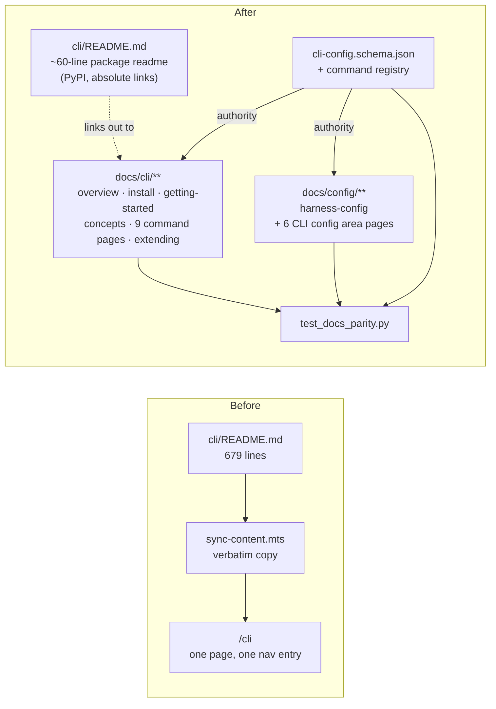
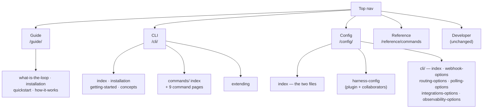

# Design: the CLI documented as a product, and the docs restructured around it

> Phase 2 of 3 (requirements → design → tasks). Derives from the approved requirements.
> MUST be reviewed and approved before moving to tasks breakdown.

## Overview

Three moves, in dependency order:

1. **Give the CLI a section.** Replace the single generated `/cli` page with an authored
   `docs/cli/` tree: overview → installation → getting-started → concepts, a commands
   index, one page per command, and an extension guide. (R1, R2)
2. **Give configuration a top-level section.** Create `docs/config/`, holding the plugin
   config and the CLI config split by area, with one uniform per-option format. This is
   the `vite.dev/config/` shape the ticket asked for. (R3)
3. **Make the split enforceable.** Author the pages against
   `.the-loop/cli-config.schema.json` and the command registry, then add a **bidirectional
   parity test** so neither can drift from the other again. (R4)

The third move is what makes this a fix rather than a tidy-up. The 679-line file was not
merely long — its flatness is why three commands and four config blocks went undocumented
while a removed key stayed documented. A structure with a slot per command and a slot per
option turns "someone forgot" into a failing test.

## Architecture

### Content flow, before and after



The site no longer derives any CLI page from `cli/README.md`; the arrow that used to
carry content now carries only outbound links. The **schema and the command registry**
become the upstream authority, and the parity test is the gate that keeps them upstream.

### Site information architecture



`Reference` keeps the plugin slash-command table; its configuration page moves into
`Config` (open question 1 in the requirements — the old `/reference/configuration` URL is
retired rather than stubbed, because VitePress has no redirect mechanism and this site
sets `markdown.html: false`).

## Components & interfaces

### C1 — `docs/cli/` (new, 15 pages)

| Page | Responsibility |
|------|----------------|
| `index.md` | What the CLI is, what it is *not* (it is not required to use the-loop), the four things it does, when an operator needs it. Entry point of the section. |
| `installation.md` | PyPI (`the-loopy-one`), `uv` workspace, editable/dev install; `--version` verification; the deprecated `[config]` extra; the `slack` extra. |
| `getting-started.md` | The onboarding path (R1.3): install → write a minimal `cli-config.yaml` → `sessions register` or webhook/poll ingress → label + `the-loop:start-execution` → watch with `events`. Each step runnable. |
| `concepts.md` | The mental model that the command pages assume: two configs, the two ingresses, the session registry, execution control, the two guards, workspaces, the process graph, the event log. |
| `commands/index.md` | One table, every command, one line each, linked. (R2.2) |
| `commands/gh-webhook.md` | Receiver: synopsis, flags, HMAC, `/health`, routing, hot-reload, guards, event log. |
| `commands/poll.md` | Poller: synopsis, flags, provider model, dedup/state, reconciliation/auto-close, retries, hot-reload, guards. |
| `commands/sessions.md` | `register`/`list`/`attach`/`close` + `start`/`pause`/`resume`/`stop`; registry layout; auto-close semantics; label-gated auto-execution. |
| `commands/events.md` | Query surface, filters, formats, `--types` catalog, record shape. |
| `commands/check.md` | **New.** Pure node evaluation, `--all`, `--recompute`, `--fail-on unmet\|block`, exit codes, CI use. |
| `commands/graph.md` | **New.** `show`/`status`/`advance`/`run`/`force`; `--max-nodes` and loop detection; `force` requiring a reason and not forging a verdict. |
| `commands/critic.md` | Critic round: config source, argv-not-shell, the single JSON envelope, exit codes 0/1/2. |
| `commands/scenarios.md` | Gherkin scenario table; glob resolution order; formats. |
| `commands/migrate-config.md` | **New.** The version gate, `--path`/`--dry-run`, the `.bak`, idempotence, relation to `/the-loop:upgrade-the-loop`. |
| `extending.md` | Adding a command (the `Command`/`@register` contract). |

### C2 — `docs/config/` (new, 8 pages)

| Page | `configBase` | Covers |
|------|--------------|--------|
| `index.md` | — | The two files, which governs what, precedence, and where each lives. |
| `harness-config.md` | — | `.the-loop/harness-config.yaml` section table (from the retired `reference/configuration.md`) + `.the-loop/collaborators.yaml` + `.the-loop/manifest.yaml`. |
| `cli/index.md` | *(root)* | Configuring the CLI: the four-position resolution order, the `version` gate and migration, `state.root` and everything it defaults. Options: `version`, `state.root`. |
| `cli/webhook-options.md` | `webhooks.ghWebhook` | `host`, `port`, `path`, `secretEnv`, `pidfile`, `events`. |
| `cli/routing-options.md` | `webhooks.ghWebhook.routing` | Every routing leaf: the scalars plus `control`, `graph`, `workspace`, `tmux`, `webTerminal`, `harnessArgs`, `harnessTrust`, `reactions`, `announce`. |
| `cli/polling-options.md` | `polling` | `intervalSeconds`, `stateFile`, `maxRetries`, `sources[]`. |
| `cli/integrations-options.md` | `integrations` | `github`/`slack`/`jira` transports, token/URL env vars, `github.cli.binary`. |
| `cli/observability-options.md` | *(root)* | `eventLog.*`, `collaborators`, `notifications.*`. |

Together the six CLI pages cover **all 80 leaf options** in the schema. That total is not
incidental — it is what the parity test asserts (C4).

### C3 — the per-option format (the contract the test reads)

Every option, on every CLI config page, is written the same way — vite's shape, plus the
machine-readable anchor the parity test needs:

````markdown
---
configBase: webhooks.ghWebhook.routing
---

### `authorizedUsers`

- **Type:** `string[]`
- **Default:** `[]`
- **Related:** [Guards](/cli/concepts#guards)

**SECURITY.** GitHub logins whose actions the-loop may act on…
````

- The `###` heading holds the option's path **relative to the page's `configBase`**, in
  backticks. Full paths (`webhooks.ghWebhook.routing.tmux.keepSessionOnClose`) would be
  exact but unreadable in the outline; `configBase` + relative path is exact *and*
  readable, and gives every option a stable anchor to link.
- `configBase` is an extra front-matter key. VitePress ignores unknown front-matter keys
  when rendering, so it costs one line per page and no markup.
- **Type** and **Default** are mandatory on every option (R3.3); **Related** is optional.

### C4 — `cli/tests/test_docs_parity.py` (new)

The recurrence guard. Four assertions, all pure filesystem reads:

| # | Assertion | Prevents |
|---|-----------|----------|
| P1 | Every command in the registry has `docs/cli/commands/<name>.md` | A shipped command with no page (`check`, `graph`, `migrate-config` today) |
| P2 | Every `docs/cli/commands/*.md` except `index.md` names a registered command | A page for a command that no longer exists |
| P3 | Every option heading across `docs/config/cli/**` resolves to a leaf in the schema | Documenting a removed key (`ghBinary` today) |
| P4 | Every leaf in the schema has an option heading | An undocumented block (`integrations`, `workspace`, `routing.graph`, `polling.maxRetries` today) |

Interfaces it depends on:

- **Registry:** `the_loop.commands.base` already keeps the registered `Command`
  subclasses; the test reads that, so a new `@register` is enough to require a page.
- **Schema:** walked with the stdlib `json` module. An `array` whose `items` declare
  `properties` contributes `path[].child` leaves (`polling.sources[]`); an array whose
  items are a `$ref` to another schema (`collaborators`) stays a single leaf, documented
  as one option pointing at the collaborators structure.
- **Skip guard:** the test is skipped when `docs/` is absent, so a source distribution
  that ships `cli/` without the site does not fail.

No new dependency: `json`, `pathlib` and a small regex, all stdlib. (Front-matter is read
with a two-line delimiter scan rather than adding a YAML front-matter parser — PyYAML is
already a dependency and parses the block once it is sliced out.)

### C5 — `cli/README.md` (rewritten, ~60 lines)

Keeps: what it is, the install block, one worked example, a table of the sections it now
points at, the test command. Everything else moves. The mapping is exhaustive, and is
carried into `tasks.md` as the fidelity check for R5.4:

| `cli/README.md` section (lines) | Now lives at |
|---|---|
| Intro, `## Install` (1–43) | `/cli/` + `/cli/installation` |
| `## Two independent config files` (45–75) | `/config/` + `/config/cli/` |
| `### CLI config reference` → `#### Top level`, `state` (77–121) | `/config/cli/` |
| `#### webhooks.ghWebhook` (122–133) | `/config/cli/webhook-options` |
| `#### …routing` + `control`, `harnessTrust`, `tmux`, `announce`, `reactions`, `webTerminal` (134–342) | `/config/cli/routing-options` |
| `#### polling`, `polling.sources[]` (343–361) | `/config/cli/polling-options` |
| `#### eventLog`, `collaborators`, `notifications` (362–397) | `/config/cli/observability-options` |
| `### gh-webhook` (400–448) | `/cli/commands/gh-webhook` |
| `### sessions` (449–512) | `/cli/commands/sessions` |
| `### poll` (513–585) | `/cli/commands/poll` |
| `### events` (586–620) | `/cli/commands/events` |
| `### scenarios` (621–636) | `/cli/commands/scenarios` |
| `### critic` (637–665) | `/cli/commands/critic` |
| `## Adding a command` (666–674) | `/cli/extending` |
| `## Test` (675–679) | retained in `cli/README.md` |

Links out of `cli/README.md` are **absolute** `https://madarauchiha-314.github.io/the-loop/…`
URLs (R5.2) — PyPI renders the file outside the repository, so a relative link is dead
there.

### C6 — `docs/.vitepress/config.mts` and `docs/scripts/sync-content.mts`

- `sync-content.mts`: delete the `["cli/README.md", "cli.md", null]` entry, leaving
  `FILE_MAPPINGS` empty; the `skills/the-loop/reference` directory mapping is untouched.
  The loop over an empty list is a no-op, so the script keeps working and stays the place
  a future file mapping would go. Its header comment and its final `console.log` are
  updated so they do not describe a copy that no longer happens.
- `config.mts`: add `CLI` and `Config` to `nav`, add the two sidebar trees keyed on
  `/cli/` and `/config/`, and drop `/reference/configuration` from the Reference sidebar.
- `.gitignore`: `docs/cli.md` is currently ignored as generated output. Replace that entry
  with nothing — `docs/cli/` is authored and must be committed. The stale ignore line is
  removed in the same change so a future `docs/cli.md` is not silently untracked.

## UI/UX design

No **prototype** artifact: this work item authors pages inside VitePress's existing default
theme, and introduces no component, layout, stylesheet or theme override. There is nothing
to mock up — the design here is the information architecture in §Architecture and the
per-option format in C3, both reviewable as markdown.

The user-facing surface is still real, though, so `design.uiArtifacts.screenshotEvidence`
is met with screenshots of the **built** site rather than of a mock:

| Artifact | Type | Location | Covers (screen · requirement) | Status |
|----------|------|----------|-------------------------------|--------|
| `design/cli-overview.png` | screenshot | `design/cli-overview.png` | `/cli/` — CLI as a top-level nav section with its own sidebar · R1.1, R1.2 | approved |
| `design/cli-commands.png` | screenshot | `design/cli-commands.png` | `/cli/commands/` — one table, one page per command · R2.2 | approved |
| `design/config-routing.png` | screenshot | `design/config-routing.png` | `/config/cli/routing-options` — per-option Type/Default/Related, area sidebar, section outline · R3.1–R3.3 | approved |

- **Flows & states:** the two onboarding paths — plugin (`Guide`) and CLI
  (`/cli/` → installation → getting-started → concepts → commands) — and the reference
  surfaces they hand off to (`/config/`, `/cli/commands/`).
- **Design system / tokens:** VitePress default theme, unmodified. Custom containers
  (`::: tip | warning | danger`) carry severity; `danger` is reserved for the three
  security statements in §Security design.
- **Accessibility & responsiveness:** inherited from the theme — no override that could
  regress either. Every option is a real heading, so the outline and screen-reader
  landmarks follow the document rather than styling.
- **Evidence:** the three screenshots above, plus the built-site checks in the execution
  log (all internal links and anchors resolve; every command and config area is its own
  search-index document — R6.5).

## Data models

One new data contract, read only by the parity test:

```text
option-heading  ::= "### " "`" relative-path "`"
relative-path   ::= segment ("." segment)*          # relative to the page's configBase
configBase      ::= dotted path from the CLI config root, or absent for a root-level page
absolute-path   ::= configBase "." relative-path    # what P3/P4 resolve against the schema
```

Schema leaves are enumerated from `.the-loop/cli-config.schema.json` by walking
`properties`, descending into `items.properties` for arrays that declare them (yielding
`sources[].provider`-style paths), and stopping at `$ref` items.

## Error handling

- **Parity test failure** names the offending path and the direction (`documented but not
  in schema` / `in schema but not documented`), because a bare assertion diff over 81
  paths is not actionable.
- **Build failure** from a bad link: the site sets `ignoreDeadLinks: true`, so VitePress
  will *not* catch a broken internal link. That is a pre-existing setting this work item
  does not change (it exists because `docs/` links out to real files outside `srcDir`), so
  internal link correctness is verified by grepping for the retired paths (`/cli#`,
  `(/cli)`, `/reference/configuration`) rather than relying on the build. This is recorded
  as a task, not left to review attention.
- **PyPI rendering**: no way to test locally beyond keeping the file plain CommonMark with
  absolute links; the risk is one dead link on a package page, not a broken build.

## Security design

The threat model in the requirements identified **no new attack surface** (no runtime, no
input, no secrets, no network) and one real risk: **a restructure that quietly weakens a
documented security control**. The mechanisms:

- **AuthN/AuthZ:** unchanged; nothing in this work item authenticates or authorizes.
- **Input validation & injection surfaces:** none added. `sync-content.mts` loses a file
  copy and gains nothing; the parity test only reads files. No user input reaches any code
  path introduced here.
- **Secrets handling:** every example uses env-var *names* (`THE_LOOP_GH_WEBHOOK_SECRET`,
  `THE_LOOP_SLACK_WEBHOOK_URL`, `integrations.github.api.tokenEnv`) and never a value.
  This is checked in review as a task item, over every new page.
- **Least privilege in copyable examples:** the getting-started config keeps
  `host: 127.0.0.1`, leaves `webTerminal.enabled: false`, and sets `authorizedUsers`
  explicitly to a single placeholder login rather than showing it empty or omitted.
- **Fail-closed behaviour preserved in prose (the load-bearing part):** three controls
  must read at least as strongly after the move as before. Each gets a named home rather
  than a passing mention:
  1. `authorizedUsers` fails closed when empty, is REQUIRED, and has **no** plugin-config
     fallback → stated on `/config/cli/routing-options` **and** `/cli/concepts#guards`,
     and repeated on both ingress command pages.
  2. The self-comment marker guard → `/cli/concepts#guards`, and on both ingress pages.
  3. Secrets come from the environment, never config → `/config/cli/webhook-options`
     (`secretEnv`) and `/config/cli/integrations-options` (`urlEnv`, `tokenEnv`).
- **Abuse-case coverage:**

  | Abuse case (requirements) | Mechanism | Proof |
  |---|---|---|
  | A secret appears in an example | Env-var names only; no literal token/URL/secret | Task T-review greps every new page for `ghp_`, `xoxb`, `hooks.slack.com`, and for a `secret:`/`token:` key with a value |
  | A reader concludes `authorizedUsers` is optional or inherited | Explicit "REQUIRED · no fallback · empty fails closed" on the option, the concepts page and both ingress pages | Same task verifies the three homes exist |
  | A pasted example widens exposure | `127.0.0.1`, `webTerminal.enabled: false`, explicit `authorizedUsers` | Same task verifies the getting-started YAML |

- **Risk tier 3** → `human-approves-pr`; below `security.review.humanSignOffMinTier` (4),
  so no named human security sign-off is required. The security-review gate itself still
  runs before ready-to-ship.

## Testing strategy

| Requirement | How it is proven |
|---|---|
| R1.1–R1.5 | Pages exist with the stated content; nav/sidebar entries present in `config.mts`; each onboarding page ends with a next-step link (review + built-site evidence) |
| R2.1, R2.2, R4.4 | **P1/P2** in `test_docs_parity.py` — registry ↔ command pages, both directions |
| R2.3–R2.5 | Written from the implementation (`graph_cmd.py`, `migrate_cmd.py`, `sessions_cmd.py`, …); reviewed against `--help` output captured in the execution log |
| R3.1, R3.2, R3.5 | Nav/sidebar structure in `config.mts`; page set on disk |
| R3.3, R3.4, R4.1, R4.3 | **P3/P4** in `test_docs_parity.py` — schema ↔ documented options, both directions. P4 is what forces `integrations`, `workspace`, `routing.graph` and `polling.maxRetries` to be written |
| R4.2 | P3 fails on any `ghBinary` heading; plus a repo-wide grep recorded as evidence |
| R5.1, R5.2 | Review of the rewritten file; grep asserts no relative `](/…)` or `](docs/…)` link remains in `cli/README.md` |
| R5.3 | `FILE_MAPPINGS` is empty; `docs/cli.md` is not produced by `bun run docs:sync` |
| R5.4 | The C5 mapping table walked section by section in the execution log |
| R6.1 | Repo-wide grep for `](/cli)`, `](/cli#`, `/reference/configuration` returns nothing outside `docs/specs/**` (historical record, not rewritten) |
| R6.2, R6.3 | `docs/index.md` hero action + root `README.md` link |
| R6.4 | `make lint` (ruff + markdownlint over `**/*.md`) and `bun run docs:build` both green |
| R6.5 | Built-site search returns per-command and per-config-area results (evidence in the execution log) |

`test_docs_parity.py` is a **unit** test (pure filesystem, no subprocess, no network), so
it is named outside `testing.integrationTestGlobs` and carries no Gherkin docstring —
consistent with `reference/testing.md`, which reserves scenario docstrings for
integration tests.

## Trade-offs & decisions

1. **Authored pages, not schema-generated.** Generating option tables from the schema
   would make P3/P4 vacuous and guarantee parity — but the value in the current README is
   its *prose* ("why sessions used to stall on a dialog", the `skipDangerousModePermissionPrompt`
   asymmetry warning). A generator would either drop it or need the schema to carry
   long-form markdown. Authored pages + a parity test keep the prose and still make drift
   a red test. **Cost:** writing 80 options by hand once.
2. **`/reference/configuration` retired, not stubbed.** No redirect mechanism exists here
   (`markdown.html: false` rules out a meta-refresh). The site is recent (#71) and the
   ticket asked for a top-level `/config/`. Flagged as open question 1; reversible.
3. **One page per command rather than one long commands page.** Nine pages is more files,
   but it is what makes P1/P2 expressible at all, and what makes site search return a
   command rather than "the CLI" (R6.5).
4. **`configBase` front-matter rather than full dotted headings.** Full paths would need
   no extra key but produce unreadable outline entries
   (`webhooks.ghWebhook.routing.tmux.harnessKillGraceSeconds`). One front-matter line per
   page buys short headings *and* exact resolution.
5. **`FILE_MAPPINGS` left in place but empty** rather than deleting the file-copy machinery
   with it. The directory mapping next to it is still used, and the pair reads as one
   symmetrical mechanism; deleting half of it to save eight lines would cost more in
   readability than it saves. (`reference/minimalism.md` — YAGNI cuts *new* abstraction,
   not existing symmetry.)
6. **No new dependency** anywhere: stdlib in the test, no VitePress plugin, no front-matter
   library.

Nothing here is a durable architectural decision needing a `docs/decisions/` entry: the
information architecture is documented by the pages themselves, and the one contract worth
recording (the per-option format) lives in this design and is enforced by the test.

## Open questions

Carried from the requirements; both are recorded on the ticket. Neither blocks
implementation — each has a stated assumption that is cheap to reverse.

## Review comments

> Appended by the-loop's `record-feedback` hook when a human gate approves with
> comments (issue-109).
