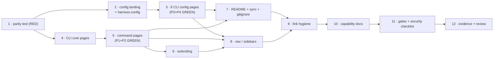

# Tasks: the CLI documented as a product, and the docs restructured around it

> Phase 3 of 3 (requirements → design → tasks). A DAG of implementation tasks derived
> from the approved design. MUST be reviewed/approved before implementation begins.

## Task list

TDD invariant (`tdd.mode: standard`): **T1 writes the failing test first.** For a
documentation work item the "production code" is the pages, and the test that motivates
them is the parity test — it goes red on all four assertions before a page exists, and
each subsequent task turns part of it green. That is a genuine red→green cycle, not a
ceremony: P4 is what *forces* `integrations`, `workspace`, `routing.graph` and
`polling.maxRetries` to be written at all.

- [x] 1. **The parity test, red.** `cli/tests/test_docs_parity.py` with P1–P4 from
      design C4: registry ↔ command pages (both directions), schema leaves ↔ documented
      option headings (both directions). Stdlib only; skip when `docs/` is absent;
      failure messages name the path and the direction.
  - **Depends on:** none
  - **Requirements:** R4.5
  - **Test:** `uv run --project cli python -m pytest cli/tests/test_docs_parity.py`
    — **red**: 4 failures (no `docs/cli/commands/`, no `docs/config/cli/`)

- [x] 2. **Config section landing + harness config.** `docs/config/index.md` (the two
      files, which governs what, resolution/precedence) and `docs/config/harness-config.md`
      (the section table from the retired `docs/reference/configuration.md`, plus
      `.the-loop/collaborators.yaml` and `.the-loop/manifest.yaml`). Delete
      `docs/reference/configuration.md`.
  - **Depends on:** 1
  - **Requirements:** R3.1, R3.5
  - **Test:** page set on disk; `make lint` (markdownlint) green

- [x] 3. **The six CLI config pages** — `docs/config/cli/{index,webhook-options,routing-options,polling-options,integrations-options,observability-options}.md`.
      Each declares `configBase` front-matter; every option is a `###` heading with
      **Type** and **Default** taken from `.the-loop/cli-config.schema.json`. Covers all
      80 leaves, which necessarily includes the four undocumented blocks and excludes the
      removed `ghBinary`. Carries the three load-bearing security statements (design
      §Security design).
  - **Depends on:** 2
  - **Requirements:** R3.2, R3.3, R3.4, R4.1, R4.2, R4.3
  - **Test:** P3 **and** P4 in `test_docs_parity.py` go **green** (red→green)

- [x] 4. **CLI section core pages** — `docs/cli/{index,installation,getting-started,concepts}.md`.
      The getting-started page carries a *complete* minimal `cli-config.yaml`, not a
      fragment, with `host: 127.0.0.1`, `webTerminal` off and an explicit
      `authorizedUsers`. Every page ends with an explicit next-step link.
  - **Depends on:** 1
  - **Requirements:** R1.2, R1.3, R1.4, R1.5
  - **Test:** pages on disk; markdownlint green; getting-started YAML validated against
    `.the-loop/cli-config.schema.json` with `scripts/validate_config.py`-style check

- [x] 5. **Command pages** — `docs/cli/commands/index.md` (the one table) plus one page
      per registered command: `gh-webhook`, `poll`, `sessions`, `events`, `check`,
      `graph`, `critic`, `scenarios`, `migrate-config`. `check`, `graph` and
      `migrate-config` are written from `graph_cmd.py` / `migrate_cmd.py`; the other six
      move from `cli/README.md` and are corrected against the current code.
  - **Depends on:** 4
  - **Requirements:** R2.1, R2.2, R2.3, R2.4, R2.5, R4.4
  - **Test:** P1 **and** P2 in `test_docs_parity.py` go **green** (red→green)

- [x] 6. **`docs/cli/extending.md`** — the `Command`/`@register` contract, and the fact
      that adding a command now also requires its page (P1).
  - **Depends on:** 5
  - **Requirements:** R2.1
  - **Test:** markdownlint green

- [x] 7. **`cli/README.md` → package landing page**, `docs/scripts/sync-content.mts`
      mapping removed, `.gitignore` `docs/cli.md` line removed. Every outbound link
      absolute (`https://madarauchiha-314.github.io/the-loop/…`). Walk the design C5
      mapping table section by section and record it in the execution log.
  - **Depends on:** 3, 5
  - **Requirements:** R5.1, R5.2, R5.3, R5.4
  - **Test:** `bun run docs:sync` produces no `docs/cli.md`; grep finds no relative site
    link in `cli/README.md`; full suite still green

- [x] 8. **Navigation** — `docs/.vitepress/config.mts`: `CLI` and `Config` in `nav`,
      sidebar trees for `/cli/` and `/config/`, `configuration` dropped from the
      Reference sidebar.
  - **Depends on:** 3, 5, 6
  - **Requirements:** R1.1, R3.1, R6.5
  - **Test:** `bun run docs:build` green; nav/sidebar render in the built output

- [x] 9. **Link hygiene across the repo** — root `README.md`, `docs/index.md` (CLI as a
      hero action), `docs/guide/{installation,quickstart,how-it-works}.md`,
      `docs/reference/commands.md`, `docs/capabilities/*.md`,
      `skills/the-loop/SKILL.md`, `skills/the-loop/reference/{observability,automation}.md`.
      `docs/specs/**` is the historical record and is **not** rewritten.
  - **Depends on:** 7, 8
  - **Requirements:** R6.1, R6.2, R6.3
  - **Test:** `grep -rn '](/cli)\|](/cli#\|/reference/configuration'` returns nothing
    outside `docs/specs/**`

- [x] 10. **Capability docs** — mint `docs/capabilities/documentation.md` (the docs site
      as a capability: information architecture, the authored-not-generated rule, the
      per-option format, the parity contract), index it in `capabilities.md`, and add the
      issue-117 history row to `capabilities/cli.md` with its `Design` link repointed.
  - **Depends on:** 9
  - **Requirements:** R6.1 (and the ready-to-ship capability-docs gate)
  - **Test:** markdownlint green; every link in the new doc resolves

- [x] 11. **Gates.** `make lint`, `make typecheck`, `make validate`, `make test`,
      `bun run docs:build`. Then the security checklist from design §Security design:
      grep every new page for a literal secret/token/webhook URL; verify the three
      fail-closed statements each have their named home; verify the getting-started YAML
      does not widen exposure.
  - **Depends on:** 10
  - **Requirements:** R6.4, and the security-review gate
  - **Test:** all five commands green; checklist recorded in the execution log

- [x] 12. **Evidence + review.** Execution log: red→green transitions, the C5 fidelity
      walk, built-site evidence (nav, sidebars, per-command search results), the
      requirement→proof table. Then the self-review rounds and the PR briefing.
  - **Depends on:** 11
  - **Requirements:** all
  - **Test:** `the-loop check issue-117` (the loop's own gate) reports no unmet reachable node

## Dependency graph (DAG)

Critical path: `1 → 4 → 5 → 7/8 → 9 → 10 → 11 → 12`. Tasks 2/3 and 4/5 are independent
branches after T1 and can be worked in either order.

## Checkpoints

| After | Run | Records |
|-------|-----|---------|
| T1 | `pytest cli/tests/test_docs_parity.py` | **red** — the 4 failures, verbatim |
| T3 | same | P3/P4 **green** — the schema↔docs red→green transition |
| T5 | same | P1/P2 **green** — the registry↔pages red→green transition |
| T7 | `bun run docs:sync` + full `make test` | no `docs/cli.md`; suite green |
| T8 | `bun run docs:build` | site builds with the new IA |
| T11 | `make lint typecheck validate test` + `docs:build` + security checklist | the ready-to-ship gate |

After the last task the review phase runs the self rounds and the **security review gate**
(`security.review`), recorded in the execution log, before the work item is marked ready.
`reviews.critics` is empty in this repo's `.the-loop/harness-config.yaml`, so the critic
rounds have no configured harness to run — that is recorded in the execution log rather
than silently skipped.

## Review comments

> Appended by the-loop's `record-feedback` hook when a human gate approves with
> comments (issue-109).
