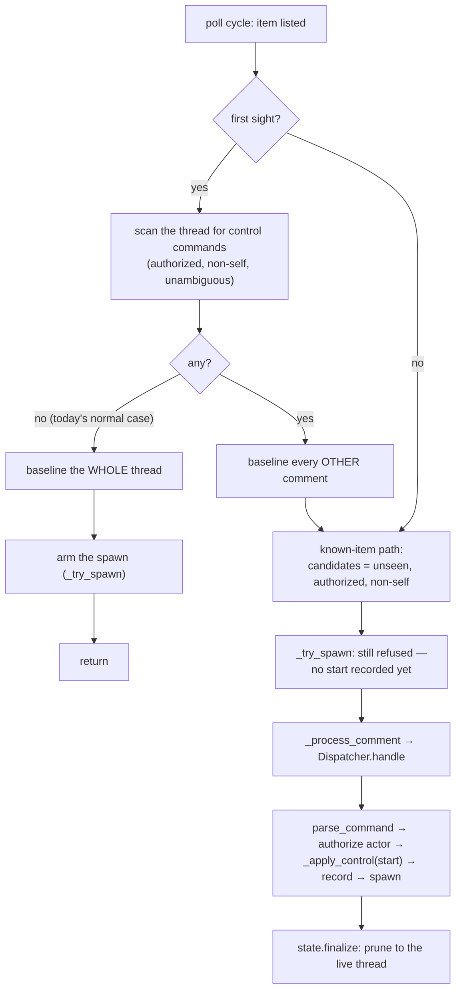

# Design: don't baseline a control command nobody has processed

> Phase 2 of 3. Derived from [`bugfix.md`](bugfix.md) (locked).

## 1. The choice

The reporter names two equivalent-sounding fixes. They are not equivalent:

| Option | Shape | Verdict |
|--------|-------|---------|
| **A — interpret and record on first sight** | The poller parses the thread itself and writes `start` into the `ControlStore` before baselining, so `_try_spawn` arms on the same cycle. | **Rejected.** It gives the poller a second, weaker authority over control state. The dispatcher's control path is deliberately the only writer: it re-checks for a *named* authorized actor (stricter than the ingress guard), refuses a start on an unarmed item so nothing is left standing, handles ambiguity, and emits `control.command`/`control.rejected`. Option A either duplicates all of that or silently skips it. |
| **B — don't baseline what nobody processed** | First sight baselines the thread **except** comments carrying an unprocessed control command; those flow through the ordinary comment path, which already ends at `Dispatcher.handle`. | **Taken.** The poller's job stays "which comments are unresolved"; the dispatcher's stays "what a comment means and who may say it". No new authority, no duplicated guard. |

Option B is also the smaller change: it re-uses the retry ledger, the delivery
dedup, `_process_comment`'s bounded retries and every existing guard verbatim.
The only new code is a predicate over comments (`_pending_control_ids`) and a
fall-through in the first-sight branch (`minimalism`: reuse before invent).

## 2. Where the defect lives, and the one-line statement of the fix

`baseline_comments()` means *"resolved — the poller will never look at this
again"*. That is true of ordinary comments on first sight (the spawned session
reads the thread itself), and **false** of a control command, which is an
instruction to the-loop that nothing has yet executed. The fix is to stop
calling an unexecuted instruction "resolved".



The dashed half of the old flow — first sight → `_try_spawn` refused → baseline →
*silence* — is what the fall-through replaces.

## 3. Components and interfaces

### 3.1 `Poller._pending_control_ids(comments) -> set[str]` (new, private)

The predicate. For each comment with an id, it is *pending* when **all** hold:

- `is_authorized(comment.author, self.authorized_users)` — the same guard the
  known-item candidate filter applies (empty allowlist ⇒ nothing is authorized);
- `not is_self_authored(comment.body)` — the-loop's own comments (including the
  keyword comment `the-loop sessions start` posts) were already applied locally
  and must never re-enter (issue-104);
- `parse_command(comment.body, self.control).command` is truthy — an
  **unambiguous** command. An ambiguous body (`ControlResult.ambiguous`) yields
  no command, so it is baselined: the dispatcher would execute nothing for it
  anyway, and deferring it would forward a comment that can only be logged and
  dropped.

`parse_command` is pure and already imported-by-contract in the dispatcher; the
poller reads `self.control` (the property that honours a hot-reloaded control
policy), so `control.enabled: false` yields an empty set and the branch collapses
to today's behaviour.

One guard sits in front of the loop (AC11): **a work item that already has a
`ControlStore` record is skipped entirely.** The record is the-loop's own durable
answer to "has this been processed?", so with one present the thread can only
contain commands already acted on — and replaying them would be a regression, not
a fix. The concrete case: the operator ran `the-loop sessions stop` and later
`the-loop sessions start`; both post the keyword back to the ticket, but the CLI
marks its own comments (`command_comment` → `mark_self_authored`), so the *stop*
that survives in the thread is a plain human comment while the *start* that
superseded it is invisible to this predicate. Losing `poll-state.json` without
losing the control records would then re-apply the stop and kill a running
session. So a first sight may **bootstrap** control state and never overwrite it
— which is exactly the reported defect's shape (there, no record exists at all).

### 3.2 `Poller._process_item` first-sight branch (changed)

```python
if first_sight:
    pending = self._pending_control_ids(comments) if item_authorized else set()
    self.state.baseline_comments(
        ref, [cid for cid in live_ids if cid not in pending], _utcnow()
    )
    if not pending:
        if item_authorized and not has_session:
            self._try_spawn(provider, item, refs, summary)
        return
    # fall through to the known-item path with `pending` unbaselined
```

Three deliberate details:

1. **`item_authorized` gates the scan**, mirroring the known-item path where the
   whole comment loop sits behind the same flag (AC7).
2. **`_try_spawn` moves inside the no-pending arm** (AC8). When commands are
   pending, the known-item path below takes the arming decision *once*, after
   `genuinely_new` re-arms the ledger — so a presence event and a
   control-triggered spawn cannot be enqueued for the same item on the same
   cycle. Ordering against `baseline_comments` is immaterial: the baseline
   preserves the `spawn` sub-record, and `_try_spawn` reads only that.
3. **Fall-through, not `return`** (AC2): the deferred comments are handled on the
   same cycle, so a start posted before first sight costs no extra poll interval
   compared with one posted after.

Everything after the branch is untouched: `seen` now excludes the pending ids, so
they become candidates; `genuinely_new` is True (no attempts recorded), which
resets the spawn ledger; `_try_spawn` runs and is refused by `_awaiting_start`
(nothing has recorded a start *yet*); each pending comment goes through
`_process_comment` → `Dispatcher.handle`, in provider listing order, which is
chronological for the GitHub provider (`gh issue view --json comments`). Ordering
is what makes AC2's `start`-then-`stop` case land disarmed. `state.finalize` then
prunes and stamps as it does on every known-item cycle.

### 3.3 What the dispatcher does with the forwarded start (unchanged)

`handle` → `parse_command` → named-actor re-check → `_apply_control(START)`:
no live session, so `_spawn_refusal(routed, control_command=START)` — armed via
`event_carries_label` on the poller's own comment payload, and the start
satisfies the control requirement directly — returns `""`; the store records the
start; `_on_unmatched(..., control_command=START)` enqueues the spawn. The spawn
path calls `registry.touch(..., delivery_id=…)`, so the poller's next
`delivery_status` for that comment reads `done` and resolves it. No new code, and
the retry accounting closes itself.

## 4. Data model

None added. `poll-state.json` keeps its shape; the only difference is *which*
ids are in `seenComments` after a first sight. A pending id is simply absent
until it resolves, which is what the retry ledger already means by "unresolved",
so an operator reading the file sees nothing novel, and a daemon rolled **back**
to the previous version reads the file unchanged (it would just baseline the
comment on its next cycle — the old behaviour).

## 5. Error handling

- **Provider/dispatcher failures** — unchanged. A failed forward spends one of
  `polling.maxRetries`; an exhausted budget resolves the comment with
  `poll.comment_failed` as it does for any comment, so a permanently
  undeliverable control comment cannot loop forever.
- **A pending comment that resolves to nothing** (e.g. `stop` with no session):
  the dispatcher records the command and returns without touching a session, so
  `delivery_status` stays `inflight` until the dedup cache evicts the id, then
  the retry budget resolves it. Pre-existing behaviour for control comments on
  the known-item path (issue-106); not widened here.
- **Unreadable/absent state file** — unchanged (`PollState` already degrades to
  "everything is first sight").

## 6. Security design

The trust boundary this touches is *comment text → daemon action*, and the fix
deliberately does **not** move it: `_pending_control_ids` returns comment ids, and
the only consumer of those ids is the existing forward path. Enforcement stays in
`Dispatcher._apply_control` (named authorized actor, fixed four-command
vocabulary, arm-check before recording).

| Requirement threat | Enforced by |
|--------------------|-------------|
| A1 — a stranger's start comment | `is_authorized` in the predicate (not deferred), and the dispatcher's stricter named-actor re-check behind it. Two layers, both tested. |
| A2 — the-loop's own keyword comment | `is_self_authored` in the predicate; the CLI marks the body it posts (`command_comment` → `mark_self_authored`). |
| A3 — a start on an unarmed item | Unchanged `_spawn_refusal` ordering: `spawn-policy` is checked first and nothing is recorded. |
| Injection into argv/path/prompt | Nothing payload-derived is produced: the predicate's output type is `set[str]` of ids the poller already holds. |
| Unbounded work | One regex pass per comment already fetched this cycle; deferred ⊆ live ids. |

`security.review.humanSignOffMinTier: 4` and this is tier 3, so no named human
security sign-off is required; the checklist review is recorded in the execution
log.

## 7. Testing strategy

- **Unit (`cli/tests/test_poller.py`)** — the predicate's behaviour through
  `poll_once` with the in-process doubles: a pre-existing start is *not*
  baselined and *is* forwarded (AC1/AC2/AC5); the arming decision is taken once
  (AC8); the negative cases — unauthorized author, self-authored body, ambiguous
  body, `control.enabled: false`, unauthorized item author, an existing control
  record — each baseline exactly as today (AC4/AC6/AC7/AC11).
- **Integration (`cli/tests/test_control_integration.py`)** — the regression
  test the bug deserves (AC9): a real `Dispatcher`, `SessionRegistry` and
  `ControlStore`, `requireStartCommand` on, a labelled item whose thread already
  carries `the-loop:start-execution` at first sight → one spawn, a recorded
  `start`, and **zero** presence events. Gherkin docstring + `Requirement:` link,
  per `testing.gherkinDocstrings: required`.
- **Ordering (AC2)** — a first-sight thread carrying `start` then `stop` ends
  with `stop` recorded and no live session.
- Red→green is recorded per task in the execution log.

## 8. Alternatives rejected

- **Baseline by timestamp instead of "all existing"** — e.g. only baseline
  comments older than the label. Needs a label-application time the provider
  contract does not expose, and would still swallow a start posted before the
  label.
- **Have `_awaiting_start` consult the thread directly** — the same authority
  duplication as option A, one layer deeper, and it would make a pure gate do I/O.
- **Emit presence anyway and let the dispatcher refuse it** — exactly what
  issue-106 removed: every labelled, unstarted item would burn its retry budget
  and log a terminal `poll.spawn_failed`.
