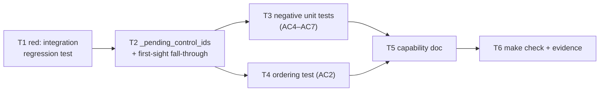

# Tasks: don't baseline a control command nobody has processed

> Phase 3 of 3. Derived from [`requirements.md`](requirements.md) and [`design.md`](design.md)
> (both locked). `tdd.mode: standard` — each task writes the failing test first.

## Dependency graph (DAG)

## Task list

- [x] **T1 — Red: the regression test the bug deserves.** In
  `cli/tests/test_control_integration.py`, drive a real `Dispatcher` +
  `SessionRegistry` + `ControlStore` (`requireStartCommand` on) with a provider
  whose thread **already** carries `the-loop:start-execution` at first sight.
  Assert: one spawn, a recorded `start`, zero presence events. Gherkin docstring
  with `Requirement: docs/specs/issue-119/requirements.md AC1, AC3`.
  *Requirements: AC1, AC3, AC9.*
- [x] **T2 — Green: defer unprocessed control comments.** Add
  `Poller._pending_control_ids` and rework the first-sight branch per
  `design.md` §3.2 (baseline everything else, `_try_spawn` only when nothing is
  pending, fall through otherwise). *Requirements: AC1, AC2, AC3, AC5, AC8.*
- [x] **T3 — Negative unit tests.** In `cli/tests/test_poller.py`: an
  unauthorized comment author, a self-authored body, an ambiguous body,
  `control.enabled: false`, an unauthorized **item** author, and an item that
  already carries a control record each baseline the keyword comment and forward
  nothing. Plus the happy-path unit assertions (deferred id absent from
  `seenComments`, comment forwarded, no presence event).
  *Requirements: AC1, AC4, AC5, AC6, AC7, AC8, AC11.*
- [x] **T4 — Ordering test.** A first-sight thread carrying `start` then `stop`
  ends with `stop` recorded and no live session. *Requirements: AC2.*
- [x] **T5 — Capability doc + execution log.** Record the behaviour in
  `docs/capabilities/webhook-triggers.md` (current behaviour + history row) and
  keep `execution-log.md` current. *Requirements: AC10.*
- [x] **T6 — Ready-to-ship gate.** `make check` (ruff, ruff format, pyright,
  markdownlint, config validation, pytest) green; security checklist recorded;
  reviewer briefing posted on the PR. *Requirements: all.*
